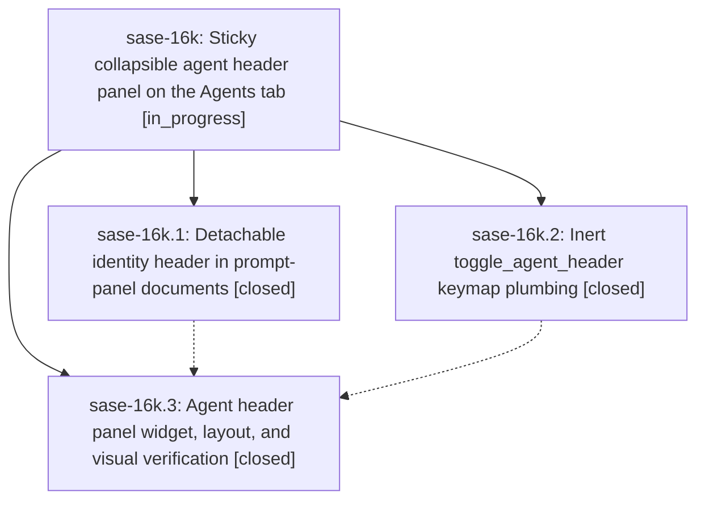

# Bead: sase-16k — Sticky collapsible agent header panel on the Agents tab

[Bead Pages](../README.md) / sase-16k

**Status:** ◐ in_progress · **Type:** ▸ plan · **Tier:** epic
**Owner:** `bryanbugyi34@gmail.com` · **Created by:** [bbugyi200.athena.0pi](https://github.com/sase-org/sase--agents/blob/main/families/bbugyi200.athena.0pi.md) · **Assignee:** `sase-16k.land`
**Created:** 2026-09-22 13:53:06 EDT
**Plan:** [202609/sticky\_agent\_header\_panel.md](https://github.com/sase-org/sase--plans/blob/main/202609/sticky_agent_header_panel.md)

## Description

On the Agents tab, the selected node's identity header (every field from the kind line through Timestamps, plus Fold where present) renders in its own always-visible panel above the scrolling metadata document whenever the metadata panel is shown. The panel is collapsed to two concise rows by default and expands to the full field list with a configurable `d` keymap. Agent clan nodes are excluded.

## Phases

| Bead | Title | Status | Size | Created | Agents | Commits |
|---|---|---|---|---|---:|---:|
| [sase-16k.1](sase-16k.1.md) | Detachable identity header in prompt-panel documents | ✓ closed | medium | 2026-09-22 | 1 | 1 |
| [sase-16k.2](sase-16k.2.md) | Inert toggle\_agent\_header keymap plumbing | ✓ closed | small | 2026-09-22 | 1 | 1 |
| [sase-16k.3](sase-16k.3.md) | Agent header panel widget, layout, and visual verification | ✓ closed | medium | 2026-09-22 | 1 | 1 |

## Lineage

## Agents

| Agent | Bead | Commits |
|---|---|---:|
| [bbugyi200.athena.sase-16k.1](https://github.com/sase-org/sase--agents/blob/main/agents/bbugyi200.athena.sase-16k.1/README.md) | [sase-16k.1](sase-16k.1.md) | 1 |
| [bbugyi200.athena.sase-16k.2](https://github.com/sase-org/sase--agents/blob/main/agents/bbugyi200.athena.sase-16k.2/README.md) | [sase-16k.2](sase-16k.2.md) | 1 |
| [bbugyi200.athena.sase-16k.3](https://github.com/sase-org/sase--agents/blob/main/agents/bbugyi200.athena.sase-16k.3/README.md) | [sase-16k.3](sase-16k.3.md) | 1 |
| [bbugyi200.athena.sase-16k.land](https://github.com/sase-org/sase--agents/blob/main/agents/bbugyi200.athena.sase-16k.land/README.md) | [sase-16k](README.md) | 0 |

## Commits

| Repo | Commit | Subject | Bead | Committed |
|---|---|---|---|---|
| sase | [`9aa46d0`](https://github.com/sase-org/sase/commit/9aa46d006734b2fbbdf49ff2fc1074e209860775) | feat(agents): add inert toggle\_agent\_header keymap plumbing | [sase-16k.2](sase-16k.2.md) | 2026-09-22 14:39:49 EDT |
| sase | [`2822794`](https://github.com/sase-org/sase/commit/28227947e135f66042f61aa3fac9428d1defad6e) | feat(agents): detachable identity header in prompt-panel documents | [sase-16k.1](sase-16k.1.md) | 2026-09-22 16:03:37 EDT |
| sase | [`7c2e051`](https://github.com/sase-org/sase/commit/7c2e051479e6b72789f33063ecd1e476278133af) | feat(agents): sticky collapsible agent header panel on Agents tab | [sase-16k.3](sase-16k.3.md) | 2026-09-22 18:03:59 EDT |

<!-- sase:referenced-by:start -->

## Referenced By

| Relation | Artifact | Why | Uses |
| --- | --- | --- | ---: |
| read-by | [agent:sase-16k.1][1] | Need parent epic context for document phase | 1 |

[1]: https://github.com/sase-org/sase--agents/blob/main/agents/bbugyi200.athena.sase-16k.1/README.md

<!-- sase:referenced-by:end -->
