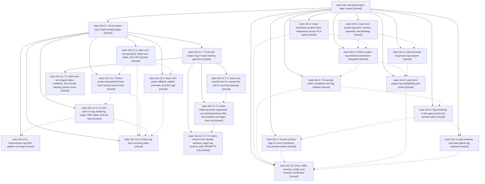

# Bead: sase-16n — Xprompt project tags (+sase)

[Bead Pages](../README.md) / sase-16n

**Status:** ✓ closed · **Resolution:** done · **Type:** ▸ plan · **Tier:** epic
**Owner:** `bryanbugyi34@gmail.com` · **Created by:** [bbugyi200.athena.0pl](https://github.com/sase-org/sase--agents/blob/main/families/bbugyi200.athena.0pl.md) · **Assignee:** `sase-16n.land`
**Created:** 2026-09-22 18:48:43 EDT · **Closed:** 2026-09-23 15:40:52 EDT
**Plan:** [202609/project\_tags.md](https://github.com/sase-org/sase--plans/blob/main/202609/project_tags.md)

## Description

Prompts name their project with a `+<project>` project tag by default. SASE resolves the tag to the project's VCS type and runs the same `#gh:`/`#git:` workflow as before. Every completion surface (TUI, LSP/Neovim, shell) inserts tags. Every surface that shows raw prompts renders tags in the project's accent color. Project names are enforced unique, case-insensitively, across all VCS types.

## Notes

[2026-09-23T12:47:58Z · sase-16n.land] LAND AUDIT #1 (sase-16n.land, master 9f9c2b702): all 10 phases closed and their commits present (sase dc08f7b21 19895a01b ec5b91d8d eea59a651 3bf3b998a 9f9c2b702; sase-core 096d42a 3120739 3da8a03; sase-nvim 2e6f1ac; sase-telegram aff9a23; sase-github fd5b7bd 204ffd0; chezmoi 996c65b0, generated SKILL copies refreshed by 7438df3e). Post-epic refactors cfac28d15 (launch_cwd split: tag guard now guard_project_tags_for_launch_units in launch_cwd_guards.py, still called pre-spawn), 352eba6af (clan split: tag highlighting preserved), d6a1cf1d3, d4d36adcb and 607a7a654 dropped nothing. Focused suites green except 2 epic-caused failures. REMAINING EPIC WORK found (planned as a child epic): prompt-history label tests red since 3bf3b998a; +home fails on a fresh machine (catalog lacks home before its spec exists) while docs present it as the first-run example; project_tag_for tags unknown names; CLI surfaces never warm the catalog so they never tagify; TUI warms the catalog only on prompt-bar mount and never re-highlights the editor; the metadata pager loses Markdown highlighting when a tag is present; MRU label shows +sase; stale current badge in completion cache; doctor misses key-case collisions; core accept only removes line-start refs; LSP accept ignores disabled/home targets; no disabled diagnostic, and hover lacks state/workspace_dir (16n.4#1); rewrite-to-tag emits invalid tags; duplicate suggestions; no tag PNG goldens (16n.6#1); nvim picker fallback, palette override and dim sigil; docs gaps (editor.md legend, schema gh_sase example, xprompt.md:418). FOLLOW-UP OUTCOMES: symvision delete_paths_in_background (16n.2#1, 16n.3#1, 16n.5#1, 16n.6#2, 16n.7#1-2) is a duplicate of sase-16l, now fixed at HEAD by c87c9d1aa (noted on sase-16l); the artifact-directory audit test in 16n.2#1 passes at HEAD, so it was declined as resolved. 16n.4#1 and 16n.6#1 are epic-caused and go into the child plan. 16n.9#1: shell-backed gate test filed as new task sase-16v; receiver generation test +1 on sase-156. 16n.9#2: sase-github PyPI venv +1 on sase-16p. Newly found, not epic-caused: symvision ExpandedLaunchSegments (cfac28d15) filed as new task sase-16u.

[2026-09-23T19:40:52Z · sase-16n.11.7.land] Resumed after child epic sase-16n.11 (and its child sase-16n.11.7) closed. Rechecked: all 10 phases and child epic sase-16n.11 closed; every REMAINING EPIC WORK item from land audit #1 was planned into sase-16n.11 and verified by its landing audit (sase-core 4300166, sase 394a53b6d/b924b0350/848a90a1b/69ca23a2e, sase-nvim dac30c9, sase-github 2b26fa3) plus the sase-16n.11.7 fixes (sase-core fb1ca29 CI green incl. macOS and pinned, sase-nvim 9378313, sase 1230ed8da/00badb84e, and the landing's bead-test catalog pin + completion snapshot sync). Post-child drift reviewed through current master: no tag integration needed. No epic-symbol entries. Follow-up outcomes recorded on sase-16n.11 and sase-16n.11.7. just symvision remains red only on other epics' symbols.

## Phases

| Bead | Title | Status | Size | Created | Agents | Commits |
|---|---|---|---|---|---:|---:|
| [sase-16n.1](sase-16n.1.md) | sase-core project tag lexer, resolver, expander, and bindings | ✓ closed | medium | 2026-09-22 | 1 | 1 |
| [sase-16n.10](sase-16n.10.md) | Docs, skills, memory, config, and machine verification | ✓ closed | medium | 2026-09-22 | 1 | 1 |
| [sase-16n.2](sase-16n.2.md) | Case-insensitive project name uniqueness across VCS types | ✓ closed | small | 2026-09-22 | 1 | 2 |
| [sase-16n.3](sase-16n.3.md) | Python project tag backend and launch integration | ✓ closed | medium | 2026-09-22 | 1 | 1 |
| [sase-16n.4](sase-16n.4.md) | sase-xprompt-lsp project tag support | ✓ closed | medium | 2026-09-22 | 1 | 1 |
| [sase-16n.5](sase-16n.5.md) | TUI prompt editor completion and tag defaults | ✓ closed | medium | 2026-09-22 | 1 | 1 |
| [sase-16n.6](sase-16n.6.md) | Tag rendering in the agent panel and prompt editor | ✓ closed | medium | 2026-09-22 | 1 | 1 |
| [sase-16n.7](sase-16n.7.md) | Accent-colored tags on every remaining raw-prompt surface | ✓ closed | medium | 2026-09-22 | 1 | 1 |
| [sase-16n.8](sase-16n.8.md) | sase-nvim project tag highlighting and picker | ✓ closed | small | 2026-09-22 | 1 | 1 |
| [sase-16n.9](sase-16n.9.md) | sase-telegram and sase-github tag adoption | ✓ closed | small | 2026-09-22 | 1 | 0 |

## Lineage

## Agents

| Agent | Bead | Commits |
|---|---|---:|
| [bbugyi200.athena.sase-16n.1](https://github.com/sase-org/sase--agents/blob/main/agents/bbugyi200.athena.sase-16n.1/README.md) | [sase-16n.1](sase-16n.1.md) | 1 |
| [bbugyi200.athena.sase-16n.10](https://github.com/sase-org/sase--agents/blob/main/agents/bbugyi200.athena.sase-16n.10/README.md) | [sase-16n.10](sase-16n.10.md) | 1 |
| [bbugyi200.athena.sase-16n.11.1](https://github.com/sase-org/sase--agents/blob/main/agents/bbugyi200.athena.sase-16n.11.1/README.md) | [sase-16n.11.1](sase-16n.11.1.md) | 1 |
| [bbugyi200.athena.sase-16n.11.2](https://github.com/sase-org/sase--agents/blob/main/agents/bbugyi200.athena.sase-16n.11.2/README.md) | [sase-16n.11.2](sase-16n.11.2.md) | 1 |
| [bbugyi200.athena.sase-16n.11.3](https://github.com/sase-org/sase--agents/blob/main/agents/bbugyi200.athena.sase-16n.11.3/README.md) | [sase-16n.11.3](sase-16n.11.3.md) | 1 |
| [bbugyi200.athena.sase-16n.11.4](https://github.com/sase-org/sase--agents/blob/main/families/bbugyi200.athena.sase-16n.11.4.md) | [sase-16n.11.4](sase-16n.11.4.md) | 1 |
| [bbugyi200.athena.sase-16n.11.5](https://github.com/sase-org/sase--agents/blob/main/agents/bbugyi200.athena.sase-16n.11.5/README.md) | [sase-16n.11.5](sase-16n.11.5.md) | 1 |
| [bbugyi200.athena.sase-16n.11.6](https://github.com/sase-org/sase--agents/blob/main/agents/bbugyi200.athena.sase-16n.11.6/README.md) | [sase-16n.11.6](sase-16n.11.6.md) | 1 |
| [bbugyi200.athena.sase-16n.11.7.1](https://github.com/sase-org/sase--agents/blob/main/agents/bbugyi200.athena.sase-16n.11.7.1/README.md) | [sase-16n.11.7.1](sase-16n.11.7.1.md) | 1 |
| [bbugyi200.athena.sase-16n.11.7.2](https://github.com/sase-org/sase--agents/blob/main/agents/bbugyi200.athena.sase-16n.11.7.2/README.md) | [sase-16n.11.7.2](sase-16n.11.7.2.md) | 1 |
| [bbugyi200.athena.sase-16n.11.7.3](https://github.com/sase-org/sase--agents/blob/main/agents/bbugyi200.athena.sase-16n.11.7.3/README.md) | [sase-16n.11.7.3](sase-16n.11.7.3.md) | 1 |
| [bbugyi200.athena.sase-16n.11.7.4](https://github.com/sase-org/sase--agents/blob/main/agents/bbugyi200.athena.sase-16n.11.7.4/README.md) | [sase-16n.11.7.4](sase-16n.11.7.4.md) | 1 |
| [bbugyi200.athena.sase-16n.11.7.land](https://github.com/sase-org/sase--agents/blob/main/agents/bbugyi200.athena.sase-16n.11.7.land/README.md) | [sase-16n.11.7](sase-16n.11.7.md) | 2 |
| [bbugyi200.athena.sase-16n.11.land](https://github.com/sase-org/sase--agents/blob/main/families/bbugyi200.athena.sase-16n.11.land.md) | [sase-16n.11](sase-16n.11.md) | 0 |
| [bbugyi200.athena.sase-16n.2](https://github.com/sase-org/sase--agents/blob/main/agents/bbugyi200.athena.sase-16n.2/README.md) | [sase-16n.2](sase-16n.2.md) | 2 |
| [bbugyi200.athena.sase-16n.3](https://github.com/sase-org/sase--agents/blob/main/agents/bbugyi200.athena.sase-16n.3/README.md) | [sase-16n.3](sase-16n.3.md) | 1 |
| [bbugyi200.athena.sase-16n.4](https://github.com/sase-org/sase--agents/blob/main/agents/bbugyi200.athena.sase-16n.4/README.md) | [sase-16n.4](sase-16n.4.md) | 1 |
| [bbugyi200.athena.sase-16n.5](https://github.com/sase-org/sase--agents/blob/main/agents/bbugyi200.athena.sase-16n.5/README.md) | [sase-16n.5](sase-16n.5.md) | 1 |
| [bbugyi200.athena.sase-16n.6](https://github.com/sase-org/sase--agents/blob/main/agents/bbugyi200.athena.sase-16n.6/README.md) | [sase-16n.6](sase-16n.6.md) | 1 |
| [bbugyi200.athena.sase-16n.7](https://github.com/sase-org/sase--agents/blob/main/agents/bbugyi200.athena.sase-16n.7/README.md) | [sase-16n.7](sase-16n.7.md) | 1 |
| [bbugyi200.athena.sase-16n.8](https://github.com/sase-org/sase--agents/blob/main/agents/bbugyi200.athena.sase-16n.8/README.md) | [sase-16n.8](sase-16n.8.md) | 1 |
| [bbugyi200.athena.sase-16n.9](https://github.com/sase-org/sase--agents/blob/main/agents/bbugyi200.athena.sase-16n.9/README.md) | [sase-16n.9](sase-16n.9.md) | 0 |
| [bbugyi200.athena.sase-16n.land](https://github.com/sase-org/sase--agents/blob/main/families/bbugyi200.athena.sase-16n.land.md) | [sase-16n](README.md) | 0 |

## Commits

| Repo | Commit | Subject | Bead | Committed |
|---|---|---|---|---|
| sase-core | [`sase-core@096d42a`](https://github.com/sase-org/sase-core/commit/096d42a3d80ecfc413ed3230e47940b99f3bc257) | feat(core-tags): add project\_tag scan/resolve/expand/accept with catalog wire v5 | [sase-16n.1](sase-16n.1.md) | 2026-09-22 19:45:03 EDT |
| sase | [`dc08f7b`](https://github.com/sase-org/sase/commit/dc08f7b21c31dd51853184a8607ed40c598beded) | feat(projects): enforce case-insensitive project name uniqueness | [sase-16n.2](sase-16n.2.md) | 2026-09-22 19:51:43 EDT |
| sase-core | [`sase-core@3120739`](https://github.com/sase-org/sase-core/commit/3120739433fb6c4d4abef462f15a97de8612fa71) | feat(projects): casefold project ref collision warnings and reserve home | [sase-16n.2](sase-16n.2.md) | 2026-09-22 19:54:53 EDT |
| sase-core | [`sase-core@3da8a03`](https://github.com/sase-org/sase-core/commit/3da8a0309ff0b15c44b5869f6af5808479582b8c) | feat(lsp): sase-xprompt-lsp project tag support | [sase-16n.4](sase-16n.4.md) | 2026-09-22 20:15:55 EDT |
| sase | [`19895a0`](https://github.com/sase-org/sase/commit/19895a01bfe8245fd627bf9a24f9cf6fe8bc6600) | feat(xprompt): add Python project tag backend and launch integration | [sase-16n.3](sase-16n.3.md) | 2026-09-22 21:05:49 EDT |
| sase-nvim | [`sase-nvim@2e6f1ac`](https://github.com/sase-org/sase-nvim/commit/2e6f1acf6c47e72d58e94953b9c602f2175ab261) | feat(nvim): project tag highlight, plus-tag completion and LSP wiring | [sase-16n.8](sase-16n.8.md) | 2026-09-22 21:29:40 EDT |
| sase | [`ec5b91d`](https://github.com/sase-org/sase/commit/ec5b91d8dfe9956c3f738b367452efd7ca4a449c) | feat(xprompt): TUI prompt editor completion and tag defaults | [sase-16n.5](sase-16n.5.md) | 2026-09-22 22:05:48 EDT |
| sase | [`eea59a6`](https://github.com/sase-org/sase/commit/eea59a65147a1dcd2d3ae7d91e818e3c463227ec) | feat(xprompt): render project tags in agent panel and prompt editor | [sase-16n.6](sase-16n.6.md) | 2026-09-22 22:43:45 EDT |
| sase | [`3bf3b99`](https://github.com/sase-org/sase/commit/3bf3b998abad35250e7a71de91e44780f2a517b5) | feat(project-tags): accent-colored project tags on raw-prompt surfaces | [sase-16n.7](sase-16n.7.md) | 2026-09-23 07:31:56 EDT |
| sase | [`9f9c2b7`](https://github.com/sase-org/sase/commit/9f9c2b702733359d4af16f4fdb662df50f9ebdb1) | docs(project-tags): present +\<project\> tags as the default project spelling | [sase-16n.10](sase-16n.10.md) | 2026-09-23 08:10:00 EDT |
| sase-core | [`sase-core@4300166`](https://github.com/sase-org/sase-core/commit/430016645d10590c75bff39fdbfc62cc89177fcd) | fix(core): project-tag core fixes for bead sase-16n.11.1 | [sase-16n.11.1](sase-16n.11.1.md) | 2026-09-23 09:19:56 EDT |
| sase-nvim | [`sase-nvim@dac30c9`](https://github.com/sase-org/sase-nvim/commit/dac30c925e16266d6f8954582de69ee7053d85d4) | feat(nvim): project-tag picker fallback, palette overrides, dim sigil | [sase-16n.11.5](sase-16n.11.5.md) | 2026-09-23 09:34:46 EDT |
| sase | [`394a53b`](https://github.com/sase-org/sase/commit/394a53b6dfc5ee436073203fe71cb958d6b039e4) | feat(project-tags): Python tag backend fixes and step-8 launch tests | [sase-16n.11.2](sase-16n.11.2.md) | 2026-09-23 10:25:14 EDT |
| sase | [`b924b03`](https://github.com/sase-org/sase/commit/b924b03508978a7f28e50bd517ecca58e499a846) | feat(project-tags): CLI and cold-TUI tag rendering, pager, MRU label, and red tests | [sase-16n.11.3](sase-16n.11.3.md) | 2026-09-23 11:12:21 EDT |
| sase | [`69ca23a`](https://github.com/sase-org/sase/commit/69ca23a2e8ba6046e17589321f403656cdec5f90) | docs(project-tags): accuracy pass for tag docs and help | [sase-16n.11.6](sase-16n.11.6.md) | 2026-09-23 11:53:04 EDT |
| sase | [`848a90a`](https://github.com/sase-org/sase/commit/848a90a1ba6550faca8c29b8d9dcde81d4decb65) | fix(ace-tui): pin project-tag catalog in PNG snapshot fixtures | [sase-16n.11.4](sase-16n.11.4.md) | 2026-09-23 13:31:59 EDT |
| sase-nvim | [`sase-nvim@9378313`](https://github.com/sase-org/sase-nvim/commit/937831308d9462d8dc6f727c03232b1ad56b0d0d) | feat(nvim-tokens): set-shaped modifiers, warn-and-cancel picker, trailing-space insert | [sase-16n.11.7.2](sase-16n.11.7.2.md) | 2026-09-23 14:25:00 EDT |
| sase-core | [`sase-core@fb1ca29`](https://github.com/sase-org/sase-core/commit/fb1ca29f50310ff5dc45f7cf3d3dc9431e3d4a97) | fix(core): project-tag accept line-join, macOS test, and tag cleanups | [sase-16n.11.7.1](sase-16n.11.7.1.md) | 2026-09-23 14:34:32 EDT |
| sase | [`1230ed8`](https://github.com/sase-org/sase/commit/1230ed8da198e5952221819caf5e7962f9dec37c) | feat(scope): describe the completed work | [sase-16n.11.7.3](sase-16n.11.7.3.md) | 2026-09-23 15:00:32 EDT |
| sase | [`00badb8`](https://github.com/sase-org/sase/commit/00badb84eed26e296bdad946b471ecda2e53892f) | feat(tui-tags): warm rebuild of tag surfaces, pager accents, tribe PROMPTS chip | [sase-16n.11.7.4](sase-16n.11.7.4.md) | 2026-09-23 15:20:46 EDT |
| sase | [`f456a8b`](https://github.com/sase-org/sase/commit/f456a8b3b11758abe409287c39dd7c6a6bc22362) | test(project-tags): pin tag catalog for bead launch tests and sync completion spec | [sase-16n.11.7](sase-16n.11.7.md) | 2026-09-23 15:42:39 EDT |
| sase--plans | [`sase--plans@0161b8a`](https://github.com/sase-org/sase--plans/commit/0161b8a263ca8cd8bdcca386641e2e3ed302d20e) | chore(plans): mark project tag plans done | [sase-16n.11.7](sase-16n.11.7.md) | 2026-09-23 15:46:21 EDT |

<!-- sase:referenced-by:start -->

## Referenced By

| Relation | Artifact | Why | Uses |
| --- | --- | --- | ---: |
| read-by | [agent:sase-16n.1][1] | Need parent epic status for phase work | 1 |
| read-by | [agent:sase-16n.11.7.land][2] | Check descendants after sase-16n.11 closed | 2 |
| read-by | [agent:sase-16n.7][3] | epic scope | 1 |
| read-by | [agent:sase-16y.land][4] | Project tags epic state | 1 |

[1]: https://github.com/sase-org/sase--agents/blob/main/agents/bbugyi200.athena.sase-16n.1/README.md
[2]: https://github.com/sase-org/sase--agents/blob/main/agents/bbugyi200.athena.sase-16n.11.7.land/README.md
[3]: https://github.com/sase-org/sase--agents/blob/main/agents/bbugyi200.athena.sase-16n.7/README.md
[4]: https://github.com/sase-org/sase--agents/blob/main/agents/bbugyi200.athena.sase-16y.land/README.md

<!-- sase:referenced-by:end -->
