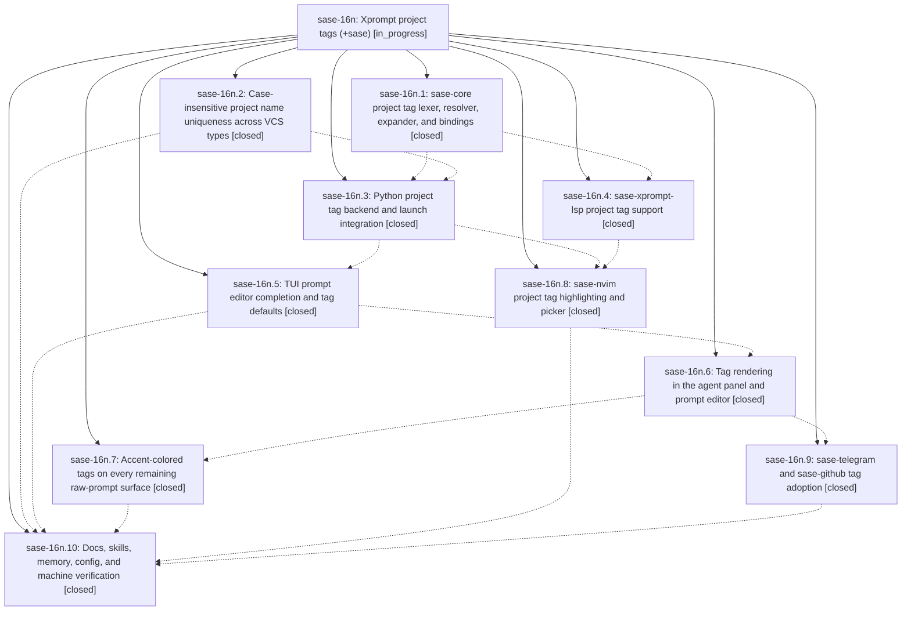

# Bead: sase-16n — Xprompt project tags (+sase)

[Bead Pages](../README.md) / sase-16n

**Status:** ◐ in_progress · **Type:** ▸ plan · **Tier:** epic
**Owner:** `bryanbugyi34@gmail.com` · **Created by:** [bbugyi200.athena.0pl](https://github.com/sase-org/sase--agents/blob/main/families/bbugyi200.athena.0pl.md) · **Assignee:** `sase-16n.land`
**Created:** 2026-09-22 18:48:43 EDT
**Plan:** [202609/project\_tags.md](https://github.com/sase-org/sase--plans/blob/main/202609/project_tags.md)

## Description

Prompts name their project with a `+<project>` project tag by default. SASE resolves the tag to the project's VCS type and runs the same `#gh:`/`#git:` workflow as before. Every completion surface (TUI, LSP/Neovim, shell) inserts tags. Every surface that shows raw prompts renders tags in the project's accent color. Project names are enforced unique, case-insensitively, across all VCS types.

## Phases

| Bead | Title | Status | Size | Created | Agents | Commits |
|---|---|---|---|---|---:|---:|
| [sase-16n.1](sase-16n.1.md) | sase-core project tag lexer, resolver, expander, and bindings | ✓ closed | medium | 2026-09-22 | 1 | 1 |
| [sase-16n.10](sase-16n.10.md) | Docs, skills, memory, config, and machine verification | ✓ closed | medium | 2026-09-22 | 1 | 1 |
| [sase-16n.2](sase-16n.2.md) | Case-insensitive project name uniqueness across VCS types | ✓ closed | small | 2026-09-22 | 1 | 2 |
| [sase-16n.3](sase-16n.3.md) | Python project tag backend and launch integration | ✓ closed | medium | 2026-09-22 | 1 | 1 |
| [sase-16n.4](sase-16n.4.md) | sase-xprompt-lsp project tag support | ✓ closed | medium | 2026-09-22 | 1 | 1 |
| [sase-16n.5](sase-16n.5.md) | TUI prompt editor completion and tag defaults | ✓ closed | medium | 2026-09-22 | 1 | 1 |
| [sase-16n.6](sase-16n.6.md) | Tag rendering in the agent panel and prompt editor | ✓ closed | medium | 2026-09-22 | 1 | 1 |
| [sase-16n.7](sase-16n.7.md) | Accent-colored tags on every remaining raw-prompt surface | ✓ closed | medium | 2026-09-22 | 1 | 1 |
| [sase-16n.8](sase-16n.8.md) | sase-nvim project tag highlighting and picker | ✓ closed | small | 2026-09-22 | 1 | 0 |
| [sase-16n.9](sase-16n.9.md) | sase-telegram and sase-github tag adoption | ✓ closed | small | 2026-09-22 | 1 | 0 |

## Lineage

## Agents

| Agent | Bead | Commits |
|---|---|---:|
| [bbugyi200.athena.sase-16n.1](https://github.com/sase-org/sase--agents/blob/main/agents/bbugyi200.athena.sase-16n.1/README.md) | [sase-16n.1](sase-16n.1.md) | 1 |
| [bbugyi200.athena.sase-16n.10](https://github.com/sase-org/sase--agents/blob/main/agents/bbugyi200.athena.sase-16n.10/README.md) | [sase-16n.10](sase-16n.10.md) | 1 |
| [bbugyi200.athena.sase-16n.2](https://github.com/sase-org/sase--agents/blob/main/agents/bbugyi200.athena.sase-16n.2/README.md) | [sase-16n.2](sase-16n.2.md) | 2 |
| [bbugyi200.athena.sase-16n.3](https://github.com/sase-org/sase--agents/blob/main/agents/bbugyi200.athena.sase-16n.3/README.md) | [sase-16n.3](sase-16n.3.md) | 1 |
| [bbugyi200.athena.sase-16n.4](https://github.com/sase-org/sase--agents/blob/main/agents/bbugyi200.athena.sase-16n.4/README.md) | [sase-16n.4](sase-16n.4.md) | 1 |
| [bbugyi200.athena.sase-16n.5](https://github.com/sase-org/sase--agents/blob/main/agents/bbugyi200.athena.sase-16n.5/README.md) | [sase-16n.5](sase-16n.5.md) | 1 |
| [bbugyi200.athena.sase-16n.6](https://github.com/sase-org/sase--agents/blob/main/agents/bbugyi200.athena.sase-16n.6/README.md) | [sase-16n.6](sase-16n.6.md) | 1 |
| [bbugyi200.athena.sase-16n.7](https://github.com/sase-org/sase--agents/blob/main/agents/bbugyi200.athena.sase-16n.7/README.md) | [sase-16n.7](sase-16n.7.md) | 1 |
| [bbugyi200.athena.sase-16n.8](https://github.com/sase-org/sase--agents/blob/main/agents/bbugyi200.athena.sase-16n.8/README.md) | [sase-16n.8](sase-16n.8.md) | 0 |
| [bbugyi200.athena.sase-16n.9](https://github.com/sase-org/sase--agents/blob/main/agents/bbugyi200.athena.sase-16n.9/README.md) | [sase-16n.9](sase-16n.9.md) | 0 |
| [bbugyi200.athena.sase-16n.land](https://github.com/sase-org/sase--agents/blob/main/agents/bbugyi200.athena.sase-16n.land/README.md) | [sase-16n](README.md) | 0 |

## Commits

| Repo | Commit | Subject | Bead | Committed |
|---|---|---|---|---|
| sase-core | [`sase-core@096d42a`](https://github.com/sase-org/sase-core/commit/096d42a3d80ecfc413ed3230e47940b99f3bc257) | feat(core-tags): add project\_tag scan/resolve/expand/accept with catalog wire v5 | [sase-16n.1](sase-16n.1.md) | 2026-09-22 19:45:03 EDT |
| sase | [`dc08f7b`](https://github.com/sase-org/sase/commit/dc08f7b21c31dd51853184a8607ed40c598beded) | feat(projects): enforce case-insensitive project name uniqueness | [sase-16n.2](sase-16n.2.md) | 2026-09-22 19:51:43 EDT |
| sase-core | [`sase-core@3120739`](https://github.com/sase-org/sase-core/commit/3120739433fb6c4d4abef462f15a97de8612fa71) | feat(projects): casefold project ref collision warnings and reserve home | [sase-16n.2](sase-16n.2.md) | 2026-09-22 19:54:53 EDT |
| sase-core | [`sase-core@3da8a03`](https://github.com/sase-org/sase-core/commit/3da8a0309ff0b15c44b5869f6af5808479582b8c) | feat(lsp): sase-xprompt-lsp project tag support | [sase-16n.4](sase-16n.4.md) | 2026-09-22 20:15:55 EDT |
| sase | [`19895a0`](https://github.com/sase-org/sase/commit/19895a01bfe8245fd627bf9a24f9cf6fe8bc6600) | feat(xprompt): add Python project tag backend and launch integration | [sase-16n.3](sase-16n.3.md) | 2026-09-22 21:05:49 EDT |
| sase | [`ec5b91d`](https://github.com/sase-org/sase/commit/ec5b91d8dfe9956c3f738b367452efd7ca4a449c) | feat(xprompt): TUI prompt editor completion and tag defaults | [sase-16n.5](sase-16n.5.md) | 2026-09-22 22:05:48 EDT |
| sase | [`eea59a6`](https://github.com/sase-org/sase/commit/eea59a65147a1dcd2d3ae7d91e818e3c463227ec) | feat(xprompt): render project tags in agent panel and prompt editor | [sase-16n.6](sase-16n.6.md) | 2026-09-22 22:43:45 EDT |
| sase | [`3bf3b99`](https://github.com/sase-org/sase/commit/3bf3b998abad35250e7a71de91e44780f2a517b5) | feat(project-tags): accent-colored project tags on raw-prompt surfaces | [sase-16n.7](sase-16n.7.md) | 2026-09-23 07:31:56 EDT |
| sase | [`9f9c2b7`](https://github.com/sase-org/sase/commit/9f9c2b702733359d4af16f4fdb662df50f9ebdb1) | docs(project-tags): present +\<project\> tags as the default project spelling | [sase-16n.10](sase-16n.10.md) | 2026-09-23 08:10:00 EDT |

<!-- sase:referenced-by:start -->

## Referenced By

| Relation | Artifact | Why | Uses |
| --- | --- | --- | ---: |
| read-by | [agent:sase-16n.1][1] | Need parent epic status for phase work | 1 |
| read-by | [agent:sase-16n.7][2] | epic scope | 1 |

[1]: https://github.com/sase-org/sase--agents/blob/main/agents/bbugyi200.athena.sase-16n.1/README.md
[2]: https://github.com/sase-org/sase--agents/blob/main/agents/bbugyi200.athena.sase-16n.7/README.md

<!-- sase:referenced-by:end -->
