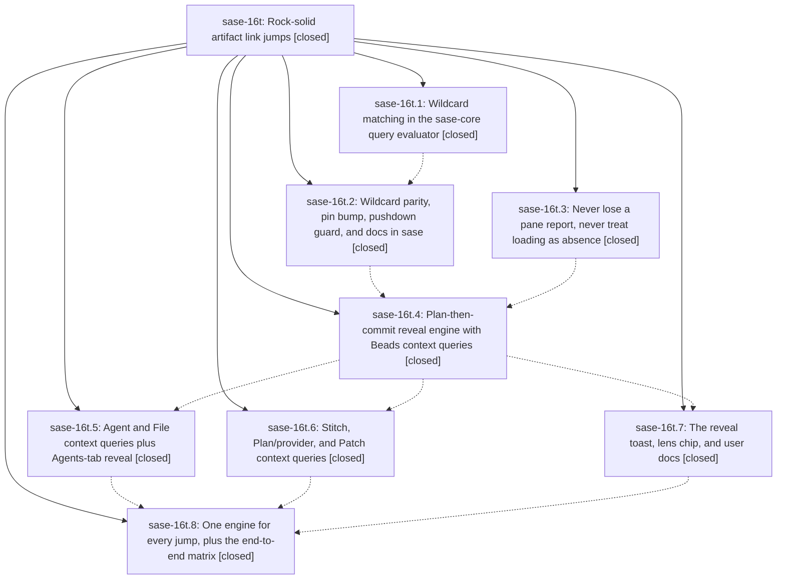

# Bead: sase-16t — Rock-solid artifact link jumps

[Bead Pages](../README.md) / sase-16t

**Status:** ✓ closed · **Resolution:** done · **Type:** ▸ plan · **Tier:** epic
**Owner:** `bryanbugyi34@gmail.com` · **Created by:** [bbugyi200.athena.0pq](https://github.com/sase-org/sase--agents/blob/main/families/bbugyi200.athena.0pq.md) · **Assignee:** `sase-16t.land`
**Created:** 2026-09-23 08:23:29 EDT · **Closed:** 2026-09-23 14:25:21 EDT
**Plan:** [202609/artifact\_link\_jumps.md](https://github.com/sase-org/sase--plans/blob/main/202609/artifact_link_jumps.md)

## Description

Following any artifact link (the `$` link rail, the `$0` Links panel, relation jumps) always lands on the target row: the destination Artifacts sub-tab switches to a verified, readable context query that shows the target among its natural family (for example `id:sase-16n.* limit:100` for a closed epic phase), selects it, explains the rewrite in one clear toast, and restores the user's query with `^`. Jumps fail only for truly dangling refs.

## Notes

[2026-09-23T18:05:09Z · sase-16n.11.land] DISCOVERED ISSUE (from code review by the sase-16n.11 land agent; not live-reproduced): the reveal toast's scope line (_describe_scope_change / _scope_display_name in src/sase/ace/tui/actions/_link_follow_toast.py, added by e25372a64 / sase-16t.7) prints the raw Artifacts project-scope key, e.g. 'scope  gh_sase-org__sase → All projects'. The Artifacts pane shows the configured display name for the same scope (_project_display_name in src/sase/ace/tui/widgets/artifacts/agents_options.py:_scope_text). Users should never see directory keys, so resolve the scope through the display-name helper (e.g. project_display_name_for) before rendering.

[2026-09-23T18:25:21Z · sase-16t.land] LANDED by sase-16t.land at master 1fb9d0138 (+ land fixes below).

VERIFIED (step 1): All 8 phases closed and every child note reviewed. Read the epic commits f37f1dd48 (.2), 06909a1ae (.3), 56a7684a3 (.4), e25372a64 (.7), 60b236b5b (.5), a74e98cfb (.6), e3c2a7788 (.8), plus sase-core 4af70ce (.1). Checked the source against the plan: anchored/unanchored/enum-literal glob in the core evaluator; sase-core-revision.txt cfe1902 contains 4af70ce; Python reference parity, pushdown guard, highlighting, field hints, and query_language/beads docs are in place; the dispatch-slot seam upgrades PENDING; loading re-requests once; re-resolve after load; entry_target_project scope rule never narrows All; plan-then-commit ladder is Fold→Context→Identity→Neutral with Acquire before rewrites, and the limit-drop/widening rungs and minimal_widening_query are deleted; host_reveal_context exists for Beads, Agents, Files, Plans/providers, Stitches, and Patches; Agents-tab reveal falls back to Artifacts ▸ Agent; the toast formatter uses live keys and escaping, with a lens-chip label; Link Jumps docs in ace.md and artifacts_pane_contract.md; relation misses and cross-pane jumps route through _follow_artifacts_target; job: jumps expand service:scheduler and roll back on failure; unconfigured ref:* no longer lands on Stitches. sase-16t.2 had closed with 'verification pending'. Running its suites surfaced two epic-caused test failures, fixed below.

LAND FIXES (epic-caused, done directly, so no child plan was needed): (a) epic note #1: the reveal toast scope line printed raw project keys (gh_sase-org__sase). format_reveal_toast now takes scope_names, and _notify_reveal_toast passes _artifacts_project_choices.display_names, the same source the Artifacts pane scope text uses. Added a pure test and a live-mixin test. (b) tests/ace/tui/test_link_trail.py: the fake _App.notify rejected title=/timeout=, which the toast (.7) passes, so test_back_restores_narrowed_query_rewritten_by_the_forward_hop failed. (c) tests/test_query_profile_reference.py (.2): the glob-flat profile's id field was not negatable/repeatable, so test_reference_flat_glob_negation_and_lists_compose raised ProfileQueryError.

TESTS: 332 epic/query/relation/member-jump tests pass after the fixes. The diff-scoped selection (81 files, 934 tests) passes via sase tool run test ee3ff627. sase tool run check 12a34e31 passes fmt, ruff, mypy, and every other lint gate. It is red only at symvision on ClanSummaryDigest (sase-170.1, not this epic), which stops the recipe before its test lane, so the scoped lane was run separately.

INTEGRATION (step 2): Reviewed the 24 non-epic commits since 08:23. None touches link-follow, reveal, artifacts panes, or the query evaluator. The sase-16y jump-panel commits (311e76114, 34080568e, 0513bf2ab) consume the same prepare/reveal_agent_navigation_target API as the epic's Agents-tab reveal. There is no conflict or duplication, so no changes were needed.

FOLLOW-UPS: sase-16t.1#1 (sase-core provider_priority LockTimeout flake): +1 on existing sase-yn. sase-16t.2/.3/.5/.6/.7 (ExpandedLaunchSegments symvision): duplicates of sase-16u, and no longer reproduce (privatized by caca6b60f). Declined, with a note added on sase-16u. sase-16t.3#2 (prompt_history_modal_label failures): declined because all 13 tests pass at HEAD. sase-16t.8#1 (ClanSummaryDigest): already a DISCOVERED ISSUE on active epic sase-170. Corroborating note added there that it still reproduces after all sase-170 phases closed.

EPIC SYMBOLS: none for sase-16t.

## Phases

| Bead | Title | Status | Size | Created | Agents | Commits |
|---|---|---|---|---|---:|---:|
| [sase-16t.1](sase-16t.1.md) | Wildcard matching in the sase-core query evaluator | ✓ closed | small | 2026-09-23 | 1 | 1 |
| [sase-16t.2](sase-16t.2.md) | Wildcard parity, pin bump, pushdown guard, and docs in sase | ✓ closed | small | 2026-09-23 | 1 | 1 |
| [sase-16t.3](sase-16t.3.md) | Never lose a pane report, never treat loading as absence | ✓ closed | medium | 2026-09-23 | 1 | 1 |
| [sase-16t.4](sase-16t.4.md) | Plan-then-commit reveal engine with Beads context queries | ✓ closed | medium | 2026-09-23 | 1 | 1 |
| [sase-16t.5](sase-16t.5.md) | Agent and File context queries plus Agents-tab reveal | ✓ closed | medium | 2026-09-23 | 1 | 1 |
| [sase-16t.6](sase-16t.6.md) | Stitch, Plan/provider, and Patch context queries | ✓ closed | medium | 2026-09-23 | 1 | 1 |
| [sase-16t.7](sase-16t.7.md) | The reveal toast, lens chip, and user docs | ✓ closed | small | 2026-09-23 | 1 | 1 |
| [sase-16t.8](sase-16t.8.md) | One engine for every jump, plus the end-to-end matrix | ✓ closed | medium | 2026-09-23 | 1 | 1 |

## Lineage

## Agents

| Agent | Bead | Commits |
|---|---|---:|
| [bbugyi200.athena.sase-16t.1](https://github.com/sase-org/sase--agents/blob/main/agents/bbugyi200.athena.sase-16t.1/README.md) | [sase-16t.1](sase-16t.1.md) | 1 |
| [bbugyi200.athena.sase-16t.2](https://github.com/sase-org/sase--agents/blob/main/agents/bbugyi200.athena.sase-16t.2/README.md) | [sase-16t.2](sase-16t.2.md) | 1 |
| [bbugyi200.athena.sase-16t.3](https://github.com/sase-org/sase--agents/blob/main/agents/bbugyi200.athena.sase-16t.3/README.md) | [sase-16t.3](sase-16t.3.md) | 1 |
| [bbugyi200.athena.sase-16t.4](https://github.com/sase-org/sase--agents/blob/main/agents/bbugyi200.athena.sase-16t.4/README.md) | [sase-16t.4](sase-16t.4.md) | 1 |
| [bbugyi200.athena.sase-16t.5](https://github.com/sase-org/sase--agents/blob/main/agents/bbugyi200.athena.sase-16t.5/README.md) | [sase-16t.5](sase-16t.5.md) | 1 |
| [bbugyi200.athena.sase-16t.6](https://github.com/sase-org/sase--agents/blob/main/agents/bbugyi200.athena.sase-16t.6/README.md) | [sase-16t.6](sase-16t.6.md) | 1 |
| [bbugyi200.athena.sase-16t.7](https://github.com/sase-org/sase--agents/blob/main/agents/bbugyi200.athena.sase-16t.7/README.md) | [sase-16t.7](sase-16t.7.md) | 1 |
| [bbugyi200.athena.sase-16t.8](https://github.com/sase-org/sase--agents/blob/main/agents/bbugyi200.athena.sase-16t.8/README.md) | [sase-16t.8](sase-16t.8.md) | 1 |
| [bbugyi200.athena.sase-16t.land](https://github.com/sase-org/sase--agents/blob/main/agents/bbugyi200.athena.sase-16t.land/README.md) | [sase-16t](README.md) | 1 |

## Commits

| Repo | Commit | Subject | Bead | Committed |
|---|---|---|---|---|
| sase-core | [`sase-core@4af70ce`](https://github.com/sase-org/sase-core/commit/4af70ce1e84b39ed6f4dd503a2bd6515f55d6aed) | feat(query): support \* wildcards in string property values | [sase-16t.1](sase-16t.1.md) | 2026-09-23 08:42:03 EDT |
| sase | [`f37f1dd`](https://github.com/sase-org/sase/commit/f37f1dd480202d5eeead8aa04f8b0808504b8613) | feat(query): wildcard parity, pin bump, pushdown guard, and docs (sase-16t.2, verification pending) | [sase-16t.2](sase-16t.2.md) | 2026-09-23 09:18:34 EDT |
| sase | [`06909a1`](https://github.com/sase-org/sase/commit/06909a1aed0aa7da3a52940ea032a6252494ea7c) | fix(ace): never lose a pane report, never treat loading as absence | [sase-16t.3](sase-16t.3.md) | 2026-09-23 10:31:19 EDT |
| sase | [`56a7684`](https://github.com/sase-org/sase/commit/56a7684a3e3b3572ccaf206a7876941a75aa4331) | feat(ace): plan-then-commit link reveal engine with Beads context queries | [sase-16t.4](sase-16t.4.md) | 2026-09-23 11:08:26 EDT |
| sase | [`e25372a`](https://github.com/sase-org/sase/commit/e25372a64a856b692329c9ad57f935a945f58ad2) | feat(ace): reveal toast, lens chip label, and Link Jumps docs | [sase-16t.7](sase-16t.7.md) | 2026-09-23 12:21:01 EDT |
| sase | [`60b236b`](https://github.com/sase-org/sase/commit/60b236b5b3d5ed591d986410da68cc6351ffc4ac) | feat(ace): agent and file context queries plus Agents-tab reveal | [sase-16t.5](sase-16t.5.md) | 2026-09-23 12:26:21 EDT |
| sase | [`a74e98c`](https://github.com/sase-org/sase/commit/a74e98cfb769e215d32ee5ed915d2683e5b59228) | feat(ace): bounded-panes acquire-then-reveal for Stitch, Plan/provider, and Patch jumps | [sase-16t.6](sase-16t.6.md) | 2026-09-23 13:28:34 EDT |
| sase | [`e3c2a77`](https://github.com/sase-org/sase/commit/e3c2a7788b83873dc1cdf5e8ca4da5bb381a7b04) | feat(ace): one engine for every jump, plus the end-to-end matrix | [sase-16t.8](sase-16t.8.md) | 2026-09-23 13:58:56 EDT |
| sase | [`813f42a`](https://github.com/sase-org/sase/commit/813f42a5356e4f80da0502d8570c10202a9fa874) | fix(ace): land sase-16t with display-name scope toasts and epic test repairs | [sase-16t](README.md) | 2026-09-23 14:28:20 EDT |

<!-- sase:referenced-by:start -->

## Referenced By

| Relation | Artifact | Why | Uses |
| --- | --- | --- | ---: |
| read-by | [agent:sase-16t.1][1] | epic context for phase | 1 |
| read-by | [agent:sase-16t.2][2] | parent epic scope | 1 |

[1]: https://github.com/sase-org/sase--agents/blob/main/agents/bbugyi200.athena.sase-16t.1/README.md
[2]: https://github.com/sase-org/sase--agents/blob/main/agents/bbugyi200.athena.sase-16t.2/README.md

<!-- sase:referenced-by:end -->
