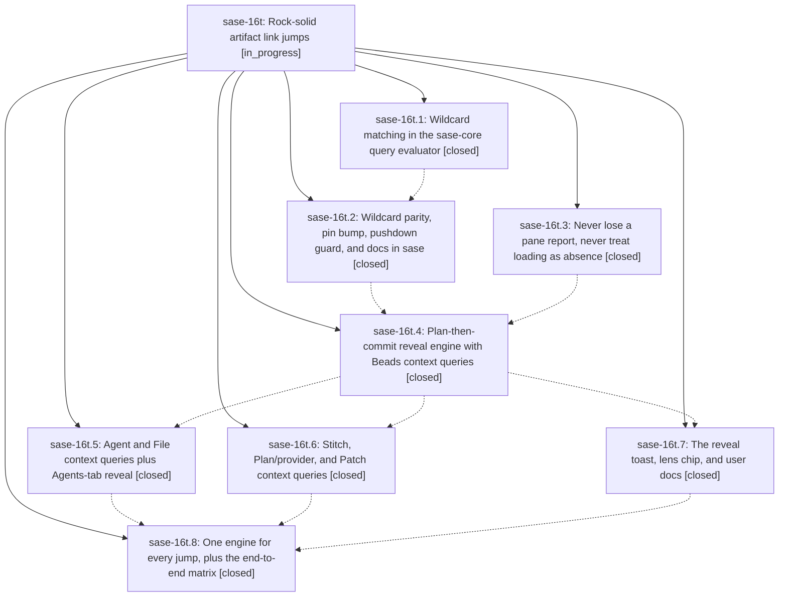

# Bead: sase-16t — Rock-solid artifact link jumps

[Bead Pages](../README.md) / sase-16t

**Status:** ◐ in_progress · **Type:** ▸ plan · **Tier:** epic
**Owner:** `bryanbugyi34@gmail.com` · **Created by:** [bbugyi200.athena.0pq](https://github.com/sase-org/sase--agents/blob/main/families/bbugyi200.athena.0pq.md) · **Assignee:** `sase-16t.land`
**Created:** 2026-09-23 08:23:29 EDT
**Plan:** [202609/artifact\_link\_jumps.md](https://github.com/sase-org/sase--plans/blob/main/202609/artifact_link_jumps.md)

## Description

Following any artifact link (the `$` link rail, the `$0` Links panel, relation jumps) always lands on the target row: the destination Artifacts sub-tab switches to a verified, readable context query that shows the target among its natural family (for example `id:sase-16n.* limit:100` for a closed epic phase), selects it, explains the rewrite in one clear toast, and restores the user's query with `^`. Jumps fail only for truly dangling refs.

## Phases

| Bead | Title | Status | Size | Created | Agents | Commits |
|---|---|---|---|---|---:|---:|
| [sase-16t.1](sase-16t.1.md) | Wildcard matching in the sase-core query evaluator | ✓ closed | small | 2026-09-23 | 1 | 1 |
| [sase-16t.2](sase-16t.2.md) | Wildcard parity, pin bump, pushdown guard, and docs in sase | ✓ closed | small | 2026-09-23 | 1 | 1 |
| [sase-16t.3](sase-16t.3.md) | Never lose a pane report, never treat loading as absence | ✓ closed | medium | 2026-09-23 | 1 | 1 |
| [sase-16t.4](sase-16t.4.md) | Plan-then-commit reveal engine with Beads context queries | ✓ closed | medium | 2026-09-23 | 1 | 1 |
| [sase-16t.5](sase-16t.5.md) | Agent and File context queries plus Agents-tab reveal | ✓ closed | medium | 2026-09-23 | 1 | 1 |
| [sase-16t.6](sase-16t.6.md) | Stitch, Plan/provider, and Patch context queries | ✓ closed | medium | 2026-09-23 | 1 | 1 |
| [sase-16t.7](sase-16t.7.md) | The reveal toast, lens chip, and user docs | ✓ closed | small | 2026-09-23 | 1 | 1 |
| [sase-16t.8](sase-16t.8.md) | One engine for every jump, plus the end-to-end matrix | ✓ closed | medium | 2026-09-23 | 1 | 1 |

## Lineage

## Agents

| Agent | Bead | Commits |
|---|---|---:|
| [bbugyi200.athena.sase-16t.1](https://github.com/sase-org/sase--agents/blob/main/agents/bbugyi200.athena.sase-16t.1/README.md) | [sase-16t.1](sase-16t.1.md) | 1 |
| [bbugyi200.athena.sase-16t.2](https://github.com/sase-org/sase--agents/blob/main/agents/bbugyi200.athena.sase-16t.2/README.md) | [sase-16t.2](sase-16t.2.md) | 1 |
| [bbugyi200.athena.sase-16t.3](https://github.com/sase-org/sase--agents/blob/main/agents/bbugyi200.athena.sase-16t.3/README.md) | [sase-16t.3](sase-16t.3.md) | 1 |
| [bbugyi200.athena.sase-16t.4](https://github.com/sase-org/sase--agents/blob/main/agents/bbugyi200.athena.sase-16t.4/README.md) | [sase-16t.4](sase-16t.4.md) | 1 |
| [bbugyi200.athena.sase-16t.5](https://github.com/sase-org/sase--agents/blob/main/agents/bbugyi200.athena.sase-16t.5/README.md) | [sase-16t.5](sase-16t.5.md) | 1 |
| [bbugyi200.athena.sase-16t.6](https://github.com/sase-org/sase--agents/blob/main/agents/bbugyi200.athena.sase-16t.6/README.md) | [sase-16t.6](sase-16t.6.md) | 1 |
| [bbugyi200.athena.sase-16t.7](https://github.com/sase-org/sase--agents/blob/main/agents/bbugyi200.athena.sase-16t.7/README.md) | [sase-16t.7](sase-16t.7.md) | 1 |
| [bbugyi200.athena.sase-16t.8](https://github.com/sase-org/sase--agents/blob/main/agents/bbugyi200.athena.sase-16t.8/README.md) | [sase-16t.8](sase-16t.8.md) | 1 |
| [bbugyi200.athena.sase-16t.land](https://github.com/sase-org/sase--agents/blob/main/agents/bbugyi200.athena.sase-16t.land/README.md) | [sase-16t](README.md) | 0 |

## Commits

| Repo | Commit | Subject | Bead | Committed |
|---|---|---|---|---|
| sase-core | [`sase-core@4af70ce`](https://github.com/sase-org/sase-core/commit/4af70ce1e84b39ed6f4dd503a2bd6515f55d6aed) | feat(query): support \* wildcards in string property values | [sase-16t.1](sase-16t.1.md) | 2026-09-23 08:42:03 EDT |
| sase | [`f37f1dd`](https://github.com/sase-org/sase/commit/f37f1dd480202d5eeead8aa04f8b0808504b8613) | feat(query): wildcard parity, pin bump, pushdown guard, and docs (sase-16t.2, verification pending) | [sase-16t.2](sase-16t.2.md) | 2026-09-23 09:18:34 EDT |
| sase | [`06909a1`](https://github.com/sase-org/sase/commit/06909a1aed0aa7da3a52940ea032a6252494ea7c) | fix(ace): never lose a pane report, never treat loading as absence | [sase-16t.3](sase-16t.3.md) | 2026-09-23 10:31:19 EDT |
| sase | [`56a7684`](https://github.com/sase-org/sase/commit/56a7684a3e3b3572ccaf206a7876941a75aa4331) | feat(ace): plan-then-commit link reveal engine with Beads context queries | [sase-16t.4](sase-16t.4.md) | 2026-09-23 11:08:26 EDT |
| sase | [`e25372a`](https://github.com/sase-org/sase/commit/e25372a64a856b692329c9ad57f935a945f58ad2) | feat(ace): reveal toast, lens chip label, and Link Jumps docs | [sase-16t.7](sase-16t.7.md) | 2026-09-23 12:21:01 EDT |
| sase | [`60b236b`](https://github.com/sase-org/sase/commit/60b236b5b3d5ed591d986410da68cc6351ffc4ac) | feat(ace): agent and file context queries plus Agents-tab reveal | [sase-16t.5](sase-16t.5.md) | 2026-09-23 12:26:21 EDT |
| sase | [`a74e98c`](https://github.com/sase-org/sase/commit/a74e98cfb769e215d32ee5ed915d2683e5b59228) | feat(ace): bounded-panes acquire-then-reveal for Stitch, Plan/provider, and Patch jumps | [sase-16t.6](sase-16t.6.md) | 2026-09-23 13:28:34 EDT |
| sase | [`e3c2a77`](https://github.com/sase-org/sase/commit/e3c2a7788b83873dc1cdf5e8ca4da5bb381a7b04) | feat(ace): one engine for every jump, plus the end-to-end matrix | [sase-16t.8](sase-16t.8.md) | 2026-09-23 13:58:56 EDT |

<!-- sase:referenced-by:start -->

## Referenced By

| Relation | Artifact | Why | Uses |
| --- | --- | --- | ---: |
| read-by | [agent:sase-16t.1][1] | epic context for phase | 1 |
| read-by | [agent:sase-16t.2][2] | parent epic scope | 1 |

[1]: https://github.com/sase-org/sase--agents/blob/main/agents/bbugyi200.athena.sase-16t.1/README.md
[2]: https://github.com/sase-org/sase--agents/blob/main/agents/bbugyi200.athena.sase-16t.2/README.md

<!-- sase:referenced-by:end -->
