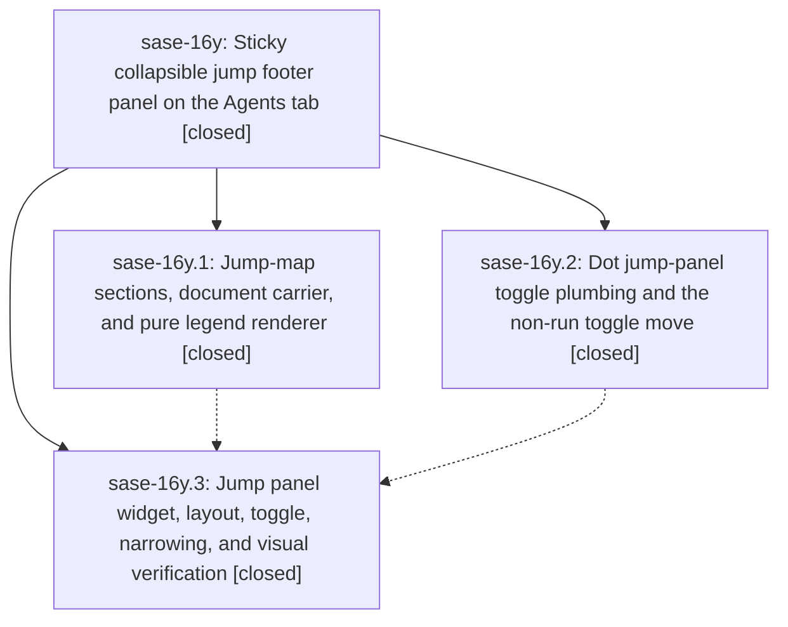

# Bead: sase-16y — Sticky collapsible jump footer panel on the Agents tab

[Bead Pages](../README.md) / sase-16y

**Status:** ✓ closed · **Resolution:** done · **Type:** ▸ plan · **Tier:** epic
**Owner:** `bryanbugyi34@gmail.com` · **Created by:** [bbugyi200.athena.0q0](https://github.com/sase-org/sase--agents/blob/main/families/bbugyi200.athena.0q0.md) · **Assignee:** `sase-16y.land`
**Created:** 2026-09-23 10:49:53 EDT · **Closed:** 2026-09-23 14:32:08 EDT
**Plan:** [202609/agent\_jump\_footer\_panel.md](https://github.com/sase-org/sase--plans/blob/main/202609/agent_jump_footer_panel.md)

## Description

On the Agents tab, every live numbered roster target (family shells, neighbors, clan members, tribe members) is listed in a sticky panel at the bottom of the detail column, below the LLM Calls/file panel. The panel appears only when digit jumps are live. It is collapsed by default to at most two packed rows, where every visible number carries a label that unambiguously identifies its target. `.` expands it to the complete list, and the first digit of a two-digit jump narrows it to the matching candidates. The Agents show/hide non-run agents toggle moves from `.` to `I`.

## Notes

[2026-09-23T18:32:08Z · sase-16y.land] Land verified: all 3 phases closed and every child note addressed; plan requirements confirmed in source (0513bf2ab legend: _MemberJumpTarget label/status_bucket, sections, carrier slot + find_member_jump_map sink attached pre-digest, JumpLegendRenderable packer; 34080568e keymap: toggle_agent_jump_panel on '.', toggle_hide_non_run_agents on 'I', toggle_hide_reverted narrowed to Services, availability/registry/palette/help/docs; 311e76114 panel: AgentJumpPanel last in #agent-detail-layout, _agent_detail_jump mixin, narrowing set/clear routed through _cancel_member_jump_pending for every pending-digit clear, CSS, docs, pilot/reliability/visual tests + goldens). Integration: reviewed 16 non-epic commits since epic start; tribe CLAN SUMMARIES (e1c4208cd) reuses the published tribe map numbers and the tribe carrier still attaches the map; link-jump engine commits (sase-16t) do not touch digit jumps; no conflicts or duplication. Epic symbol: privatized MemberJumpSection -> _MemberJumpSection (only used in _member_roster.py, like _MemberJumpTarget) and removed its Justfile --epic-symbol entry; symvision shows no sase-16y symbols. just check: every stage green except symvision, which fails only on sase-170's stale sase-170.5(resolve_clan_launch_defaults) entry + ClanSummaryDigest (noted on sase-170); scoped tests 45709 passed, 16 failed, 15 reproduce on pristine master and 1 (prompt_stack add_pane) passed on rerun - none in jump-panel code. Follow-ups: sase-16y.3 retry_e2e golden drift -> +1 on duplicate sase-173; sase-16y.1 pre-existing reds -> DISCOVERED ISSUE notes on causing active epics sase-16t (query_profile_reference, no_ref_prefix_dispatch, link_trail), sase-16n.11.7 (8 bead-work '+sase' nodes, prompt edit/run/select completion-spec drift), sase-171 (agent-cli install completion-spec drift), sase-170 (symvision); import budget 3298>=3290 -> +1 on sase-13p (reopened; budget already 3295 before this epic, which added +1 module). The sase-16y.1 pyscripts and ExpandedLaunchSegments reds are already gone at HEAD, so nothing filed for them.

## Phases

| Bead | Title | Status | Size | Created | Agents | Commits |
|---|---|---|---|---|---:|---:|
| [sase-16y.1](sase-16y.1.md) | Jump-map sections, document carrier, and pure legend renderer | ✓ closed | medium | 2026-09-23 | 1 | 1 |
| [sase-16y.2](sase-16y.2.md) | Dot jump-panel toggle plumbing and the non-run toggle move | ✓ closed | small | 2026-09-23 | 1 | 1 |
| [sase-16y.3](sase-16y.3.md) | Jump panel widget, layout, toggle, narrowing, and visual verification | ✓ closed | medium | 2026-09-23 | 1 | 1 |

## Lineage

## Agents

| Agent | Bead | Commits |
|---|---|---:|
| [bbugyi200.athena.sase-16y.1](https://github.com/sase-org/sase--agents/blob/main/agents/bbugyi200.athena.sase-16y.1/README.md) | [sase-16y.1](sase-16y.1.md) | 1 |
| [bbugyi200.athena.sase-16y.2](https://github.com/sase-org/sase--agents/blob/main/agents/bbugyi200.athena.sase-16y.2/README.md) | [sase-16y.2](sase-16y.2.md) | 1 |
| [bbugyi200.athena.sase-16y.3](https://github.com/sase-org/sase--agents/blob/main/agents/bbugyi200.athena.sase-16y.3/README.md) | [sase-16y.3](sase-16y.3.md) | 1 |
| [bbugyi200.athena.sase-16y.land](https://github.com/sase-org/sase--agents/blob/main/agents/bbugyi200.athena.sase-16y.land/README.md) | [sase-16y](README.md) | 1 |

## Commits

| Repo | Commit | Subject | Bead | Committed |
|---|---|---|---|---|
| sase | [`0513bf2`](https://github.com/sase-org/sase/commit/0513bf2ab3048cd8b6c07c1041fe9856b33e142b) | feat(agents): jump-map sections, document carrier, and pure legend renderer | [sase-16y.1](sase-16y.1.md) | 2026-09-23 11:34:27 EDT |
| sase | [`3408056`](https://github.com/sase-org/sase/commit/34080568e6e9e91376eed89906eae3d99f24dd7b) | feat(ace): add Agents jump-panel keymap phase with non-run toggle | [sase-16y.2](sase-16y.2.md) | 2026-09-23 11:37:35 EDT |
| sase | [`311e761`](https://github.com/sase-org/sase/commit/311e761145e56aa22b2b4eaa030afd3ebd704932) | feat(ace): sticky collapsible jump footer panel on the Agents tab | [sase-16y.3](sase-16y.3.md) | 2026-09-23 13:51:47 EDT |
| sase | [`afc72c6`](https://github.com/sase-org/sase/commit/afc72c6989108c93fc65ab67c42bb225dd1cc362) | chore(ace): land jump footer panel epic and retire its epic symbol | [sase-16y](README.md) | 2026-09-23 14:53:22 EDT |
