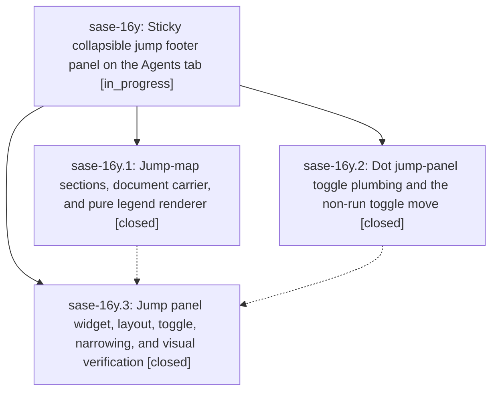

# Bead: sase-16y — Sticky collapsible jump footer panel on the Agents tab

[Bead Pages](../README.md) / sase-16y

**Status:** ◐ in_progress · **Type:** ▸ plan · **Tier:** epic
**Owner:** `bryanbugyi34@gmail.com` · **Created by:** [bbugyi200.athena.0q0](https://github.com/sase-org/sase--agents/blob/main/families/bbugyi200.athena.0q0.md) · **Assignee:** `sase-16y.land`
**Created:** 2026-09-23 10:49:53 EDT
**Plan:** [202609/agent\_jump\_footer\_panel.md](https://github.com/sase-org/sase--plans/blob/main/202609/agent_jump_footer_panel.md)

## Description

On the Agents tab, every live numbered roster target (family shells, neighbors, clan members, tribe members) is listed in a sticky panel at the bottom of the detail column, below the LLM Calls/file panel. The panel appears only when digit jumps are live. It is collapsed by default to at most two packed rows, where every visible number carries a label that unambiguously identifies its target. `.` expands it to the complete list, and the first digit of a two-digit jump narrows it to the matching candidates. The Agents show/hide non-run agents toggle moves from `.` to `I`.

## Phases

| Bead | Title | Status | Size | Created | Agents | Commits |
|---|---|---|---|---|---:|---:|
| [sase-16y.1](sase-16y.1.md) | Jump-map sections, document carrier, and pure legend renderer | ✓ closed | medium | 2026-09-23 | 1 | 1 |
| [sase-16y.2](sase-16y.2.md) | Dot jump-panel toggle plumbing and the non-run toggle move | ✓ closed | small | 2026-09-23 | 1 | 1 |
| [sase-16y.3](sase-16y.3.md) | Jump panel widget, layout, toggle, narrowing, and visual verification | ✓ closed | medium | 2026-09-23 | 1 | 1 |

## Lineage

## Agents

| Agent | Bead | Commits |
|---|---|---:|
| [bbugyi200.athena.sase-16y.1](https://github.com/sase-org/sase--agents/blob/main/agents/bbugyi200.athena.sase-16y.1/README.md) | [sase-16y.1](sase-16y.1.md) | 1 |
| [bbugyi200.athena.sase-16y.2](https://github.com/sase-org/sase--agents/blob/main/agents/bbugyi200.athena.sase-16y.2/README.md) | [sase-16y.2](sase-16y.2.md) | 1 |
| [bbugyi200.athena.sase-16y.3](https://github.com/sase-org/sase--agents/blob/main/agents/bbugyi200.athena.sase-16y.3/README.md) | [sase-16y.3](sase-16y.3.md) | 1 |
| [bbugyi200.athena.sase-16y.land](https://github.com/sase-org/sase--agents/blob/main/agents/bbugyi200.athena.sase-16y.land/README.md) | [sase-16y](README.md) | 0 |

## Commits

| Repo | Commit | Subject | Bead | Committed |
|---|---|---|---|---|
| sase | [`0513bf2`](https://github.com/sase-org/sase/commit/0513bf2ab3048cd8b6c07c1041fe9856b33e142b) | feat(agents): jump-map sections, document carrier, and pure legend renderer | [sase-16y.1](sase-16y.1.md) | 2026-09-23 11:34:27 EDT |
| sase | [`3408056`](https://github.com/sase-org/sase/commit/34080568e6e9e91376eed89906eae3d99f24dd7b) | feat(ace): add Agents jump-panel keymap phase with non-run toggle | [sase-16y.2](sase-16y.2.md) | 2026-09-23 11:37:35 EDT |
| sase | [`311e761`](https://github.com/sase-org/sase/commit/311e761145e56aa22b2b4eaa030afd3ebd704932) | feat(ace): sticky collapsible jump footer panel on the Agents tab | [sase-16y.3](sase-16y.3.md) | 2026-09-23 13:51:47 EDT |
