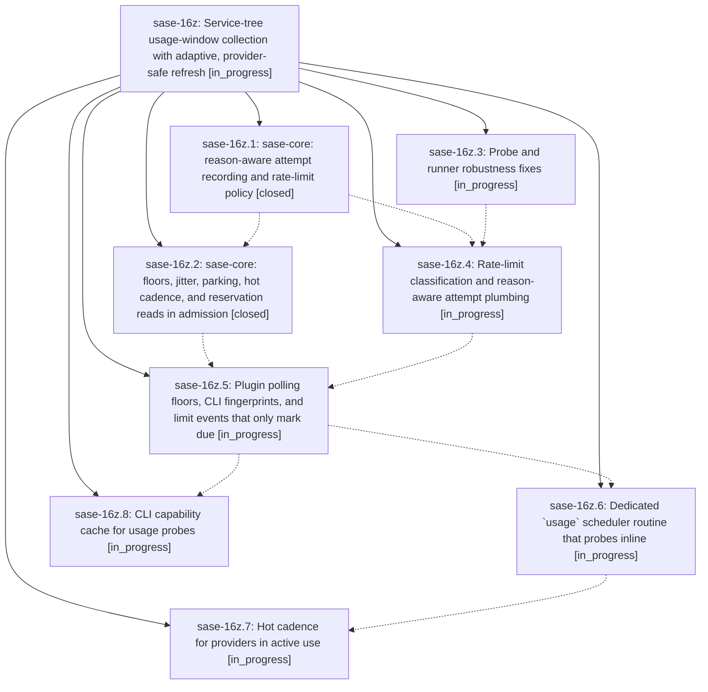

# Bead: sase-16z — Service-tree usage-window collection with adaptive, provider-safe refresh

[Bead Pages](../README.md) / sase-16z

**Status:** ◐ in_progress · **Type:** ▸ plan · **Tier:** epic
**Owner:** `bryanbugyi34@gmail.com` · **Created by:** [bbugyi200.athena.0q3](https://github.com/sase-org/sase--agents/blob/main/families/bbugyi200.athena.0q3.md) · **Assignee:** `sase-16z.land`
**Created:** 2026-09-23 11:06:09 EDT
**Plan:** [202609/usage\_window\_collection\_service\_tree.md](https://github.com/sase-org/sase--plans/blob/main/202609/usage_window_collection_service_tree.md)

## Description

Periodic usage-window collection runs inside the scheduler service tree (a dedicated `usage` routine whose job probes inline) and no longer creates periodic proc rows. Usage windows refresh sooner where the numbers actually move (a 60 s routine tick plus a "hot" cadence for providers in use). Per-provider polling floors, jitter, honored Retry-After, and reason-aware backoff keep every provider from being overwhelmed. Each provider's collection errors are classified, surfaced with a retry time, and recovered from without blanking last-known-good windows.

## Phases

| Bead | Title | Status | Size | Created | Agents | Commits |
|---|---|---|---|---|---:|---:|
| [sase-16z.1](sase-16z.1.md) | sase-core: reason-aware attempt recording and rate-limit policy | ✓ closed | medium | 2026-09-23 | 1 | 1 |
| [sase-16z.2](sase-16z.2.md) | sase-core: floors, jitter, parking, hot cadence, and reservation reads in admission | ✓ closed | medium | 2026-09-23 | 1 | 1 |
| [sase-16z.3](sase-16z.3.md) | Probe and runner robustness fixes | ◐ in_progress | medium | 2026-09-23 | 1 | 0 |
| [sase-16z.4](sase-16z.4.md) | Rate-limit classification and reason-aware attempt plumbing | ◐ in_progress | medium | 2026-09-23 | 1 | 0 |
| [sase-16z.5](sase-16z.5.md) | Plugin polling floors, CLI fingerprints, and limit events that only mark due | ◐ in_progress | medium | 2026-09-23 | 1 | 0 |
| [sase-16z.6](sase-16z.6.md) | Dedicated \`usage\` scheduler routine that probes inline | ◐ in_progress | medium | 2026-09-23 | 1 | 0 |
| [sase-16z.7](sase-16z.7.md) | Hot cadence for providers in active use | ◐ in_progress | medium | 2026-09-23 | 1 | 0 |
| [sase-16z.8](sase-16z.8.md) | CLI capability cache for usage probes | ◐ in_progress | medium | 2026-09-23 | 1 | 0 |

## Lineage

## Agents

| Agent | Bead | Commits |
|---|---|---:|
| [bbugyi200.athena.sase-16z.1](https://github.com/sase-org/sase--agents/blob/main/agents/bbugyi200.athena.sase-16z.1/README.md) | [sase-16z.1](sase-16z.1.md) | 1 |
| [bbugyi200.athena.sase-16z.2](https://github.com/sase-org/sase--agents/blob/main/agents/bbugyi200.athena.sase-16z.2/README.md) | [sase-16z.2](sase-16z.2.md) | 1 |
| [bbugyi200.athena.sase-16z.3](https://github.com/sase-org/sase--agents/blob/main/families/bbugyi200.athena.sase-16z.3.md) | [sase-16z.3](sase-16z.3.md) | 0 |
| [bbugyi200.athena.sase-16z.4](https://github.com/sase-org/sase--agents/blob/main/agents/bbugyi200.athena.sase-16z.4/README.md) | [sase-16z.4](sase-16z.4.md) | 0 |
| [bbugyi200.athena.sase-16z.5](https://github.com/sase-org/sase--agents/blob/main/agents/bbugyi200.athena.sase-16z.5/README.md) | [sase-16z.5](sase-16z.5.md) | 0 |
| [bbugyi200.athena.sase-16z.6](https://github.com/sase-org/sase--agents/blob/main/agents/bbugyi200.athena.sase-16z.6/README.md) | [sase-16z.6](sase-16z.6.md) | 0 |
| [bbugyi200.athena.sase-16z.7](https://github.com/sase-org/sase--agents/blob/main/agents/bbugyi200.athena.sase-16z.7/README.md) | [sase-16z.7](sase-16z.7.md) | 0 |
| [bbugyi200.athena.sase-16z.8](https://github.com/sase-org/sase--agents/blob/main/agents/bbugyi200.athena.sase-16z.8/README.md) | [sase-16z.8](sase-16z.8.md) | 0 |
| [bbugyi200.athena.sase-16z.land](https://github.com/sase-org/sase--agents/blob/main/agents/bbugyi200.athena.sase-16z.land/README.md) | [sase-16z](README.md) | 0 |

## Commits

| Repo | Commit | Subject | Bead | Committed |
|---|---|---|---|---|
| sase-core | [`sase-core@44dbc91`](https://github.com/sase-org/sase-core/commit/44dbc91b909c060a5ba5c53329f4891d0204d057) | feat!: reason-aware adaptive refresh-attempt policy for provider usage | [sase-16z.1](sase-16z.1.md) | 2026-09-23 11:42:05 EDT |
| sase-core | [`sase-core@cfe1902`](https://github.com/sase-org/sase-core/commit/cfe1902a69919b2860c87bdae8b15b52c99d49ca) | feat!: adaptive admission policy for provider usage | [sase-16z.2](sase-16z.2.md) | 2026-09-23 12:37:06 EDT |
