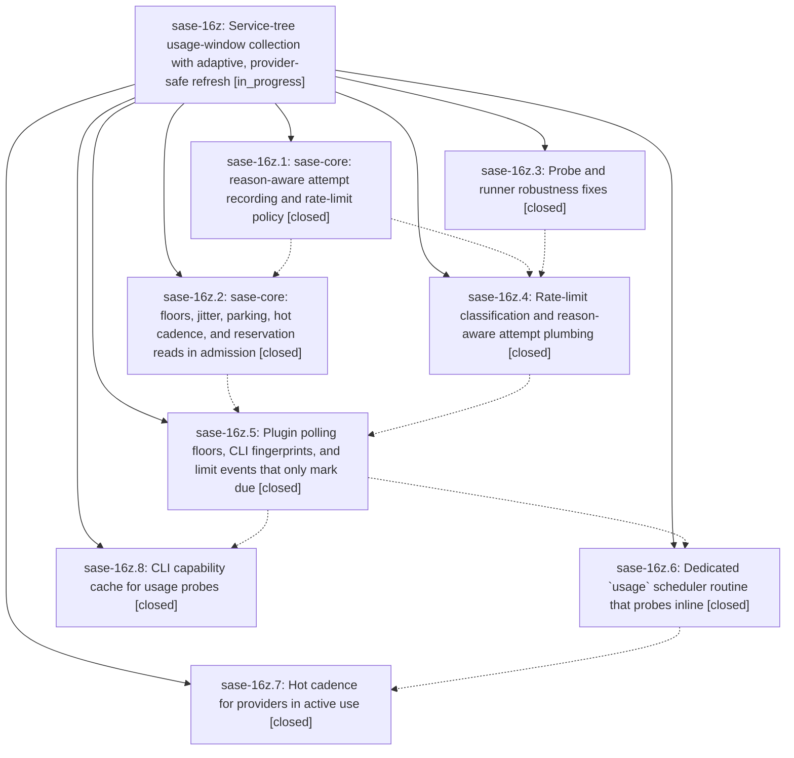

# Bead: sase-16z — Service-tree usage-window collection with adaptive, provider-safe refresh

[Bead Pages](../README.md) / sase-16z

**Status:** ◐ in_progress · **Type:** ▸ plan · **Tier:** epic
**Owner:** `bryanbugyi34@gmail.com` · **Created by:** [bbugyi200.athena.0q3](https://github.com/sase-org/sase--agents/blob/main/families/bbugyi200.athena.0q3.md) · **Assignee:** `sase-16z.land`
**Created:** 2026-09-23 11:06:09 EDT
**Plan:** [202609/usage\_window\_collection\_service\_tree.md](https://github.com/sase-org/sase--plans/blob/main/202609/usage_window_collection_service_tree.md)

## Description

Periodic usage-window collection runs inside the scheduler service tree (a dedicated `usage` routine whose job probes inline) and no longer creates periodic proc rows. Usage windows refresh sooner where the numbers actually move (a 60 s routine tick plus a "hot" cadence for providers in use). Per-provider polling floors, jitter, honored Retry-After, and reason-aware backoff keep every provider from being overwhelmed. Each provider's collection errors are classified, surfaced with a retry time, and recovered from without blanking last-known-good windows.

## Notes

[2026-09-23T18:58:02Z · sase-16y.land] DISCOVERED ISSUE: on master 02cd6b69e (and afc72c698), 'sase tool run check' fails at lint (symvision): 'Private functions/classes must be used in the file where they are defined: _clear_probe_floor_cache and _resolve_provider_cli_command in src/sase/llm_provider/usage/_probe_meta.py'. Both are defined (lines ~131/138) with zero references anywhere in src/ or tests/; introduced by fcce8f2f3 (sase-16z.5). Blocks every agent's 'just check' until a later phase consumes them, they are deleted, or an --epic-symbol entry is added to the Justfile symvision recipe.

[2026-09-23T19:43:39Z · sase-170.land] DISCOVERED ISSUE (sase-170.land): a second symvision failure is masked behind the _probe_meta private-symbol error already noted here. Running 'symvision src/sase ... --exclude-file src/sase/llm_provider/usage/_probe_meta.py' at master 1230ed8da reports unused-public capability_cache_dir and invalidate_probe_capability in src/sase/llm_provider/usage/_capability_cache.py (added by 5e50d27f5, sase-16z.8); grep finds no consumer of either anywhere in src/. Once the _probe_meta error is fixed, just check will go red on these unless a later phase consumes them, they are privatized/deleted, or they get --epic-symbol entries.

## Phases

| Bead | Title | Status | Size | Created | Agents | Commits |
|---|---|---|---|---|---:|---:|
| [sase-16z.1](sase-16z.1.md) | sase-core: reason-aware attempt recording and rate-limit policy | ✓ closed | medium | 2026-09-23 | 1 | 1 |
| [sase-16z.2](sase-16z.2.md) | sase-core: floors, jitter, parking, hot cadence, and reservation reads in admission | ✓ closed | medium | 2026-09-23 | 1 | 1 |
| [sase-16z.3](sase-16z.3.md) | Probe and runner robustness fixes | ✓ closed | medium | 2026-09-23 | 1 | 1 |
| [sase-16z.4](sase-16z.4.md) | Rate-limit classification and reason-aware attempt plumbing | ✓ closed | medium | 2026-09-23 | 1 | 1 |
| [sase-16z.5](sase-16z.5.md) | Plugin polling floors, CLI fingerprints, and limit events that only mark due | ✓ closed | medium | 2026-09-23 | 1 | 1 |
| [sase-16z.6](sase-16z.6.md) | Dedicated \`usage\` scheduler routine that probes inline | ✓ closed | medium | 2026-09-23 | 1 | 1 |
| [sase-16z.7](sase-16z.7.md) | Hot cadence for providers in active use | ✓ closed | medium | 2026-09-23 | 1 | 1 |
| [sase-16z.8](sase-16z.8.md) | CLI capability cache for usage probes | ✓ closed | medium | 2026-09-23 | 1 | 1 |

## Lineage

## Agents

| Agent | Bead | Commits |
|---|---|---:|
| [bbugyi200.athena.sase-16z.1](https://github.com/sase-org/sase--agents/blob/main/agents/bbugyi200.athena.sase-16z.1/README.md) | [sase-16z.1](sase-16z.1.md) | 1 |
| [bbugyi200.athena.sase-16z.2](https://github.com/sase-org/sase--agents/blob/main/agents/bbugyi200.athena.sase-16z.2/README.md) | [sase-16z.2](sase-16z.2.md) | 1 |
| [bbugyi200.athena.sase-16z.3](https://github.com/sase-org/sase--agents/blob/main/families/bbugyi200.athena.sase-16z.3.md) | [sase-16z.3](sase-16z.3.md) | 1 |
| [bbugyi200.athena.sase-16z.4](https://github.com/sase-org/sase--agents/blob/main/agents/bbugyi200.athena.sase-16z.4/README.md) | [sase-16z.4](sase-16z.4.md) | 1 |
| [bbugyi200.athena.sase-16z.5](https://github.com/sase-org/sase--agents/blob/main/agents/bbugyi200.athena.sase-16z.5/README.md) | [sase-16z.5](sase-16z.5.md) | 1 |
| [bbugyi200.athena.sase-16z.6](https://github.com/sase-org/sase--agents/blob/main/agents/bbugyi200.athena.sase-16z.6/README.md) | [sase-16z.6](sase-16z.6.md) | 1 |
| [bbugyi200.athena.sase-16z.7](https://github.com/sase-org/sase--agents/blob/main/agents/bbugyi200.athena.sase-16z.7/README.md) | [sase-16z.7](sase-16z.7.md) | 1 |
| [bbugyi200.athena.sase-16z.8](https://github.com/sase-org/sase--agents/blob/main/agents/bbugyi200.athena.sase-16z.8/README.md) | [sase-16z.8](sase-16z.8.md) | 1 |
| [bbugyi200.athena.sase-16z.land](https://github.com/sase-org/sase--agents/blob/main/agents/bbugyi200.athena.sase-16z.land/README.md) | [sase-16z](README.md) | 0 |

## Commits

| Repo | Commit | Subject | Bead | Committed |
|---|---|---|---|---|
| sase-core | [`sase-core@44dbc91`](https://github.com/sase-org/sase-core/commit/44dbc91b909c060a5ba5c53329f4891d0204d057) | feat!: reason-aware adaptive refresh-attempt policy for provider usage | [sase-16z.1](sase-16z.1.md) | 2026-09-23 11:42:05 EDT |
| sase-core | [`sase-core@cfe1902`](https://github.com/sase-org/sase-core/commit/cfe1902a69919b2860c87bdae8b15b52c99d49ca) | feat!: adaptive admission policy for provider usage | [sase-16z.2](sase-16z.2.md) | 2026-09-23 12:37:06 EDT |
| sase | [`caca6b6`](https://github.com/sase-org/sase/commit/caca6b60f9a2263ea29073be42fee94c1b88c52f) | fix(llm-provider): harden usage probe and refresh-runner robustness | [sase-16z.3](sase-16z.3.md) | 2026-09-23 13:18:02 EDT |
| sase | [`ed8172f`](https://github.com/sase-org/sase/commit/ed8172fdabebbc60bbe29df9473ea899129de4a7) | feat(llm-provider): rate-limit classification and reason-aware attempt plumbing | [sase-16z.4](sase-16z.4.md) | 2026-09-23 14:00:36 EDT |
| sase | [`fcce8f2`](https://github.com/sase-org/sase/commit/fcce8f2f336199f4db80088c7a02531c34f66128) | feat(llm-provider): plugin polling floors, CLI fingerprints, and mark-only limit events | [sase-16z.5](sase-16z.5.md) | 2026-09-23 14:25:40 EDT |
| sase | [`5e50d27`](https://github.com/sase-org/sase/commit/5e50d27f599b8b5e5e63376bbcf216825ae32331) | feat(llm-provider): add CLI capability cache for usage probes | [sase-16z.8](sase-16z.8.md) | 2026-09-23 14:56:56 EDT |
| sase | [`a6e2758`](https://github.com/sase-org/sase/commit/a6e27583c848ef087636e9f4fca1f2bd027c6bda) | feat(llm-provider): dedicated usage scheduler routine that probes inline | [sase-16z.6](sase-16z.6.md) | 2026-09-23 15:15:21 EDT |
| sase | [`1f75302`](https://github.com/sase-org/sase/commit/1f753027252a7ed5332871f8430d86693c30f5e8) | feat(llm-provider): hot cadence for providers in active use | [sase-16z.7](sase-16z.7.md) | 2026-09-23 15:47:27 EDT |

<!-- sase:referenced-by:start -->

## Referenced By

| Relation | Artifact | Why | Uses |
| --- | --- | --- | ---: |
| read-by | [agent:sase-16z.2][1] | Need parent epic scope for phase 16z.2 | 1 |

[1]: https://github.com/sase-org/sase--agents/blob/main/agents/bbugyi200.athena.sase-16z.2/README.md

<!-- sase:referenced-by:end -->
