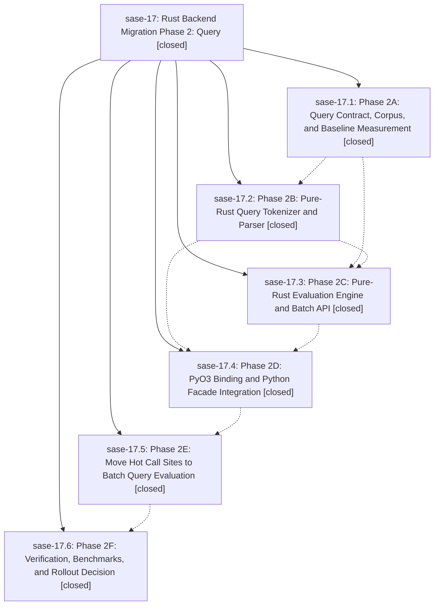

# Bead: sase-17 — Rust Backend Migration Phase 2: Query

[Bead Pages](../README.md) / sase-17

**Status:** ✓ closed · **Resolution:** (unrecorded) · **Type:** plan · **Tier:** epic
**Owner:** `bryanbugyi34@gmail.com`
**Created:** 2026-04-29 06:52:56 UTC · **Closed:** 2026-04-29 08:16:27 UTC
**Plan:** [202604/rust\_backend\_phase2\_query.md](https://github.com/sase-org/sase--plans/blob/main/202604/rust_backend_phase2_query.md)

## Description

Phase 2 of the Rust backend migration: port the query tokenizer, parser, and evaluator to Rust with a batch (compiled) API, integrate via PyO3 behind SASE_CORE_BACKEND, move hot call sites to batch evaluation, and benchmark to make the rollout decision.

## Phases

| Bead | Title | Status | Size | Agents | Commits |
|---|---|---|---|---:|---:|
| [sase-17.1](sase-17.1.md) | Phase 2A: Query Contract, Corpus, and Baseline Measurement | ✓ closed | small | 0 | 2 |
| [sase-17.2](sase-17.2.md) | Phase 2B: Pure-Rust Query Tokenizer and Parser | ✓ closed | small | 0 | 2 |
| [sase-17.3](sase-17.3.md) | Phase 2C: Pure-Rust Evaluation Engine and Batch API | ✓ closed | small | 0 | 2 |
| [sase-17.4](sase-17.4.md) | Phase 2D: PyO3 Binding and Python Facade Integration | ✓ closed | small | 0 | 2 |
| [sase-17.5](sase-17.5.md) | Phase 2E: Move Hot Call Sites to Batch Query Evaluation | ✓ closed | small | 0 | 1 |
| [sase-17.6](sase-17.6.md) | Phase 2F: Verification, Benchmarks, and Rollout Decision | ✓ closed | small | 0 | 1 |

## Lineage

## Commits

| Commit | Subject | Bead | Committed (UTC) |
|---|---|---|---|
| [`ce7b508`](https://github.com/sase-org/sase/commit/ce7b508da02942c762c758648df4716a1c76f6e6) | chore(core): Phase 2A — query wire contract, golden corpus, and benchmark (sase-17.1) | [sase-17.1](sase-17.1.md) | 2026-04-29 07:05:47 |
| [`74195a7`](https://github.com/sase-org/sase/commit/74195a709a0634c7ea6d6c860173c2103bc522a1) | chore: close Phase 2A bead (sase-17.1) | [sase-17.1](sase-17.1.md) | 2026-04-29 07:06:28 |
| [`sase-core@849dd9e`](https://github.com/sase-org/sase-core/commit/849dd9e3f51fd0f2fa2982b43febb7d0674ad377) | feat(query): Phase 2B pure-Rust query tokenizer and parser (sase-17.2) | [sase-17.2](sase-17.2.md) | 2026-04-29 07:15:12 |
| [`91e433a`](https://github.com/sase-org/sase/commit/91e433a9ea90bc2a2d4b0e3e863459aa8fef48ff) | chore: close sase-17.2 (Phase 2B done in sase-core) (sase-17.2) | [sase-17.2](sase-17.2.md) | 2026-04-29 07:17:24 |
| [`sase-core@6b0adb4`](https://github.com/sase-org/sase-core/commit/6b0adb4c2367aa9052a830fa4746d1e1aab91671) | feat(query): Phase 2C pure-Rust query evaluator and batch API (sase-17.3) | [sase-17.3](sase-17.3.md) | 2026-04-29 07:27:33 |
| [`cbfbd14`](https://github.com/sase-org/sase/commit/cbfbd14e5f3228c46b76d004525be476371fddcb) | chore: close sase-17.3 (Phase 2C done in sase-core) (sase-17.3) | [sase-17.3](sase-17.3.md) | 2026-04-29 07:28:01 |
| [`sase-core@830ce4c`](https://github.com/sase-org/sase-core/commit/830ce4c635afa71446e1816d64a9942d6028d3f8) | feat(query): Phase 2D PyO3 query bindings (sase-17.4) | [sase-17.4](sase-17.4.md) | 2026-04-29 07:41:20 |
| [`7d23ac5`](https://github.com/sase-org/sase/commit/7d23ac5de9b0b8763ff7d1d12e5270980c93ff1f) | feat(core): Phase 2D — wire Rust query bindings into facade (sase-17.4) | [sase-17.4](sase-17.4.md) | 2026-04-29 07:41:46 |
| [`41ae7f7`](https://github.com/sase-org/sase/commit/41ae7f73d3ab6363633c25da53c43aba585aec1b) | feat(core): Phase 2E — route hot query call sites through evaluate\_query\_many (sase-17.5) | [sase-17.5](sase-17.5.md) | 2026-04-29 07:54:04 |
| [`40c9bed`](https://github.com/sase-org/sase/commit/40c9bed3af5c1860db39dcd4a18a4582303dd06b) | chore(core): Phase 2F — verification, benchmarks, and rollout decision (sase-17.6) | [sase-17.6](sase-17.6.md) | 2026-04-29 08:19:30 |
