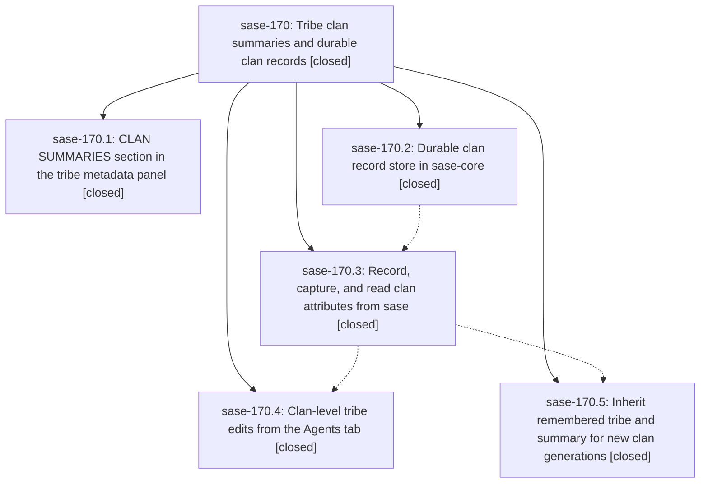

# Bead: sase-170 — Tribe clan summaries and durable clan records

[Bead Pages](../README.md) / sase-170

**Status:** ✓ closed · **Resolution:** done · **Type:** ▸ plan · **Tier:** epic
**Owner:** `bryanbugyi34@gmail.com` · **Created by:** [bbugyi200.athena.0pw.w0](https://github.com/sase-org/sase--agents/blob/main/families/bbugyi200.athena.0pw.w0.md) · **Assignee:** `sase-170.land`
**Created:** 2026-09-23 11:39:52 EDT · **Closed:** 2026-09-23 15:51:08 EDT
**Plan:** [202609/tribe\_clan\_summaries\_and\_clan\_records.md](https://github.com/sase-org/sase--plans/blob/main/202609/tribe_clan_summaries_and_clan_records.md)

## Description

Selecting an agent tribe panel shows the summary of every clan in the tribe through a fast, fold-aware CLAN SUMMARIES section with a useful one-line-per-clan default. A clan's summary and chosen tribe are recorded durably per clan generation, so they survive member kills, dismissals, relaunches, and full reloads, and they seed the defaults when a clan with the same name is created again.

## Notes

[2026-09-23T18:04:16Z · sase-16n.11.land] DISCOVERED ISSUE: master symvision is red on this epic's symbol. At 848a90a1b, 'just symvision' fails with 'Unused public functions/classes: ClanSummaryDigest in src/sase/ace/tui/widgets/prompt_panel/_agent_tribe_clan_summaries.py'. The class was added by e1c4208cd (sase-170.1). No --epic-symbol entry covers it, so every agent's 'just check' fails at lint. Either privatize it (it is only used in its own file plus __all__), or add a 'sase-170.x(ClanSummaryDigest)' --epic-symbol entry if a later phase will consume it. Found by the sase-16n.11 land agent.

[2026-09-23T18:19:06Z · sase-16t.land] DISCOVERED ISSUE (corroboration from sase-16t.land, relaying PROPOSED FOLLOW-UP sase-16t.8#1): ClanSummaryDigest in src/sase/ace/tui/widgets/prompt_panel/_agent_tribe_clan_summaries.py is still flagged as unused-public by 'just symvision' at master 1fb9d0138, after every sase-170 phase (through sase-170.5) has closed. So no later phase consumes it; privatize it (it appears only in its own file plus __all__) rather than adding an --epic-symbol entry. It keeps every agent's just check red at lint.

[2026-09-23T18:31:03Z · sase-16y.land] DISCOVERED ISSUE (sase-16y.land): besides ClanSummaryDigest, symvision at master ed8172fda now fails first on the Justfile entry --epic-symbol 'sase-170.5(resolve_clan_launch_defaults)': 'bead sase-170.5 is closed. Remove this stale --epic-symbol entry and clean up the symbol.' resolve_clan_launch_defaults (src/sase/core/agent_clan_record.py) still has no non-test consumer in the tree, so the consuming sase-170.5 change has not landed on master (or never wired it). Left untouched by sase-16y.land since the entry is keyed to sase-170.

[2026-09-23T19:51:08Z · sase-170.land] LANDED by sase-170.land.

VERIFY: read the epic, all 5 phases and every note; three read-only reviews checked the code against the plan.
- 170.1 (e1c4208cd): digest, renderer, section order, fold anchors, number chips, ladder limits, enrichment signature, the from_markup guard test, docs and goldens are all present.
- 170.2 (sase-core 7fc3501): wire types, path encoding, merge rules, locking, capture, launch defaults, the scan overlay on all 3 paths (both index branches) and the 4 bindings are present.
- 170.3 (69a5ca5e1): pin bump, facade, default clan_records_dir, launch and refresh writes, capture before delete and wipe, and wait-index tribes with tombstones are present.
- 170.4 (372135af7): edited clan_record per (clan, gen), deduped, with a record-only synthetic row, strict errors and optimistic display with rollback.
- 170.5 (1fb9d0138): new-generation detection, inherited tribe and summary script with text fallback, log line, and idempotent re-exec.

EPIC DEFECTS FIXED IN THE LANDING:
(a) Symvision unused-public ClanSummaryDigest (epic notes #1/#2, 170.4#1, 170.5#1): privatized to _ClanSummaryDigest, since it is only used in its own file.
(b) A truncated-headline Triage lede ignored the 4-line cap and started at body line 0. It now starts at the headline block and is capped at 4 non-blank lines; regression test added.
(c) sase-core load_clan_record cached a record under metadata from a second stat() call. A racing rename could then pin a stale record in the cache. Metadata now comes from the same open file handle on both the read and the write path.
(d) A keep-8 update older than every retained generation rewrote the file and reported changed:true. It is now a no-op; test added.
(e) A misplaced binding doc comment was restored to agent_scan_options_from_pydict.
sase-core 'sase tool run check' passes; the gateway fleet failures in the first run are known flake sase-15g (+1 recorded).

INTEGRATE:
- 311e76114 (jump footer, sase-16y.3) updated every tribe golden except the two CLAN SUMMARIES goldens. They drifted (test-visual check failed); I regenerated them and the only difference is the new JUMP footer.
- The epic grew run_agent_directives.py from 642 to 991 lines (toobig warning, limit 1000). Its clan-record launch helpers moved into run_agent_directive_clans.py, and the file is now 679 lines.
- No other commit since e1c4208cd touches epic files or adds artifact deletion paths.
- The completion catalog index query reads only agent names, so it needs no clan_records_dir.
- Container clan_tribes is not optimistically updated, but that predates the epic and the plan defers it to the refresh path.
- Uncapturing rmtree sites were declined: agents_sync purge_local_state only touches imported state, and project removal is whole-project deletion.

FOLLOW-UPS:
- 170.1#1 (pyscripts Rule 2): declined, 'lint (pyscripts)' passes at master.
- 170.1#2 (import budget): +1 recorded on duplicate sase-13p, now 3299 vs 3290, with this epic's 2 eager modules attributed.
- 170.3#1 (14 pre-existing failures): triaged.
  - link_trail and query_profile_reference were fixed by 813f42a53.
  - Bead rendering, work_task and completion-snapshot failures are owned by active sase-16n.11.7 / sase-171 notes.
  - The import budget is sase-13p.
  - The 3 load flakes passed in this run.
- 170.4#1 and 170.5#1: fixed by (a).

DISCOVERED:
- New task sase-174 (ci, small): no_ref_prefix_dispatch, from e3c2a7788; closed sase-16t no longer owns it.
- DISCOVERED ISSUE notes on active epics:
  - sase-171: test_visual_fixture_host_paths fails on /home/dev in 02cd6b69e.
  - sase-16z: masked unused-public capability_cache_dir and invalidate_probe_capability.

GATES: 'just check' is still red on master for reasons outside this epic.
- symvision: sase-16z's _probe_meta private symbols.
- toobig: sase-171's install test file.
Every other gate stage passes, the scoped lane fails only on the sase-171 visual fixture, and 143 clan/directive tests plus 34 tribe-summary tests pass.

The plan's manual TUI smoke test was not run live; the regression tests cover the dismiss/reload path through the real deletion call.

## Phases

| Bead | Title | Status | Size | Created | Agents | Commits |
|---|---|---|---|---|---:|---:|
| [sase-170.1](sase-170.1.md) | CLAN SUMMARIES section in the tribe metadata panel | ✓ closed | medium | 2026-09-23 | 1 | 1 |
| [sase-170.2](sase-170.2.md) | Durable clan record store in sase-core | ✓ closed | medium | 2026-09-23 | 1 | 1 |
| [sase-170.3](sase-170.3.md) | Record, capture, and read clan attributes from sase | ✓ closed | medium | 2026-09-23 | 1 | 1 |
| [sase-170.4](sase-170.4.md) | Clan-level tribe edits from the Agents tab | ✓ closed | medium | 2026-09-23 | 1 | 1 |
| [sase-170.5](sase-170.5.md) | Inherit remembered tribe and summary for new clan generations | ✓ closed | medium | 2026-09-23 | 1 | 1 |

## Lineage

## Agents

| Agent | Bead | Commits |
|---|---|---:|
| [bbugyi200.athena.sase-170.1](https://github.com/sase-org/sase--agents/blob/main/agents/bbugyi200.athena.sase-170.1/README.md) | [sase-170.1](sase-170.1.md) | 1 |
| [bbugyi200.athena.sase-170.2](https://github.com/sase-org/sase--agents/blob/main/agents/bbugyi200.athena.sase-170.2/README.md) | [sase-170.2](sase-170.2.md) | 1 |
| [bbugyi200.athena.sase-170.3](https://github.com/sase-org/sase--agents/blob/main/agents/bbugyi200.athena.sase-170.3/README.md) | [sase-170.3](sase-170.3.md) | 1 |
| [bbugyi200.athena.sase-170.4](https://github.com/sase-org/sase--agents/blob/main/agents/bbugyi200.athena.sase-170.4/README.md) | [sase-170.4](sase-170.4.md) | 1 |
| [bbugyi200.athena.sase-170.5](https://github.com/sase-org/sase--agents/blob/main/agents/bbugyi200.athena.sase-170.5/README.md) | [sase-170.5](sase-170.5.md) | 1 |
| [bbugyi200.athena.sase-170.land](https://github.com/sase-org/sase--agents/blob/main/agents/bbugyi200.athena.sase-170.land/README.md) | [sase-170](README.md) | 2 |

## Commits

| Repo | Commit | Subject | Bead | Committed |
|---|---|---|---|---|
| sase-core | [`sase-core@7fc3501`](https://github.com/sase-org/sase-core/commit/7fc3501d49f28aff399e48bf0fe4f560523a8ab8) | feat(core): durable per-clan record store with scan overlay and bindings | [sase-170.2](sase-170.2.md) | 2026-09-23 12:18:33 EDT |
| sase | [`e1c4208`](https://github.com/sase-org/sase/commit/e1c4208cd23f8b5561d5ac96386e23d6d6ef5afd) | feat(ace): add tribe CLAN SUMMARIES section with worker-side digests | [sase-170.1](sase-170.1.md) | 2026-09-23 13:01:39 EDT |
| sase | [`69a5ca5`](https://github.com/sase-org/sase/commit/69a5ca5e1d0d059f7a0c613526d6990629c045ae) | feat(clans): record, capture, and read clan attributes from sase | [sase-170.3](sase-170.3.md) | 2026-09-23 13:44:14 EDT |
| sase | [`1fb9d01`](https://github.com/sase-org/sase/commit/1fb9d01385cbe420eaed7e3c341eb921ca178ba4) | feat(clans): inherit remembered tribe and summary for new clan generations | [sase-170.5](sase-170.5.md) | 2026-09-23 14:08:34 EDT |
| sase | [`372135a`](https://github.com/sase-org/sase/commit/372135af742b8ec04e08ce47781a94de289ae3eb) | feat(clans): clan-level tribe edits from the Agents tab | [sase-170.4](sase-170.4.md) | 2026-09-23 14:20:05 EDT |
| sase | [`1d04946`](https://github.com/sase-org/sase/commit/1d04946e49c76888c1023b444678205214c3c5e6) | fix(clans): land sase-170 tribe clan summaries and durable clan records | [sase-170](README.md) | 2026-09-23 15:53:26 EDT |
| sase-core | [`sase-core@35dc083`](https://github.com/sase-org/sase-core/commit/35dc083b5170ec11d18410d36ceb7e30cb1d1bf0) | fix(core): race-free clan record cache and keep-8 no-op merges | [sase-170](README.md) | 2026-09-23 15:57:10 EDT |

<!-- sase:referenced-by:start -->

## Referenced By

| Relation | Artifact | Why | Uses |
| --- | --- | --- | ---: |
| read-by | [agent:sase-16t.land][1] | Check whether the ClanSummaryDigest symvision flag belongs to an active epic | 1 |
| read-by | [agent:sase-16y.land][2] | Check whether stale sase-170.5 epic-symbol belongs to an in-progress landing | 2 |
| read-by | [agent:sase-170.5][3] | x | 1 |
| read-by | [agent:sase-170.land][4] | Final submit could not read assigned bead status; confirm it is closed | 3 |

[1]: https://github.com/sase-org/sase--agents/blob/main/agents/bbugyi200.athena.sase-16t.land/README.md
[2]: https://github.com/sase-org/sase--agents/blob/main/agents/bbugyi200.athena.sase-16y.land/README.md
[3]: https://github.com/sase-org/sase--agents/blob/main/agents/bbugyi200.athena.sase-170.5/README.md
[4]: https://github.com/sase-org/sase--agents/blob/main/agents/bbugyi200.athena.sase-170.land/README.md

<!-- sase:referenced-by:end -->
