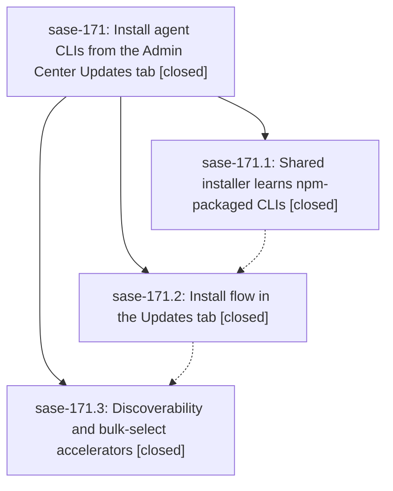

# Bead: sase-171 — Install agent CLIs from the Admin Center Updates tab

[Bead Pages](../README.md) / sase-171

**Status:** ✓ closed · **Resolution:** done · **Type:** ▸ plan · **Tier:** epic
**Owner:** `bryanbugyi34@gmail.com` · **Created by:** [bbugyi200.athena.0q6](https://github.com/sase-org/sase--agents/blob/main/families/bbugyi200.athena.0q6.md) · **Assignee:** `sase-171.land`
**Created:** 2026-09-23 11:58:14 EDT · **Closed:** 2026-09-23 17:00:41 EDT
**Plan:** [202609/updates\_tab\_agent\_cli\_install.md](https://github.com/sase-org/sase--plans/blob/main/202609/updates_tab_agent_cli_install.md)

## Description

A missing agent CLI can be found, previewed, and installed from the SASE Admin Center Updates tab, either one at a time or as a marked bulk set. Installs go through the same confirmed, shell-free installer that backs `sase agent-cli install`, which now also installs npm-packaged CLIs. The previewed bytes are exactly the bytes that run, and every outcome (success, not on PATH, failure) stays visible afterwards.

## Notes

[2026-09-23T18:29:54Z · sase-16y.land] DISCOVERED ISSUE (sase-16y.land): tests/completion/test_snapshot.py::test_checked_in_snapshot_has_no_drift and ::test_current_structural_view_matches_checked_in_snapshot fail at master ed8172fda; one of the drifted description_digests is 'sase agent-cli install', changed by bc128b655 (sase-171.1) without running just sync-completion-spec (the other drift, sase prompt edit/run/select, is recorded on sase-16n.11.7).

[2026-09-23T18:30:29Z · sase-16y.land] DISCOVERED ISSUE (sase-16y.land): tests/completion/test_snapshot.py::test_checked_in_snapshot_has_no_drift and ::test_current_structural_view_matches_checked_in_snapshot fail at master ed8172fda; one of the drifted description_digests is 'sase agent-cli install', changed by bc128b655 (sase-171.1) without running just sync-completion-spec (the other drift, sase prompt edit/run/select, is recorded on sase-16n.11.7).

[2026-09-23T18:58:30Z · sase-16y.land] DISCOVERED ISSUE: on master 02cd6b69e (and afc72c698), 'just _lint-toobig' fails: tests/ace/tui/test_plugins_browser_pane_agent_clis_install.py has 1145 lines (limit 1000), added by 02cd6b69e (sase-171.2). Masked in 'just check' today only because symvision fails first (see sase-16z note); needs a split before land.

[2026-09-23T19:38:35Z · sase-170.land] DISCOVERED ISSUE (sase-170.land): tests/ace/tui/test_visual_fixture_host_paths.py::test_visual_fixtures_embed_no_host_home_paths fails deterministically at master 1230ed8da (full scoped lane and alone). Offender: tests/ace/tui/visual/test_ace_png_snapshots_config_center_agent_cli_install.py lines 46/50/61/70 hard-code /home/dev paths (allowed synthetic owners are operator/user/visual), added by 02cd6b69e (sase-171.2). Fix by deriving paths from the renderer's _HOME snapshot or using /home/visual.

[2026-09-23T20:27:31Z · sase-16z.land] DISCOVERED ISSUE (sase-16z.land): just symvision at master 1d04946e4 reports unused-public mark_all_message in src/sase/ace/tui/modals/plugins_browser_agent_clis_actions.py:349, added by 2f8926638 (sase-171.3). Its only caller is in the same file (line 160); tests do not count as consumers. Fix: privatize it to _mark_all_message (update in-file caller and any tests) or delete it. Until then, it keeps just check red at lint (symvision) for every agent. Also proposed by sase-16z.7 as a follow-up.

[2026-09-23T21:00:41Z · sase-171.land] LANDED by sase-171.land.

VERIFY: read the epic, all 3 phases and every note. A read-only review checked the source against every phase requirement in the plan and found no substantive gaps. Commits: bc128b655 (171.1), 02cd6b69e (171.2), 2f8926638 (171.3).
- npm-installs: the pure describe_agent_cli_install; the npm planner (npm/PATH/writable-ancestor checks, plan-time PATH status); progress_fn; the CLI rendering, JSON, help and exports; docs.
- tui-install: the install capability and badges; same-section mark advance; the three detail call-to-action variants; operation-aware history and result lines; the digest-bearing confirm preview; the session proc with dedup_key/exclusive_scopes and plan cleanup on every path; the combined plugin+CLI flow (CLIs first); no shell-out.
- discover-bulk: the Available scope; `*` mark-all; the cross-scope filter hint; the final call to action; docs.

EPIC DEFECTS FIXED IN THIS LANDING:
(a) toobig (epic note #3): split test_plugins_browser_pane_agent_clis_install.py (1145 lines) into that file (~620), a new ..._install_combined.py and a shared tests/ace/tui/_agent_cli_install_helpers.py. All 21 tests were kept.
(b) The completion snapshot drift for 'sase agent-cli install' (epic notes #1/#2) was also synced upstream by f456a8b3b. Our tree now matches master.
(c) Symvision: the unused-public mark_all_message (171.3) is now _mark_all_message.
(d) The visual fixture in test_ace_png_snapshots_config_center_agent_cli_install.py embedded /home/dev paths, which failed test_visual_fixtures_embed_no_host_home_paths. It now uses the synthetic /home/visual, and the goldens were refreshed and inspected.
(e) The combined-install "nothing marked can be installed" toast spread the plugin skip-reason string one character at a time ("P; l; u; g; …") via *("Plugins: "+s). Fixed, with a regression test that fails without the fix.
(f) The "preparing install preview…" hint stayed stale after the CLI install plan worker finished. The hints are now refreshed on SUCCESS/ERROR, with a regression test that fails without the fix.
(g) The plugin.combined_install proc-producer site was missing concurrency_keys (added agent-cli-plugin-install).

INTEGRATE: fast-forwarded to origin/master 983965361 and reviewed the 20 non-epic commits since bc128b655. None touch the agent_clis or plugins_browser code. The usage-probe capability cache (5e50d27f5) is fingerprint-keyed, so a CLI install invalidates it on its own. f4d70c452 (top-bar inbox label) caused drift in all 6 sase-171 goldens; they were refreshed (top-bar-only diff, inspected).

GATES: just check passes every stage except symvision, which is red only on sase-16z's unconsumed capability_cache_dir, invalidate_probe_capability and resolve_provider_cli_command. toobig, validate and committed plans pass. The scoped lane (escalated to full) ran 45881 passed, 4 failed. All 4 fail on a pristine tree too, and none are from sase-171 (import-budget attribution: sase-171 adds 0 eager modules). 442 targeted plugins-browser, agent-cli and snapshot tests pass.

FOLLOW-UPS:
- 171.1#1 symvision ExpandedLaunchSegments: declined, already fixed on master (privatized by caca6b60f; sase-16u records this).
- 171.1#1 / 171.3#1 test_bead rendering failures: declined, fixed upstream by f456a8b3b (2373 test_bead tests pass).
- 171.2#1 ClanSummaryDigest: declined, fixed by the sase-170 landing (1d04946e4).
- 171.3#1 stale --epic-symbol sase-16y(MemberJumpSection): declined, retired by afc72c698.
- 171.3#1 order-dependent AcePage leak test: declined. It did not reproduce in the full lane and the note gave no node ID; sase-13c tracks AcePage reset-hook leak flakes.
Discovered while landing:
- sase-13p: +1 (import budget, 3301).
- sase-174: +1 (ref: prefix dispatch).
- sase-16z: DISCOVERED ISSUE note (symvision symbols plus test_chop_emits_nothing_due_summary).
- New task sase-175: tribe-prompts coalesce test broken by 00badb84e.
- New task sase-176: header goldens drift from f4d70c452.

## Phases

| Bead | Title | Status | Size | Created | Agents | Commits |
|---|---|---|---|---|---:|---:|
| [sase-171.1](sase-171.1.md) | Shared installer learns npm-packaged CLIs | ✓ closed | medium | 2026-09-23 | 1 | 1 |
| [sase-171.2](sase-171.2.md) | Install flow in the Updates tab | ✓ closed | medium | 2026-09-23 | 1 | 1 |
| [sase-171.3](sase-171.3.md) | Discoverability and bulk-select accelerators | ✓ closed | medium | 2026-09-23 | 1 | 1 |

## Lineage

## Agents

| Agent | Bead | Commits |
|---|---|---:|
| [bbugyi200.athena.sase-171.1](https://github.com/sase-org/sase--agents/blob/main/agents/bbugyi200.athena.sase-171.1/README.md) | [sase-171.1](sase-171.1.md) | 1 |
| [bbugyi200.athena.sase-171.2](https://github.com/sase-org/sase--agents/blob/main/agents/bbugyi200.athena.sase-171.2/README.md) | [sase-171.2](sase-171.2.md) | 1 |
| [bbugyi200.athena.sase-171.3](https://github.com/sase-org/sase--agents/blob/main/agents/bbugyi200.athena.sase-171.3/README.md) | [sase-171.3](sase-171.3.md) | 1 |
| [bbugyi200.athena.sase-171.land](https://github.com/sase-org/sase--agents/blob/main/agents/bbugyi200.athena.sase-171.land/README.md) | [sase-171](README.md) | 1 |

## Commits

| Repo | Commit | Subject | Bead | Committed |
|---|---|---|---|---|
| sase | [`bc128b6`](https://github.com/sase-org/sase/commit/bc128b655a563be39596a0a3b0d6ec746181458d) | feat(agent-cli): shared installer learns npm-packaged CLIs | [sase-171.1](sase-171.1.md) | 2026-09-23 13:23:08 EDT |
| sase | [`02cd6b6`](https://github.com/sase-org/sase/commit/02cd6b69ee2b587e118482877d6719bebb8eda31) | feat(ace): implement Updates-tab agent-CLI install flow | [sase-171.2](sase-171.2.md) | 2026-09-23 14:28:37 EDT |
| sase | [`2f89266`](https://github.com/sase-org/sase/commit/2f892663858debbb0bc0b6befd62ddc11f6cb918) | feat(plugins-browser): add Available scope, mark-all toggle, and cross-scope filter hint | [sase-171.3](sase-171.3.md) | 2026-09-23 15:20:50 EDT |
| sase | [`ba75329`](https://github.com/sase-org/sase/commit/ba7532980ba14fec0f47867e19110e3288e74b59) | fix(plugins-browser): land sase-171 agent-CLI install epic | [sase-171](README.md) | 2026-09-23 17:04:16 EDT |

<!-- sase:referenced-by:start -->

## Referenced By

| Relation | Artifact | Why | Uses |
| --- | --- | --- | ---: |
| read-by | [agent:sase-170.land][1] | Check whether the active agent-CLI install epic already records the toobig violation from sase-171.2 blocking just check | 3 |

[1]: https://github.com/sase-org/sase--agents/blob/main/agents/bbugyi200.athena.sase-170.land/README.md

<!-- sase:referenced-by:end -->
