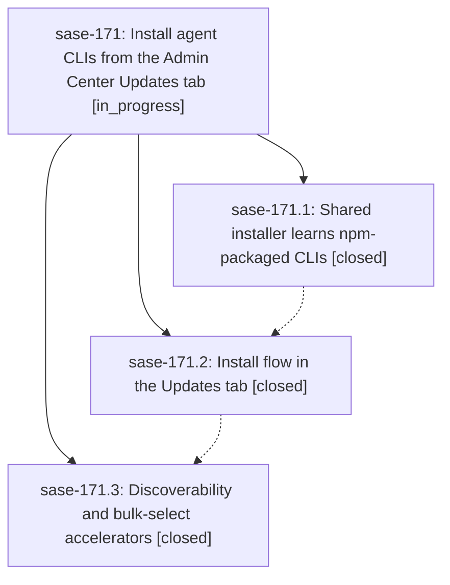

# Bead: sase-171 — Install agent CLIs from the Admin Center Updates tab

[Bead Pages](../README.md) / sase-171

**Status:** ◐ in_progress · **Type:** ▸ plan · **Tier:** epic
**Owner:** `bryanbugyi34@gmail.com` · **Created by:** [bbugyi200.athena.0q6](https://github.com/sase-org/sase--agents/blob/main/families/bbugyi200.athena.0q6.md) · **Assignee:** `sase-171.land`
**Created:** 2026-09-23 11:58:14 EDT
**Plan:** [202609/updates\_tab\_agent\_cli\_install.md](https://github.com/sase-org/sase--plans/blob/main/202609/updates_tab_agent_cli_install.md)

## Description

A missing agent CLI can be found, previewed, and installed from the SASE Admin Center Updates tab, either one at a time or as a marked bulk set. Installs go through the same confirmed, shell-free installer that backs `sase agent-cli install`, which now also installs npm-packaged CLIs. The previewed bytes are exactly the bytes that run, and every outcome (success, not on PATH, failure) stays visible afterwards.

## Notes

[2026-09-23T18:29:54Z · sase-16y.land] DISCOVERED ISSUE (sase-16y.land): tests/completion/test_snapshot.py::test_checked_in_snapshot_has_no_drift and ::test_current_structural_view_matches_checked_in_snapshot fail at master ed8172fda; one of the drifted description_digests is 'sase agent-cli install', changed by bc128b655 (sase-171.1) without running just sync-completion-spec (the other drift, sase prompt edit/run/select, is recorded on sase-16n.11.7).

[2026-09-23T18:30:29Z · sase-16y.land] DISCOVERED ISSUE (sase-16y.land): tests/completion/test_snapshot.py::test_checked_in_snapshot_has_no_drift and ::test_current_structural_view_matches_checked_in_snapshot fail at master ed8172fda; one of the drifted description_digests is 'sase agent-cli install', changed by bc128b655 (sase-171.1) without running just sync-completion-spec (the other drift, sase prompt edit/run/select, is recorded on sase-16n.11.7).

[2026-09-23T18:58:30Z · sase-16y.land] DISCOVERED ISSUE: on master 02cd6b69e (and afc72c698), 'just _lint-toobig' fails: tests/ace/tui/test_plugins_browser_pane_agent_clis_install.py has 1145 lines (limit 1000), added by 02cd6b69e (sase-171.2). Masked in 'just check' today only because symvision fails first (see sase-16z note); needs a split before land.

## Phases

| Bead | Title | Status | Size | Created | Agents | Commits |
|---|---|---|---|---|---:|---:|
| [sase-171.1](sase-171.1.md) | Shared installer learns npm-packaged CLIs | ✓ closed | medium | 2026-09-23 | 1 | 1 |
| [sase-171.2](sase-171.2.md) | Install flow in the Updates tab | ✓ closed | medium | 2026-09-23 | 1 | 1 |
| [sase-171.3](sase-171.3.md) | Discoverability and bulk-select accelerators | ✓ closed | medium | 2026-09-23 | 1 | 1 |

## Lineage

## Agents

| Agent | Bead | Commits |
|---|---|---:|
| [bbugyi200.athena.sase-171.1](https://github.com/sase-org/sase--agents/blob/main/agents/bbugyi200.athena.sase-171.1/README.md) | [sase-171.1](sase-171.1.md) | 1 |
| [bbugyi200.athena.sase-171.2](https://github.com/sase-org/sase--agents/blob/main/agents/bbugyi200.athena.sase-171.2/README.md) | [sase-171.2](sase-171.2.md) | 1 |
| [bbugyi200.athena.sase-171.3](https://github.com/sase-org/sase--agents/blob/main/agents/bbugyi200.athena.sase-171.3/README.md) | [sase-171.3](sase-171.3.md) | 1 |
| [bbugyi200.athena.sase-171.land](https://github.com/sase-org/sase--agents/blob/main/agents/bbugyi200.athena.sase-171.land/README.md) | [sase-171](README.md) | 0 |

## Commits

| Repo | Commit | Subject | Bead | Committed |
|---|---|---|---|---|
| sase | [`bc128b6`](https://github.com/sase-org/sase/commit/bc128b655a563be39596a0a3b0d6ec746181458d) | feat(agent-cli): shared installer learns npm-packaged CLIs | [sase-171.1](sase-171.1.md) | 2026-09-23 13:23:08 EDT |
| sase | [`02cd6b6`](https://github.com/sase-org/sase/commit/02cd6b69ee2b587e118482877d6719bebb8eda31) | feat(ace): implement Updates-tab agent-CLI install flow | [sase-171.2](sase-171.2.md) | 2026-09-23 14:28:37 EDT |
| sase | [`2f89266`](https://github.com/sase-org/sase/commit/2f892663858debbb0bc0b6befd62ddc11f6cb918) | feat(plugins-browser): add Available scope, mark-all toggle, and cross-scope filter hint | [sase-171.3](sase-171.3.md) | 2026-09-23 15:20:50 EDT |
