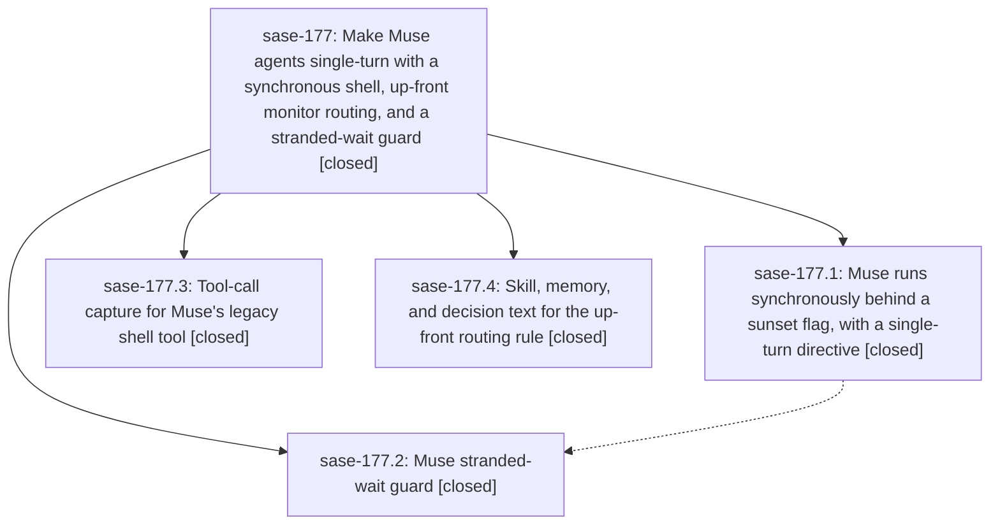

# Bead: sase-177 — Make Muse agents single-turn with a synchronous shell, up-front monitor routing, and a stranded-wait guard

[Bead Pages](../README.md) / sase-177

**Status:** ✓ closed · **Resolution:** done · **Type:** ▸ plan · **Tier:** epic
**Owner:** `bryanbugyi34@gmail.com` · **Created by:** [bbugyi200.athena.0qc--1](https://github.com/sase-org/sase--agents/blob/main/families/bbugyi200.athena.0qc.md) · **Assignee:** `sase-177.land`
**Created:** 2026-09-23 17:47:06 EDT · **Closed:** 2026-09-23 19:26:30 EDT
**Plan:** [202609/muse\_single\_turn\_normalization.md](https://github.com/sase-org/sase--plans/blob/main/202609/muse_single_turn_normalization.md)

## Description

Muse agents stop dying mid-task because they waited on Muse's own post-turn background wake. Muse runs every command synchronously inside its turn, and anything that can outlast Muse's 10-minute synchronous ceiling goes to a SASE monitor, chosen before the command starts. A reply that still ends by claiming to wait is caught and continued, or fails loudly. The skills and memory stop telling agents to declare and then wait, or to switch to a monitor mid-flight.

## Notes

[2026-09-23T23:26:30Z · sase-177.land] VERIFIED (sase-177.land): all 4 phases closed and their commits on master: a0368d54f (177.3: shell->Bash display, timeout/timed_out->failure, live R3401.1 fixture), 28b3c1bab (177.1: muse_synchronous_shell sunset flag + flag bead sase-178, --enable-shell-tool never duplicated from extra args, mode-aware directive wrapped once at top of invoke so interrupt and wait-guard reconstructions carry it, both-state tests, docs), 7c41709a7 (177.4: sase_monitor Decide Before You Start, sase_final never-wait rules + prepared-completion recipe checked against finalizers/prepare.py wrapper shape, core template + markers, lint_and_test.md up-front routing + known-long commands + sase-16q text, adapters-normalize-harnesses decision), eda674116 (177.2: shared _wait_signals.WAIT_SIGNAL_RE used by claude.py and muse.py, bounded SASE_MUSE_MAX_WAIT_CONTINUATIONS guard, LLMInvocationError, wait_guard_log.jsonl). 177.1 had been closed without its own verification, so I re-reviewed muse.py in full and reran tests: 1348 passed (tests/llm_provider, feature_flags, init memory/skills content). sase tool run check e23099f5...: every gate green except symvision, which fails only on the pre-existing plugins_browser_install private imports from ebbfbc91b (sase-17c; not epic-caused). INTEGRATION: commits since the epic started (0965a042d, ebbfbc91b, de98e8f50, d9f3cbd4c) are TUI/artifact refactors with no overlap; agy.py keeps its own distinct no-progress heuristic by design. LANDING STEPS: deployed changed skills from the landed tree (sase skill init --force, chezmoi 1e149010, 14 files) and regenerated home memory (chezmoi 87b2785a, pushed + chezmoi apply); sase validate now all ok (this resolves 177.3's home-memory drift proposal, which was the epic's own template change). Closed sase-16q done and sase-16i superseded. FOLLOW-UPS: 177.2 symvision -> +1 on existing sase-17c; 177.3 home-memory drift -> resolved in landing, no task; 177.4 items -> sase-17e (routing, large, per user), sase-17f (monitor hops, large), sase-17g (detach/wait/join, xlarge), sase-17h (Muse CLI smoke test, medium), sase-17i (Muse async tools allowlist, telemetry-gated, medium). Also added root-cause evidence to sase-17b (pyscripts failure caused by a stale untracked __pycache__-only tests/ace/tui/tools dir). No epic-symbol entries. Flag bead sase-178 stays open by design (sunset flag).

## Phases

| Bead | Title | Status | Size | Created | Agents | Commits |
|---|---|---|---|---|---:|---:|
| [sase-177.1](sase-177.1.md) | Muse runs synchronously behind a sunset flag, with a single-turn directive | ✓ closed | medium | 2026-09-23 | 1 | 1 |
| [sase-177.2](sase-177.2.md) | Muse stranded-wait guard | ✓ closed | small | 2026-09-23 | 1 | 1 |
| [sase-177.3](sase-177.3.md) | Tool-call capture for Muse's legacy shell tool | ✓ closed | small | 2026-09-23 | 1 | 1 |
| [sase-177.4](sase-177.4.md) | Skill, memory, and decision text for the up-front routing rule | ✓ closed | medium | 2026-09-23 | 1 | 1 |

## Lineage

## Agents

| Agent | Bead | Commits |
|---|---|---:|
| [bbugyi200.athena.sase-177.1](https://github.com/sase-org/sase--agents/blob/main/agents/bbugyi200.athena.sase-177.1/README.md) | [sase-177.1](sase-177.1.md) | 1 |
| [bbugyi200.athena.sase-177.2](https://github.com/sase-org/sase--agents/blob/main/agents/bbugyi200.athena.sase-177.2/README.md) | [sase-177.2](sase-177.2.md) | 1 |
| [bbugyi200.athena.sase-177.3](https://github.com/sase-org/sase--agents/blob/main/agents/bbugyi200.athena.sase-177.3/README.md) | [sase-177.3](sase-177.3.md) | 1 |
| [bbugyi200.athena.sase-177.4](https://github.com/sase-org/sase--agents/blob/main/agents/bbugyi200.athena.sase-177.4/README.md) | [sase-177.4](sase-177.4.md) | 1 |
| [bbugyi200.athena.sase-177.land](https://github.com/sase-org/sase--agents/blob/main/agents/bbugyi200.athena.sase-177.land/README.md) | [sase-177](README.md) | 1 |

## Commits

| Repo | Commit | Subject | Bead | Committed |
|---|---|---|---|---|
| sase | [`a0368d5`](https://github.com/sase-org/sase/commit/a0368d54f1fb99e55bb261b785b67751777544a8) | feat(llm-provider): capture Muse shell tool calls and map timeout outcomes to failure | [sase-177.3](sase-177.3.md) | 2026-09-23 18:07:45 EDT |
| sase | [`28b3c1b`](https://github.com/sase-org/sase/commit/28b3c1bab27cdbbc6f1ea99c4f5afbebcbd003a4) | feat(muse): run synchronously behind muse\_synchronous\_shell sunset flag | [sase-177.1](sase-177.1.md) | 2026-09-23 18:09:21 EDT |
| sase | [`7c41709`](https://github.com/sase-org/sase/commit/7c41709a7c2925af3845dd61e47d5660208d02a1) | docs(sase-177.4): up-front monitor routing in skills, memory, and decision text | [sase-177.4](sase-177.4.md) | 2026-09-23 18:38:54 EDT |
| sase | [`eda6741`](https://github.com/sase-org/sase/commit/eda67411640ea58995921352f54af9e3b454f5a5) | feat(llm-provider): add Muse wait-claim continuation guard | [sase-177.2](sase-177.2.md) | 2026-09-23 19:02:43 EDT |
| sase--plans | [`sase--plans@ebfe077`](https://github.com/sase-org/sase--plans/commit/ebfe0773b453352dd02bd4b77bafb7bff625ea13) | chore(plans): mark muse\_single\_turn\_normalization plan done after sase-177 landing | [sase-177](README.md) | 2026-09-23 19:28:54 EDT |
