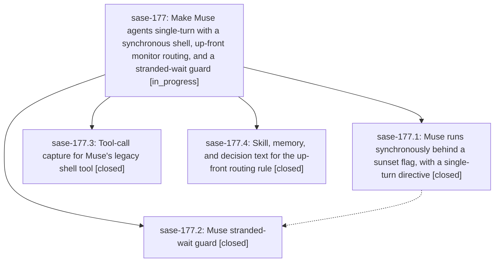

# Bead: sase-177 — Make Muse agents single-turn with a synchronous shell, up-front monitor routing, and a stranded-wait guard

[Bead Pages](../README.md) / sase-177

**Status:** ◐ in_progress · **Type:** ▸ plan · **Tier:** epic
**Owner:** `bryanbugyi34@gmail.com` · **Created by:** [bbugyi200.athena.0qc--1](https://github.com/sase-org/sase--agents/blob/main/families/bbugyi200.athena.0qc.md) · **Assignee:** `sase-177.land`
**Created:** 2026-09-23 17:47:06 EDT
**Plan:** [202609/muse\_single\_turn\_normalization.md](https://github.com/sase-org/sase--plans/blob/main/202609/muse_single_turn_normalization.md)

## Description

Muse agents stop dying mid-task because they waited on Muse's own post-turn background wake. Muse runs every command synchronously inside its turn, and anything that can outlast Muse's 10-minute synchronous ceiling goes to a SASE monitor, chosen before the command starts. A reply that still ends by claiming to wait is caught and continued, or fails loudly. The skills and memory stop telling agents to declare and then wait, or to switch to a monitor mid-flight.

## Phases

| Bead | Title | Status | Size | Created | Agents | Commits |
|---|---|---|---|---|---:|---:|
| [sase-177.1](sase-177.1.md) | Muse runs synchronously behind a sunset flag, with a single-turn directive | ✓ closed | medium | 2026-09-23 | 1 | 1 |
| [sase-177.2](sase-177.2.md) | Muse stranded-wait guard | ✓ closed | small | 2026-09-23 | 1 | 1 |
| [sase-177.3](sase-177.3.md) | Tool-call capture for Muse's legacy shell tool | ✓ closed | small | 2026-09-23 | 1 | 1 |
| [sase-177.4](sase-177.4.md) | Skill, memory, and decision text for the up-front routing rule | ✓ closed | medium | 2026-09-23 | 1 | 1 |

## Lineage

## Agents

| Agent | Bead | Commits |
|---|---|---:|
| [bbugyi200.athena.sase-177.1](https://github.com/sase-org/sase--agents/blob/main/agents/bbugyi200.athena.sase-177.1/README.md) | [sase-177.1](sase-177.1.md) | 1 |
| [bbugyi200.athena.sase-177.2](https://github.com/sase-org/sase--agents/blob/main/agents/bbugyi200.athena.sase-177.2/README.md) | [sase-177.2](sase-177.2.md) | 1 |
| [bbugyi200.athena.sase-177.3](https://github.com/sase-org/sase--agents/blob/main/agents/bbugyi200.athena.sase-177.3/README.md) | [sase-177.3](sase-177.3.md) | 1 |
| [bbugyi200.athena.sase-177.4](https://github.com/sase-org/sase--agents/blob/main/agents/bbugyi200.athena.sase-177.4/README.md) | [sase-177.4](sase-177.4.md) | 1 |
| [bbugyi200.athena.sase-177.land](https://github.com/sase-org/sase--agents/blob/main/agents/bbugyi200.athena.sase-177.land/README.md) | [sase-177](README.md) | 0 |

## Commits

| Repo | Commit | Subject | Bead | Committed |
|---|---|---|---|---|
| sase | [`a0368d5`](https://github.com/sase-org/sase/commit/a0368d54f1fb99e55bb261b785b67751777544a8) | feat(llm-provider): capture Muse shell tool calls and map timeout outcomes to failure | [sase-177.3](sase-177.3.md) | 2026-09-23 18:07:45 EDT |
| sase | [`28b3c1b`](https://github.com/sase-org/sase/commit/28b3c1bab27cdbbc6f1ea99c4f5afbebcbd003a4) | feat(muse): run synchronously behind muse\_synchronous\_shell sunset flag | [sase-177.1](sase-177.1.md) | 2026-09-23 18:09:21 EDT |
| sase | [`7c41709`](https://github.com/sase-org/sase/commit/7c41709a7c2925af3845dd61e47d5660208d02a1) | docs(sase-177.4): up-front monitor routing in skills, memory, and decision text | [sase-177.4](sase-177.4.md) | 2026-09-23 18:38:54 EDT |
| sase | [`eda6741`](https://github.com/sase-org/sase/commit/eda67411640ea58995921352f54af9e3b454f5a5) | feat(llm-provider): add Muse wait-claim continuation guard | [sase-177.2](sase-177.2.md) | 2026-09-23 19:02:43 EDT |
