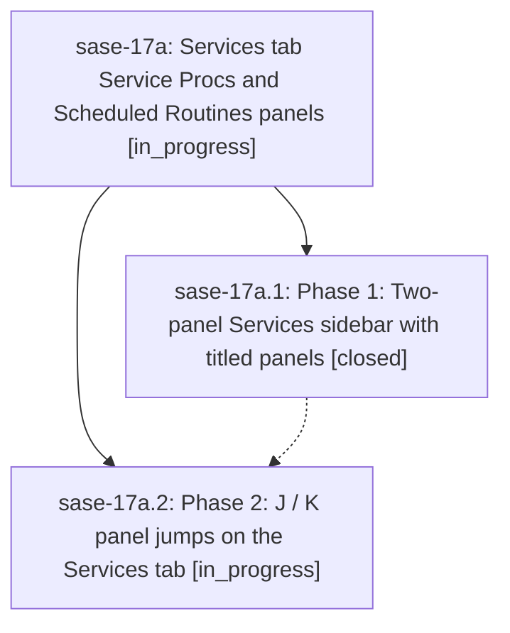

# Bead: sase-17a — Services tab Service Procs and Scheduled Routines panels

[Bead Pages](../README.md) / sase-17a

**Status:** ◐ in_progress · **Type:** ▸ plan · **Tier:** epic
**Owner:** `bryanbugyi34@gmail.com` · **Created by:** [bbugyi200.athena.0q5--1](https://github.com/sase-org/sase--agents/blob/main/families/bbugyi200.athena.0q5.md) · **Assignee:** `sase-17a.land`
**Created:** 2026-09-23 18:26:49 EDT
**Plan:** [202609/services\_tab\_panels.md](https://github.com/sase-org/sase--plans/blob/main/202609/services_tab_panels.md)

## Description

The Services tab sidebar renders as two titled, tribe-panel-style panels — "Service Procs" (daemon procs plus oneshots) and "Scheduled Routines" (routines with their jobs) — each with at-a-glance metadata in its title, and J/K jump to the first/last node of the next/previous panel.

## Phases

| Bead | Title | Status | Size | Created | Agents | Commits |
|---|---|---|---|---|---:|---:|
| [sase-17a.1](sase-17a.1.md) | Phase 1: Two-panel Services sidebar with titled panels | ✓ closed | medium | 2026-09-23 | 1 | 1 |
| [sase-17a.2](sase-17a.2.md) | Phase 2: J / K panel jumps on the Services tab | ◐ in_progress | small | 2026-09-23 | 1 | 0 |

## Lineage

## Agents

| Agent | Bead | Commits |
|---|---|---:|
| [bbugyi200.athena.sase-17a.1](https://github.com/sase-org/sase--agents/blob/main/families/bbugyi200.athena.sase-17a.1.md) | [sase-17a.1](sase-17a.1.md) | 1 |
| [bbugyi200.athena.sase-17a.2](https://github.com/sase-org/sase--agents/blob/main/agents/bbugyi200.athena.sase-17a.2/README.md) | [sase-17a.2](sase-17a.2.md) | 0 |
| [bbugyi200.athena.sase-17a.land](https://github.com/sase-org/sase--agents/blob/main/agents/bbugyi200.athena.sase-17a.land/README.md) | [sase-17a](README.md) | 0 |

## Commits

| Repo | Commit | Subject | Bead | Committed |
|---|---|---|---|---|
| sase | [`3f5d34e`](https://github.com/sase-org/sase/commit/3f5d34e9fde31be2c0a8cc393f1db464e2cfa14d) | feat(axe): two-panel Services sidebar with titled panels | [sase-17a.1](sase-17a.1.md) | 2026-09-23 19:44:56 EDT |
