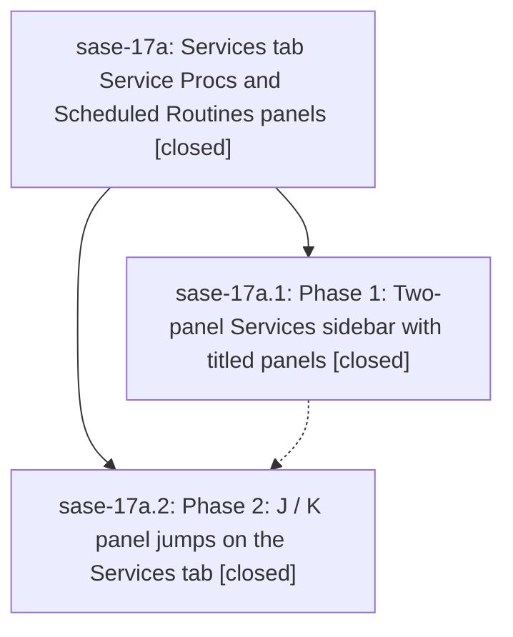

# Bead: sase-17a — Services tab Service Procs and Scheduled Routines panels

[Bead Pages](../README.md) / sase-17a

**Status:** ✓ closed · **Resolution:** done · **Type:** ▸ plan · **Tier:** epic
**Owner:** `bryanbugyi34@gmail.com` · **Created by:** [bbugyi200.athena.0q5--1](https://github.com/sase-org/sase--agents/blob/main/families/bbugyi200.athena.0q5.md) · **Assignee:** `sase-17a.land`
**Created:** 2026-09-23 18:26:49 EDT · **Closed:** 2026-09-23 20:34:28 EDT
**Plan:** [202609/services\_tab\_panels.md](https://github.com/sase-org/sase--plans/blob/main/202609/services_tab_panels.md)

## Description

The Services tab sidebar renders as two titled, tribe-panel-style panels — "Service Procs" (daemon procs plus oneshots) and "Scheduled Routines" (routines with their jobs) — each with at-a-glance metadata in its title, and J/K jump to the first/last node of the next/previous panel.

## Notes

[2026-09-24T00:34:28Z · sase-17a.land] Verified: both phases closed with notes addressed. Phase 1 (3f5d34e9f): two-panel Services sidebar (Service Procs + Scheduled Routines) over the reordered global _axe_items index, metadata titles (_panel_titles.py), panel index (_panels.py), shared util/panel_heights.py, scheduler-fold removal, docs (ace.md/axe.md), glossary strands, tests, goldens. Phase 2 (37bf26429): tab-gated focus_next/prev_service_panel J/K in default_config.yml, keymaps/registry/metadata/bindings, availability gating, AxePanelNavigationMixin, palette/help/onboarding/docs, tests, goldens. 111 epic tests pass on HEAD. Integration: commits since the epic started (9c701d658, 4271bd9c1, d9f3cbd4c, eda674116, de98e8f50, ebbfbc91b, 7c41709a7 before phase 1; 933a170f3, d7faebddf, 9abf08b5d between phases) touch LLM calls, artifacts, top bar, usage, plugins browser and Agents Main cards; none duplicates or conflicts with the Services panels, and phase goldens were regenerated after the top-bar golden refresh. Epic symbols: privatized services_panel_key_for_item -> _services_panel_key_for_item (used only in _panels.py) and dropped its Justfile --epic-symbol entry. just check: fmt/ruff/mypy/other lints pass; symvision fails only on pre-existing cross-file private imports, byte-identical with changes stashed. Follow-ups: sase-17a.2 PROPOSED FOLLOW-UP (plugins_browser private imports) -> +1 on existing sase-17c; the usage presentation split (d7faebddf) half of the same symvision failure had no bead -> created sase-17j (task(ci), small), linked related to sase-17c.

## Phases

| Bead | Title | Status | Size | Created | Agents | Commits |
|---|---|---|---|---|---:|---:|
| [sase-17a.1](sase-17a.1.md) | Phase 1: Two-panel Services sidebar with titled panels | ✓ closed | medium | 2026-09-23 | 1 | 1 |
| [sase-17a.2](sase-17a.2.md) | Phase 2: J / K panel jumps on the Services tab | ✓ closed | small | 2026-09-23 | 1 | 1 |

## Lineage

## Agents

| Agent | Bead | Commits |
|---|---|---:|
| [bbugyi200.athena.sase-17a.1](https://github.com/sase-org/sase--agents/blob/main/families/bbugyi200.athena.sase-17a.1.md) | [sase-17a.1](sase-17a.1.md) | 1 |
| [bbugyi200.athena.sase-17a.2](https://github.com/sase-org/sase--agents/blob/main/agents/bbugyi200.athena.sase-17a.2/README.md) | [sase-17a.2](sase-17a.2.md) | 1 |
| [bbugyi200.athena.sase-17a.land](https://github.com/sase-org/sase--agents/blob/main/agents/bbugyi200.athena.sase-17a.land/README.md) | [sase-17a](README.md) | 2 |

## Commits

| Repo | Commit | Subject | Bead | Committed |
|---|---|---|---|---|
| sase | [`3f5d34e`](https://github.com/sase-org/sase/commit/3f5d34e9fde31be2c0a8cc393f1db464e2cfa14d) | feat(axe): two-panel Services sidebar with titled panels | [sase-17a.1](sase-17a.1.md) | 2026-09-23 19:44:56 EDT |
| sase | [`37bf264`](https://github.com/sase-org/sase/commit/37bf264296e6fe2aa2c6c80479c2a0d218c5572c) | feat(services): J/K panel jumps on the Services tab | [sase-17a.2](sase-17a.2.md) | 2026-09-23 20:17:37 EDT |
| sase | [`09dda64`](https://github.com/sase-org/sase/commit/09dda64b5e8b1e0582a417c1ec90b5aee6d48576) | chore(services): land sase-17a by privatizing the services panel key helper | [sase-17a](README.md) | 2026-09-23 20:36:14 EDT |
| sase--plans | [`sase--plans@513cb15`](https://github.com/sase-org/sase--plans/commit/513cb15158bdd582515eb960485b875301eb147a) | docs(plans): mark services\_tab\_panels plan done | [sase-17a](README.md) | 2026-09-23 20:39:59 EDT |

<!-- sase:referenced-by:start -->

## Referenced By

| Relation | Artifact | Why | Uses |
| --- | --- | --- | ---: |
| read-by | [agent:sase-17a.2][1] | check parent epic still open before re-keying epic-symbol | 1 |
| read-by | [agent:sase-17a.land][2] | Need the epic scope, children, and linked plan file | 2 |

[1]: https://github.com/sase-org/sase--agents/blob/main/agents/bbugyi200.athena.sase-17a.2/README.md
[2]: https://github.com/sase-org/sase--agents/blob/main/agents/bbugyi200.athena.sase-17a.land/README.md

<!-- sase:referenced-by:end -->
