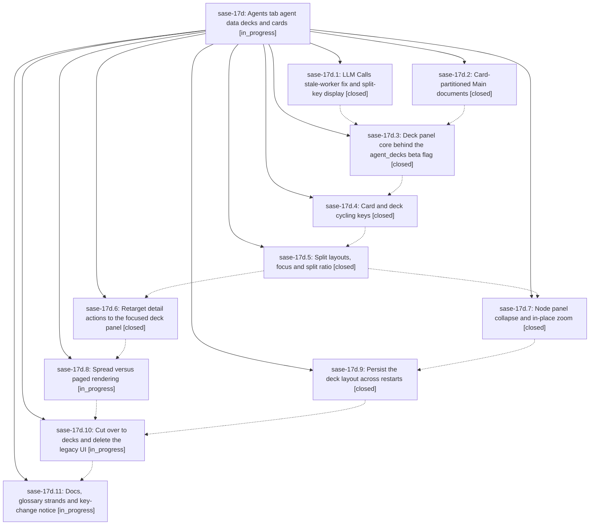

# Bead: sase-17d — Agents tab agent data decks and cards

[Bead Pages](../README.md) / sase-17d

**Status:** ◐ in_progress · **Type:** ▸ plan · **Tier:** epic
**Owner:** `bryanbugyi34@gmail.com` · **Created by:** [bbugyi200.athena.0qd](https://github.com/sase-org/sase--agents/blob/main/families/bbugyi200.athena.0qd.md) · **Assignee:** `sase-17d.land`
**Created:** 2026-09-23 19:16:45 EDT
**Plan:** [202609/agents\_tab\_decks\_and\_cards.md](https://github.com/sase-org/sase--plans/blob/main/202609/agents_tab_decks_and_cards.md)

## Description

The Agents tab replaces its metadata panel and its Files and LLM Calls panels with one deck-panel type. It shows one or two panels, stacked top and bottom or side by side, and each panel shows an agent data deck (Main, Files or Tools) made of agent data cards. A deck renders all of its cards on one page when they fit a configurable threshold and one card per page otherwise. Keys cycle cards (Ctrl+J/K) and decks (Ctrl+N/P), split and unsplit panels (\ and |), move focus (Ctrl+F), collapse the node panel (Ctrl+S) and zoom a deck in place (Z). The p view picker, the Z zoom modal and the legacy panel modes are deleted, and glossary strands describe the new vocabulary.

## Notes

[2026-09-24T02:22:32Z · chop.refresh_docs.sase.1_365885.1] DISCOVERED ISSUE: just check fails at lint (mypy) on master 00ee51996 (deck panel core): src/sase/ace/tui/widgets/file_panel/_content.py:132 error: "FilePanelContentMixin" has no attribute "parent" [attr-defined] in _get_scroll_container. Reproduced from a docs-only working tree via sase tool run 6476c6ba9891284bb1887d7baabfef64. Also: with agent_decks on, no keys switch decks/cards yet, so the Reply card is unreachable (docs now state this).

## Phases

| Bead | Title | Status | Size | Created | Agents | Commits |
|---|---|---|---|---|---:|---:|
| [sase-17d.1](sase-17d.1.md) | LLM Calls stale-worker fix and split-key display | ✓ closed | small | 2026-09-23 | 1 | 1 |
| [sase-17d.10](sase-17d.10.md) | Cut over to decks and delete the legacy UI | ◐ in_progress | large | 2026-09-23 | 1 | 0 |
| [sase-17d.11](sase-17d.11.md) | Docs, glossary strands and key-change notice | ◐ in_progress | medium | 2026-09-23 | 1 | 0 |
| [sase-17d.2](sase-17d.2.md) | Card-partitioned Main documents | ✓ closed | large | 2026-09-23 | 1 | 1 |
| [sase-17d.3](sase-17d.3.md) | Deck panel core behind the agent\_decks beta flag | ✓ closed | large | 2026-09-23 | 1 | 1 |
| [sase-17d.4](sase-17d.4.md) | Card and deck cycling keys | ✓ closed | medium | 2026-09-23 | 0 | 0 |
| [sase-17d.5](sase-17d.5.md) | Split layouts, focus and split ratio | ✓ closed | large | 2026-09-23 | 1 | 1 |
| [sase-17d.6](sase-17d.6.md) | Retarget detail actions to the focused deck panel | ✓ closed | large | 2026-09-23 | 1 | 1 |
| [sase-17d.7](sase-17d.7.md) | Node panel collapse and in-place zoom | ✓ closed | medium | 2026-09-23 | 1 | 1 |
| [sase-17d.8](sase-17d.8.md) | Spread versus paged rendering | ◐ in_progress | large | 2026-09-23 | 1 | 1 |
| [sase-17d.9](sase-17d.9.md) | Persist the deck layout across restarts | ✓ closed | small | 2026-09-23 | 1 | 1 |

## Lineage

## Agents

| Agent | Bead | Commits |
|---|---|---:|
| [bbugyi200.athena.sase-17d.1](https://github.com/sase-org/sase--agents/blob/main/agents/bbugyi200.athena.sase-17d.1/README.md) | [sase-17d.1](sase-17d.1.md) | 1 |
| [bbugyi200.athena.sase-17d.10](https://github.com/sase-org/sase--agents/blob/main/agents/bbugyi200.athena.sase-17d.10/README.md) | [sase-17d.10](sase-17d.10.md) | 0 |
| [bbugyi200.athena.sase-17d.11](https://github.com/sase-org/sase--agents/blob/main/agents/bbugyi200.athena.sase-17d.11/README.md) | [sase-17d.11](sase-17d.11.md) | 0 |
| [bbugyi200.athena.sase-17d.2](https://github.com/sase-org/sase--agents/blob/main/families/bbugyi200.athena.sase-17d.2.md) | [sase-17d.2](sase-17d.2.md) | 1 |
| [bbugyi200.athena.sase-17d.3](https://github.com/sase-org/sase--agents/blob/main/families/bbugyi200.athena.sase-17d.3.md) | [sase-17d.3](sase-17d.3.md) | 1 |
| [bbugyi200.athena.sase-17d.5](https://github.com/sase-org/sase--agents/blob/main/families/bbugyi200.athena.sase-17d.5.md) | [sase-17d.5](sase-17d.5.md) | 1 |
| [bbugyi200.athena.sase-17d.6](https://github.com/sase-org/sase--agents/blob/main/families/bbugyi200.athena.sase-17d.6.md) | [sase-17d.6](sase-17d.6.md) | 1 |
| [bbugyi200.athena.sase-17d.7](https://github.com/sase-org/sase--agents/blob/main/agents/bbugyi200.athena.sase-17d.7/README.md) | [sase-17d.7](sase-17d.7.md) | 1 |
| [bbugyi200.athena.sase-17d.8](https://github.com/sase-org/sase--agents/blob/main/families/bbugyi200.athena.sase-17d.8.md) | [sase-17d.8](sase-17d.8.md) | 1 |
| [bbugyi200.athena.sase-17d.9](https://github.com/sase-org/sase--agents/blob/main/agents/bbugyi200.athena.sase-17d.9/README.md) | [sase-17d.9](sase-17d.9.md) | 1 |
| [bbugyi200.athena.sase-17d.land](https://github.com/sase-org/sase--agents/blob/main/agents/bbugyi200.athena.sase-17d.land/README.md) | [sase-17d](README.md) | 0 |

## Commits

| Repo | Commit | Subject | Bead | Committed |
|---|---|---|---|---|
| sase | [`9c701d6`](https://github.com/sase-org/sase/commit/9c701d658fef3edcef2981da5c09058ae0844ad1) | fix(tui): guard LLM Calls panel against stale-worker paints; split-key display | [sase-17d.1](sase-17d.1.md) | 2026-09-23 19:36:21 EDT |
| sase | [`9abf08b`](https://github.com/sase-org/sase/commit/9abf08b5df74ebc17f5e293e4909702867105880) | feat(agents-tab): card-partitioned Main documents | [sase-17d.2](sase-17d.2.md) | 2026-09-23 20:09:06 EDT |
| sase | [`00ee519`](https://github.com/sase-org/sase/commit/00ee51996d109f2715701b4140f7b528520764de) | feat(agents-tui): deck panel core behind the agent\_decks beta flag | [sase-17d.3](sase-17d.3.md) | 2026-09-23 21:30:43 EDT |
| sase | [`075225d`](https://github.com/sase-org/sase/commit/075225d53795b20eb18dd4a8f32a421ebaa8caad) | feat(ace): implement deck splits focus layout state machine | [sase-17d.5](sase-17d.5.md) | 2026-09-24 08:27:07 EDT |
| sase | [`71fff39`](https://github.com/sase-org/sase/commit/71fff39d1588bd96ded18c7f5b64c1ca9d63421e) | feat(ace-tui): deck node collapse and in-place zoom | [sase-17d.7](sase-17d.7.md) | 2026-09-24 09:13:00 EDT |
| sase | [`7d22725`](https://github.com/sase-org/sase/commit/7d2272588839582b01bcdeb789a26708ed0f1b8d) | feat(ace): retarget agents detail actions to focused deck panel | [sase-17d.6](sase-17d.6.md) | 2026-09-24 09:17:42 EDT |
| sase | [`4388817`](https://github.com/sase-org/sase/commit/43888178618aa31fb531a3d02e0ffb4fe6839dc7) | feat(agents): persist deck layout across restarts | [sase-17d.9](sase-17d.9.md) | 2026-09-24 09:47:52 EDT |
| sase | [`329d404`](https://github.com/sase-org/sase/commit/329d4049b6f61467f5a97006346f0b487b994ee8) | feat(ace): implement deck spread versus paged rendering (sase-17d.8) | [sase-17d.8](sase-17d.8.md) | 2026-09-24 09:53:14 EDT |

<!-- sase:referenced-by:start -->

## Referenced By

| Relation | Artifact | Why | Uses |
| --- | --- | --- | ---: |
| read-by | [agent:0ql][1] | Understand sase-17d epic scope to generate infographic | 1 |
| read-by | [agent:sase-17d.7][2] | parent status | 1 |
| read-by | [agent:sase-17m.2.1.land][3] | Check existing notes for the mypy issue | 2 |

[1]: https://github.com/sase-org/sase--agents/blob/main/agents/bbugyi200.athena.0ql/README.md
[2]: https://github.com/sase-org/sase--agents/blob/main/agents/bbugyi200.athena.sase-17d.7/README.md
[3]: https://github.com/sase-org/sase--agents/blob/main/agents/bbugyi200.athena.sase-17m.2.1.land/README.md

<!-- sase:referenced-by:end -->
