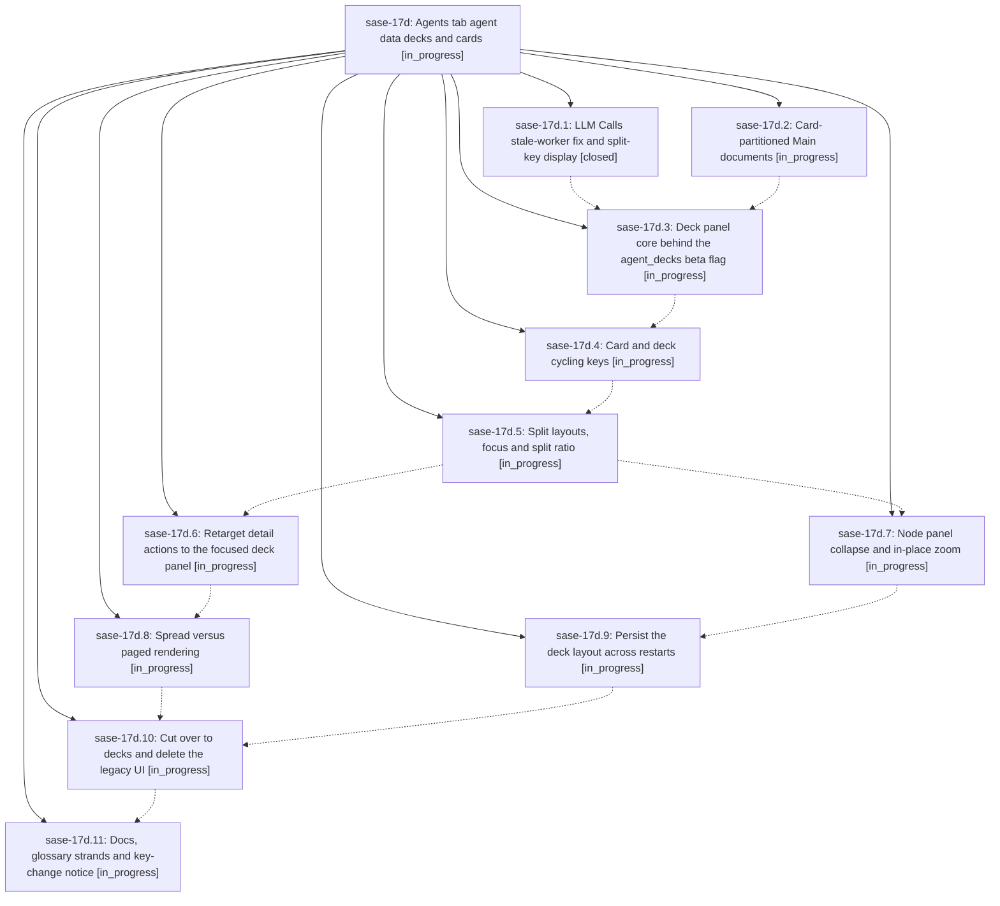

# Bead: sase-17d — Agents tab agent data decks and cards

[Bead Pages](../README.md) / sase-17d

**Status:** ◐ in_progress · **Type:** ▸ plan · **Tier:** epic
**Owner:** `bryanbugyi34@gmail.com` · **Created by:** [bbugyi200.athena.0qd](https://github.com/sase-org/sase--agents/blob/main/families/bbugyi200.athena.0qd.md) · **Assignee:** `sase-17d.land`
**Created:** 2026-09-23 19:16:45 EDT
**Plan:** [202609/agents\_tab\_decks\_and\_cards.md](https://github.com/sase-org/sase--plans/blob/main/202609/agents_tab_decks_and_cards.md)

## Description

The Agents tab replaces its metadata panel and its Files and LLM Calls panels with one deck-panel type. It shows one or two panels, stacked top and bottom or side by side, and each panel shows an agent data deck (Main, Files or Tools) made of agent data cards. A deck renders all of its cards on one page when they fit a configurable threshold and one card per page otherwise. Keys cycle cards (Ctrl+J/K) and decks (Ctrl+N/P), split and unsplit panels (\ and |), move focus (Ctrl+F), collapse the node panel (Ctrl+S) and zoom a deck in place (Z). The p view picker, the Z zoom modal and the legacy panel modes are deleted, and glossary strands describe the new vocabulary.

## Phases

| Bead | Title | Status | Size | Created | Agents | Commits |
|---|---|---|---|---|---:|---:|
| [sase-17d.1](sase-17d.1.md) | LLM Calls stale-worker fix and split-key display | ✓ closed | small | 2026-09-23 | 1 | 1 |
| [sase-17d.10](sase-17d.10.md) | Cut over to decks and delete the legacy UI | ◐ in_progress | large | 2026-09-23 | 1 | 0 |
| [sase-17d.11](sase-17d.11.md) | Docs, glossary strands and key-change notice | ◐ in_progress | medium | 2026-09-23 | 1 | 0 |
| [sase-17d.2](sase-17d.2.md) | Card-partitioned Main documents | ◐ in_progress | large | 2026-09-23 | 1 | 0 |
| [sase-17d.3](sase-17d.3.md) | Deck panel core behind the agent\_decks beta flag | ◐ in_progress | large | 2026-09-23 | 1 | 0 |
| [sase-17d.4](sase-17d.4.md) | Card and deck cycling keys | ◐ in_progress | medium | 2026-09-23 | 1 | 0 |
| [sase-17d.5](sase-17d.5.md) | Split layouts, focus and split ratio | ◐ in_progress | large | 2026-09-23 | 1 | 0 |
| [sase-17d.6](sase-17d.6.md) | Retarget detail actions to the focused deck panel | ◐ in_progress | large | 2026-09-23 | 1 | 0 |
| [sase-17d.7](sase-17d.7.md) | Node panel collapse and in-place zoom | ◐ in_progress | medium | 2026-09-23 | 1 | 0 |
| [sase-17d.8](sase-17d.8.md) | Spread versus paged rendering | ◐ in_progress | large | 2026-09-23 | 1 | 0 |
| [sase-17d.9](sase-17d.9.md) | Persist the deck layout across restarts | ◐ in_progress | small | 2026-09-23 | 1 | 0 |

## Lineage

## Agents

| Agent | Bead | Commits |
|---|---|---:|
| [bbugyi200.athena.sase-17d.1](https://github.com/sase-org/sase--agents/blob/main/agents/bbugyi200.athena.sase-17d.1/README.md) | [sase-17d.1](sase-17d.1.md) | 1 |
| [bbugyi200.athena.sase-17d.10](https://github.com/sase-org/sase--agents/blob/main/agents/bbugyi200.athena.sase-17d.10/README.md) | [sase-17d.10](sase-17d.10.md) | 0 |
| [bbugyi200.athena.sase-17d.11](https://github.com/sase-org/sase--agents/blob/main/agents/bbugyi200.athena.sase-17d.11/README.md) | [sase-17d.11](sase-17d.11.md) | 0 |
| [bbugyi200.athena.sase-17d.2](https://github.com/sase-org/sase--agents/blob/main/families/bbugyi200.athena.sase-17d.2.md) | [sase-17d.2](sase-17d.2.md) | 0 |
| [bbugyi200.athena.sase-17d.3](https://github.com/sase-org/sase--agents/blob/main/agents/bbugyi200.athena.sase-17d.3/README.md) | [sase-17d.3](sase-17d.3.md) | 0 |
| [bbugyi200.athena.sase-17d.4](https://github.com/sase-org/sase--agents/blob/main/agents/bbugyi200.athena.sase-17d.4/README.md) | [sase-17d.4](sase-17d.4.md) | 0 |
| [bbugyi200.athena.sase-17d.5](https://github.com/sase-org/sase--agents/blob/main/agents/bbugyi200.athena.sase-17d.5/README.md) | [sase-17d.5](sase-17d.5.md) | 0 |
| [bbugyi200.athena.sase-17d.6](https://github.com/sase-org/sase--agents/blob/main/agents/bbugyi200.athena.sase-17d.6/README.md) | [sase-17d.6](sase-17d.6.md) | 0 |
| [bbugyi200.athena.sase-17d.7](https://github.com/sase-org/sase--agents/blob/main/agents/bbugyi200.athena.sase-17d.7/README.md) | [sase-17d.7](sase-17d.7.md) | 0 |
| [bbugyi200.athena.sase-17d.8](https://github.com/sase-org/sase--agents/blob/main/agents/bbugyi200.athena.sase-17d.8/README.md) | [sase-17d.8](sase-17d.8.md) | 0 |
| [bbugyi200.athena.sase-17d.9](https://github.com/sase-org/sase--agents/blob/main/agents/bbugyi200.athena.sase-17d.9/README.md) | [sase-17d.9](sase-17d.9.md) | 0 |
| [bbugyi200.athena.sase-17d.land](https://github.com/sase-org/sase--agents/blob/main/agents/bbugyi200.athena.sase-17d.land/README.md) | [sase-17d](README.md) | 0 |

## Commits

| Repo | Commit | Subject | Bead | Committed |
|---|---|---|---|---|
| sase | [`9c701d6`](https://github.com/sase-org/sase/commit/9c701d658fef3edcef2981da5c09058ae0844ad1) | fix(tui): guard LLM Calls panel against stale-worker paints; split-key display | [sase-17d.1](sase-17d.1.md) | 2026-09-23 19:36:21 EDT |
