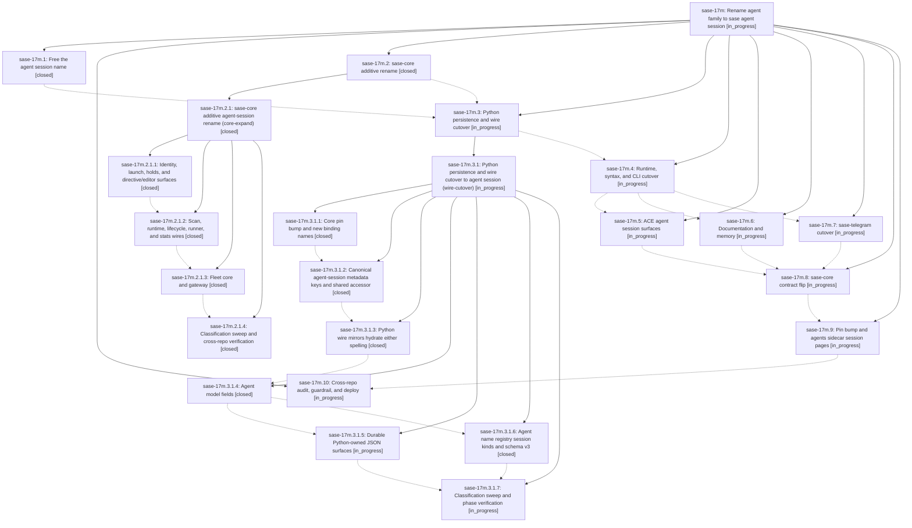

# Bead: sase-17m — Rename agent family to sase agent session

[Bead Pages](../README.md) / sase-17m

**Status:** ◐ in_progress · **Type:** ▸ plan · **Tier:** epic
**Owner:** `bryanbugyi34@gmail.com` · **Created by:** [bbugyi200.athena.0qh](https://github.com/sase-org/sase--agents/blob/main/families/bbugyi200.athena.0qh.md) · **Assignee:** `sase-17m.land`
**Created:** 2026-09-23 22:46:33 EDT
**Plan:** [202609/agent\_session\_rename.md](https://github.com/sase-org/sase--plans/blob/main/202609/agent_session_rename.md)

## Description

The concept formerly called an agent family is named a sase agent session (agent session) on every current surface in sase, sase-core, sase-telegram, and chezmoi: code, wire contracts, persisted output, CLI, prompt syntax, ACE, skills, docs, and memory. Pre-rename data still loads, retired user syntax keeps working behind a sunset flag, and unrelated meanings of "family" are unchanged.

## Notes

[2026-09-24T14:26:17Z · sase-17o.land] DISCOVERED ISSUE (sase-17o land, 2026-09-24, master 7d2272588): the full test lane on HEAD has 52 deterministic failures, identical with and without sase-17o's land diff, dominated by 'TypeError: AgentMetaWire.__init__() got an unexpected keyword argument agent_family' (tests/test_dynamic_agent_family_attach_resolution.py x23, test_editor_helper_family_catalog.py x9, test_agent_generated_name_guard.py x3, agent_prompt_panel/semantic/tribe widget tests, test_agent_cleanup_facade.py, test_agent_names_extract_metadata.py). The installed sase_core_rs wheel lacks 16 capabilities (probe_core_floor: resolve_agent_session_parent, parse_agent_session_name, ... blocked_unpublished) while tests/Python callers already use the session-rename wire. Likely owned by the in-flight wire cutover (sase-17m.3.1) / pin bump (sase-17m.9).

## Phases

| Bead | Title | Status | Size | Created | Agents | Commits |
|---|---|---|---|---|---:|---:|
| [sase-17m.1](sase-17m.1.md) | Free the agent session name | ✓ closed | small | 2026-09-23 | 1 | 1 |
| [sase-17m.10](sase-17m.10.md) | Cross-repo audit, guardrail, and deploy | ◐ in_progress | medium | 2026-09-23 | 1 | 0 |
| [sase-17m.2](sase-17m.2.md) | sase-core additive rename | ✓ closed | large | 2026-09-23 | 1 | 0 |
| [sase-17m.3](sase-17m.3.md) | Python persistence and wire cutover | ◐ in_progress | large | 2026-09-23 | 1 | 0 |
| [sase-17m.4](sase-17m.4.md) | Runtime, syntax, and CLI cutover | ◐ in_progress | large | 2026-09-23 | 1 | 0 |
| [sase-17m.5](sase-17m.5.md) | ACE agent session surfaces | ◐ in_progress | large | 2026-09-23 | 1 | 0 |
| [sase-17m.6](sase-17m.6.md) | Documentation and memory | ◐ in_progress | medium | 2026-09-23 | 1 | 0 |
| [sase-17m.7](sase-17m.7.md) | sase-telegram cutover | ◐ in_progress | small | 2026-09-23 | 1 | 0 |
| [sase-17m.8](sase-17m.8.md) | sase-core contract flip | ◐ in_progress | medium | 2026-09-23 | 1 | 0 |
| [sase-17m.9](sase-17m.9.md) | Pin bump and agents sidecar session pages | ◐ in_progress | medium | 2026-09-23 | 1 | 0 |

## Lineage

## Agents

| Agent | Bead | Commits |
|---|---|---:|
| [bbugyi200.athena.sase-17m.1](https://github.com/sase-org/sase--agents/blob/main/agents/bbugyi200.athena.sase-17m.1/README.md) | [sase-17m.1](sase-17m.1.md) | 1 |
| [bbugyi200.athena.sase-17m.10](https://github.com/sase-org/sase--agents/blob/main/agents/bbugyi200.athena.sase-17m.10/README.md) | [sase-17m.10](sase-17m.10.md) | 0 |
| [bbugyi200.athena.sase-17m.2](https://github.com/sase-org/sase--agents/blob/main/families/bbugyi200.athena.sase-17m.2.md) | [sase-17m.2](sase-17m.2.md) | 0 |
| [bbugyi200.athena.sase-17m.2.1.1](https://github.com/sase-org/sase--agents/blob/main/agents/bbugyi200.athena.sase-17m.2.1.1/README.md) | [sase-17m.2.1.1](sase-17m.2.1.1.md) | 2 |
| [bbugyi200.athena.sase-17m.2.1.2](https://github.com/sase-org/sase--agents/blob/main/agents/bbugyi200.athena.sase-17m.2.1.2/README.md) | [sase-17m.2.1.2](sase-17m.2.1.2.md) | 1 |
| [bbugyi200.athena.sase-17m.2.1.3](https://github.com/sase-org/sase--agents/blob/main/agents/bbugyi200.athena.sase-17m.2.1.3/README.md) | [sase-17m.2.1.3](sase-17m.2.1.3.md) | 1 |
| [bbugyi200.athena.sase-17m.2.1.4](https://github.com/sase-org/sase--agents/blob/main/agents/bbugyi200.athena.sase-17m.2.1.4/README.md) | [sase-17m.2.1.4](sase-17m.2.1.4.md) | 1 |
| [bbugyi200.athena.sase-17m.2.1.land](https://github.com/sase-org/sase--agents/blob/main/agents/bbugyi200.athena.sase-17m.2.1.land/README.md) | [sase-17m.2.1](sase-17m.2.1.md) | 1 |
| [bbugyi200.athena.sase-17m.3](https://github.com/sase-org/sase--agents/blob/main/families/bbugyi200.athena.sase-17m.3.md) | [sase-17m.3](sase-17m.3.md) | 0 |
| [bbugyi200.athena.sase-17m.3.1.1](https://github.com/sase-org/sase--agents/blob/main/agents/bbugyi200.athena.sase-17m.3.1.1/README.md) | [sase-17m.3.1.1](sase-17m.3.1.1.md) | 1 |
| [bbugyi200.athena.sase-17m.3.1.2](https://github.com/sase-org/sase--agents/blob/main/agents/bbugyi200.athena.sase-17m.3.1.2/README.md) | [sase-17m.3.1.2](sase-17m.3.1.2.md) | 1 |
| [bbugyi200.athena.sase-17m.3.1.3](https://github.com/sase-org/sase--agents/blob/main/agents/bbugyi200.athena.sase-17m.3.1.3/README.md) | [sase-17m.3.1.3](sase-17m.3.1.3.md) | 1 |
| [bbugyi200.athena.sase-17m.3.1.4](https://github.com/sase-org/sase--agents/blob/main/agents/bbugyi200.athena.sase-17m.3.1.4/README.md) | [sase-17m.3.1.4](sase-17m.3.1.4.md) | 1 |
| [bbugyi200.athena.sase-17m.3.1.5](https://github.com/sase-org/sase--agents/blob/main/agents/bbugyi200.athena.sase-17m.3.1.5/README.md) | [sase-17m.3.1.5](sase-17m.3.1.5.md) | 1 |
| [bbugyi200.athena.sase-17m.3.1.6](https://github.com/sase-org/sase--agents/blob/main/agents/bbugyi200.athena.sase-17m.3.1.6/README.md) | [sase-17m.3.1.6](sase-17m.3.1.6.md) | 1 |
| [bbugyi200.athena.sase-17m.3.1.7](https://github.com/sase-org/sase--agents/blob/main/agents/bbugyi200.athena.sase-17m.3.1.7/README.md) | [sase-17m.3.1.7](sase-17m.3.1.7.md) | 0 |
| [bbugyi200.athena.sase-17m.3.1.land](https://github.com/sase-org/sase--agents/blob/main/agents/bbugyi200.athena.sase-17m.3.1.land/README.md) | [sase-17m.3.1](sase-17m.3.1.md) | 0 |
| [bbugyi200.athena.sase-17m.4](https://github.com/sase-org/sase--agents/blob/main/agents/bbugyi200.athena.sase-17m.4/README.md) | [sase-17m.4](sase-17m.4.md) | 0 |
| [bbugyi200.athena.sase-17m.5](https://github.com/sase-org/sase--agents/blob/main/agents/bbugyi200.athena.sase-17m.5/README.md) | [sase-17m.5](sase-17m.5.md) | 0 |
| [bbugyi200.athena.sase-17m.6](https://github.com/sase-org/sase--agents/blob/main/agents/bbugyi200.athena.sase-17m.6/README.md) | [sase-17m.6](sase-17m.6.md) | 0 |
| [bbugyi200.athena.sase-17m.7](https://github.com/sase-org/sase--agents/blob/main/agents/bbugyi200.athena.sase-17m.7/README.md) | [sase-17m.7](sase-17m.7.md) | 0 |
| [bbugyi200.athena.sase-17m.8](https://github.com/sase-org/sase--agents/blob/main/agents/bbugyi200.athena.sase-17m.8/README.md) | [sase-17m.8](sase-17m.8.md) | 0 |
| [bbugyi200.athena.sase-17m.9](https://github.com/sase-org/sase--agents/blob/main/agents/bbugyi200.athena.sase-17m.9/README.md) | [sase-17m.9](sase-17m.9.md) | 0 |
| [bbugyi200.athena.sase-17m.land](https://github.com/sase-org/sase--agents/blob/main/agents/bbugyi200.athena.sase-17m.land/README.md) | [sase-17m](README.md) | 0 |

## Commits

| Repo | Commit | Subject | Bead | Committed |
|---|---|---|---|---|
| sase | [`e662494`](https://github.com/sase-org/sase/commit/e662494ba5af6af123cf88e026555a87f4476b40) | refactor(free-name): rename transcript resolvers, tmux helpers, and agent-run prose | [sase-17m.1](sase-17m.1.md) | 2026-09-23 23:02:35 EDT |
| sase | [`a764a76`](https://github.com/sase-org/sase/commit/a764a76d41fbcacfe08ecbf93a351d3c53d732ad) | feat(ace): tolerate new agent-session spelling in directive contract and completion | [sase-17m.2.1.1](sase-17m.2.1.1.md) | 2026-09-24 00:05:04 EDT |
| sase-core | [`sase-core@c5b9c0d`](https://github.com/sase-org/sase-core/commit/c5b9c0d68867fb1cef8923b06270e39d5f9533d1) | feat(core): additive agent-session rename for identity, launch, holds, and editor surfaces | [sase-17m.2.1.1](sase-17m.2.1.1.md) | 2026-09-24 00:09:36 EDT |
| sase-core | [`sase-core@ef82848`](https://github.com/sase-org/sase-core/commit/ef8284804ab894ed8f3277726bea1e4cc34a6864) | feat(core): additive agent-session rename for scan, runtime, lifecycle, runner, and stats wires | [sase-17m.2.1.2](sase-17m.2.1.2.md) | 2026-09-24 01:01:58 EDT |
| sase-core | [`sase-core@b814a0f`](https://github.com/sase-org/sase-core/commit/b814a0fc08ad5a94aba5863fa4550b3622ac9126) | refactor(fleet): rename family to agent session with session key acceptance | [sase-17m.2.1.3](sase-17m.2.1.3.md) | 2026-09-24 01:35:09 EDT |
| sase-core | [`sase-core@ae9dbf6`](https://github.com/sase-org/sase-core/commit/ae9dbf6e0719761d825478021aa8ff8d7b27aae8) | refactor(core): sweep remaining agent-family spellings to agent session | [sase-17m.2.1.4](sase-17m.2.1.4.md) | 2026-09-24 02:35:32 EDT |
| sase--plans | [`sase--plans@f4ede6d`](https://github.com/sase-org/sase--plans/commit/f4ede6dd559c0b0bc69003ba9e615f130e3b8c6f) | chore(plans): mark agent\_session\_core\_expand plan done after sase-17m.2.1 landed | [sase-17m.2.1](sase-17m.2.1.md) | 2026-09-24 03:02:21 EDT |
| sase | [`bb81b99`](https://github.com/sase-org/sase/commit/bb81b993a0df13a300baaa784c902d51e74201ec) | refactor(agent-session): pin core-expand bindings to agent\_session spellings | [sase-17m.3.1.1](sase-17m.3.1.1.md) | 2026-09-24 04:00:06 EDT |
| sase | [`29ca9ee`](https://github.com/sase-org/sase/commit/29ca9ee46fde78dee5b96a48c9021101b608624e) | refactor(agent-session): canonical metadata keys and shared accessor (sase-17m.3.1.2) | [sase-17m.3.1.2](sase-17m.3.1.2.md) | 2026-09-24 05:21:50 EDT |
| sase | [`b855380`](https://github.com/sase-org/sase/commit/b855380098eddf57ed0e60b9d5dce764fee64264) | refactor(agent-session): Python wire mirrors hydrate either spelling (sase-17m.3.1.3) | [sase-17m.3.1.3](sase-17m.3.1.3.md) | 2026-09-24 06:34:26 EDT |
| sase | [`5a048ce`](https://github.com/sase-org/sase/commit/5a048ceb35cd17f2d0c56fa0586eff849ca9c535) | refactor(agent-session): rename Agent family-concept fields to agent\_session (sase-17m.3.1.4) | [sase-17m.3.1.4](sase-17m.3.1.4.md) | 2026-09-24 09:25:09 EDT |
| sase | [`12b253c`](https://github.com/sase-org/sase/commit/12b253c35db43302c636c14f38fe769057c8b3e7) | refactor(agent-session): cut name registry to session kinds and schema v3 (sase-17m.3.1.6) | [sase-17m.3.1.6](sase-17m.3.1.6.md) | 2026-09-24 10:08:34 EDT |
| sase | [`5393b41`](https://github.com/sase-org/sase/commit/5393b41b0de4df4912adb2fe53eff081eec45e51) | refactor(agent-session): durable Python-owned JSON surfaces emit session spellings (sase-17m.3.1.5) | [sase-17m.3.1.5](sase-17m.3.1.5.md) | 2026-09-24 10:36:30 EDT |

<!-- sase:referenced-by:start -->

## Referenced By

| Relation | Artifact | Why | Uses |
| --- | --- | --- | ---: |
| read-by | [agent:research.2f.cld][1] | Research critique of SASE concept renames (family->session, shell->turn) | 1 |
| read-by | [agent:research.2f.final][2] | Check sase-17m rename epic scope and status to critique the family→session rename | 1 |
| read-by | [agent:research.2f.gem][3] | Understand context for concept renames in epic sase-17m | 1 |
| read-by | [agent:research.2f.mus][4] | researching rename epic context for terminology critique | 1 |
| read-by | [agent:research.2g.final.f0][5] | Flake corroboration counts and 17m rename epic state for P1 sequencing | 1 |
| read-by | [agent:sase-17m.2.1.land][6] | Need parent epic to see wire-cutover/core-contract phases | 1 |

[1]: https://github.com/sase-org/sase--agents/blob/main/agents/bbugyi200.athena.research.2f.cld/README.md
[2]: https://github.com/sase-org/sase--agents/blob/main/agents/bbugyi200.athena.research.2f.final/README.md
[3]: https://github.com/sase-org/sase--agents/blob/main/agents/bbugyi200.athena.research.2f.gem/README.md
[4]: https://github.com/sase-org/sase--agents/blob/main/agents/bbugyi200.athena.research.2f.mus/README.md
[5]: https://github.com/sase-org/sase--agents/blob/main/agents/bbugyi200.athena.research.2g.final.f0/README.md
[6]: https://github.com/sase-org/sase--agents/blob/main/agents/bbugyi200.athena.sase-17m.2.1.land/README.md

<!-- sase:referenced-by:end -->
