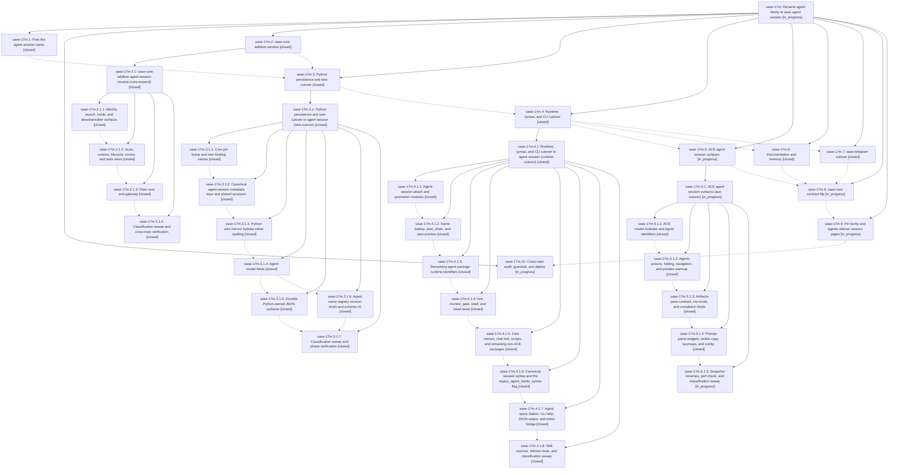

# Bead: sase-17m — Rename agent family to sase agent session

[Bead Pages](../README.md) / sase-17m

**Status:** ◐ in_progress · **Type:** ▸ plan · **Tier:** epic
**Owner:** `bryanbugyi34@gmail.com` · **Created by:** [bbugyi200.athena.0qh](https://github.com/sase-org/sase--agents/blob/main/families/bbugyi200.athena.0qh.md) · **Assignee:** `sase-17m.land`
**Created:** 2026-09-23 22:46:33 EDT
**Plan:** [202609/agent\_session\_rename.md](https://github.com/sase-org/sase--plans/blob/main/202609/agent_session_rename.md)

<!-- sase:links:start -->

## Links

| Relation | Artifact | Why |
| --- | --- | --- |
| related | [bead:sase-183][1] | 7e1b05964 (sase-17m.3.1 wire cutover) renamed the family index fields that 9bd351b67 still references |

_Plus 10 automatic references — see [Referenced By](#referenced-by)._

[1]: https://github.com/sase-org/sase--beads/blob/main/pages/sase-183/README.md

<!-- sase:links:end -->

## Description

The concept formerly called an agent family is named a sase agent session (agent session) on every current surface in sase, sase-core, sase-telegram, and chezmoi: code, wire contracts, persisted output, CLI, prompt syntax, ACE, skills, docs, and memory. Pre-rename data still loads, retired user syntax keeps working behind a sunset flag, and unrelated meanings of "family" are unchanged.

## Notes

[2026-09-24T14:26:17Z · sase-17o.land] DISCOVERED ISSUE (sase-17o land, 2026-09-24, master 7d2272588): the full test lane on HEAD has 52 deterministic failures, identical with and without sase-17o's land diff, dominated by 'TypeError: AgentMetaWire.__init__() got an unexpected keyword argument agent_family' (tests/test_dynamic_agent_family_attach_resolution.py x23, test_editor_helper_family_catalog.py x9, test_agent_generated_name_guard.py x3, agent_prompt_panel/semantic/tribe widget tests, test_agent_cleanup_facade.py, test_agent_names_extract_metadata.py). The installed sase_core_rs wheel lacks 16 capabilities (probe_core_floor: resolve_agent_session_parent, parse_agent_session_name, ... blocked_unpublished) while tests/Python callers already use the session-rename wire. Likely owned by the in-flight wire cutover (sase-17m.3.1) / pin bump (sase-17m.9).

[2026-09-25T02:17:43Z · sase-18i.land] DISCOVERED ISSUE: While verifying an unrelated plan-approval tale on 2026-09-24 at master 4858f20a2, the escalated just test-scoped lane failed 16 nodes that still expect the retired family= spelling or wording after the canonical session= cutover (65d3dfb1d, sase-17m.4.1.6). Each fails identically on a pristine tree (changes stashed), so none is caused by the tale. Nodes: tests/ace/tui/test_kill_and_edit_prompt_name.py::test_prepare_kill_and_edit_prompt_restarts_exact_family_member (4 params, expected '%id(!code, family=...' vs emitted 'session='), tests/ace/tui/test_kill_and_edit_agent_name.py::test_kill_and_edit_family_phase_forces_exact_member_attachment, tests/ace/tui/test_retry_edit_prompt_name.py::test_rewrite_retry_prompt_uses_concrete_name_for_family_member, tests/ace/tui/test_family_member_relaunch.py (3 nodes; the notice now says 'session=sase-pw.1 attaches the agent to itself' where the test asserts 'family='), tests/ace/tui/test_agent_bulk_kill_edit.py::test_bulk_kill_and_edit_rewrites_exact_marked_family_member, tests/test_force_reuse_launch_seam.py (2 nodes), tests/test_directives_bead.py::test_id_bead_survives_fanout_repeat_retry_and_forced_reuse and ::test_id_bead_reports_targeted_argument_errors, tests/test_parallel_agent_session_launch.py::test_prompt_local_clan_errors_surface_through_launch_preflight, tests/test_xprompt_load_issues.py::test_removed_agent_family_kind_raises_migration_error. Routed here rather than filed as a task because phase sase-17m.4 (runtime, syntax, and CLI cutover) is still in progress and owns updating these expectations.

[2026-09-25T03:58:58Z · sase-17m.4.1.land] HANDOFF RESOLUTION: parent note #2 (16 clean-master family= expectation failures) was addressed by runtime-cutover child phase sase-17m.4.1.8 in commit a2ec65a1f, which updated stale ACE and non-ACE tests to canonical session= and session query expectations; its focused session/query tests pass in the child landing review. Child epic sase-17m.4.1 and parent phase sase-17m.4 are closed. Core-contract, ACE, Telegram, docs, and session-pages handoffs remain on phase sase-17m.4 notes #3-#6 for the still-open sibling phases.

[2026-09-25T05:32:44Z · sase-18d.7.land] DISCOVERED ISSUE (sase-18d.7 land, 2026-09-25, master 02c4b029a): pyproject still admits sase-core-rs>=0.34.71, and 'uv run' in a workspace re-syncs the venv to 0.34.71. That binding rejects the agent_session capacity fields HEAD Python sends (ValueError: invalid runner capacity request: unknown field 'agent_session' from src/sase/core/runner_slots/_admission_snapshot.py:34), so every mounted Agents-tab load fails and all 7 sase-18d.7 pilot e2e tests time out after 60s. After 'just rust-install' (cached 0.34.73 wheel) and running .venv/bin/python directly, all 62 pass. The floor or pin bump in sase-17m.9 needs to reach >=0.34.73. Also reported as PROPOSED FOLLOW-UP #1 on sase-18d.7.2.

## Phases

| Bead | Title | Status | Size | Created | Agents | Commits |
|---|---|---|---|---|---:|---:|
| [sase-17m.1](sase-17m.1.md) | Free the agent session name | ✓ closed | small | 2026-09-23 | 1 | 1 |
| [sase-17m.10](sase-17m.10.md) | Cross-repo audit, guardrail, and deploy | ◐ in_progress | medium | 2026-09-23 | 1 | 0 |
| [sase-17m.2](sase-17m.2.md) | sase-core additive rename | ✓ closed | large | 2026-09-23 | 1 | 0 |
| [sase-17m.3](sase-17m.3.md) | Python persistence and wire cutover | ✓ closed | large | 2026-09-23 | 1 | 0 |
| [sase-17m.4](sase-17m.4.md) | Runtime, syntax, and CLI cutover | ✓ closed | large | 2026-09-23 | 1 | 0 |
| [sase-17m.5](sase-17m.5.md) | ACE agent session surfaces | ◐ in_progress | large | 2026-09-23 | 1 | 0 |
| [sase-17m.6](sase-17m.6.md) | Documentation and memory | ✓ closed | medium | 2026-09-23 | 1 | 1 |
| [sase-17m.7](sase-17m.7.md) | sase-telegram cutover | ✓ closed | small | 2026-09-23 | 1 | 0 |
| [sase-17m.8](sase-17m.8.md) | sase-core contract flip | ◐ in_progress | medium | 2026-09-23 | 1 | 0 |
| [sase-17m.9](sase-17m.9.md) | Pin bump and agents sidecar session pages | ◐ in_progress | medium | 2026-09-23 | 1 | 0 |

## Lineage

## Agents

| Agent | Bead | Commits |
|---|---|---:|
| [bbugyi200.athena.sase-17m.1](https://github.com/sase-org/sase--agents/blob/main/agents/bbugyi200.athena.sase-17m.1/README.md) | [sase-17m.1](sase-17m.1.md) | 1 |
| [bbugyi200.athena.sase-17m.10](https://github.com/sase-org/sase--agents/blob/main/agents/bbugyi200.athena.sase-17m.10/README.md) | [sase-17m.10](sase-17m.10.md) | 0 |
| [bbugyi200.athena.sase-17m.2](https://github.com/sase-org/sase--agents/blob/main/families/bbugyi200.athena.sase-17m.2.md) | [sase-17m.2](sase-17m.2.md) | 0 |
| [bbugyi200.athena.sase-17m.2.1.1](https://github.com/sase-org/sase--agents/blob/main/agents/bbugyi200.athena.sase-17m.2.1.1/README.md) | [sase-17m.2.1.1](sase-17m.2.1.1.md) | 2 |
| [bbugyi200.athena.sase-17m.2.1.2](https://github.com/sase-org/sase--agents/blob/main/agents/bbugyi200.athena.sase-17m.2.1.2/README.md) | [sase-17m.2.1.2](sase-17m.2.1.2.md) | 1 |
| [bbugyi200.athena.sase-17m.2.1.3](https://github.com/sase-org/sase--agents/blob/main/agents/bbugyi200.athena.sase-17m.2.1.3/README.md) | [sase-17m.2.1.3](sase-17m.2.1.3.md) | 1 |
| [bbugyi200.athena.sase-17m.2.1.4](https://github.com/sase-org/sase--agents/blob/main/agents/bbugyi200.athena.sase-17m.2.1.4/README.md) | [sase-17m.2.1.4](sase-17m.2.1.4.md) | 1 |
| [bbugyi200.athena.sase-17m.2.1.land](https://github.com/sase-org/sase--agents/blob/main/agents/bbugyi200.athena.sase-17m.2.1.land/README.md) | [sase-17m.2.1](sase-17m.2.1.md) | 1 |
| [bbugyi200.athena.sase-17m.3](https://github.com/sase-org/sase--agents/blob/main/families/bbugyi200.athena.sase-17m.3.md) | [sase-17m.3](sase-17m.3.md) | 0 |
| [bbugyi200.athena.sase-17m.3.1.1](https://github.com/sase-org/sase--agents/blob/main/agents/bbugyi200.athena.sase-17m.3.1.1/README.md) | [sase-17m.3.1.1](sase-17m.3.1.1.md) | 1 |
| [bbugyi200.athena.sase-17m.3.1.2](https://github.com/sase-org/sase--agents/blob/main/agents/bbugyi200.athena.sase-17m.3.1.2/README.md) | [sase-17m.3.1.2](sase-17m.3.1.2.md) | 1 |
| [bbugyi200.athena.sase-17m.3.1.3](https://github.com/sase-org/sase--agents/blob/main/agents/bbugyi200.athena.sase-17m.3.1.3/README.md) | [sase-17m.3.1.3](sase-17m.3.1.3.md) | 1 |
| [bbugyi200.athena.sase-17m.3.1.4](https://github.com/sase-org/sase--agents/blob/main/agents/bbugyi200.athena.sase-17m.3.1.4/README.md) | [sase-17m.3.1.4](sase-17m.3.1.4.md) | 1 |
| [bbugyi200.athena.sase-17m.3.1.5](https://github.com/sase-org/sase--agents/blob/main/agents/bbugyi200.athena.sase-17m.3.1.5/README.md) | [sase-17m.3.1.5](sase-17m.3.1.5.md) | 1 |
| [bbugyi200.athena.sase-17m.3.1.6](https://github.com/sase-org/sase--agents/blob/main/agents/bbugyi200.athena.sase-17m.3.1.6/README.md) | [sase-17m.3.1.6](sase-17m.3.1.6.md) | 1 |
| [bbugyi200.athena.sase-17m.3.1.7](https://github.com/sase-org/sase--agents/blob/main/agents/bbugyi200.athena.sase-17m.3.1.7/README.md) | [sase-17m.3.1.7](sase-17m.3.1.7.md) | 0 |
| [bbugyi200.athena.sase-17m.3.1.land](https://github.com/sase-org/sase--agents/blob/main/agents/bbugyi200.athena.sase-17m.3.1.land/README.md) | [sase-17m.3.1](sase-17m.3.1.md) | 2 |
| [bbugyi200.athena.sase-17m.4](https://github.com/sase-org/sase--agents/blob/main/families/bbugyi200.athena.sase-17m.4.md) | [sase-17m.4](sase-17m.4.md) | 0 |
| [bbugyi200.athena.sase-17m.4.1.1](https://github.com/sase-org/sase--agents/blob/main/agents/bbugyi200.athena.sase-17m.4.1.1/README.md) | [sase-17m.4.1.1](sase-17m.4.1.1.md) | 1 |
| [bbugyi200.athena.sase-17m.4.1.2](https://github.com/sase-org/sase--agents/blob/main/agents/bbugyi200.athena.sase-17m.4.1.2/README.md) | [sase-17m.4.1.2](sase-17m.4.1.2.md) | 1 |
| [bbugyi200.athena.sase-17m.4.1.3](https://github.com/sase-org/sase--agents/blob/main/agents/bbugyi200.athena.sase-17m.4.1.3/README.md) | [sase-17m.4.1.3](sase-17m.4.1.3.md) | 1 |
| [bbugyi200.athena.sase-17m.4.1.4](https://github.com/sase-org/sase--agents/blob/main/agents/bbugyi200.athena.sase-17m.4.1.4/README.md) | [sase-17m.4.1.4](sase-17m.4.1.4.md) | 1 |
| [bbugyi200.athena.sase-17m.4.1.5](https://github.com/sase-org/sase--agents/blob/main/agents/bbugyi200.athena.sase-17m.4.1.5/README.md) | [sase-17m.4.1.5](sase-17m.4.1.5.md) | 1 |
| [bbugyi200.athena.sase-17m.4.1.6](https://github.com/sase-org/sase--agents/blob/main/agents/bbugyi200.athena.sase-17m.4.1.6/README.md) | [sase-17m.4.1.6](sase-17m.4.1.6.md) | 1 |
| [bbugyi200.athena.sase-17m.4.1.7](https://github.com/sase-org/sase--agents/blob/main/agents/bbugyi200.athena.sase-17m.4.1.7/README.md) | [sase-17m.4.1.7](sase-17m.4.1.7.md) | 1 |
| [bbugyi200.athena.sase-17m.4.1.8](https://github.com/sase-org/sase--agents/blob/main/agents/bbugyi200.athena.sase-17m.4.1.8/README.md) | [sase-17m.4.1.8](sase-17m.4.1.8.md) | 1 |
| [bbugyi200.athena.sase-17m.4.1.land](https://github.com/sase-org/sase--agents/blob/main/agents/bbugyi200.athena.sase-17m.4.1.land/README.md) | [sase-17m.4.1](sase-17m.4.1.md) | 1 |
| [bbugyi200.athena.sase-17m.5](https://github.com/sase-org/sase--agents/blob/main/families/bbugyi200.athena.sase-17m.5.md) | [sase-17m.5](sase-17m.5.md) | 0 |
| [bbugyi200.athena.sase-17m.5.1.1](https://github.com/sase-org/sase--agents/blob/main/agents/bbugyi200.athena.sase-17m.5.1.1/README.md) | [sase-17m.5.1.1](sase-17m.5.1.1.md) | 1 |
| [bbugyi200.athena.sase-17m.5.1.2](https://github.com/sase-org/sase--agents/blob/main/agents/bbugyi200.athena.sase-17m.5.1.2/README.md) | [sase-17m.5.1.2](sase-17m.5.1.2.md) | 1 |
| [bbugyi200.athena.sase-17m.5.1.3](https://github.com/sase-org/sase--agents/blob/main/families/bbugyi200.athena.sase-17m.5.1.3.md) | [sase-17m.5.1.3](sase-17m.5.1.3.md) | 1 |
| [bbugyi200.athena.sase-17m.5.1.4](https://github.com/sase-org/sase--agents/blob/main/families/bbugyi200.athena.sase-17m.5.1.4.md) | [sase-17m.5.1.4](sase-17m.5.1.4.md) | 1 |
| [bbugyi200.athena.sase-17m.5.1.5](https://github.com/sase-org/sase--agents/blob/main/agents/bbugyi200.athena.sase-17m.5.1.5/README.md) | [sase-17m.5.1.5](sase-17m.5.1.5.md) | 0 |
| [bbugyi200.athena.sase-17m.5.1.land](https://github.com/sase-org/sase--agents/blob/main/agents/bbugyi200.athena.sase-17m.5.1.land/README.md) | [sase-17m.5.1](sase-17m.5.1.md) | 0 |
| [bbugyi200.athena.sase-17m.6](https://github.com/sase-org/sase--agents/blob/main/agents/bbugyi200.athena.sase-17m.6/README.md) | [sase-17m.6](sase-17m.6.md) | 1 |
| [bbugyi200.athena.sase-17m.7](https://github.com/sase-org/sase--agents/blob/main/families/bbugyi200.athena.sase-17m.7.md) | [sase-17m.7](sase-17m.7.md) | 0 |
| [bbugyi200.athena.sase-17m.8](https://github.com/sase-org/sase--agents/blob/main/agents/bbugyi200.athena.sase-17m.8/README.md) | [sase-17m.8](sase-17m.8.md) | 0 |
| [bbugyi200.athena.sase-17m.9](https://github.com/sase-org/sase--agents/blob/main/agents/bbugyi200.athena.sase-17m.9/README.md) | [sase-17m.9](sase-17m.9.md) | 0 |
| [bbugyi200.athena.sase-17m.land](https://github.com/sase-org/sase--agents/blob/main/agents/bbugyi200.athena.sase-17m.land/README.md) | [sase-17m](README.md) | 0 |

## Commits

| Repo | Commit | Subject | Bead | Committed |
|---|---|---|---|---|
| sase | [`e662494`](https://github.com/sase-org/sase/commit/e662494ba5af6af123cf88e026555a87f4476b40) | refactor(free-name): rename transcript resolvers, tmux helpers, and agent-run prose | [sase-17m.1](sase-17m.1.md) | 2026-09-23 23:02:35 EDT |
| sase | [`a764a76`](https://github.com/sase-org/sase/commit/a764a76d41fbcacfe08ecbf93a351d3c53d732ad) | feat(ace): tolerate new agent-session spelling in directive contract and completion | [sase-17m.2.1.1](sase-17m.2.1.1.md) | 2026-09-24 00:05:04 EDT |
| sase-core | [`sase-core@c5b9c0d`](https://github.com/sase-org/sase-core/commit/c5b9c0d68867fb1cef8923b06270e39d5f9533d1) | feat(core): additive agent-session rename for identity, launch, holds, and editor surfaces | [sase-17m.2.1.1](sase-17m.2.1.1.md) | 2026-09-24 00:09:36 EDT |
| sase-core | [`sase-core@ef82848`](https://github.com/sase-org/sase-core/commit/ef8284804ab894ed8f3277726bea1e4cc34a6864) | feat(core): additive agent-session rename for scan, runtime, lifecycle, runner, and stats wires | [sase-17m.2.1.2](sase-17m.2.1.2.md) | 2026-09-24 01:01:58 EDT |
| sase-core | [`sase-core@b814a0f`](https://github.com/sase-org/sase-core/commit/b814a0fc08ad5a94aba5863fa4550b3622ac9126) | refactor(fleet): rename family to agent session with session key acceptance | [sase-17m.2.1.3](sase-17m.2.1.3.md) | 2026-09-24 01:35:09 EDT |
| sase-core | [`sase-core@ae9dbf6`](https://github.com/sase-org/sase-core/commit/ae9dbf6e0719761d825478021aa8ff8d7b27aae8) | refactor(core): sweep remaining agent-family spellings to agent session | [sase-17m.2.1.4](sase-17m.2.1.4.md) | 2026-09-24 02:35:32 EDT |
| sase--plans | [`sase--plans@f4ede6d`](https://github.com/sase-org/sase--plans/commit/f4ede6dd559c0b0bc69003ba9e615f130e3b8c6f) | chore(plans): mark agent\_session\_core\_expand plan done after sase-17m.2.1 landed | [sase-17m.2.1](sase-17m.2.1.md) | 2026-09-24 03:02:21 EDT |
| sase | [`bb81b99`](https://github.com/sase-org/sase/commit/bb81b993a0df13a300baaa784c902d51e74201ec) | refactor(agent-session): pin core-expand bindings to agent\_session spellings | [sase-17m.3.1.1](sase-17m.3.1.1.md) | 2026-09-24 04:00:06 EDT |
| sase | [`29ca9ee`](https://github.com/sase-org/sase/commit/29ca9ee46fde78dee5b96a48c9021101b608624e) | refactor(agent-session): canonical metadata keys and shared accessor (sase-17m.3.1.2) | [sase-17m.3.1.2](sase-17m.3.1.2.md) | 2026-09-24 05:21:50 EDT |
| sase | [`b855380`](https://github.com/sase-org/sase/commit/b855380098eddf57ed0e60b9d5dce764fee64264) | refactor(agent-session): Python wire mirrors hydrate either spelling (sase-17m.3.1.3) | [sase-17m.3.1.3](sase-17m.3.1.3.md) | 2026-09-24 06:34:26 EDT |
| sase | [`5a048ce`](https://github.com/sase-org/sase/commit/5a048ceb35cd17f2d0c56fa0586eff849ca9c535) | refactor(agent-session): rename Agent family-concept fields to agent\_session (sase-17m.3.1.4) | [sase-17m.3.1.4](sase-17m.3.1.4.md) | 2026-09-24 09:25:09 EDT |
| sase | [`12b253c`](https://github.com/sase-org/sase/commit/12b253c35db43302c636c14f38fe769057c8b3e7) | refactor(agent-session): cut name registry to session kinds and schema v3 (sase-17m.3.1.6) | [sase-17m.3.1.6](sase-17m.3.1.6.md) | 2026-09-24 10:08:34 EDT |
| sase | [`5393b41`](https://github.com/sase-org/sase/commit/5393b41b0de4df4912adb2fe53eff081eec45e51) | refactor(agent-session): durable Python-owned JSON surfaces emit session spellings (sase-17m.3.1.5) | [sase-17m.3.1.5](sase-17m.3.1.5.md) | 2026-09-24 10:36:30 EDT |
| sase | [`7e1b059`](https://github.com/sase-org/sase/commit/7e1b05964838f750cbd10f3a7dd786611cf77105) | refactor(agent-session): finish the wire cutover and land sase-17m.3.1 | [sase-17m.3.1](sase-17m.3.1.md) | 2026-09-24 13:23:25 EDT |
| sase--plans | [`sase--plans@1a97500`](https://github.com/sase-org/sase--plans/commit/1a975004d3f9c96deca011afa9837a3cfd6a0782) | docs(plans): mark agent\_session\_wire\_cutover epic done (sase-17m.3.1) | [sase-17m.3.1](sase-17m.3.1.md) | 2026-09-24 13:28:33 EDT |
| sase | [`f2790e0`](https://github.com/sase-org/sase/commit/f2790e0e588628a0efe3d769c52b2faf284b5be9) | refactor(agent-session): rename attach and promotion modules (sase-17m.4.1.1) | [sase-17m.4.1.1](sase-17m.4.1.1.md) | 2026-09-24 14:52:20 EDT |
| sase | [`786539e`](https://github.com/sase-org/sase/commit/786539e6a67d8c134a7469d931089dcec2c8785c) | refactor(agent-session): name lookup, plan\_chain, and plan preview (sase-17m.4.1.2) | [sase-17m.4.1.2](sase-17m.4.1.2.md) | 2026-09-24 15:35:42 EDT |
| sase | [`44ec3e6`](https://github.com/sase-org/sase/commit/44ec3e62d3d94851cc4a01abc03ba1a161f72e05) | refactor(agent-session): rename agent runtime identifiers (sase-17m.4.1.3) | [sase-17m.4.1.3](sase-17m.4.1.3.md) | 2026-09-24 16:31:11 EDT |
| sase | [`e747d75`](https://github.com/sase-org/sase/commit/e747d7548dad59497f8505c31cd27aa557a7551b) | refactor(lanes): rename family-concept identifiers to agent-session terminology | [sase-17m.4.1.4](sase-17m.4.1.4.md) | 2026-09-24 17:10:06 EDT |
| sase | [`33e41c7`](https://github.com/sase-org/sase/commit/33e41c72e2d3ed445864bfe5d932e370ac0207d4) | refactor(agent-session): rename core mirrors, chat fork, and scripts identifiers (sase-17m.4.1.5) | [sase-17m.4.1.5](sase-17m.4.1.5.md) | 2026-09-24 19:11:45 EDT |
| sase | [`65d3dfb`](https://github.com/sase-org/sase/commit/65d3dfb1d4a641876b54015e4d8aaf583a34f9a3) | refactor(agent-session): canonical session syntax and legacy flag (sase-17m.4.1.6) | [sase-17m.4.1.6](sase-17m.4.1.6.md) | 2026-09-24 20:49:37 EDT |
| sase | [`3a1d0ba`](https://github.com/sase-org/sase/commit/3a1d0bab282a5d796d9b2d8f45ab4a65c96f4091) | feat(agent-session)!: canonical session query dialect with JSON kinds | [sase-17m.4.1.7](sase-17m.4.1.7.md) | 2026-09-24 21:54:27 EDT |
| sase | [`a2ec65a`](https://github.com/sase-org/sase/commit/a2ec65a1f44f6c15dab488f4df7797d49c00cf2c) | refactor(agent-session): sweep skill sources, leftover tests, and stragglers (sase-17m.4.1.8) | [sase-17m.4.1.8](sase-17m.4.1.8.md) | 2026-09-24 23:31:26 EDT |
| sase--plans | [`sase--plans@aae2e87`](https://github.com/sase-org/sase--plans/commit/aae2e8782782544cfcde1e39a094e7c4fb366aeb) | chore(plan): mark agent-session runtime cutover done | [sase-17m.4.1](sase-17m.4.1.md) | 2026-09-24 23:59:50 EDT |
| sase | [`6960261`](https://github.com/sase-org/sase/commit/696026157ee3c66c857ddf3f72a069f5d29c3d72) | docs(agent-session): rename agent family to agent session across docs and memory (sase-17m.6) | [sase-17m.6](sase-17m.6.md) | 2026-09-25 00:46:51 EDT |
| sase | [`09e0571`](https://github.com/sase-org/sase/commit/09e0571475add947cf30fc2db0eb48ef089c7dfc) | refactor(ace): rename agent-family model modules and identifiers to agent session (sase-17m.5.1.1) | [sase-17m.5.1.1](sase-17m.5.1.1.md) | 2026-09-25 01:23:00 EDT |
| sase | [`61d3b27`](https://github.com/sase-org/sase/commit/61d3b2707c2a669a0f173a6288a03cea3ceb2278) | refactor(agent-session): rename ACE action session surfaces (sase-17m.5.1.2) | [sase-17m.5.1.2](sase-17m.5.1.2.md) | 2026-09-25 01:54:07 EDT |
| sase | [`f7cbb59`](https://github.com/sase-org/sase/commit/f7cbb59f3588c0dc2c921c0c06c17d7595365eb1) | refactor(agent-session): rename Artifacts-pane contract, row kinds, and completion kinds (sase-17m.5.1.3) | [sase-17m.5.1.3](sase-17m.5.1.3.md) | 2026-09-25 02:32:06 EDT |
| sase | [`b79b9da`](https://github.com/sase-org/sase/commit/b79b9da246b434897fad03229097f76be34a7848) | feat(ace): rename family prompt panels to sessions | [sase-17m.5.1.4](sase-17m.5.1.4.md) | 2026-09-25 03:05:30 EDT |

<!-- sase:referenced-by:start -->

## Referenced By

| Relation | Artifact | Why | Uses |
| --- | --- | --- | ---: |
| read-by | [agent:research.2f.cld][1] | Research critique of SASE concept renames (family->session, shell->turn) | 1 |
| read-by | [agent:research.2f.final][2] | Check sase-17m rename epic scope and status to critique the family→session rename | 1 |
| read-by | [agent:research.2f.gem][3] | Understand context for concept renames in epic sase-17m | 1 |
| read-by | [agent:research.2f.mus][4] | researching rename epic context for terminology critique | 1 |
| read-by | [agent:research.2g.final.f0][5] | Flake corroboration counts and 17m rename epic state for P1 sequencing | 1 |
| read-by | [agent:research.2i.cdx][6] | Assess E1 outcomes and residual scope before refining E3 and E4 | 1 |
| read-by | [agent:sase-17m.2.1.land][7] | Need parent epic to see wire-cutover/core-contract phases | 1 |
| read-by | [agent:sase-17m.4.1.land][8] | Confirm containing epic remains open for its land agent | 1 |
| read-by | [agent:sase-18d.7.land][9] | Need to check whether sase-17m owns the sase-core-rs floor/pin ratchet for agent_session capacity fields | 1 |
| read-by | [agent:sase-18f.land][10] | Check whether the agent-session epic already tracks the 34 dialect test failures | 1 |

[1]: https://github.com/sase-org/sase--agents/blob/main/agents/bbugyi200.athena.research.2f.cld/README.md
[2]: https://github.com/sase-org/sase--agents/blob/main/agents/bbugyi200.athena.research.2f.final/README.md
[3]: https://github.com/sase-org/sase--agents/blob/main/agents/bbugyi200.athena.research.2f.gem/README.md
[4]: https://github.com/sase-org/sase--agents/blob/main/agents/bbugyi200.athena.research.2f.mus/README.md
[5]: https://github.com/sase-org/sase--agents/blob/main/agents/bbugyi200.athena.research.2g.final.f0/README.md
[6]: https://github.com/sase-org/sase--agents/blob/main/agents/bbugyi200.athena.research.2i.cdx/README.md
[7]: https://github.com/sase-org/sase--agents/blob/main/agents/bbugyi200.athena.sase-17m.2.1.land/README.md
[8]: https://github.com/sase-org/sase--agents/blob/main/agents/bbugyi200.athena.sase-17m.4.1.land/README.md
[9]: https://github.com/sase-org/sase--agents/blob/main/agents/bbugyi200.athena.sase-18d.7.land/README.md
[10]: https://github.com/sase-org/sase--agents/blob/main/agents/bbugyi200.athena.sase-18f.land/README.md

<!-- sase:referenced-by:end -->
