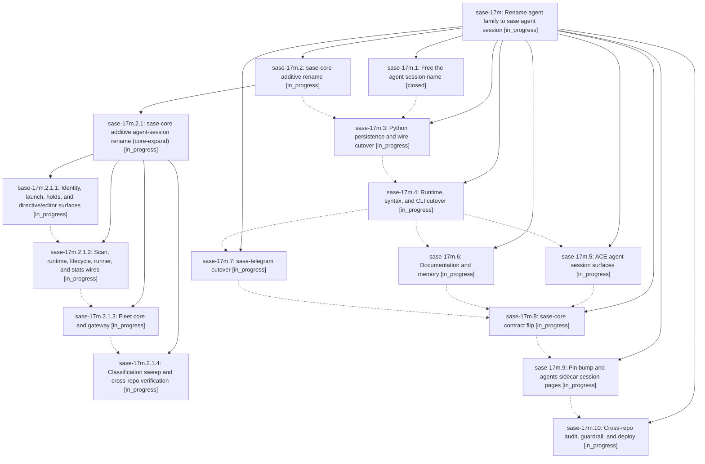

# Bead: sase-17m — Rename agent family to sase agent session

[Bead Pages](../README.md) / sase-17m

**Status:** ◐ in_progress · **Type:** ▸ plan · **Tier:** epic
**Owner:** `bryanbugyi34@gmail.com` · **Created by:** [bbugyi200.athena.0qh](https://github.com/sase-org/sase--agents/blob/main/families/bbugyi200.athena.0qh.md) · **Assignee:** `sase-17m.land`
**Created:** 2026-09-23 22:46:33 EDT
**Plan:** [202609/agent\_session\_rename.md](https://github.com/sase-org/sase--plans/blob/main/202609/agent_session_rename.md)

## Description

The concept formerly called an agent family is named a sase agent session (agent session) on every current surface in sase, sase-core, sase-telegram, and chezmoi: code, wire contracts, persisted output, CLI, prompt syntax, ACE, skills, docs, and memory. Pre-rename data still loads, retired user syntax keeps working behind a sunset flag, and unrelated meanings of "family" are unchanged.

## Phases

| Bead | Title | Status | Size | Created | Agents | Commits |
|---|---|---|---|---|---:|---:|
| [sase-17m.1](sase-17m.1.md) | Free the agent session name | ✓ closed | small | 2026-09-23 | 1 | 1 |
| [sase-17m.10](sase-17m.10.md) | Cross-repo audit, guardrail, and deploy | ◐ in_progress | medium | 2026-09-23 | 1 | 0 |
| [sase-17m.2](sase-17m.2.md) | sase-core additive rename | ◐ in_progress | large | 2026-09-23 | 1 | 0 |
| [sase-17m.3](sase-17m.3.md) | Python persistence and wire cutover | ◐ in_progress | large | 2026-09-23 | 1 | 0 |
| [sase-17m.4](sase-17m.4.md) | Runtime, syntax, and CLI cutover | ◐ in_progress | large | 2026-09-23 | 1 | 0 |
| [sase-17m.5](sase-17m.5.md) | ACE agent session surfaces | ◐ in_progress | large | 2026-09-23 | 1 | 0 |
| [sase-17m.6](sase-17m.6.md) | Documentation and memory | ◐ in_progress | medium | 2026-09-23 | 1 | 0 |
| [sase-17m.7](sase-17m.7.md) | sase-telegram cutover | ◐ in_progress | small | 2026-09-23 | 1 | 0 |
| [sase-17m.8](sase-17m.8.md) | sase-core contract flip | ◐ in_progress | medium | 2026-09-23 | 1 | 0 |
| [sase-17m.9](sase-17m.9.md) | Pin bump and agents sidecar session pages | ◐ in_progress | medium | 2026-09-23 | 1 | 0 |

## Lineage

## Agents

| Agent | Bead | Commits |
|---|---|---:|
| [bbugyi200.athena.sase-17m.1](https://github.com/sase-org/sase--agents/blob/main/agents/bbugyi200.athena.sase-17m.1/README.md) | [sase-17m.1](sase-17m.1.md) | 1 |
| [bbugyi200.athena.sase-17m.10](https://github.com/sase-org/sase--agents/blob/main/agents/bbugyi200.athena.sase-17m.10/README.md) | [sase-17m.10](sase-17m.10.md) | 0 |
| [bbugyi200.athena.sase-17m.2](https://github.com/sase-org/sase--agents/blob/main/families/bbugyi200.athena.sase-17m.2.md) | [sase-17m.2](sase-17m.2.md) | 0 |
| [bbugyi200.athena.sase-17m.2.1.1](https://github.com/sase-org/sase--agents/blob/main/agents/bbugyi200.athena.sase-17m.2.1.1/README.md) | [sase-17m.2.1.1](sase-17m.2.1.1.md) | 1 |
| [bbugyi200.athena.sase-17m.2.1.2](https://github.com/sase-org/sase--agents/blob/main/agents/bbugyi200.athena.sase-17m.2.1.2/README.md) | [sase-17m.2.1.2](sase-17m.2.1.2.md) | 0 |
| [bbugyi200.athena.sase-17m.2.1.3](https://github.com/sase-org/sase--agents/blob/main/agents/bbugyi200.athena.sase-17m.2.1.3/README.md) | [sase-17m.2.1.3](sase-17m.2.1.3.md) | 0 |
| [bbugyi200.athena.sase-17m.2.1.4](https://github.com/sase-org/sase--agents/blob/main/agents/bbugyi200.athena.sase-17m.2.1.4/README.md) | [sase-17m.2.1.4](sase-17m.2.1.4.md) | 0 |
| [bbugyi200.athena.sase-17m.2.1.land](https://github.com/sase-org/sase--agents/blob/main/agents/bbugyi200.athena.sase-17m.2.1.land/README.md) | [sase-17m.2.1](sase-17m.2.1.md) | 0 |
| [bbugyi200.athena.sase-17m.3](https://github.com/sase-org/sase--agents/blob/main/agents/bbugyi200.athena.sase-17m.3/README.md) | [sase-17m.3](sase-17m.3.md) | 0 |
| [bbugyi200.athena.sase-17m.4](https://github.com/sase-org/sase--agents/blob/main/agents/bbugyi200.athena.sase-17m.4/README.md) | [sase-17m.4](sase-17m.4.md) | 0 |
| [bbugyi200.athena.sase-17m.5](https://github.com/sase-org/sase--agents/blob/main/agents/bbugyi200.athena.sase-17m.5/README.md) | [sase-17m.5](sase-17m.5.md) | 0 |
| [bbugyi200.athena.sase-17m.6](https://github.com/sase-org/sase--agents/blob/main/agents/bbugyi200.athena.sase-17m.6/README.md) | [sase-17m.6](sase-17m.6.md) | 0 |
| [bbugyi200.athena.sase-17m.7](https://github.com/sase-org/sase--agents/blob/main/agents/bbugyi200.athena.sase-17m.7/README.md) | [sase-17m.7](sase-17m.7.md) | 0 |
| [bbugyi200.athena.sase-17m.8](https://github.com/sase-org/sase--agents/blob/main/agents/bbugyi200.athena.sase-17m.8/README.md) | [sase-17m.8](sase-17m.8.md) | 0 |
| [bbugyi200.athena.sase-17m.9](https://github.com/sase-org/sase--agents/blob/main/agents/bbugyi200.athena.sase-17m.9/README.md) | [sase-17m.9](sase-17m.9.md) | 0 |
| [bbugyi200.athena.sase-17m.land](https://github.com/sase-org/sase--agents/blob/main/agents/bbugyi200.athena.sase-17m.land/README.md) | [sase-17m](README.md) | 0 |

## Commits

| Repo | Commit | Subject | Bead | Committed |
|---|---|---|---|---|
| sase | [`e662494`](https://github.com/sase-org/sase/commit/e662494ba5af6af123cf88e026555a87f4476b40) | refactor(free-name): rename transcript resolvers, tmux helpers, and agent-run prose | [sase-17m.1](sase-17m.1.md) | 2026-09-23 23:02:35 EDT |
| sase | [`a764a76`](https://github.com/sase-org/sase/commit/a764a76d41fbcacfe08ecbf93a351d3c53d732ad) | feat(ace): tolerate new agent-session spelling in directive contract and completion | [sase-17m.2.1.1](sase-17m.2.1.1.md) | 2026-09-24 00:05:04 EDT |
