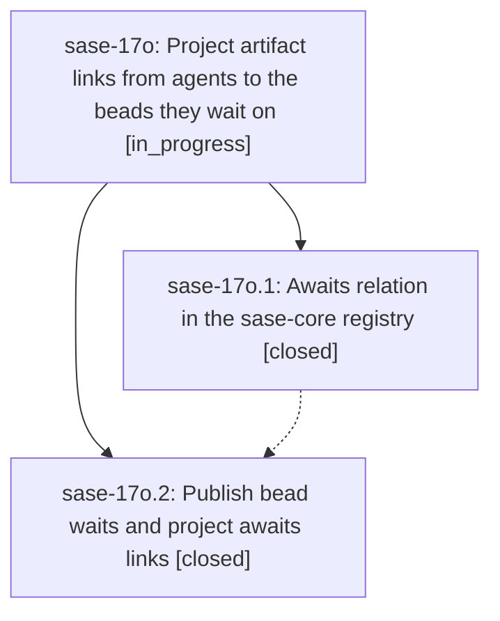

# Bead: sase-17o — Project artifact links from agents to the beads they wait on

[Bead Pages](../README.md) / sase-17o

**Status:** ◐ in_progress · **Type:** ▸ plan · **Tier:** epic
**Owner:** `bryanbugyi34@gmail.com` · **Created by:** [bbugyi200.athena.0qk](https://github.com/sase-org/sase--agents/blob/main/families/bbugyi200.athena.0qk.md) · **Assignee:** `sase-17o.land`
**Created:** 2026-09-24 08:23:07 EDT
**Plan:** [202609/agent\_wait\_bead\_links.md](https://github.com/sase-org/sase--plans/blob/main/202609/agent_wait_bead_links.md)

## Description

An agent launched with `%wait(bead=<id>)` gets a durable, visible artifact link to that bead, just as `%id(..., bead=<id>)` already yields `agent:<name> implements bead:<id>`.

## Phases

| Bead | Title | Status | Size | Created | Agents | Commits |
|---|---|---|---|---|---:|---:|
| [sase-17o.1](sase-17o.1.md) | Awaits relation in the sase-core registry | ✓ closed | small | 2026-09-24 | 1 | 1 |
| [sase-17o.2](sase-17o.2.md) | Publish bead waits and project awaits links | ✓ closed | medium | 2026-09-24 | 1 | 1 |

## Lineage

## Agents

| Agent | Bead | Commits |
|---|---|---:|
| [bbugyi200.athena.sase-17o.1](https://github.com/sase-org/sase--agents/blob/main/agents/bbugyi200.athena.sase-17o.1/README.md) | [sase-17o.1](sase-17o.1.md) | 1 |
| [bbugyi200.athena.sase-17o.2](https://github.com/sase-org/sase--agents/blob/main/agents/bbugyi200.athena.sase-17o.2/README.md) | [sase-17o.2](sase-17o.2.md) | 1 |
| [bbugyi200.athena.sase-17o.land](https://github.com/sase-org/sase--agents/blob/main/agents/bbugyi200.athena.sase-17o.land/README.md) | [sase-17o](README.md) | 0 |

## Commits

| Repo | Commit | Subject | Bead | Committed |
|---|---|---|---|---|
| sase-core | [`sase-core@eef7ca4`](https://github.com/sase-org/sase-core/commit/eef7ca415c763e8ba7c7b3040b50cee5d08c7539) | feat(artifact-links): add projection-only awaits/awaited-by relation | [sase-17o.1](sase-17o.1.md) | 2026-09-24 08:33:38 EDT |
| sase | [`8d97ef7`](https://github.com/sase-org/sase/commit/8d97ef7661de6b7aa42cf979d166606c7ee1d815) | feat(wait-links): publish wait\_for\_beads and project agent awaits bead links (sase-17o.2) | [sase-17o.2](sase-17o.2.md) | 2026-09-24 09:16:17 EDT |
