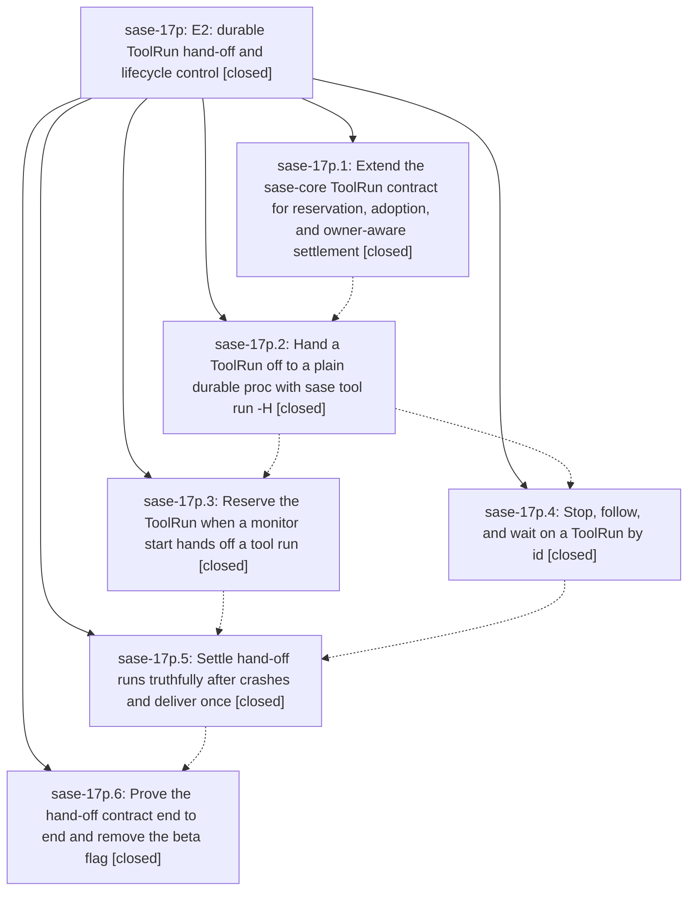

# Bead: sase-17p — E2: durable ToolRun hand-off and lifecycle control

[Bead Pages](../README.md) / sase-17p

**Status:** ✓ closed · **Resolution:** done · **Type:** ▸ plan · **Tier:** epic
**Owner:** `bryanbugyi34@gmail.com` · **Created by:** [bbugyi200.athena.0qj](https://github.com/sase-org/sase--agents/blob/main/families/bbugyi200.athena.0qj.md) · **Assignee:** `sase-17p.land`
**Created:** 2026-09-24 08:40:19 EDT · **Closed:** 2026-09-24 16:18:47 EDT
**Plan:** [202609/tool\_e2\_durable\_handoff.md](https://github.com/sase-org/sase--plans/blob/main/202609/tool_e2_durable_handoff.md)

## Description

A handed-off ToolRun has a durable identity before its caller lets go, stays discoverable, followable, waitable, and stoppable through that identity, and always settles to either an authoritative outcome or an explicit, typed uncertainty — built on the existing monitor and proc executors, with no new supervisor.

## Notes

[2026-09-24T15:39:48Z · sase-17m.3.1.land] DISCOVERED ISSUE (routed by the sase-17m.3.1 land agent from sase-17m.3.1.7's PROPOSED FOLLOW-UP; corroborates sase-17p.1 follow-up #1): at master 77e0cfb6c, sase-core-revision.txt still pins eef7ca415c76, but b6b9f4f59 (sase-17p.1) added tool_run_claim and tool_run_request_stop to tools/validate_sase_core_rs REQUIRED_BINDINGS and the Justfile epic-symbols. A binding built from the pin lacks both, so the validator refuses a pinned build (sase-17m.3.1.7 hit this in sase tool run check). The sase-core commit now exists on origin/master: 9956773 'feat(tool-run): add reservation, claim, stop requests, and owner-aware settlement'. A local build from the linked checkout at 9956773 exposes both and validate_sase_core_rs passes. Remedy per the 17p plan: ratchet sase-core-revision.txt to 9956773 or later.

[2026-09-24T17:15:12Z · sase-17m.3.1.land] DISCOVERED ISSUE (sase-17m.3.1 land agent, master df8ed5134, 2026-09-24): these gates fail on master with and without the landing diff: (1) tests/completion/test_snapshot.py::test_checked_in_snapshot_has_no_drift and ::test_current_structural_view_matches_checked_in_snapshot: the argparse tree adds 'sase tool stop' and 'sase tool wait' and changes 'sase tool run'/'sase tool show' against tests/completion/snapshots/cli_spec.json (sase-17p.4 df8ed5134; remedy: just sync-completion-spec). (2) tests/main/test_parser_tool.py::test_tool_help_advertises_implemented_verbs: the advertised verb list is now ['_adopt', 'list', ..., 'stop', ...] against the expected ['list','run','runs','show'] (sase-17p.4; the hidden '_adopt' verb also appears). (3) tests/main/test_monitor_handler_start_policy.py::test_start_loads_yaml_policy_before_calling_start_monitor: AttributeError '_Record' object has no attribute 'tool_run_id' (test double predates sase-17p.3 7f450e011). (4) just _lint-test-waits: tests/tool/test_handoff.py:205 fixed-sleep-missing-pragma. (5) just _lint-flags rule 6: feature flag 'tool_handoff' names missing bead 'sase-17v', but the flag bead is sase-17w 'Retire tool_handoff' (looks like a relocated duplicate bead id; compare sase-17y).

[2026-09-24T18:58:16Z · sase-17z.land] DISCOVERED ISSUE: (proposed by sase-17z.2, re-verified by sase-17z land agent at master 71736697d) tests/completion/test_kind_coverage.py::test_every_value_slot_is_kinded_choiced_or_hinted is red: uncaptioned slots tool/stop:tool_stop_run_id, tool/wait:tool_wait_run_id, tool/wait:tool_wait_tail_lines, tool/wait:tool_wait_timeout — added by df8ed5134 (sase-17p.4). Kind the run-id slots (TOOL_RUN kind exists since 79a16ca77) and add value hints for tail_lines/timeout in src/sase/completion/kinds.py.

[2026-09-24T20:18:47Z · sase-17p.land] Landed by the sase-17p land agent at master 682089c84 (2026-09-24).

VERIFIED (step 1): All six phases are closed, and their commits are on master: b6b9f4f59 (.1, core contract + adapters; sase-core 9956773), c0591adf2 (.2, sase tool run -H + _adopt worker + handoff module), 7f450e011 (.3, monitor-start reservation), df8ed5134 (.4, stop / show -F / wait), 71736697d (.5, owner-fact settlement + exactly-once delivery), c91690efc (.6, smoke fault matrix, docs, memory, skill source, tool_handoff flag removed, flag bead sase-17w closed). I read the source against every binding contract. sase-core-revision.txt pins 6d0d0e6, which descends from 9956773, and the venv binding exposes tool_run_claim and tool_run_request_stop. tests/tool, tests/core/test_tool_run_store.py, tests/monitor, the parser tests, and tests/test_sase_tool_runs_smoke.py pass.

LANDING FIXES (epic-caused, in this landing diff):
(a) Kind coverage (epic note #3): tool_stop_run_id and tool_wait_run_id are now TOOL_RUN kinds, tool_wait_tail_lines is an int hint, and tool_wait_timeout is a duration hint. cli_spec.json is regenerated.
(b) test_tool_help_advertises_implemented_verbs now expects [_adopt, list, run, runs, show, stop, wait], keeps _adopt out of the usage line, and a new hidden-but-reachable _adopt test is added.
(c) The monitor start-policy test double gets tool_run_id=None.
(d) Three test_monitor_tool_wrap integration tests still asserted the flag-off E1.5 proc argv. Phase .6 missed them when it removed the flag. They now assert the reserved _adopt worker argv and the single reserved run.
(e) Attribution regression: without the flag, a monitor-owned reservation recorded the starter shell's SASE_AGENT_NAME. That name goes stale when the start promotes the starter to a family ('acme' becomes 'acme--0'). E1.5 had attributed to the durable promoted name via SASE_TOOL_RUN_AGENT, which matches monitor_starter_agent. reserve_handoff_run now takes agent=, maybe_reserve_monitor_tool_run takes starter_agent=, and start_monitor passes lane_start.starter_agent, falling back to SASE_AGENT_NAME. There is a new unit test for both paths.
Epic notes #1 (pin) and #2 items 1, 4, and 5 (snapshot drift, test_handoff sleep pragma, flag lint) were already fixed on master.

INTEGRATION (step 2): I reviewed the 40 commits since b6b9f4f59. 79a16ca77 (TOOL_RUN completion kind) is now wired to stop and wait. sase-17x Command Line procs use origin=ace, so -H inside them gets the 'drop -H' refusal. sase-17m renames do not touch monitor_tool_run_id. sase-17x.6's rotation-aware ProcLogCursor postdates show -F. tool/monitor/proc show -F all share the same naive offset follower, so I routed the fix as sase-18b instead of forking one path here.

VERIFICATION: sase tool run check (run 2c7ffe1e) stops at lint (mypy) with 15 errors in 4 files this epic never touched. I ran the remaining gates individually. Flags, pyscripts, changelog, patch/stitch terminology, validate, and committed plans pass. test-waits, symvision, and toobig are red only on non-epic files. just test-scoped: 6698 passed and 3 failed, all non-epic: a command_line visual-fixture host path, the timezone guard (block_render.py plus catalog_plans.py), and the config schema's ace.keymaps.command_line. Nothing in the epic's scope fails.

FOLLOW-UPS:
- sase-17p.1 #1 (ratchet the pin): declined, already done (pin 6d0d0e6 contains 9956773).
- sase-17p.1 #2 and sase-17p.5 #2 (close sase-145): done. I verified the acceptance tests (spawn, stage-ingest, log-write, truncation diagnostics persisted and rendered in show -j and DIAG) and closed sase-145.
- sase-17p.5 #1: informational rename record; no action.
- sase-17p.5 #3 (TUI action for the tool-run settlement notification): new sase-189 (feature, medium).
- sase-17p.5 #4 (pre-existing gates): flag lint and the test_handoff sleep are resolved, and the epic-caused completion/parser tests are fixed above. The remaining red gates went to their causal active epics as DISCOVERED ISSUE notes: sase-17x (Command Line mypy, test-waits, toobig screen.py, symvision, three scoped tests) and sase-17d.10.1 (agent_detail mixin mypy; legacy-UI unused-public symbols including status_text). decks/panel.py toobig was already noted on sase-17d. The catalog_plans timezone guard is new ci task sase-188, since its epic sase-17z is closed. The bead-candidates store leak corroborates sase-14o (+1).
- sase-17p.6 #2 (decisions strand for fail-closed -H): new sase-18a (memory, small).
- sase-17p.6 #3 (deploy the regenerated sase_monitor skill): done. sase skill init --force from HEAD 682089c84 (an ancestor of origin/master; no xprompt changes since) wrote the seven provider copies, chezmoi commit 793e6cf4 is pushed and applied, and --diff is now empty.
- Also found during landing: tools/AGENTS.md 'ToolRun smokes' omits the new hand-off case group and still says phase-pending, so I corroborated sase-148 (+1). The '==SUPPRESS==' rows for monitor _supervise and tool _adopt in group --help are new bug sase-18c (small).

Epic-symbols: none remain.

## Phases

| Bead | Title | Status | Size | Created | Agents | Commits |
|---|---|---|---|---|---:|---:|
| [sase-17p.1](sase-17p.1.md) | Extend the sase-core ToolRun contract for reservation, adoption, and owner-aware settlement | ✓ closed | large | 2026-09-24 | 1 | 2 |
| [sase-17p.2](sase-17p.2.md) | Hand a ToolRun off to a plain durable proc with sase tool run -H | ✓ closed | large | 2026-09-24 | 1 | 1 |
| [sase-17p.3](sase-17p.3.md) | Reserve the ToolRun when a monitor start hands off a tool run | ✓ closed | medium | 2026-09-24 | 1 | 1 |
| [sase-17p.4](sase-17p.4.md) | Stop, follow, and wait on a ToolRun by id | ✓ closed | medium | 2026-09-24 | 1 | 1 |
| [sase-17p.5](sase-17p.5.md) | Settle hand-off runs truthfully after crashes and deliver once | ✓ closed | large | 2026-09-24 | 1 | 1 |
| [sase-17p.6](sase-17p.6.md) | Prove the hand-off contract end to end and remove the beta flag | ✓ closed | medium | 2026-09-24 | 1 | 1 |

## Lineage

## Agents

| Agent | Bead | Commits |
|---|---|---:|
| [bbugyi200.athena.sase-17p.1](https://github.com/sase-org/sase--agents/blob/main/families/bbugyi200.athena.sase-17p.1.md) | [sase-17p.1](sase-17p.1.md) | 2 |
| [bbugyi200.athena.sase-17p.2](https://github.com/sase-org/sase--agents/blob/main/families/bbugyi200.athena.sase-17p.2.md) | [sase-17p.2](sase-17p.2.md) | 1 |
| [bbugyi200.athena.sase-17p.3](https://github.com/sase-org/sase--agents/blob/main/agents/bbugyi200.athena.sase-17p.3/README.md) | [sase-17p.3](sase-17p.3.md) | 1 |
| [bbugyi200.athena.sase-17p.4](https://github.com/sase-org/sase--agents/blob/main/agents/bbugyi200.athena.sase-17p.4/README.md) | [sase-17p.4](sase-17p.4.md) | 1 |
| [bbugyi200.athena.sase-17p.5](https://github.com/sase-org/sase--agents/blob/main/families/bbugyi200.athena.sase-17p.5.md) | [sase-17p.5](sase-17p.5.md) | 1 |
| [bbugyi200.athena.sase-17p.6](https://github.com/sase-org/sase--agents/blob/main/agents/bbugyi200.athena.sase-17p.6/README.md) | [sase-17p.6](sase-17p.6.md) | 1 |
| [bbugyi200.athena.sase-17p.land](https://github.com/sase-org/sase--agents/blob/main/agents/bbugyi200.athena.sase-17p.land/README.md) | [sase-17p](README.md) | 1 |

## Commits

| Repo | Commit | Subject | Bead | Committed |
|---|---|---|---|---|
| sase | [`b6b9f4f`](https://github.com/sase-org/sase/commit/b6b9f4f59b900f74edbcd0bbea2f704c2659a128) | feat(tool): add hand-off adapters, contract probes, and finish diagnostics | [sase-17p.1](sase-17p.1.md) | 2026-09-24 10:44:13 EDT |
| sase-core | [`sase-core@9956773`](https://github.com/sase-org/sase-core/commit/9956773f1fee51305700b0a1e5004873dbc36e5c) | feat(tool-run): add reservation, claim, stop requests, and owner-aware settlement | [sase-17p.1](sase-17p.1.md) | 2026-09-24 10:47:14 EDT |
| sase | [`c0591ad`](https://github.com/sase-org/sase/commit/c0591adf203646bbe36a723a5592b0d4275c6863) | feat(tool): standalone hand-off of ToolRun via sase tool run -H | [sase-17p.2](sase-17p.2.md) | 2026-09-24 11:40:31 EDT |
| sase | [`7f450e0`](https://github.com/sase-org/sase/commit/7f450e0112d43136cf19afde6053979747c43439) | feat(monitor): reserve ToolRun hand-off on monitor start (sase-17p.3) | [sase-17p.3](sase-17p.3.md) | 2026-09-24 12:02:48 EDT |
| sase | [`df8ed51`](https://github.com/sase-org/sase/commit/df8ed5134112a26735b501c5126593a1d40dd8d7) | feat(tool): stop, follow, and wait on a ToolRun by id (sase-17p.4) | [sase-17p.4](sase-17p.4.md) | 2026-09-24 12:20:14 EDT |
| sase | [`7173669`](https://github.com/sase-org/sase/commit/71736697dcb97b14cceb96cf687dfa24d6454d17) | feat(tool): settle hand-off ToolRuns from owner facts and deliver once (sase-17p.5) | [sase-17p.5](sase-17p.5.md) | 2026-09-24 14:00:16 EDT |
| sase | [`c91690e`](https://github.com/sase-org/sase/commit/c91690efcbae1179773f70a2823e77fabac4b203) | feat(tool): prove hand-off contract end to end and remove tool\_handoff flag (sase-17p.6) | [sase-17p.6](sase-17p.6.md) | 2026-09-24 15:29:12 EDT |
| sase | [`cae16be`](https://github.com/sase-org/sase/commit/cae16be3ca730c7f3201357b00168477fa167ed4) | fix(tool): land sase-17p E2 hand-off: completion kinds, stale tests, starter attribution | [sase-17p](README.md) | 2026-09-24 16:20:56 EDT |

<!-- sase:referenced-by:start -->

## Referenced By

| Relation | Artifact | Why | Uses |
| --- | --- | --- | ---: |
| read-by | [agent:research.2i.cdx][1] | Assess the nearly complete E2 epic as evidence for whether roadmap epics E3 and E4 remain correct | 1 |
| read-by | [agent:research.2i.cld][2] | Assess E2 progress to evaluate readiness of E3/E4 epics | 1 |
| read-by | [agent:research.2i.final][3] | Lead E3/E4 research: verify E2 completion state and landing notes | 1 |
| read-by | [agent:research.2i.gem][4] | Understand E2 scope and status for E3/E4 research | 1 |
| read-by | [agent:research.2i.mus][5] | Research E3/E4 epics: need E2 completion status and landing criteria context | 1 |
| read-by | [agent:sase-17m.3.1.land][6] | Land sase-17m.3.1: check whether pre-existing tool-verb/completion/monitor-start test failures are already noted before routing them | 1 |
| read-by | [agent:sase-17p.6][7] | parent epic scope | 1 |

[1]: https://github.com/sase-org/sase--agents/blob/main/agents/bbugyi200.athena.research.2i.cdx/README.md
[2]: https://github.com/sase-org/sase--agents/blob/main/agents/bbugyi200.athena.research.2i.cld/README.md
[3]: https://github.com/sase-org/sase--agents/blob/main/agents/bbugyi200.athena.research.2i.final/README.md
[4]: https://github.com/sase-org/sase--agents/blob/main/agents/bbugyi200.athena.research.2i.gem/README.md
[5]: https://github.com/sase-org/sase--agents/blob/main/agents/bbugyi200.athena.research.2i.mus/README.md
[6]: https://github.com/sase-org/sase--agents/blob/main/agents/bbugyi200.athena.sase-17m.3.1.land/README.md
[7]: https://github.com/sase-org/sase--agents/blob/main/agents/bbugyi200.athena.sase-17p.6/README.md

<!-- sase:referenced-by:end -->
