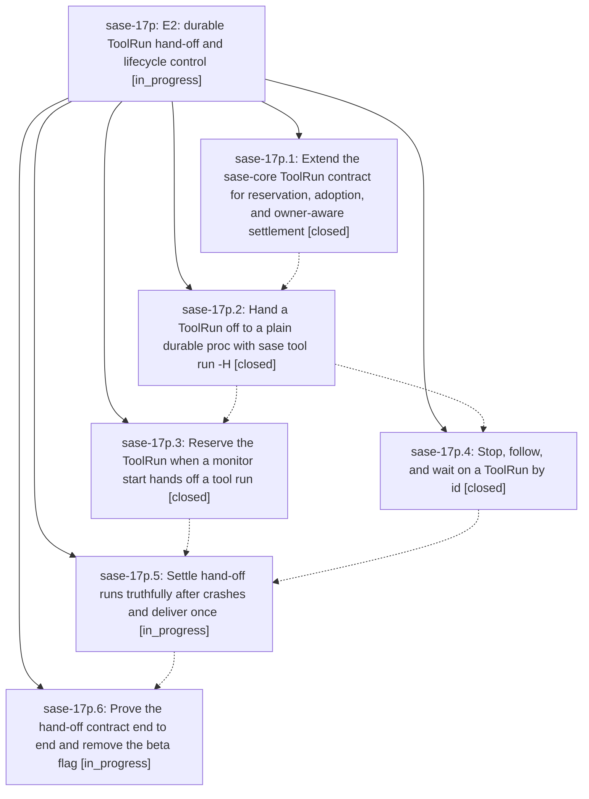

# Bead: sase-17p — E2: durable ToolRun hand-off and lifecycle control

[Bead Pages](../README.md) / sase-17p

**Status:** ◐ in_progress · **Type:** ▸ plan · **Tier:** epic
**Owner:** `bryanbugyi34@gmail.com` · **Created by:** [bbugyi200.athena.0qj](https://github.com/sase-org/sase--agents/blob/main/families/bbugyi200.athena.0qj.md) · **Assignee:** `sase-17p.land`
**Created:** 2026-09-24 08:40:19 EDT
**Plan:** [202609/tool\_e2\_durable\_handoff.md](https://github.com/sase-org/sase--plans/blob/main/202609/tool_e2_durable_handoff.md)

## Description

A handed-off ToolRun has a durable identity before its caller lets go, stays discoverable, followable, waitable, and stoppable through that identity, and always settles to either an authoritative outcome or an explicit, typed uncertainty — built on the existing monitor and proc executors, with no new supervisor.

## Notes

[2026-09-24T15:39:48Z · sase-17m.3.1.land] DISCOVERED ISSUE (routed by the sase-17m.3.1 land agent from sase-17m.3.1.7's PROPOSED FOLLOW-UP; corroborates sase-17p.1 follow-up #1): at master 77e0cfb6c, sase-core-revision.txt still pins eef7ca415c76, but b6b9f4f59 (sase-17p.1) added tool_run_claim and tool_run_request_stop to tools/validate_sase_core_rs REQUIRED_BINDINGS and the Justfile epic-symbols. A binding built from the pin lacks both, so the validator refuses a pinned build (sase-17m.3.1.7 hit this in sase tool run check). The sase-core commit now exists on origin/master: 9956773 'feat(tool-run): add reservation, claim, stop requests, and owner-aware settlement'. A local build from the linked checkout at 9956773 exposes both and validate_sase_core_rs passes. Remedy per the 17p plan: ratchet sase-core-revision.txt to 9956773 or later.

## Phases

| Bead | Title | Status | Size | Created | Agents | Commits |
|---|---|---|---|---|---:|---:|
| [sase-17p.1](sase-17p.1.md) | Extend the sase-core ToolRun contract for reservation, adoption, and owner-aware settlement | ✓ closed | large | 2026-09-24 | 1 | 2 |
| [sase-17p.2](sase-17p.2.md) | Hand a ToolRun off to a plain durable proc with sase tool run -H | ✓ closed | large | 2026-09-24 | 1 | 1 |
| [sase-17p.3](sase-17p.3.md) | Reserve the ToolRun when a monitor start hands off a tool run | ✓ closed | medium | 2026-09-24 | 1 | 1 |
| [sase-17p.4](sase-17p.4.md) | Stop, follow, and wait on a ToolRun by id | ✓ closed | medium | 2026-09-24 | 1 | 1 |
| [sase-17p.5](sase-17p.5.md) | Settle hand-off runs truthfully after crashes and deliver once | ◐ in_progress | large | 2026-09-24 | 1 | 0 |
| [sase-17p.6](sase-17p.6.md) | Prove the hand-off contract end to end and remove the beta flag | ◐ in_progress | medium | 2026-09-24 | 1 | 0 |

## Lineage

## Agents

| Agent | Bead | Commits |
|---|---|---:|
| [bbugyi200.athena.sase-17p.1](https://github.com/sase-org/sase--agents/blob/main/families/bbugyi200.athena.sase-17p.1.md) | [sase-17p.1](sase-17p.1.md) | 2 |
| [bbugyi200.athena.sase-17p.2](https://github.com/sase-org/sase--agents/blob/main/families/bbugyi200.athena.sase-17p.2.md) | [sase-17p.2](sase-17p.2.md) | 1 |
| [bbugyi200.athena.sase-17p.3](https://github.com/sase-org/sase--agents/blob/main/agents/bbugyi200.athena.sase-17p.3/README.md) | [sase-17p.3](sase-17p.3.md) | 1 |
| [bbugyi200.athena.sase-17p.4](https://github.com/sase-org/sase--agents/blob/main/agents/bbugyi200.athena.sase-17p.4/README.md) | [sase-17p.4](sase-17p.4.md) | 1 |
| [bbugyi200.athena.sase-17p.5](https://github.com/sase-org/sase--agents/blob/main/agents/bbugyi200.athena.sase-17p.5/README.md) | [sase-17p.5](sase-17p.5.md) | 0 |
| [bbugyi200.athena.sase-17p.6](https://github.com/sase-org/sase--agents/blob/main/agents/bbugyi200.athena.sase-17p.6/README.md) | [sase-17p.6](sase-17p.6.md) | 0 |
| [bbugyi200.athena.sase-17p.land](https://github.com/sase-org/sase--agents/blob/main/agents/bbugyi200.athena.sase-17p.land/README.md) | [sase-17p](README.md) | 0 |

## Commits

| Repo | Commit | Subject | Bead | Committed |
|---|---|---|---|---|
| sase | [`b6b9f4f`](https://github.com/sase-org/sase/commit/b6b9f4f59b900f74edbcd0bbea2f704c2659a128) | feat(tool): add hand-off adapters, contract probes, and finish diagnostics | [sase-17p.1](sase-17p.1.md) | 2026-09-24 10:44:13 EDT |
| sase-core | [`sase-core@9956773`](https://github.com/sase-org/sase-core/commit/9956773f1fee51305700b0a1e5004873dbc36e5c) | feat(tool-run): add reservation, claim, stop requests, and owner-aware settlement | [sase-17p.1](sase-17p.1.md) | 2026-09-24 10:47:14 EDT |
| sase | [`c0591ad`](https://github.com/sase-org/sase/commit/c0591adf203646bbe36a723a5592b0d4275c6863) | feat(tool): standalone hand-off of ToolRun via sase tool run -H | [sase-17p.2](sase-17p.2.md) | 2026-09-24 11:40:31 EDT |
| sase | [`7f450e0`](https://github.com/sase-org/sase/commit/7f450e0112d43136cf19afde6053979747c43439) | feat(monitor): reserve ToolRun hand-off on monitor start (sase-17p.3) | [sase-17p.3](sase-17p.3.md) | 2026-09-24 12:02:48 EDT |
| sase | [`df8ed51`](https://github.com/sase-org/sase/commit/df8ed5134112a26735b501c5126593a1d40dd8d7) | feat(tool): stop, follow, and wait on a ToolRun by id (sase-17p.4) | [sase-17p.4](sase-17p.4.md) | 2026-09-24 12:20:14 EDT |
