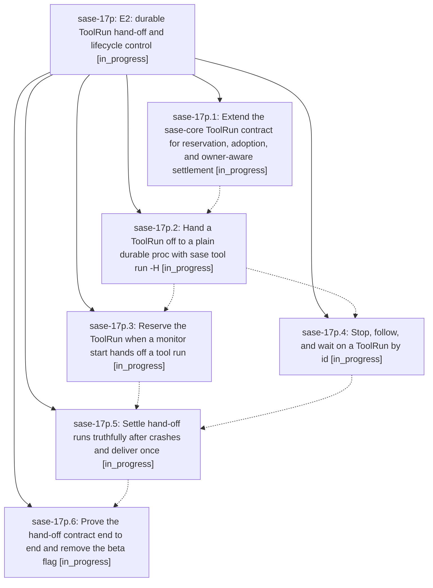

# Bead: sase-17p — E2: durable ToolRun hand-off and lifecycle control

[Bead Pages](../README.md) / sase-17p

**Status:** ◐ in_progress · **Type:** ▸ plan · **Tier:** epic
**Owner:** `bryanbugyi34@gmail.com` · **Created by:** [bbugyi200.athena.0qj](https://github.com/sase-org/sase--agents/blob/main/families/bbugyi200.athena.0qj.md) · **Assignee:** `sase-17p.land`
**Created:** 2026-09-24 08:40:19 EDT
**Plan:** [202609/tool\_e2\_durable\_handoff.md](https://github.com/sase-org/sase--plans/blob/main/202609/tool_e2_durable_handoff.md)

## Description

A handed-off ToolRun has a durable identity before its caller lets go, stays discoverable, followable, waitable, and stoppable through that identity, and always settles to either an authoritative outcome or an explicit, typed uncertainty — built on the existing monitor and proc executors, with no new supervisor.

## Phases

| Bead | Title | Status | Size | Created | Agents | Commits |
|---|---|---|---|---|---:|---:|
| [sase-17p.1](sase-17p.1.md) | Extend the sase-core ToolRun contract for reservation, adoption, and owner-aware settlement | ◐ in_progress | large | 2026-09-24 | 1 | 1 |
| [sase-17p.2](sase-17p.2.md) | Hand a ToolRun off to a plain durable proc with sase tool run -H | ◐ in_progress | large | 2026-09-24 | 1 | 0 |
| [sase-17p.3](sase-17p.3.md) | Reserve the ToolRun when a monitor start hands off a tool run | ◐ in_progress | medium | 2026-09-24 | 1 | 0 |
| [sase-17p.4](sase-17p.4.md) | Stop, follow, and wait on a ToolRun by id | ◐ in_progress | medium | 2026-09-24 | 1 | 0 |
| [sase-17p.5](sase-17p.5.md) | Settle hand-off runs truthfully after crashes and deliver once | ◐ in_progress | large | 2026-09-24 | 1 | 0 |
| [sase-17p.6](sase-17p.6.md) | Prove the hand-off contract end to end and remove the beta flag | ◐ in_progress | medium | 2026-09-24 | 1 | 0 |

## Lineage

## Agents

| Agent | Bead | Commits |
|---|---|---:|
| [bbugyi200.athena.sase-17p.1](https://github.com/sase-org/sase--agents/blob/main/families/bbugyi200.athena.sase-17p.1.md) | [sase-17p.1](sase-17p.1.md) | 1 |
| [bbugyi200.athena.sase-17p.2](https://github.com/sase-org/sase--agents/blob/main/agents/bbugyi200.athena.sase-17p.2/README.md) | [sase-17p.2](sase-17p.2.md) | 0 |
| [bbugyi200.athena.sase-17p.3](https://github.com/sase-org/sase--agents/blob/main/agents/bbugyi200.athena.sase-17p.3/README.md) | [sase-17p.3](sase-17p.3.md) | 0 |
| [bbugyi200.athena.sase-17p.4](https://github.com/sase-org/sase--agents/blob/main/agents/bbugyi200.athena.sase-17p.4/README.md) | [sase-17p.4](sase-17p.4.md) | 0 |
| [bbugyi200.athena.sase-17p.5](https://github.com/sase-org/sase--agents/blob/main/agents/bbugyi200.athena.sase-17p.5/README.md) | [sase-17p.5](sase-17p.5.md) | 0 |
| [bbugyi200.athena.sase-17p.6](https://github.com/sase-org/sase--agents/blob/main/agents/bbugyi200.athena.sase-17p.6/README.md) | [sase-17p.6](sase-17p.6.md) | 0 |
| [bbugyi200.athena.sase-17p.land](https://github.com/sase-org/sase--agents/blob/main/agents/bbugyi200.athena.sase-17p.land/README.md) | [sase-17p](README.md) | 0 |

## Commits

| Repo | Commit | Subject | Bead | Committed |
|---|---|---|---|---|
| sase | [`b6b9f4f`](https://github.com/sase-org/sase/commit/b6b9f4f59b900f74edbcd0bbea2f704c2659a128) | feat(tool): add hand-off adapters, contract probes, and finish diagnostics | [sase-17p.1](sase-17p.1.md) | 2026-09-24 10:44:13 EDT |
