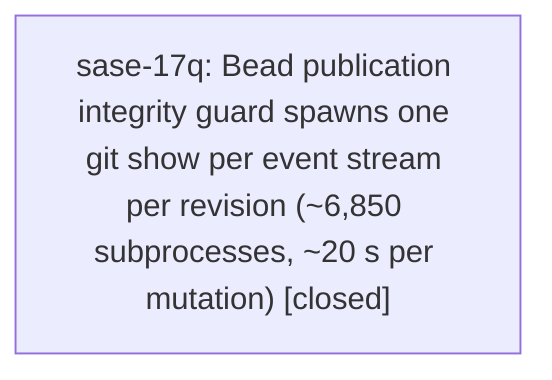

# Bead: sase-17q — Bead publication integrity guard spawns one git show per event stream per revision (~6,850 subprocesses, ~20 s per mutation)

[Bead Pages](../README.md) / sase-17q

**Status:** ✓ closed · **Resolution:** done · **Type:** ◆ task · **Task type:** ⨯ bug
**Owner:** `bryanbugyi34@gmail.com` · **Created by:** [bbugyi200.athena.research.2e.cld](https://github.com/sase-org/sase--agents/blob/main/agents/bbugyi200.athena.research.2e.cld/README.md) · **Assignee:** `sase-17q` · **Size:** medium
**Created:** 2026-09-24 08:48:09 EDT · **Closed:** 2026-09-24 09:40:33 EDT

<!-- sase:links:start -->

## Links

| Relation | Artifact | Why |
| --- | --- | --- |
| related | [bead:sase-li][1] | sase-li's silent event deletion is what the shrink guard defends against; keep that protection while making the guard read only changed/new streams |

_Plus 1 automatic references — see [Referenced By](#referenced-by)._

[1]: https://github.com/sase-org/sase--beads/blob/main/pages/sase-li/README.md

<!-- sase:links:end -->

## Description

Every bead publication (the synchronous push that `ensure_bead_mutation_published` forces after each CLI mutation, and every detached sync worker that has local stream changes to publish) runs `refuse_unpublished_event_stream_shrink` twice (pre- and post-integration, `src/sase/bead/sync_worker.py:134` and `:205`). Each call runs `streams_at_rev` for HEAD and for the ancestor (`src/sase/bead/_stream_integrity.py:182-183`), and `streams_at_rev` spawns one `git show <rev>:<path>` subprocess per event-stream file (`src/sase/bead/_stream_integrity_git.py:114-142`, `show_text` at :135). With the sase store at 1,712 streams that is ~6,850 `git` subprocesses per publishing sync.

Root cause: the full per-rev stream maps are only needed for (a) `new_stream_ids = set(head_streams) - set(ancestor_streams)` — stream *names*, available from the `git ls-tree` output `streams_at_rev` already runs — and (b) `other_streams`, which `_stream_integrity_analysis.py:201-212` consults only when a changed stream is missing ancestor events AND new streams exist, and then only for the new stream IDs. Reading every blob is unnecessary.

Fix sketch: compute stream-name sets from `ls-tree` (2 subprocesses), read only the changed streams plus (lazily, only in the missing-events case) the new streams, and batch blob reads through a single `git cat-file --batch` process. `diagnose_event_stream_history` (`_stream_integrity.py:270-271`) has the same per-commit whole-store walk and should share the fix.

Evidence (2026-09-24, found while researching a bead daemon, see research:202609/bead_daemon_service_proc_evaluation__cld.md):
- cProfile of `sase bead note` in a temp split-layout project holding a copy of the real sase bead store with a LOCAL bare remote (so no network): 26.4 s total, of which `refuse_unpublished_event_stream_shrink` = 19.95 s across 2 calls, 6,854 `show_text` subprocesses, `subprocess.run` 18.0 s. Uninstrumented: `note` 24.2 s / 24.0 s, `update --status` 22.3 s / 22.4 s.
- Production `~/.sase/bead_push_logs`: of 1,984 beads-sidecar sync-worker runs in Sept 2026, p50 2.1 s (runs with nothing to publish exit the guard early), p90 23.8 s, p99 36.7 s, max 55.3 s; 425 runs (21%) exceeded 10 s. Slow runs show ~10.4-10.9 s between `started` and `manifest_repair` (pre-integration guard) and ~13-14 s between `integration` and `completed` (post-integration guard + push).
- Network fetch/push for the same store are ~0.5-0.6 s p50, so the guard is ~90% of mutation publication time.

---

\## Bug

- **Location:** `src/sase/bead/_stream_integrity_git.py:114 streams_at_rev (called from _stream_integrity.py:182-183 refuse_unpublished_event_stream_shrink)`

1. Copy a real bead store (`sase repo path beads`: config.json, metadata.json, issues.jsonl, events/) into `<tmp>/sase/repos/plans/beads` of a temp split-layout project with a local bare `origin` and an upstream-tracking branch (same setup as `_bench_sidecar_mutation_shell` in `tests/perf/bench_bead.py`, plus a remote).
2. From the temp project root run `sase bead note <id> "x"` under cProfile.
3. Observe ~20 s in `refuse_unpublished_event_stream_shrink` -> `streams_at_rev` -> ~6,850 `git show` subprocesses. Alternatively inspect recent `~/.sase/bead_push_logs/sync-*.log` for beads-sidecar runs with ~10 s gaps before `manifest_repair`.

Every agent and human bead mutation (close, note, update, create, +1, dep, ref...) blocks ~20-25 s in the CLI, because the CLI forces a synchronous publish and waits up to 30 s for the sync-worker lock. The worker lock is held for the whole guard, serializing other publishers in the same clone. Cost grows linearly with stream count (1,078 -> 1,712 streams in the last month), so it keeps getting worse.

## Notes

[2026-09-24T13:40:33Z · sase-17q] Guard now reads stream-name sets from ls-tree (2 subprocesses), fetches only changed streams plus lazily-loaded new streams through one git cat-file --batch per rev; diagnose shares the fix and skips whole-store walks unless a shrink candidate needs a relocation check. Verified: tests/test_bead/test_stream_integrity.py 19 passed incl. new bounded-reads/shrink/relocation test; scratch probe with 61 streams shows an append uses 2 ls-tree + 2 cat-file batch and 0 git-show (was ~6,850 git-show for 1,712 streams); shrink still refused with missing-ancestor-events; relocation into a new stream still allowed; diagnose still names the shrunk stream. just check: fmt/ruff/mypy pass; symvision fails identically on the clean tree (pre-existing, corroborated on sase-17l).

## Lineage

## Agents

| Agent | Bead | Commits |
|---|---|---:|
| [bbugyi200.athena.sase-17q](https://github.com/sase-org/sase--agents/blob/main/agents/bbugyi200.athena.sase-17q/README.md) | [sase-17q](README.md) | 1 |

## Commits

| Repo | Commit | Subject | Bead | Committed |
|---|---|---|---|---|
| sase | [`1ba4e80`](https://github.com/sase-org/sase/commit/1ba4e80e380fef5083faad30b428cd6d7974c6b4) | fix(beads): bound publication guard git reads to changed and new streams | [sase-17q](README.md) | 2026-09-24 09:43:12 EDT |

<!-- sase:referenced-by:start -->

## Referenced By

| Relation | Artifact | Why | Uses |
| --- | --- | --- | ---: |
| read-by | [agent:research.2e.final][1] | Check status of related in-flight bead work for consolidated bead-daemon research report | 1 |

[1]: https://github.com/sase-org/sase--agents/blob/main/agents/bbugyi200.athena.research.2e.final/README.md

<!-- sase:referenced-by:end -->
