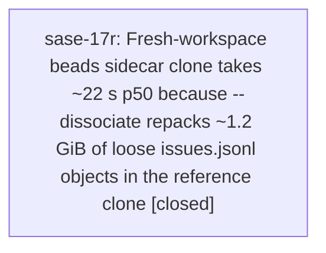

# Bead: sase-17r — Fresh-workspace beads sidecar clone takes ~22 s p50 because --dissociate repacks ~1.2 GiB of loose issues.jsonl objects in the reference clone

[Bead Pages](../README.md) / sase-17r

**Status:** ✓ closed · **Resolution:** done · **Type:** ◆ task · **Task type:** ⨯ bug
**Owner:** `bryanbugyi34@gmail.com` · **Created by:** [bbugyi200.athena.research.2e.final](https://github.com/sase-org/sase--agents/blob/main/agents/bbugyi200.athena.research.2e.final/README.md) · **Assignee:** `sase-17r` · **Size:** medium
**Created:** 2026-09-24 09:11:54 EDT · **Closed:** 2026-09-24 09:49:12 EDT

<!-- sase:links:start -->

## Links

| Relation | Artifact | Why |
| --- | --- | --- |
| related | [bead:sase-k1][1] | sase-k1 (closed, canceled as accepted cost) asked to re-file if sidecar clone latency showed up on the agent launch path; this is that evidence, with a different root cause (dissociate repack of loose objects, not the clone source) |

[1]: https://github.com/sase-org/sase--beads/blob/main/pages/sase-k1/README.md

<!-- sase:links:end -->

## Description

The first bead command in a fresh workspace blocks for ~22 s p50 (max 47 s) while the beads sidecar is cloned, and nearly all of that time is a local `git repack`, not the network.

Root cause: `_remote_clone_args` (`src/sase/sdd/_store_clone_remote.py:229`) clones with `--reference-if-able <primary beads clone> --dissociate`. `--dissociate` repacks every object borrowed from the reference. The reference is up to date but badly unpacked:

- `/home/bryan/projects/github/sase-org/sase/sase/repos/beads` holds 1,891 loose objects totaling 1.15 GiB.
- The project primary store `~/.sase/projects/gh_sase-org__sase/repos/beads` holds 2,334 loose objects totaling 1.52 GiB.
- ~230 of the reference's loose objects are over 200 KB. Each is a ~5.4 MB zlib copy of the 16.7 MB `issues.jsonl` projection, one per bead commit since the last repack. Together they account for essentially all 1.15 GiB.
- Git's auto-gc is count-based (`gc.auto` default 6,700 objects), so it never fires even though the bytes are huge.

Evidence (2026-09-24, athena; found while consolidating bead-daemon research, see research:202609/bead_speedup_daemon_vs_direct_path/bead_speedup_daemon_vs_direct_path.md §1.4):

- `~/.sase/logs/tui_git_ops.jsonl` (+`.1`), 2026-09-23 19:58 → 09-24 09:04: 41 beads-sidecar `sdd.clone.remote` operations, p50 22.2 s, p90 28.4 s, max 47.3 s.
- A fresh `sase bead ready` in workspace sase_32 took 50.1 s, of which 47.3 s was this clone.
- Local-only experiment (no network), `git clone --no-checkout` of the reference into /tmp:
  - `--reference-if-able REF --dissociate file://REF`: 24.1 s
  - the same against a fully packed copy of REF: 2.0 s
  - `--shared REF`: 7 ms, plus 0.38 s checkout

Fix sketch:

1. Keep the primary and reference beads clones packed. Options: a scheduler job that runs `git repack -d` (or `git gc`) when *loose-object bytes* exceed a threshold, or a post-commit/publication hook doing the same. Expected: clone p50 ~22 s → ~2–3 s.
2. Optionally reconsider `--dissociate` against a never-pruned machine mirror.
3. The underlying source of the bloat is regenerating and committing the whole 16.7 MB `issues.jsonl` on every mutation. Taking it off the per-mutation commit path (see the research report, RA4) removes the cause, but that is a larger, separate change.

---

\## Bug

- **Location:** `src/sase/sdd/_store_clone_remote.py:229 _remote_clone_args (--reference-if-able ... --dissociate); unpacked primary/reference beads clones`

1. `git -C /home/bryan/projects/github/sase-org/sase/sase/repos/beads count-objects -vH` shows ~1.15 GiB of loose objects.
2. `find <ref>/.git/objects -type f -path '*/objects/??/*' -size +200k | wc -l` counts ~230. `git rev-parse HEAD:issues.jsonl` locates one of them as a ~5.4 MB loose blob.
3. Time `git clone -q --no-checkout --reference-if-able <ref> --dissociate file://<ref> /tmp/a` (~24 s). Then clone again from `/tmp/a`, which is now fully packed, with the same flags (~2 s).
4. Production telemetry: filter `~/.sase/logs/tui_git_ops.jsonl` for `operation == "sdd.clone.remote"` whose cwd contains `.sase-sdd-clone-staging/beads-`.

Every agent whose first bead command runs in a fresh or re-prepared workspace blocks ~22–47 s: `sase bead read`, `ready`, `create`, and similar. This happened ~3 times per hour on athena (41 clones in 13 h). The loose-object pile grows with every bead commit, so the cost keeps rising. Earlier related report sase-k1 was closed as "accepted cost … re-file if sidecar clone latency actually shows up on the agent launch path in practice". This is that evidence, but the root cause is different: the clone already uses the local primary as its reference, and the dissociate repack is what dominates.

## Notes

[2026-09-24T13:49:12Z · sase-17r] Fixed: _store_maintenance now triggers git gc on loose-object bytes (256 MiB threshold), not just count, so byte-heavy beads clones like the reported 1,891-object/1.15 GiB reference get packed and fresh-workspace --dissociate clones stay ~2s. Verified: 9/9 tests pass in tests/sdd_store/test_store_maintenance.py under the real harness (3 new regression tests fail on pre-change code, pass after); ruff check/format clean; mypy gate passed; bytes trigger confirmed against the real 2,492-object/1.62 GiB hidden beads clone. just check still stops at the pre-existing _lint-symvision backlog (73 unused symbols, none in touched files, fails identically on base tree, already noted on existing beads).

## Lineage

## Agents

| Agent | Bead | Commits |
|---|---|---:|
| [bbugyi200.athena.sase-17r](https://github.com/sase-org/sase--agents/blob/main/agents/bbugyi200.athena.sase-17r/README.md) | [sase-17r](README.md) | 1 |

## Commits

| Repo | Commit | Subject | Bead | Committed |
|---|---|---|---|---|
| sase | [`a054efc`](https://github.com/sase-org/sase/commit/a054efc585e78078675c9e75bc5ee70fabe21056) | fix(sdd): trigger sidecar gc on loose-object bytes | [sase-17r](README.md) | 2026-09-24 09:51:39 EDT |
