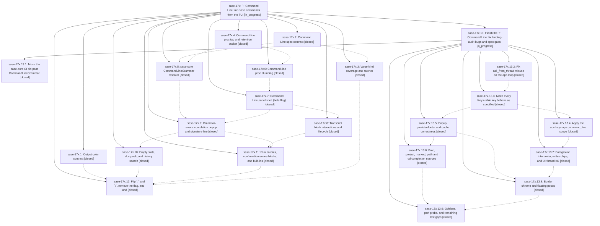

# Bead: sase-17x — \`:\` Command Line: run sase commands from the TUI

[Bead Pages](../README.md) / sase-17x

**Status:** ◐ in_progress · **Type:** ▸ plan · **Tier:** epic
**Owner:** `bryanbugyi34@gmail.com` · **Created by:** [bbugyi200.athena.0qs](https://github.com/sase-org/sase--agents/blob/main/families/bbugyi200.athena.0qs.md) · **Assignee:** `sase-17x.land`
**Created:** 2026-09-24 11:29:17 EDT
**Plan:** [202609/command\_line\_panel.md](https://github.com/sase-org/sase--plans/blob/main/202609/command_line_panel.md)

## Description

`;` opens the Command Palette and `:` opens a new bottom-anchored Command Line panel. In the panel, users type `sase` commands with better completion than any shell offers: selection-aware, fuzzy, documented and grammar-checked. Output streams inline. Every command runs as a durable, tagged proc that keeps running after the panel is hidden, shows up in Admin Center → Procs, and returns to the transcript when the panel reopens.

## Notes

[2026-09-24T17:14:59Z · sase-17m.3.1.land] DISCOVERED ISSUE (sase-17m.3.1 land agent, master df8ed5134, 2026-09-24): tests/fakey/test_cli.py::test_help_is_colored_sorted_and_all_long_options_have_aliases fails on master with and without the landing diff. sase-17x.1 (5a7955161) moved fakey help onto sase.core.term_color.should_colorize (NO_COLOR, then FORCE_COLOR/CLICOLOR_FORCE, then isatty). The test runs 'python -m sase.fakey.cli --help' with capture_output (not a TTY), TERM=xterm, and NO_COLOR removed, and expects '\x1b[1;36musage:', but now gets plain 'usage: fakey ...'. Either the test should set FORCE_COLOR=1, or fakey help should keep its previous TERM-based coloring. Seen in the full lane that just test-scoped escalated to (17 failed / 46440 passed).

[2026-09-24T18:58:38Z · sase-17z.land] DISCOVERED ISSUE: (found by sase-17z land agent at master 71736697d) just _lint-symvision is red with 14 unused public symbols in src/sase/completion/command_line_grammar.py (CommandLineGrammar, CompletionItem, DynamicCandidate, HelpChild, HelpOption, HelpPositional, LineContext, LineDiagnostic, LineSignature, LineSlot, LineToken, RunPolicyOutcome, SignatureSegment, load_command_line_grammar) added by ede63ea9d (CommandLineGrammar resolver adapter). Wire them up or add --epic-symbol 'sase-17x(...)' entries keyed to the open consuming phase.

[2026-09-24T20:14:56Z · sase-17p.land] DISCOVERED ISSUE (sase-17p land agent, master 682089c84, 2026-09-24; reproduced with and without the sase-17p landing diff, which touches no command_line file): Command Line work leaves just check red at several gates. (1) lint (mypy): src/sase/ace/tui/command_line/input.py:158 assigns 'TextAreaTheme | None' to a 'TextAreaTheme' variable; command_line/screen.py:1074/1076/1081/1091 pass 'LineContext | None'/'LineContext' where 'dict[str, Any]' is declared (set_resolve_context, _complete_line, _maybe_fetch_providers) — from d4dc96eb4 (17x.9) / 98c8312f9 (17x.8). (2) lint (test waits): tests/ace/tui/command_line/test_completion_popup.py:181 fixed-sleep-missing-pragma (d4dc96eb4). (3) lint (toobig): src/sase/ace/tui/command_line/screen.py is 1492 lines (limit 1000). (4) lint (symvision): beyond the command_line_grammar.py symbols already noted by sase-17z.land, CommandHelp/CommandLineCompletion there plus CommandLineBlockWidget (command_line/transcript.py), SourceCandidate/in_memory_candidates (sources.py), build_chips/build_signature/first_diagnostic_message/option_summary_text/role_style (signature.py), command_line_from_proc/select_restore_rows (restore.py), command_line_grammar_error/load_command_line_grammar_sync (grammar.py), completion_toast_text (exits.py), longest_common_prefix/render_popup_row (popup.py), resolve_launch_cwd (context.py), build_command_line_bindings (keymaps/bindings.py), command_line_history_file/save_command_line_history/set_command_line_history_file (history/command_line.py), is_command_line_row/open_command_line_on_block (modals/procs_pane_agent_jump.py) are unused-public. (5) scoped tests: tests/ace/tui/test_visual_fixture_host_paths.py::test_visual_fixtures_embed_no_host_home_paths (test_ace_png_snapshots_command_line.py:36 and :143 embed cwd=/home/test/projects/sase; allowed synthetic owners are operator/user/visual); tests/test_timezone_display_guard.py::test_no_system_clock_display_sites flags src/sase/ace/tui/command_line/block_render.py:105 datetime.fromtimestamp(finished_at).strftime('%H:%M'); tests/test_config_schema.py::test_default_config_matches_public_schema fails 'ace.keymaps: Additional properties are not allowed (command_line was unexpected)' — default_config.yml gained ace.keymaps.command_line without a src/sase/config/sase.schema.json entry.

[2026-09-25T00:26:20Z · sase-17x.land] LANDING INTERRUPTED (sase-17x land agent, master 55936f429, 2026-09-24): epic NOT closed; remaining epic-caused work planned as a child epic plan (command_line_landing_fixes) whose land agent resumes this landing.

VERIFIED: all 12 phases closed; 12 epic commits present (5a7955161..c83e3bd91); sase bead epic-symbols sase-17x = none; flag ace_command_line fully removed from src (registry, flag.py, Off branch) -> closed flag bead sase-181 with a note. Plan items present: color contract, spec contract, kind ratchet, retention bucket, resolver + adapter, proc plumbing, panel/session/history/transcript, run policies/built-ins, flip (: -> Command Line, ; -> palette, hop, fallback row, one-time tip, docs/ace.md section).

REMAINING EPIC WORK FOUND (reproduced/confirmed in code) -> child plan phases: (1) core-pin: sase-core-revision.txt 6d0d0e6 predates sase-core 1bdadab CommandLineGrammar (17x.4 #1, 17x.5 #1). (2) worker-hops: 'v' on an unloaded tail crashes the TUI (WorkerFailed: call_from_thread from the app loop in _open_pager_worker); grammar on_ready never refreshes popup (same misuse). (3) key-behavior: up/down history never wired (history_step has no callers); right-arrow mid-line inserts ghost; NORMAL mode swallows vim keys with no block selected; R not limited to declined blocks; palette ':' hop erases the draft; ctrl+f accept (integration with 307da2dac). (4) keymap-config: ace.keymaps.command_line is loaded but never applied (screen/input hardcode keys) + block-nav keys configurable (17x.8 #2); docs/configuration.md custom-mode prefix ';' collision; quickstart/onboarding omit ':'. (5) completion-fixes: candidates past row 8 unreachable, echo guard ineffective, sticky provider footer, flat TTL ignores VOLATILE_KIND_TTL_SECONDS (integration with 482fb46bc), cursor not rechecked, hint text. (6) entity-sources: proc and project in-memory sources always empty; Agents-tab marks ignored; no path/dir or cd completion (17x.11 #1); selected plan ranking. (7) policy-io: foreground runs PATH sase not sase_command_argv; tool stop / plan approve|reject writes=false (integration with cae16be3c); sync disk I/O on UI thread (history per open, tip marker, K kill, Procs jump, tail polling). (8) chrome-layout: title/chip/hints/running not on borders; popup in-flow not floating. (9) goldens-perf: missing completion-popup goldens (17x.9 #2), perf probe/never-awaits/test gaps, live walkthrough.

FOLLOW-UP OUTCOMES: 17x.1 #1 symvision _failure_count -> declined, fixed by 064830632. 17x.3 #1 run full check -> declined as a task; every child phase runs sase tool run check. 17x.5 #2, 17x.7 #1, 17x.8 #1, 17x.10 #1, 17x.12 #1/#2 (pre-existing mypy/symvision/toobig/flag-drift/test-waits/snapshot gates) -> declined, fixed by sase-18f.1/.2/.3 (114fbca89, b18f3d38f, 55936f429) with the rest in sase-18f.4/.9 scope. 17x.10 #2 (sase final prepare blocked by untracked agents-sidecar objects) -> duplicate of sase-17u, +1 recorded after re-verifying the same 3 untracked objects. 17x.12 #3 (Z zoom help tests) -> still failing, but caused by 742c1df38 (legacy agents UI removal), not this epic, and explicitly scoped in sase-18f.4's plan; no new task. Epic notes #1 (fakey help color, fixed 55936f429), #2 (symvision, fixed 114fbca89), #3 (mypy/test-waits/toobig/symvision/timezone/config-schema fixed by sase-18f.1-.3; command-line visual host path + import budget owned by in-flight sase-18f.4, rechecked by child goldens-perf). Drift audit: no conflicts from 742c1df38, the sase-17m.4.x renames, sase-185, !! bang mode, or new isatty color branches.

## Phases

| Bead | Title | Status | Size | Created | Agents | Commits |
|---|---|---|---|---|---:|---:|
| [sase-17x.1](sase-17x.1.md) | Output color contract | ✓ closed | medium | 2026-09-24 | 1 | 1 |
| [sase-17x.10](sase-17x.10.md) | Empty state, doc peek, and history search | ✓ closed | medium | 2026-09-24 | 1 | 1 |
| [sase-17x.11](sase-17x.11.md) | Run policies, confirmation-aware blocks, and built-ins | ✓ closed | medium | 2026-09-24 | 1 | 1 |
| [sase-17x.12](sase-17x.12.md) | Flip \`:\` and \`;\`, remove the flag, and land | ✓ closed | medium | 2026-09-24 | 1 | 1 |
| [sase-17x.2](sase-17x.2.md) | Command Line spec contract | ✓ closed | medium | 2026-09-24 | 1 | 1 |
| [sase-17x.3](sase-17x.3.md) | Value-kind coverage and ratchet | ✓ closed | medium | 2026-09-24 | 1 | 1 |
| [sase-17x.4](sase-17x.4.md) | Command-line proc tag and retention bucket | ✓ closed | small | 2026-09-24 | 1 | 2 |
| [sase-17x.5](sase-17x.5.md) | sase-core CommandLineGrammar resolver | ✓ closed | large | 2026-09-24 | 1 | 2 |
| [sase-17x.6](sase-17x.6.md) | Command-line proc plumbing | ✓ closed | medium | 2026-09-24 | 1 | 1 |
| [sase-17x.7](sase-17x.7.md) | Command Line panel shell (beta flag) | ✓ closed | medium | 2026-09-24 | 1 | 1 |
| [sase-17x.8](sase-17x.8.md) | Transcript block interactions and lifecycle | ✓ closed | medium | 2026-09-24 | 1 | 1 |
| [sase-17x.9](sase-17x.9.md) | Grammar-aware completion popup and signature line | ✓ closed | medium | 2026-09-24 | 1 | 1 |

## Lineage

## Agents

| Agent | Bead | Commits |
|---|---|---:|
| [bbugyi200.athena.sase-17x.1](https://github.com/sase-org/sase--agents/blob/main/agents/bbugyi200.athena.sase-17x.1/README.md) | [sase-17x.1](sase-17x.1.md) | 1 |
| [bbugyi200.athena.sase-17x.10](https://github.com/sase-org/sase--agents/blob/main/families/bbugyi200.athena.sase-17x.10.md) | [sase-17x.10](sase-17x.10.md) | 1 |
| [bbugyi200.athena.sase-17x.11](https://github.com/sase-org/sase--agents/blob/main/agents/bbugyi200.athena.sase-17x.11/README.md) | [sase-17x.11](sase-17x.11.md) | 1 |
| [bbugyi200.athena.sase-17x.12](https://github.com/sase-org/sase--agents/blob/main/agents/bbugyi200.athena.sase-17x.12/README.md) | [sase-17x.12](sase-17x.12.md) | 1 |
| [bbugyi200.athena.sase-17x.13.1](https://github.com/sase-org/sase--agents/blob/main/agents/bbugyi200.athena.sase-17x.13.1/README.md) | [sase-17x.13.1](sase-17x.13.1.md) | 1 |
| [bbugyi200.athena.sase-17x.13.2](https://github.com/sase-org/sase--agents/blob/main/agents/bbugyi200.athena.sase-17x.13.2/README.md) | [sase-17x.13.2](sase-17x.13.2.md) | 1 |
| [bbugyi200.athena.sase-17x.13.3](https://github.com/sase-org/sase--agents/blob/main/families/bbugyi200.athena.sase-17x.13.3.md) | [sase-17x.13.3](sase-17x.13.3.md) | 1 |
| [bbugyi200.athena.sase-17x.13.4](https://github.com/sase-org/sase--agents/blob/main/agents/bbugyi200.athena.sase-17x.13.4/README.md) | [sase-17x.13.4](sase-17x.13.4.md) | 1 |
| [bbugyi200.athena.sase-17x.13.5](https://github.com/sase-org/sase--agents/blob/main/agents/bbugyi200.athena.sase-17x.13.5/README.md) | [sase-17x.13.5](sase-17x.13.5.md) | 1 |
| [bbugyi200.athena.sase-17x.13.6](https://github.com/sase-org/sase--agents/blob/main/families/bbugyi200.athena.sase-17x.13.6.md) | [sase-17x.13.6](sase-17x.13.6.md) | 1 |
| [bbugyi200.athena.sase-17x.13.7](https://github.com/sase-org/sase--agents/blob/main/agents/bbugyi200.athena.sase-17x.13.7/README.md) | [sase-17x.13.7](sase-17x.13.7.md) | 1 |
| [bbugyi200.athena.sase-17x.13.8](https://github.com/sase-org/sase--agents/blob/main/agents/bbugyi200.athena.sase-17x.13.8/README.md) | [sase-17x.13.8](sase-17x.13.8.md) | 1 |
| [bbugyi200.athena.sase-17x.13.9](https://github.com/sase-org/sase--agents/blob/main/families/bbugyi200.athena.sase-17x.13.9.md) | [sase-17x.13.9](sase-17x.13.9.md) | 1 |
| [bbugyi200.athena.sase-17x.13.land](https://github.com/sase-org/sase--agents/blob/main/agents/bbugyi200.athena.sase-17x.13.land/README.md) | [sase-17x.13](sase-17x.13.md) | 0 |
| [bbugyi200.athena.sase-17x.2](https://github.com/sase-org/sase--agents/blob/main/agents/bbugyi200.athena.sase-17x.2/README.md) | [sase-17x.2](sase-17x.2.md) | 1 |
| [bbugyi200.athena.sase-17x.3](https://github.com/sase-org/sase--agents/blob/main/agents/bbugyi200.athena.sase-17x.3/README.md) | [sase-17x.3](sase-17x.3.md) | 1 |
| [bbugyi200.athena.sase-17x.4](https://github.com/sase-org/sase--agents/blob/main/agents/bbugyi200.athena.sase-17x.4/README.md) | [sase-17x.4](sase-17x.4.md) | 2 |
| [bbugyi200.athena.sase-17x.5](https://github.com/sase-org/sase--agents/blob/main/families/bbugyi200.athena.sase-17x.5.md) | [sase-17x.5](sase-17x.5.md) | 2 |
| [bbugyi200.athena.sase-17x.6](https://github.com/sase-org/sase--agents/blob/main/agents/bbugyi200.athena.sase-17x.6/README.md) | [sase-17x.6](sase-17x.6.md) | 1 |
| [bbugyi200.athena.sase-17x.7](https://github.com/sase-org/sase--agents/blob/main/agents/bbugyi200.athena.sase-17x.7/README.md) | [sase-17x.7](sase-17x.7.md) | 1 |
| [bbugyi200.athena.sase-17x.8](https://github.com/sase-org/sase--agents/blob/main/agents/bbugyi200.athena.sase-17x.8/README.md) | [sase-17x.8](sase-17x.8.md) | 1 |
| [bbugyi200.athena.sase-17x.9](https://github.com/sase-org/sase--agents/blob/main/agents/bbugyi200.athena.sase-17x.9/README.md) | [sase-17x.9](sase-17x.9.md) | 1 |
| [bbugyi200.athena.sase-17x.land](https://github.com/sase-org/sase--agents/blob/main/families/bbugyi200.athena.sase-17x.land.md) | [sase-17x](README.md) | 0 |

## Commits

| Repo | Commit | Subject | Bead | Committed |
|---|---|---|---|---|
| sase | [`5a79551`](https://github.com/sase-org/sase/commit/5a7955161e960662c41fa496ab5ef699941e3cb1) | feat(cli): add shared stdout color contract honoring FORCE\_COLOR | [sase-17x.1](sase-17x.1.md) | 2026-09-24 11:48:58 EDT |
| sase | [`db4266e`](https://github.com/sase-org/sase/commit/db4266e1cd1c853bfe3a176a053ef2aa0c80dbde) | feat(completion): Command Line spec contract (sase-17x.2) | [sase-17x.2](sase-17x.2.md) | 2026-09-24 11:51:25 EDT |
| sase | [`f6e17fb`](https://github.com/sase-org/sase/commit/f6e17fb2c9adfbc82c4c1c726867b9026a512450) | feat(sase-17x.4): command-line proc tag and retention bucket in sase | [sase-17x.4](sase-17x.4.md) | 2026-09-24 12:05:27 EDT |
| sase-core | [`sase-core@f405c44`](https://github.com/sase-org/sase-core/commit/f405c440a048595c7d9572e23b5dacfcf887050c) | feat(procs): command-line proc tag retention bucket in Rust store | [sase-17x.4](sase-17x.4.md) | 2026-09-24 12:10:40 EDT |
| sase | [`79a16ca`](https://github.com/sase-org/sase/commit/79a16ca7712fca793714e92d9c884aca86da1fc5) | feat(completion): add GATE, TOOL\_RUN, TASK\_TYPE kinds with entity candidates and kind-coverage ratchet | [sase-17x.3](sase-17x.3.md) | 2026-09-24 12:37:08 EDT |
| sase | [`70afac5`](https://github.com/sase-org/sase/commit/70afac5176b90b4c7cad6590b4199ad295fc14cb) | feat(cmdline): command-line proc plumbing (sase-17x.6) | [sase-17x.6](sase-17x.6.md) | 2026-09-24 12:50:35 EDT |
| sase | [`ede63ea`](https://github.com/sase-org/sase/commit/ede63ea9dcec4672873412d9f5d4d3f65f72ffcf) | feat(command-line): CommandLineGrammar resolver adapter and contract test | [sase-17x.5](sase-17x.5.md) | 2026-09-24 13:50:20 EDT |
| sase-core | [`sase-core@1bdadab`](https://github.com/sase-org/sase-core/commit/1bdadab86ea787212cd975ba681ed0f572870d7f) | feat(command-line): CommandLineGrammar resolver and sase adapter | [sase-17x.5](sase-17x.5.md) | 2026-09-24 13:53:51 EDT |
| sase | [`db99493`](https://github.com/sase-org/sase/commit/db99493448ff762695410f6d06e42164707572d8) | feat(ace): implement Command Line panel shell behind ace\_command\_line beta flag | [sase-17x.7](sase-17x.7.md) | 2026-09-24 14:35:48 EDT |
| sase | [`d4dc96e`](https://github.com/sase-org/sase/commit/d4dc96eb4a163f33c73d2e6a93c3731a227b2829) | feat(ace-tui): add command-line completion popup phase sase-17x.9 | [sase-17x.9](sase-17x.9.md) | 2026-09-24 15:17:34 EDT |
| sase | [`98c8312`](https://github.com/sase-org/sase/commit/98c8312f96f6b8f50303f7d6b6106c31a6afd03b) | feat(ace): command-line transcript blocks with NORMAL-mode navigation | [sase-17x.8](sase-17x.8.md) | 2026-09-24 15:38:28 EDT |
| sase | [`ee9eda4`](https://github.com/sase-org/sase/commit/ee9eda4ab340bf9f6aaac08a773ca39dd912f93f) | feat(ace): command-line run policies, confirmation-aware blocks, and built-ins (sase-17x.11) | [sase-17x.11](sase-17x.11.md) | 2026-09-24 16:22:54 EDT |
| sase | [`c03c717`](https://github.com/sase-org/sase/commit/c03c717daebb74852c9c1f329e7aabd866cc2741) | feat(ace): command-line completion extras for sase-17x.10 | [sase-17x.10](sase-17x.10.md) | 2026-09-24 16:57:28 EDT |
| sase | [`c83e3bd`](https://github.com/sase-org/sase/commit/c83e3bd916be309d8ffc9e4bc0b258131ea1d253) | feat(ace): flip command-line and palette keys to colon and semicolon | [sase-17x.12](sase-17x.12.md) | 2026-09-24 19:06:28 EDT |
| sase | [`d0df63a`](https://github.com/sase-org/sase/commit/d0df63a234329eec8414203bcae58e1671d7618d) | chore(core): ratchet sase-core pin to 83153645fe14 for CommandLineGrammar | [sase-17x.13.1](sase-17x.13.1.md) | 2026-09-24 20:59:41 EDT |
| sase | [`7484c50`](https://github.com/sase-org/sase/commit/7484c50abb1bd9c87897d5b0ae4b164da941f242) | fix(tui): avoid app-loop worker hops | [sase-17x.13.2](sase-17x.13.2.md) | 2026-09-24 21:04:52 EDT |
| sase | [`543d012`](https://github.com/sase-org/sase/commit/543d012209875d59081f8c4d908168c6687ac4e9) | feat(command-line): complete key behavior contract | [sase-17x.13.3](sase-17x.13.3.md) | 2026-09-24 21:54:35 EDT |
| sase | [`bde335d`](https://github.com/sase-org/sase/commit/bde335de55acb2d17ce120213046d2f26fd33e19) | feat(command-line): apply the ace.keymaps.command\_line scope | [sase-17x.13.4](sase-17x.13.4.md) | 2026-09-24 23:41:09 EDT |
| sase | [`61f88cc`](https://github.com/sase-org/sase/commit/61f88ccd695509b23b5547d9c9901641746fb005) | fix(command-line): scroll popup window, scope provider footer, honor cache TTLs | [sase-17x.13.5](sase-17x.13.5.md) | 2026-09-25 00:14:32 EDT |
| sase | [`fad9b5d`](https://github.com/sase-org/sase/commit/fad9b5d03db1b2812dcd10576d1eeefe4aec3de4) | feat(command-line): add dynamic completion sources | [sase-17x.13.6](sase-17x.13.6.md) | 2026-09-25 00:48:31 EDT |
| sase | [`5b305b1`](https://github.com/sase-org/sase/commit/5b305b1b95c4e6d21ddb8fbf8982dafb7f8c13f1) | feat(command-line): foreground interpreter, writes chips, and UI-thread I/O (sase-17x.13.7) | [sase-17x.13.7](sase-17x.13.7.md) | 2026-09-25 01:37:03 EDT |
| sase | [`403586e`](https://github.com/sase-org/sase/commit/403586e27127f4a0afd6479416957b13de1bc3dd) | feat(command-line): border chrome and floating popup (sase-17x.13.8) | [sase-17x.13.8](sase-17x.13.8.md) | 2026-09-25 02:31:58 EDT |
| sase | [`3c6e8f0`](https://github.com/sase-org/sase/commit/3c6e8f04dcdbd0806909d519ef3c661efbfde87a) | feat(command-line): add completion goldens and perf probe | [sase-17x.13.9](sase-17x.13.9.md) | 2026-09-25 04:02:20 EDT |

<!-- sase:referenced-by:start -->

## Referenced By

| Relation | Artifact | Why | Uses |
| --- | --- | --- | ---: |
| read-by | [agent:0qz--code][1] | check 17x phases for hint consumption | 1 |
| read-by | [agent:0rd][2] | Need the epic scope for a possible DISCOVERED ISSUE note about mypy errors from d4dc96eb4 | 2 |
| read-by | [agent:sase-17m.3.1.land][3] | Check whether the FORCE_COLOR stdout color contract (5a7955161) belongs to this epic before routing a fakey help-color test failure | 2 |
| read-by | [agent:sase-17p.land][4] | Route sase-17p land gate failures: check existing DISCOVERED ISSUE notes on the Command Line epic | 2 |
| read-by | [agent:sase-17x.1][5] | Need parent epic context for color-contract phase | 1 |
| read-by | [agent:sase-17x.13.8][6] | Need the UX specification 'Geometry and chrome' for the chrome-layout phase | 1 |
| read-by | [agent:sase-17x.2][7] | Need parent epic status for phase work | 1 |
| read-by | [agent:sase-17x.9][8] | need epic context for phase 9 | 1 |
| read-by | [agent:sase-17y.land][9] | Check for existing symvision discovered-issue notes | 2 |
| read-by | [agent:sase-18f.1][10] | Check which command-line phases are still open before deciding on symvision epic-symbol whitelisting | 2 |

[1]: https://github.com/sase-org/sase--agents/blob/main/families/bbugyi200.athena.0qz.md
[2]: https://github.com/sase-org/sase--agents/blob/main/agents/bbugyi200.athena.0rd/README.md
[3]: https://github.com/sase-org/sase--agents/blob/main/agents/bbugyi200.athena.sase-17m.3.1.land/README.md
[4]: https://github.com/sase-org/sase--agents/blob/main/agents/bbugyi200.athena.sase-17p.land/README.md
[5]: https://github.com/sase-org/sase--agents/blob/main/agents/bbugyi200.athena.sase-17x.1/README.md
[6]: https://github.com/sase-org/sase--agents/blob/main/agents/bbugyi200.athena.sase-17x.13.8/README.md
[7]: https://github.com/sase-org/sase--agents/blob/main/agents/bbugyi200.athena.sase-17x.2/README.md
[8]: https://github.com/sase-org/sase--agents/blob/main/agents/bbugyi200.athena.sase-17x.9/README.md
[9]: https://github.com/sase-org/sase--agents/blob/main/agents/bbugyi200.athena.sase-17y.land/README.md
[10]: https://github.com/sase-org/sase--agents/blob/main/agents/bbugyi200.athena.sase-18f.1/README.md

<!-- sase:referenced-by:end -->
