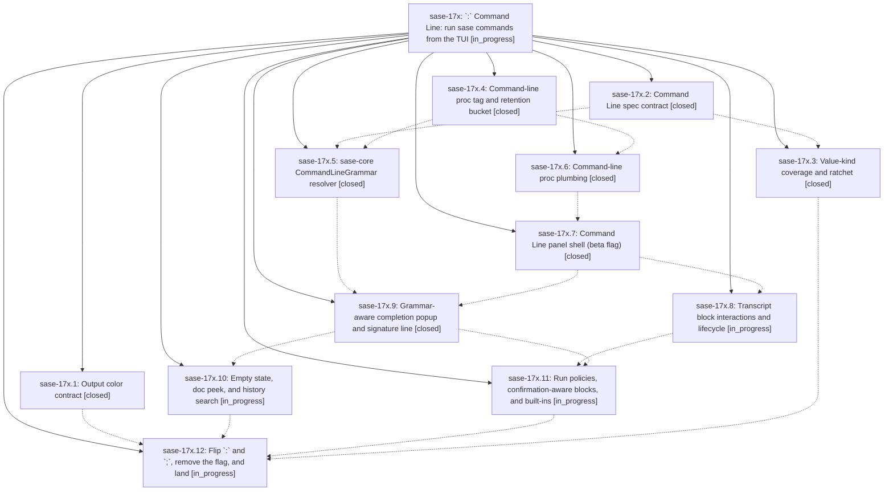

# Bead: sase-17x — \`:\` Command Line: run sase commands from the TUI

[Bead Pages](../README.md) / sase-17x

**Status:** ◐ in_progress · **Type:** ▸ plan · **Tier:** epic
**Owner:** `bryanbugyi34@gmail.com` · **Created by:** [bbugyi200.athena.0qs](https://github.com/sase-org/sase--agents/blob/main/families/bbugyi200.athena.0qs.md) · **Assignee:** `sase-17x.land`
**Created:** 2026-09-24 11:29:17 EDT
**Plan:** [202609/command\_line\_panel.md](https://github.com/sase-org/sase--plans/blob/main/202609/command_line_panel.md)

## Description

`;` opens the Command Palette and `:` opens a new bottom-anchored Command Line panel. In the panel, users type `sase` commands with better completion than any shell offers: selection-aware, fuzzy, documented and grammar-checked. Output streams inline. Every command runs as a durable, tagged proc that keeps running after the panel is hidden, shows up in Admin Center → Procs, and returns to the transcript when the panel reopens.

## Notes

[2026-09-24T17:14:59Z · sase-17m.3.1.land] DISCOVERED ISSUE (sase-17m.3.1 land agent, master df8ed5134, 2026-09-24): tests/fakey/test_cli.py::test_help_is_colored_sorted_and_all_long_options_have_aliases fails on master with and without the landing diff. sase-17x.1 (5a7955161) moved fakey help onto sase.core.term_color.should_colorize (NO_COLOR, then FORCE_COLOR/CLICOLOR_FORCE, then isatty). The test runs 'python -m sase.fakey.cli --help' with capture_output (not a TTY), TERM=xterm, and NO_COLOR removed, and expects '\x1b[1;36musage:', but now gets plain 'usage: fakey ...'. Either the test should set FORCE_COLOR=1, or fakey help should keep its previous TERM-based coloring. Seen in the full lane that just test-scoped escalated to (17 failed / 46440 passed).

[2026-09-24T18:58:38Z · sase-17z.land] DISCOVERED ISSUE: (found by sase-17z land agent at master 71736697d) just _lint-symvision is red with 14 unused public symbols in src/sase/completion/command_line_grammar.py (CommandLineGrammar, CompletionItem, DynamicCandidate, HelpChild, HelpOption, HelpPositional, LineContext, LineDiagnostic, LineSignature, LineSlot, LineToken, RunPolicyOutcome, SignatureSegment, load_command_line_grammar) added by ede63ea9d (CommandLineGrammar resolver adapter). Wire them up or add --epic-symbol 'sase-17x(...)' entries keyed to the open consuming phase.

## Phases

| Bead | Title | Status | Size | Created | Agents | Commits |
|---|---|---|---|---|---:|---:|
| [sase-17x.1](sase-17x.1.md) | Output color contract | ✓ closed | medium | 2026-09-24 | 1 | 1 |
| [sase-17x.10](sase-17x.10.md) | Empty state, doc peek, and history search | ◐ in_progress | medium | 2026-09-24 | 1 | 0 |
| [sase-17x.11](sase-17x.11.md) | Run policies, confirmation-aware blocks, and built-ins | ◐ in_progress | medium | 2026-09-24 | 1 | 0 |
| [sase-17x.12](sase-17x.12.md) | Flip \`:\` and \`;\`, remove the flag, and land | ◐ in_progress | medium | 2026-09-24 | 1 | 0 |
| [sase-17x.2](sase-17x.2.md) | Command Line spec contract | ✓ closed | medium | 2026-09-24 | 1 | 1 |
| [sase-17x.3](sase-17x.3.md) | Value-kind coverage and ratchet | ✓ closed | medium | 2026-09-24 | 1 | 1 |
| [sase-17x.4](sase-17x.4.md) | Command-line proc tag and retention bucket | ✓ closed | small | 2026-09-24 | 1 | 2 |
| [sase-17x.5](sase-17x.5.md) | sase-core CommandLineGrammar resolver | ✓ closed | large | 2026-09-24 | 1 | 2 |
| [sase-17x.6](sase-17x.6.md) | Command-line proc plumbing | ✓ closed | medium | 2026-09-24 | 1 | 1 |
| [sase-17x.7](sase-17x.7.md) | Command Line panel shell (beta flag) | ✓ closed | medium | 2026-09-24 | 1 | 1 |
| [sase-17x.8](sase-17x.8.md) | Transcript block interactions and lifecycle | ◐ in_progress | medium | 2026-09-24 | 1 | 0 |
| [sase-17x.9](sase-17x.9.md) | Grammar-aware completion popup and signature line | ✓ closed | medium | 2026-09-24 | 1 | 1 |

## Lineage

## Agents

| Agent | Bead | Commits |
|---|---|---:|
| [bbugyi200.athena.sase-17x.1](https://github.com/sase-org/sase--agents/blob/main/agents/bbugyi200.athena.sase-17x.1/README.md) | [sase-17x.1](sase-17x.1.md) | 1 |
| [bbugyi200.athena.sase-17x.10](https://github.com/sase-org/sase--agents/blob/main/agents/bbugyi200.athena.sase-17x.10/README.md) | [sase-17x.10](sase-17x.10.md) | 0 |
| [bbugyi200.athena.sase-17x.11](https://github.com/sase-org/sase--agents/blob/main/agents/bbugyi200.athena.sase-17x.11/README.md) | [sase-17x.11](sase-17x.11.md) | 0 |
| [bbugyi200.athena.sase-17x.12](https://github.com/sase-org/sase--agents/blob/main/agents/bbugyi200.athena.sase-17x.12/README.md) | [sase-17x.12](sase-17x.12.md) | 0 |
| [bbugyi200.athena.sase-17x.2](https://github.com/sase-org/sase--agents/blob/main/agents/bbugyi200.athena.sase-17x.2/README.md) | [sase-17x.2](sase-17x.2.md) | 1 |
| [bbugyi200.athena.sase-17x.3](https://github.com/sase-org/sase--agents/blob/main/agents/bbugyi200.athena.sase-17x.3/README.md) | [sase-17x.3](sase-17x.3.md) | 1 |
| [bbugyi200.athena.sase-17x.4](https://github.com/sase-org/sase--agents/blob/main/agents/bbugyi200.athena.sase-17x.4/README.md) | [sase-17x.4](sase-17x.4.md) | 2 |
| [bbugyi200.athena.sase-17x.5](https://github.com/sase-org/sase--agents/blob/main/families/bbugyi200.athena.sase-17x.5.md) | [sase-17x.5](sase-17x.5.md) | 2 |
| [bbugyi200.athena.sase-17x.6](https://github.com/sase-org/sase--agents/blob/main/agents/bbugyi200.athena.sase-17x.6/README.md) | [sase-17x.6](sase-17x.6.md) | 1 |
| [bbugyi200.athena.sase-17x.7](https://github.com/sase-org/sase--agents/blob/main/agents/bbugyi200.athena.sase-17x.7/README.md) | [sase-17x.7](sase-17x.7.md) | 1 |
| [bbugyi200.athena.sase-17x.8](https://github.com/sase-org/sase--agents/blob/main/agents/bbugyi200.athena.sase-17x.8/README.md) | [sase-17x.8](sase-17x.8.md) | 0 |
| [bbugyi200.athena.sase-17x.9](https://github.com/sase-org/sase--agents/blob/main/agents/bbugyi200.athena.sase-17x.9/README.md) | [sase-17x.9](sase-17x.9.md) | 1 |
| [bbugyi200.athena.sase-17x.land](https://github.com/sase-org/sase--agents/blob/main/agents/bbugyi200.athena.sase-17x.land/README.md) | [sase-17x](README.md) | 0 |

## Commits

| Repo | Commit | Subject | Bead | Committed |
|---|---|---|---|---|
| sase | [`5a79551`](https://github.com/sase-org/sase/commit/5a7955161e960662c41fa496ab5ef699941e3cb1) | feat(cli): add shared stdout color contract honoring FORCE\_COLOR | [sase-17x.1](sase-17x.1.md) | 2026-09-24 11:48:58 EDT |
| sase | [`db4266e`](https://github.com/sase-org/sase/commit/db4266e1cd1c853bfe3a176a053ef2aa0c80dbde) | feat(completion): Command Line spec contract (sase-17x.2) | [sase-17x.2](sase-17x.2.md) | 2026-09-24 11:51:25 EDT |
| sase | [`f6e17fb`](https://github.com/sase-org/sase/commit/f6e17fb2c9adfbc82c4c1c726867b9026a512450) | feat(sase-17x.4): command-line proc tag and retention bucket in sase | [sase-17x.4](sase-17x.4.md) | 2026-09-24 12:05:27 EDT |
| sase-core | [`sase-core@f405c44`](https://github.com/sase-org/sase-core/commit/f405c440a048595c7d9572e23b5dacfcf887050c) | feat(procs): command-line proc tag retention bucket in Rust store | [sase-17x.4](sase-17x.4.md) | 2026-09-24 12:10:40 EDT |
| sase | [`79a16ca`](https://github.com/sase-org/sase/commit/79a16ca7712fca793714e92d9c884aca86da1fc5) | feat(completion): add GATE, TOOL\_RUN, TASK\_TYPE kinds with entity candidates and kind-coverage ratchet | [sase-17x.3](sase-17x.3.md) | 2026-09-24 12:37:08 EDT |
| sase | [`70afac5`](https://github.com/sase-org/sase/commit/70afac5176b90b4c7cad6590b4199ad295fc14cb) | feat(cmdline): command-line proc plumbing (sase-17x.6) | [sase-17x.6](sase-17x.6.md) | 2026-09-24 12:50:35 EDT |
| sase | [`ede63ea`](https://github.com/sase-org/sase/commit/ede63ea9dcec4672873412d9f5d4d3f65f72ffcf) | feat(command-line): CommandLineGrammar resolver adapter and contract test | [sase-17x.5](sase-17x.5.md) | 2026-09-24 13:50:20 EDT |
| sase-core | [`sase-core@1bdadab`](https://github.com/sase-org/sase-core/commit/1bdadab86ea787212cd975ba681ed0f572870d7f) | feat(command-line): CommandLineGrammar resolver and sase adapter | [sase-17x.5](sase-17x.5.md) | 2026-09-24 13:53:51 EDT |
| sase | [`db99493`](https://github.com/sase-org/sase/commit/db99493448ff762695410f6d06e42164707572d8) | feat(ace): implement Command Line panel shell behind ace\_command\_line beta flag | [sase-17x.7](sase-17x.7.md) | 2026-09-24 14:35:48 EDT |
| sase | [`d4dc96e`](https://github.com/sase-org/sase/commit/d4dc96eb4a163f33c73d2e6a93c3731a227b2829) | feat(ace-tui): add command-line completion popup phase sase-17x.9 | [sase-17x.9](sase-17x.9.md) | 2026-09-24 15:17:34 EDT |

<!-- sase:referenced-by:start -->

## Referenced By

| Relation | Artifact | Why | Uses |
| --- | --- | --- | ---: |
| read-by | [agent:0qz--code][1] | check 17x phases for hint consumption | 1 |
| read-by | [agent:sase-17m.3.1.land][2] | Check whether the FORCE_COLOR stdout color contract (5a7955161) belongs to this epic before routing a fakey help-color test failure | 2 |
| read-by | [agent:sase-17x.1][3] | Need parent epic context for color-contract phase | 1 |
| read-by | [agent:sase-17x.2][4] | Need parent epic status for phase work | 1 |

[1]: https://github.com/sase-org/sase--agents/blob/main/families/bbugyi200.athena.0qz.md
[2]: https://github.com/sase-org/sase--agents/blob/main/agents/bbugyi200.athena.sase-17m.3.1.land/README.md
[3]: https://github.com/sase-org/sase--agents/blob/main/agents/bbugyi200.athena.sase-17x.1/README.md
[4]: https://github.com/sase-org/sase--agents/blob/main/agents/bbugyi200.athena.sase-17x.2/README.md

<!-- sase:referenced-by:end -->
