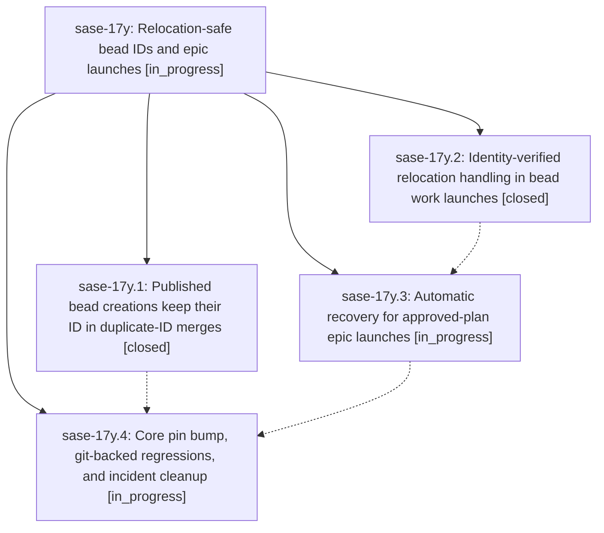

# Bead: sase-17y — Relocation-safe bead IDs and epic launches

[Bead Pages](../README.md) / sase-17y

**Status:** ◐ in_progress · **Type:** ▸ plan · **Tier:** epic
**Owner:** `bryanbugyi34@gmail.com` · **Created by:** [bbugyi200.athena.0qv](https://github.com/sase-org/sase--agents/blob/main/families/bbugyi200.athena.0qv.md) · **Assignee:** `sase-17y.land`
**Created:** 2026-09-24 11:57:10 EDT
**Plan:** [202609/bead\_relocation\_safe\_epic\_launch.md](https://github.com/sase-org/sase--plans/blob/main/202609/bead_relocation_safe_epic_launch.md)

## Description

A concurrently minted bead ID never renumbers a bead that is already published, and `sase bead work` only acts on bead relocations it can prove moved its own beads. When publication does move a freshly created epic graph, the launch rolls back by the moved IDs and retries automatically, so an approved epic launches without a manual retry and without collateral damage to other agents' beads.

## Phases

| Bead | Title | Status | Size | Created | Agents | Commits |
|---|---|---|---|---|---:|---:|
| [sase-17y.1](sase-17y.1.md) | Published bead creations keep their ID in duplicate-ID merges | ✓ closed | small | 2026-09-24 | 1 | 1 |
| [sase-17y.2](sase-17y.2.md) | Identity-verified relocation handling in bead work launches | ✓ closed | medium | 2026-09-24 | 1 | 1 |
| [sase-17y.3](sase-17y.3.md) | Automatic recovery for approved-plan epic launches | ◐ in_progress | medium | 2026-09-24 | 1 | 0 |
| [sase-17y.4](sase-17y.4.md) | Core pin bump, git-backed regressions, and incident cleanup | ◐ in_progress | small | 2026-09-24 | 1 | 0 |

## Lineage

## Agents

| Agent | Bead | Commits |
|---|---|---:|
| [bbugyi200.athena.sase-17y.1](https://github.com/sase-org/sase--agents/blob/main/agents/bbugyi200.athena.sase-17y.1/README.md) | [sase-17y.1](sase-17y.1.md) | 1 |
| [bbugyi200.athena.sase-17y.2](https://github.com/sase-org/sase--agents/blob/main/agents/bbugyi200.athena.sase-17y.2/README.md) | [sase-17y.2](sase-17y.2.md) | 1 |
| [bbugyi200.athena.sase-17y.3](https://github.com/sase-org/sase--agents/blob/main/agents/bbugyi200.athena.sase-17y.3/README.md) | [sase-17y.3](sase-17y.3.md) | 0 |
| [bbugyi200.athena.sase-17y.4](https://github.com/sase-org/sase--agents/blob/main/agents/bbugyi200.athena.sase-17y.4/README.md) | [sase-17y.4](sase-17y.4.md) | 0 |
| [bbugyi200.athena.sase-17y.land](https://github.com/sase-org/sase--agents/blob/main/agents/bbugyi200.athena.sase-17y.land/README.md) | [sase-17y](README.md) | 0 |

## Commits

| Repo | Commit | Subject | Bead | Committed |
|---|---|---|---|---|
| sase-core | [`sase-core@6d0d0e6`](https://github.com/sase-org/sase-core/commit/6d0d0e6d5c0e783e68650f908e8c9eb01ceea7dc) | fix(bead): keep published bead ids stable when relocating duplicate creations | [sase-17y.1](sase-17y.1.md) | 2026-09-24 12:17:56 EDT |
| sase | [`2d6a57b`](https://github.com/sase-org/sase/commit/2d6a57b3fcf8e349eb243e4f3dead5de50b52e7e) | feat(bead): launch-guard for relocated epic/task graphs | [sase-17y.2](sase-17y.2.md) | 2026-09-24 12:38:49 EDT |
