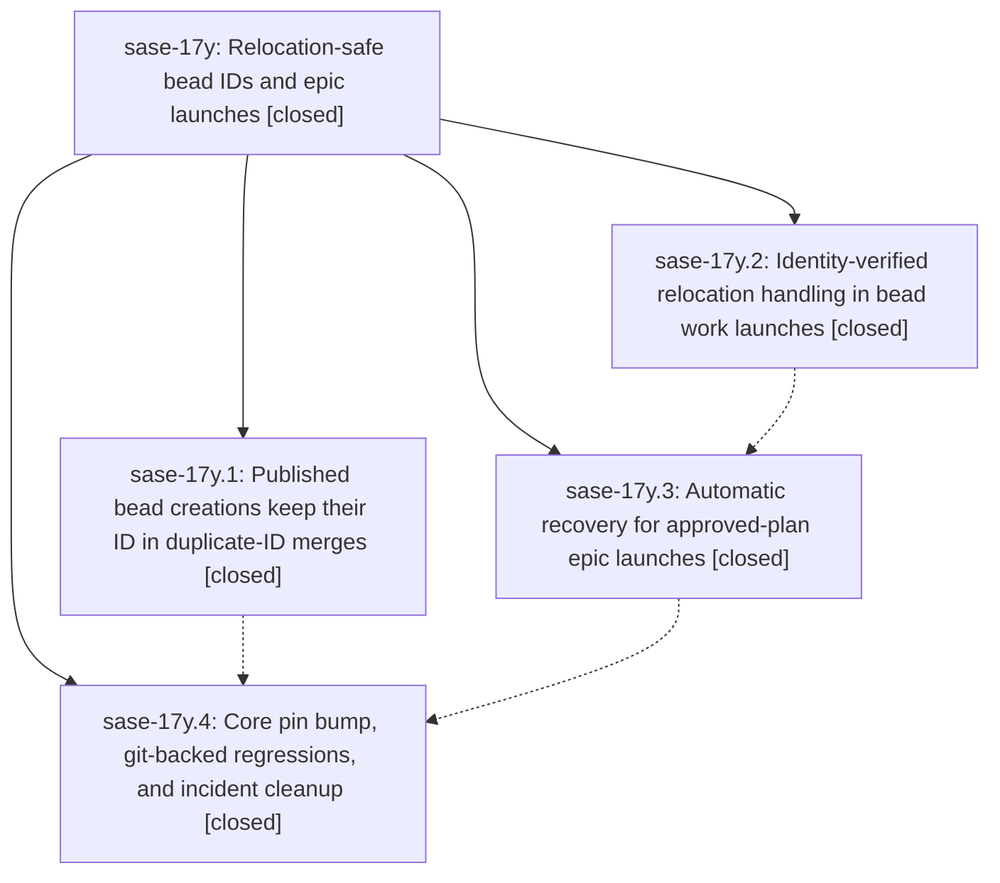

# Bead: sase-17y — Relocation-safe bead IDs and epic launches

[Bead Pages](../README.md) / sase-17y

**Status:** ✓ closed · **Resolution:** done · **Type:** ▸ plan · **Tier:** epic
**Owner:** `bryanbugyi34@gmail.com` · **Created by:** [bbugyi200.athena.0qv](https://github.com/sase-org/sase--agents/blob/main/families/bbugyi200.athena.0qv.md) · **Assignee:** `sase-17y.land`
**Created:** 2026-09-24 11:57:10 EDT · **Closed:** 2026-09-24 15:23:24 EDT
**Plan:** [202609/bead\_relocation\_safe\_epic\_launch.md](https://github.com/sase-org/sase--plans/blob/main/202609/bead_relocation_safe_epic_launch.md)

## Description

A concurrently minted bead ID never renumbers a bead that is already published, and `sase bead work` only acts on bead relocations it can prove moved its own beads. When publication does move a freshly created epic graph, the launch rolls back by the moved IDs and retries automatically, so an approved epic launches without a manual retry and without collateral damage to other agents' beads.

## Notes

[2026-09-24T19:23:24Z · sase-17y.land] VERIFIED (step 1): all 4 phases are closed and every note was addressed. Checked the source.
- core-winner: sase-core 6d0d0e6 (on origin master). losing_creation keeps Base, then Theirs, then the oldest creation as a defensive fallback, and the comments are rewritten. sase-core-revision.txt pins 6d0d0e6; that bump landed via ede63ea9d, which collided with 17y.4's pin change.
- launch-guard (2d6a57b3f): relocation.py has relocations_for_subtree, resolve_own_bead_id, and a token-safe single-pass _rewrite_text_for_bead_relocations. launch_epic_bead_work launches unmoved and foreign-moved graphs with the original IDs. An own move rolls back on the moved IDs and mapped preclaims, then raises EpicGraphRelocatedError. An unlocatable move raises BeadWorkError with a doctor hint. The task path and the resume passthrough are wired.
- plan-retry (edfa80f0b): rollback removes relocated_epic_id, creation retries at most 3 attempts, the relocation_retries timer field is recorded, the resume path relinks the plan, and published_relocations is gone.
- pin-regression (f2164ed24): the older-local git-backed and sync-level regressions are present. The registry maps tool_handoff to sase-17w.
- The 17y.3 note #3 symvision entry for EpicGraphRelocatedError is gone because the symbol is now used cross-module. epic-symbols: none.
LAND FIX: the retry loop's no-op `try/except Exception: raise` around rollback publication now raises EpicFromPlanError. It keeps the relocation detail plus "rollback publication also failed" and does not retry. A new regression test covers this: test_plan_file_relocation_rollback_publication_failure_stops_retrying. The epic suites pass (88 tests plus 12 in the resume file).
INTEGRATE (step 2): reviewed 15 non-epic commits since 11:57. None touch the relocation or launch paths, except 064830632 (the symvision privatizations, already consistent) and 7e1b05964/epic_launch.py (a rename only). Nothing duplicates or conflicts with the epic.
CHECK: sase tool run check was red only on pre-existing master breakage from other work:
(a) mypy from the 9bd351b67 rename collision. I fixed it here and closed sase-183.
(b) symvision on command_line_grammar.py, already noted on active epic sase-17x.
(c) toobig on decks/panel.py, already noted on active epic sase-17d.
(d) The escalated full test lane: 46574 passed and 29 failed. 27 fail identically on clean master; the other 2 were load flakes that pass alone. None are in bead code. 3 wait-check failures bisect to 9bd351b67, filed as sase-186; the others are tracked in sase-174, sase-175, sase-184, and more.
FOLLOW-UPS:
- 17y.1 (empty worker.pid flake in post_spawn_publish_failure_reaps_barred_worker): corroborated with a +1 on sase-15e, whose scope already names this test.
- 17y.3 (run the full just check before landing): declined as a task. The land agent ran it; see CHECK above.

## Phases

| Bead | Title | Status | Size | Created | Agents | Commits |
|---|---|---|---|---|---:|---:|
| [sase-17y.1](sase-17y.1.md) | Published bead creations keep their ID in duplicate-ID merges | ✓ closed | small | 2026-09-24 | 1 | 1 |
| [sase-17y.2](sase-17y.2.md) | Identity-verified relocation handling in bead work launches | ✓ closed | medium | 2026-09-24 | 1 | 1 |
| [sase-17y.3](sase-17y.3.md) | Automatic recovery for approved-plan epic launches | ✓ closed | medium | 2026-09-24 | 1 | 1 |
| [sase-17y.4](sase-17y.4.md) | Core pin bump, git-backed regressions, and incident cleanup | ✓ closed | small | 2026-09-24 | 1 | 1 |

## Lineage

## Agents

| Agent | Bead | Commits |
|---|---|---:|
| [bbugyi200.athena.sase-17y.1](https://github.com/sase-org/sase--agents/blob/main/agents/bbugyi200.athena.sase-17y.1/README.md) | [sase-17y.1](sase-17y.1.md) | 1 |
| [bbugyi200.athena.sase-17y.2](https://github.com/sase-org/sase--agents/blob/main/agents/bbugyi200.athena.sase-17y.2/README.md) | [sase-17y.2](sase-17y.2.md) | 1 |
| [bbugyi200.athena.sase-17y.3](https://github.com/sase-org/sase--agents/blob/main/agents/bbugyi200.athena.sase-17y.3/README.md) | [sase-17y.3](sase-17y.3.md) | 1 |
| [bbugyi200.athena.sase-17y.4](https://github.com/sase-org/sase--agents/blob/main/agents/bbugyi200.athena.sase-17y.4/README.md) | [sase-17y.4](sase-17y.4.md) | 1 |
| [bbugyi200.athena.sase-17y.land](https://github.com/sase-org/sase--agents/blob/main/agents/bbugyi200.athena.sase-17y.land/README.md) | [sase-17y](README.md) | 1 |

## Commits

| Repo | Commit | Subject | Bead | Committed |
|---|---|---|---|---|
| sase-core | [`sase-core@6d0d0e6`](https://github.com/sase-org/sase-core/commit/6d0d0e6d5c0e783e68650f908e8c9eb01ceea7dc) | fix(bead): keep published bead ids stable when relocating duplicate creations | [sase-17y.1](sase-17y.1.md) | 2026-09-24 12:17:56 EDT |
| sase | [`2d6a57b`](https://github.com/sase-org/sase/commit/2d6a57b3fcf8e349eb243e4f3dead5de50b52e7e) | feat(bead): launch-guard for relocated epic/task graphs | [sase-17y.2](sase-17y.2.md) | 2026-09-24 12:38:49 EDT |
| sase | [`edfa80f`](https://github.com/sase-org/sase/commit/edfa80f0ba395170a102eabff8e14a1fd9361202) | feat(bead): automatic recovery for approved-plan epic launches (sase-17y.3) | [sase-17y.3](sase-17y.3.md) | 2026-09-24 13:14:39 EDT |
| sase | [`f2164ed`](https://github.com/sase-org/sase/commit/f2164ed241db6bc9c6c5b85d995f4d4c6981bf1a) | test(bead): pin core-winner core and add older-local relocation regressions | [sase-17y.4](sase-17y.4.md) | 2026-09-24 13:56:02 EDT |
| sase | [`7a1438b`](https://github.com/sase-org/sase/commit/7a1438b142e1cd5b20f897f27f56aa4c68e6f404) | fix(bead): land sase-17y relocation-safe epic launches | [sase-17y](README.md) | 2026-09-24 15:26:34 EDT |

<!-- sase:referenced-by:start -->

## Referenced By

| Relation | Artifact | Why | Uses |
| --- | --- | --- | ---: |
| read-by | [agent:0qz--code][1] | triaging extra symvision symbols from 17y.2 landing | 1 |

[1]: https://github.com/sase-org/sase--agents/blob/main/families/bbugyi200.athena.0qz.md

<!-- sase:referenced-by:end -->
