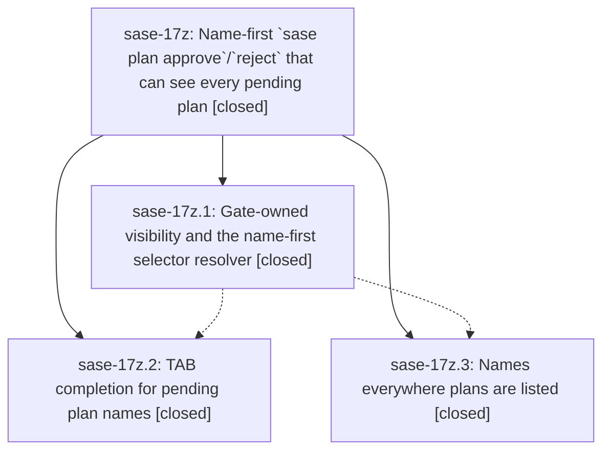

# Bead: sase-17z — Name-first \`sase plan approve\`/\`reject\` that can see every pending plan

[Bead Pages](../README.md) / sase-17z

**Status:** ✓ closed · **Resolution:** done · **Type:** ▸ plan · **Tier:** epic
**Owner:** `bryanbugyi34@gmail.com` · **Created by:** [bbugyi200.athena.0qx](https://github.com/sase-org/sase--agents/blob/main/families/bbugyi200.athena.0qx.md) · **Assignee:** `sase-17z.land`
**Created:** 2026-09-24 12:07:25 EDT · **Closed:** 2026-09-24 14:59:08 EDT
**Plan:** [202609/plan\_approve\_names.md](https://github.com/sase-org/sase--plans/blob/main/202609/plan_approve_names.md)

## Description

`sase plan approve` and `sase plan reject` find every plan that is really awaiting review, accept the plan's name in whatever form the user has on hand (`unrelated_red_gate_bead_close`, `202609/unrelated_red_gate_bead_close.md`, a path, a `plan:` ref, the planner agent, or the old notification ID), TAB-complete pending plan names with rich descriptions, and explain every miss precisely instead of printing "pending plan approval not found".

## Notes

[2026-09-24T18:59:08Z · sase-17z.land] Land verified at master 71736697d. STEP 1: all 3 phases closed; read every note and the epic commits 2bdd70c2d (resolver: gate-owned visibility in plan_candidates, plan_names, exact-then-prefix resolver + diagnosis + renderer, parser/show/docs), c3a61ae7d (surfaces: Name column, hint line, name JSON field, show hint), 482fb46bc (completion: pending_plan kind, catalog_plans fast path pinned to TERMINAL_GATE_STATES, VOLATILE_KIND_TTL_SECONDS 5s in disk/zsh/bash). 463 focused plan/completion tests pass; live CLI: plan list Proposed consistent with gate list, unrelated_red_gate_bead_close prints never-gated diagnosis exit 2, plan_approve_names prints already-approved-as-epic diagnosis. REMAINING EPIC WORK FIXED: 2bdd70c2d broke tests/main/test_parser_plan.py::test_plan_subcommand_help_is_complete (asserted old SELECTOR/notification-id help) - updated to PLAN/name-first help. STEP 2 integration: 064830632 already reshaped plan_pending_render/handlers for symvision; 7e1b05964 wire cutover compatible (catalog_plans reads agent_session_shell); sase wait NEEDS_REVIEW unblock hint (agents/_wait_live_rows.py) now prints 'sase plan approve <planner>' using the epic's agent selector. No other duplicate/conflicting code found. just check: fmt/ruff/keep-sorted/flags/pyscripts/test-waits/changelog/terminology/validate/committed-plans green; mypy, symvision, toobig red only on pre-existing master breaks proven on pristine tree; scoped lane escalated to full suite after wheel rebuild and timed out, so touched/epic suites run directly (all green; 34 remaining failures identical on pristine tree). FOLLOW-UPS: 17z.1 flag-lint rule 7 (sase-17k agent_decks) and rule 6 (tool_handoff/sase-17v) DECLINED - _lint-flags now green (resolved by bda83083b / sase-17w). 17z.2+17z.3 symvision 74 findings DECLINED - fixed by 064830632. 17z.2 kind-coverage tool/stop+tool/wait -> DISCOVERED ISSUE on active epic sase-17p (df8ed5134). 17z.2 toobig decks/panel.py -> DISCOVERED ISSUE on active epic sase-17d. Discovered: mypy+wait-deps break from 9bd351b67 vs 7e1b05964 -> new task sase-183; 3 monitor prompt-panel test failures -> new task sase-184; bead-candidates absent-store test -> +1 sase-14o; tribe prompts test -> +1 sase-175; command_line_grammar symvision -> DISCOVERED ISSUE on sase-17x.

## Phases

| Bead | Title | Status | Size | Created | Agents | Commits |
|---|---|---|---|---|---:|---:|
| [sase-17z.1](sase-17z.1.md) | Gate-owned visibility and the name-first selector resolver | ✓ closed | medium | 2026-09-24 | 1 | 1 |
| [sase-17z.2](sase-17z.2.md) | TAB completion for pending plan names | ✓ closed | medium | 2026-09-24 | 1 | 1 |
| [sase-17z.3](sase-17z.3.md) | Names everywhere plans are listed | ✓ closed | small | 2026-09-24 | 1 | 1 |

## Lineage

## Agents

| Agent | Bead | Commits |
|---|---|---:|
| [bbugyi200.athena.sase-17z.1](https://github.com/sase-org/sase--agents/blob/main/families/bbugyi200.athena.sase-17z.1.md) | [sase-17z.1](sase-17z.1.md) | 1 |
| [bbugyi200.athena.sase-17z.2](https://github.com/sase-org/sase--agents/blob/main/agents/bbugyi200.athena.sase-17z.2/README.md) | [sase-17z.2](sase-17z.2.md) | 1 |
| [bbugyi200.athena.sase-17z.3](https://github.com/sase-org/sase--agents/blob/main/agents/bbugyi200.athena.sase-17z.3/README.md) | [sase-17z.3](sase-17z.3.md) | 1 |
| [bbugyi200.athena.sase-17z.land](https://github.com/sase-org/sase--agents/blob/main/agents/bbugyi200.athena.sase-17z.land/README.md) | [sase-17z](README.md) | 1 |

## Commits

| Repo | Commit | Subject | Bead | Committed |
|---|---|---|---|---|
| sase | [`2bdd70c`](https://github.com/sase-org/sase/commit/2bdd70c2d5d7c5fd09e2a23e32fce53a47512e28) | feat(plan): gate-owned pending visibility and name-first selector resolver (sase-17z.1) | [sase-17z.1](sase-17z.1.md) | 2026-09-24 13:16:04 EDT |
| sase | [`c3a61ae`](https://github.com/sase-org/sase/commit/c3a61ae7d9e178ef1ec4758b808191ea50c54a93) | feat(plan): names everywhere plans are listed (sase-17z.3) | [sase-17z.3](sase-17z.3.md) | 2026-09-24 13:51:33 EDT |
| sase | [`482fb46`](https://github.com/sase-org/sase/commit/482fb46bcc02044219d3723f1b215d76baaa7642) | feat(completion): TAB completion for pending plan names | [sase-17z.2](sase-17z.2.md) | 2026-09-24 13:58:40 EDT |
| sase | [`3899cb9`](https://github.com/sase-org/sase/commit/3899cb92fd66b74b5e23cf609b49e75ae0e683fe) | fix(plan): land sase-17z name-first plan approve help and wait unblock hint | [sase-17z](README.md) | 2026-09-24 15:01:27 EDT |
