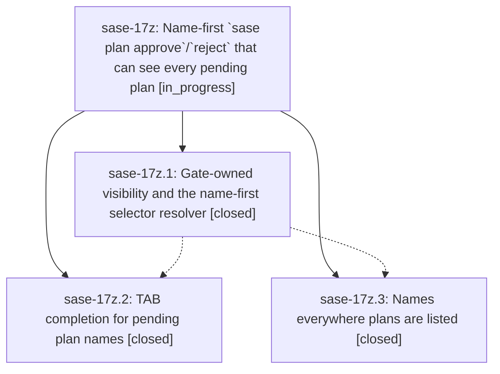

# Bead: sase-17z — Name-first \`sase plan approve\`/\`reject\` that can see every pending plan

[Bead Pages](../README.md) / sase-17z

**Status:** ◐ in_progress · **Type:** ▸ plan · **Tier:** epic
**Owner:** `bryanbugyi34@gmail.com` · **Created by:** [bbugyi200.athena.0qx](https://github.com/sase-org/sase--agents/blob/main/families/bbugyi200.athena.0qx.md) · **Assignee:** `sase-17z.land`
**Created:** 2026-09-24 12:07:25 EDT
**Plan:** [202609/plan\_approve\_names.md](https://github.com/sase-org/sase--plans/blob/main/202609/plan_approve_names.md)

## Description

`sase plan approve` and `sase plan reject` find every plan that is really awaiting review, accept the plan's name in whatever form the user has on hand (`unrelated_red_gate_bead_close`, `202609/unrelated_red_gate_bead_close.md`, a path, a `plan:` ref, the planner agent, or the old notification ID), TAB-complete pending plan names with rich descriptions, and explain every miss precisely instead of printing "pending plan approval not found".

## Phases

| Bead | Title | Status | Size | Created | Agents | Commits |
|---|---|---|---|---|---:|---:|
| [sase-17z.1](sase-17z.1.md) | Gate-owned visibility and the name-first selector resolver | ✓ closed | medium | 2026-09-24 | 1 | 1 |
| [sase-17z.2](sase-17z.2.md) | TAB completion for pending plan names | ✓ closed | medium | 2026-09-24 | 1 | 1 |
| [sase-17z.3](sase-17z.3.md) | Names everywhere plans are listed | ✓ closed | small | 2026-09-24 | 1 | 1 |

## Lineage

## Agents

| Agent | Bead | Commits |
|---|---|---:|
| [bbugyi200.athena.sase-17z.1](https://github.com/sase-org/sase--agents/blob/main/families/bbugyi200.athena.sase-17z.1.md) | [sase-17z.1](sase-17z.1.md) | 1 |
| [bbugyi200.athena.sase-17z.2](https://github.com/sase-org/sase--agents/blob/main/agents/bbugyi200.athena.sase-17z.2/README.md) | [sase-17z.2](sase-17z.2.md) | 1 |
| [bbugyi200.athena.sase-17z.3](https://github.com/sase-org/sase--agents/blob/main/agents/bbugyi200.athena.sase-17z.3/README.md) | [sase-17z.3](sase-17z.3.md) | 1 |
| [bbugyi200.athena.sase-17z.land](https://github.com/sase-org/sase--agents/blob/main/agents/bbugyi200.athena.sase-17z.land/README.md) | [sase-17z](README.md) | 0 |

## Commits

| Repo | Commit | Subject | Bead | Committed |
|---|---|---|---|---|
| sase | [`2bdd70c`](https://github.com/sase-org/sase/commit/2bdd70c2d5d7c5fd09e2a23e32fce53a47512e28) | feat(plan): gate-owned pending visibility and name-first selector resolver (sase-17z.1) | [sase-17z.1](sase-17z.1.md) | 2026-09-24 13:16:04 EDT |
| sase | [`c3a61ae`](https://github.com/sase-org/sase/commit/c3a61ae7d9e178ef1ec4758b808191ea50c54a93) | feat(plan): names everywhere plans are listed (sase-17z.3) | [sase-17z.3](sase-17z.3.md) | 2026-09-24 13:51:33 EDT |
| sase | [`482fb46`](https://github.com/sase-org/sase/commit/482fb46bcc02044219d3723f1b215d76baaa7642) | feat(completion): TAB completion for pending plan names | [sase-17z.2](sase-17z.2.md) | 2026-09-24 13:58:40 EDT |
