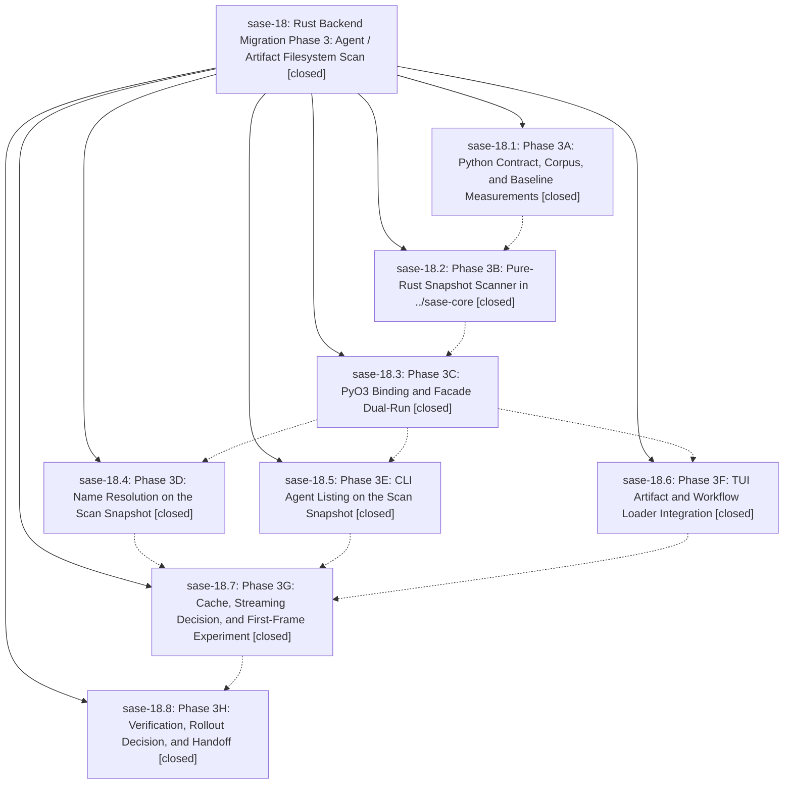

# Bead: sase-18 — Rust Backend Migration Phase 3: Agent / Artifact Filesystem Scan

[Bead Pages](../README.md) / sase-18

**Status:** ✓ closed · **Resolution:** (unrecorded) · **Type:** plan · **Tier:** epic
**Owner:** `bryanbugyi34@gmail.com`
**Created:** 2026-04-29 13:19:32 UTC · **Closed:** 2026-04-29 14:52:59 UTC
**Plan:** [202604/rust\_backend\_phase3\_agent\_scan.md](https://github.com/sase-org/sase--plans/blob/main/202604/rust_backend_phase3_agent_scan.md)

## Phases

| Bead | Title | Status | Size | Agents | Commits |
|---|---|---|---|---:|---:|
| [sase-18.1](sase-18.1.md) | Phase 3A: Python Contract, Corpus, and Baseline Measurements | ✓ closed | small | 0 | 2 |
| [sase-18.2](sase-18.2.md) | Phase 3B: Pure-Rust Snapshot Scanner in ../sase-core | ✓ closed | small | 0 | 2 |
| [sase-18.3](sase-18.3.md) | Phase 3C: PyO3 Binding and Facade Dual-Run | ✓ closed | small | 0 | 2 |
| [sase-18.4](sase-18.4.md) | Phase 3D: Name Resolution on the Scan Snapshot | ✓ closed | small | 0 | 1 |
| [sase-18.5](sase-18.5.md) | Phase 3E: CLI Agent Listing on the Scan Snapshot | ✓ closed | small | 0 | 1 |
| [sase-18.6](sase-18.6.md) | Phase 3F: TUI Artifact and Workflow Loader Integration | ✓ closed | small | 0 | 1 |
| [sase-18.7](sase-18.7.md) | Phase 3G: Cache, Streaming Decision, and First-Frame Experiment | ✓ closed | small | 0 | 1 |
| [sase-18.8](sase-18.8.md) | Phase 3H: Verification, Rollout Decision, and Handoff | ✓ closed | small | 0 | 1 |

## Lineage

## Commits

| Commit | Subject | Bead | Committed (UTC) |
|---|---|---|---|
| [`1e7f762`](https://github.com/sase-org/sase/commit/1e7f762c01e9bfa6fbfbe24cc8e0dadc8c864cb2) | chore(core): Phase 3A — agent-artifact scan wire contract, golden corpus, and baseline benchmark (sase-18.1) | [sase-18.1](sase-18.1.md) | 2026-04-29 13:40:02 |
| [`8feb1ab`](https://github.com/sase-org/sase/commit/8feb1abd723f32fe5c0ba3c417f5e01543db0808) | chore: close Phase 3A bead (sase-18.1) | [sase-18.1](sase-18.1.md) | 2026-04-29 13:40:35 |
| [`sase-core@5761ccf`](https://github.com/sase-org/sase-core/commit/5761ccf55844b24171caeffd0db580506c98ec59) | feat: Phase 3B — pure-Rust artifact-scan snapshot scanner (sase-18.2) | [sase-18.2](sase-18.2.md) | 2026-04-29 13:53:16 |
| [`7908faf`](https://github.com/sase-org/sase/commit/7908faf8d99181dbec8f315f39fa2866945b3a6d) | chore: Phase 3B handoff note (sase-18.2) | [sase-18.2](sase-18.2.md) | 2026-04-29 13:53:33 |
| [`sase-core@f5e9c25`](https://github.com/sase-org/sase-core/commit/f5e9c255192d710180695f5df51185b96e804975) | feat: Phase 3C — sase\_core\_rs.scan\_agent\_artifacts PyO3 binding (sase-18.3) | [sase-18.3](sase-18.3.md) | 2026-04-29 14:04:49 |
| [`87d9788`](https://github.com/sase-org/sase/commit/87d97884693960fd7e1890700c3f2f016637bf37) | chore(core): Phase 3C — agent-scan facade dual-run dispatch and PyO3 wiring (sase-18.3) | [sase-18.3](sase-18.3.md) | 2026-04-29 14:05:08 |
| [`e6610a1`](https://github.com/sase-org/sase/commit/e6610a163e4145bf498e7bbdf1819b0671918346) | ref(agent): route name lookup through scan facade (sase-18.4) | [sase-18.4](sase-18.4.md) | 2026-04-29 14:18:44 |
| [`31005be`](https://github.com/sase-org/sase/commit/31005be470a18a8cc7d0b0a34ac1959d038ab97f) | feat(agent): Phase 3E — route \`sase agents\` listing through the scan snapshot (sase-18.5) | [sase-18.5](sase-18.5.md) | 2026-04-29 14:21:10 |
| [`d87093b`](https://github.com/sase-org/sase/commit/d87093bbdd64740ad0dc6ca6fdad560af15208ab) | chore(core): Phase 3F — TUI artifact and workflow loader snapshot integration (sase-18.6) | [sase-18.6](sase-18.6.md) | 2026-04-29 14:23:51 |
| [`3da97df`](https://github.com/sase-org/sase/commit/3da97dfb5be8234cce6f38d6f6961bf4ad974ef8) | chore(core): Phase 3G — snapshot/streaming decision and bench breakdown (sase-18.7) | [sase-18.7](sase-18.7.md) | 2026-04-29 14:39:25 |
| [`6b62639`](https://github.com/sase-org/sase/commit/6b626395e9f597e2618b12c5d5421691d4c49585) | chore(core): Phase 3H — verification, rollout decision, and Phase 3 close-out (sase-18.8) | [sase-18.8](sase-18.8.md) | 2026-04-29 14:49:37 |
