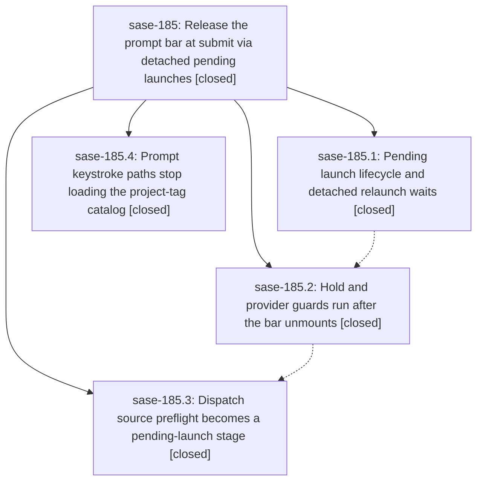

# Bead: sase-185 — Release the prompt bar at submit via detached pending launches

[Bead Pages](../README.md) / sase-185

**Status:** ✓ closed · **Resolution:** done · **Type:** ▸ plan · **Tier:** epic
**Owner:** `bryanbugyi34@gmail.com` · **Created by:** [bbugyi200.athena.0r6](https://github.com/sase-org/sase--agents/blob/main/families/bbugyi200.athena.0r6.md) · **Assignee:** `sase-185.land`
**Created:** 2026-09-24 15:03:15 EDT · **Closed:** 2026-09-24 17:41:05 EDT
**Plan:** [202609/detached\_prompt\_submit.md](https://github.com/sase-org/sase--plans/blob/main/202609/detached_prompt_submit.md)

## Description

Submitting from the ACE prompt input bar removes the bar on the very next paint in every launch flow. Kill/dismiss cleanup waits, provider/hold/dispatch preflights, and launch bookkeeping continue as a visible, cancellable pending launch that hands off to the durable `sase run` proc, and every abort path gives the prompt back.

## Notes

[2026-09-24T20:30:04Z · 0rd] DISCOVERED ISSUE (2026-09-24, master cae16be3c, found while landing an unrelated finalizer close_policy change; reproduced identically with that diff stashed): just check fails at lint (mypy) partly because of this epic. src/sase/ace/tui/actions/agent_workflow/_launch_prompt_inputs.py:178 calls self._accept_resolved_launch(...) but LaunchPromptInputMixin declares no such attribute ([attr-defined]); the method is defined on a different mixin in _launch_submission.py:68. Introduced by 93d8d4140 (sase-185.2, detach accepted agent launch guards). The other 15 mypy errors on master belong to already-noted owners: 5 command_line errors on sase-17x (sase-17p.land note) and 10 agent_detail mixin errors on sase-17d.10.1 / sase-17m.4.1.2. Fix by declaring the method on LaunchPromptInputMixin (TYPE_CHECKING stub or shared protocol), matching how sibling mixins declare host methods.

[2026-09-24T21:41:05Z · sase-185.land] Land verification: read epic + all 4 phase beads and notes, the plan, and commits 02dd0527f (185.4), 8c4f3f809 (185.1), 93d8d4140 (185.2), a21985b88 (185.3). Confirmed in source: PendingLaunch record/registry/stages/row/PREPARING record/,X cancel/quit stash (_pending_launch.py); acceptance + unmount in _accept_resolved_launch before dispatch preview -> %hold -> provider guard -> relaunch barrier -> durable submit; hold/provider guards keyed per launch_id with non-exclusive per-launch worker groups, modal only when no bar/modal (else stash), hold confirm defaults to Cancel; dispatch source preview runs as a per-launch stage and blocked sources restore with the source-blocked context line; launch.accepted/launch.submitted traces; keystroke/render/submit callers use *_with_catalog snapshot helpers (only a background warmer still calls load_project_tag_catalog). Epic note #1 (mypy attr-defined for _accept_resolved_launch in _launch_prompt_inputs.py) was already fixed by 185.3's TYPE_CHECKING stubs; mypy now reports no errors in any epic file. Landing fixes: deleted _dispatch_preview_source_summary (dead private helper left by 185.3; it failed symvision) plus its dead TYPE_CHECKING import/stubs; collapsed duplicate worker->UI helpers (_call_from_ui, _call_from_ui_hold_guard, inline dispatch caller) onto call_pending_launch_from_worker (185.1 PROPOSED FOLLOW-UP #2, epic-caused, resolved here); fixed stale _submit_resolved_launch docstring refs in _entry_bulk.py/_entry_relaunch.py. Integration: reviewed every non-epic commit since 02dd0527f (command-line sase-17x.9-11, session agent removals, agent-session renames, decks, effort completion, GPT-6, finalizers, wait); none launches agents, touches the tag catalog on keystroke paths, or conflicts with pending launches. Verification: 52 focused pending-launch/guard/barrier tests pass; sase tool run check fails only at mypy with 15 pre-existing errors in agent_detail/command_line; remaining gates run individually: flags/pyscripts/changelog/terminology/validate/committed-plans pass, test-waits/toobig/symvision fail only on non-epic command_line/decks/etc. items; full just test (ToolRun e9508bd2c3882f6b873a990f33deffcb) 46748 passed, 42 failed - 41 fail identically on a clean tree, 1 (load-tiering oracle) passes in isolation (load flake). Follow-ups: 185.1 #1 (master red on unrelated gates) recorded via /sase_new_task as a DISCOVERED ISSUE note on active epic sase-18f (Return just check to green), whose phases own exactly these gates; no new task created. 185.1 #2 resolved in landing. No --epic-symbol entries existed.

## Phases

| Bead | Title | Status | Size | Created | Agents | Commits |
|---|---|---|---|---|---:|---:|
| [sase-185.1](sase-185.1.md) | Pending launch lifecycle and detached relaunch waits | ✓ closed | medium | 2026-09-24 | 1 | 1 |
| [sase-185.2](sase-185.2.md) | Hold and provider guards run after the bar unmounts | ✓ closed | medium | 2026-09-24 | 1 | 1 |
| [sase-185.3](sase-185.3.md) | Dispatch source preflight becomes a pending-launch stage | ✓ closed | small | 2026-09-24 | 1 | 1 |
| [sase-185.4](sase-185.4.md) | Prompt keystroke paths stop loading the project-tag catalog | ✓ closed | small | 2026-09-24 | 1 | 1 |

## Lineage

## Agents

| Agent | Bead | Commits |
|---|---|---:|
| [bbugyi200.athena.sase-185.1](https://github.com/sase-org/sase--agents/blob/main/agents/bbugyi200.athena.sase-185.1/README.md) | [sase-185.1](sase-185.1.md) | 1 |
| [bbugyi200.athena.sase-185.2](https://github.com/sase-org/sase--agents/blob/main/families/bbugyi200.athena.sase-185.2.md) | [sase-185.2](sase-185.2.md) | 1 |
| [bbugyi200.athena.sase-185.3](https://github.com/sase-org/sase--agents/blob/main/agents/bbugyi200.athena.sase-185.3/README.md) | [sase-185.3](sase-185.3.md) | 1 |
| [bbugyi200.athena.sase-185.4](https://github.com/sase-org/sase--agents/blob/main/agents/bbugyi200.athena.sase-185.4/README.md) | [sase-185.4](sase-185.4.md) | 1 |
| [bbugyi200.athena.sase-185.land](https://github.com/sase-org/sase--agents/blob/main/agents/bbugyi200.athena.sase-185.land/README.md) | [sase-185](README.md) | 2 |

## Commits

| Repo | Commit | Subject | Bead | Committed |
|---|---|---|---|---|
| sase | [`02dd052`](https://github.com/sase-org/sase/commit/02dd0527f903203cfdb5e0fad18b0c2049068e07) | feat(ace-tui): keystroke paths use snapshot-only project-tag helpers phase sase-185.4 | [sase-185.4](sase-185.4.md) | 2026-09-24 15:30:38 EDT |
| sase | [`8c4f3f8`](https://github.com/sase-org/sase/commit/8c4f3f8094b9c8c968382ac4ce79e9d5cd788822) | feat(ace): accept prompt submits as pending launches (sase-185.1) | [sase-185.1](sase-185.1.md) | 2026-09-24 15:58:18 EDT |
| sase | [`93d8d41`](https://github.com/sase-org/sase/commit/93d8d4140cea62629942839fa9eee8c962fcf5a0) | feat(ace): detach accepted agent launch guards | [sase-185.2](sase-185.2.md) | 2026-09-24 16:17:44 EDT |
| sase | [`a21985b`](https://github.com/sase-org/sase/commit/a21985b88fe2de892bb221d3a5ab4fa1cec285b7) | feat(ace): detach dispatch source preflight (sase-185.3) | [sase-185.3](sase-185.3.md) | 2026-09-24 16:44:28 EDT |
| sase | [`10422bd`](https://github.com/sase-org/sase/commit/10422bd05fe47a34e8b78ef916db103db7018cfc) | fix(ace): land sase-185 detached prompt submit | [sase-185](README.md) | 2026-09-24 17:58:52 EDT |
| sase--plans | [`sase--plans@01c6f4f`](https://github.com/sase-org/sase--plans/commit/01c6f4f40a1ffccb4864f9093d2ee25160432ffc) | chore(plans): mark detached\_prompt\_submit plan done (sase-185) | [sase-185](README.md) | 2026-09-24 18:02:46 EDT |

<!-- sase:referenced-by:start -->

## Referenced By

| Relation | Artifact | Why | Uses |
| --- | --- | --- | ---: |
| read-by | [agent:0rd][1] | Need my note's ordinal to correct an error count | 3 |
| read-by | [agent:sase-185.land][2] | Need the parent link | 2 |

[1]: https://github.com/sase-org/sase--agents/blob/main/agents/bbugyi200.athena.0rd/README.md
[2]: https://github.com/sase-org/sase--agents/blob/main/agents/bbugyi200.athena.sase-185.land/README.md

<!-- sase:referenced-by:end -->
