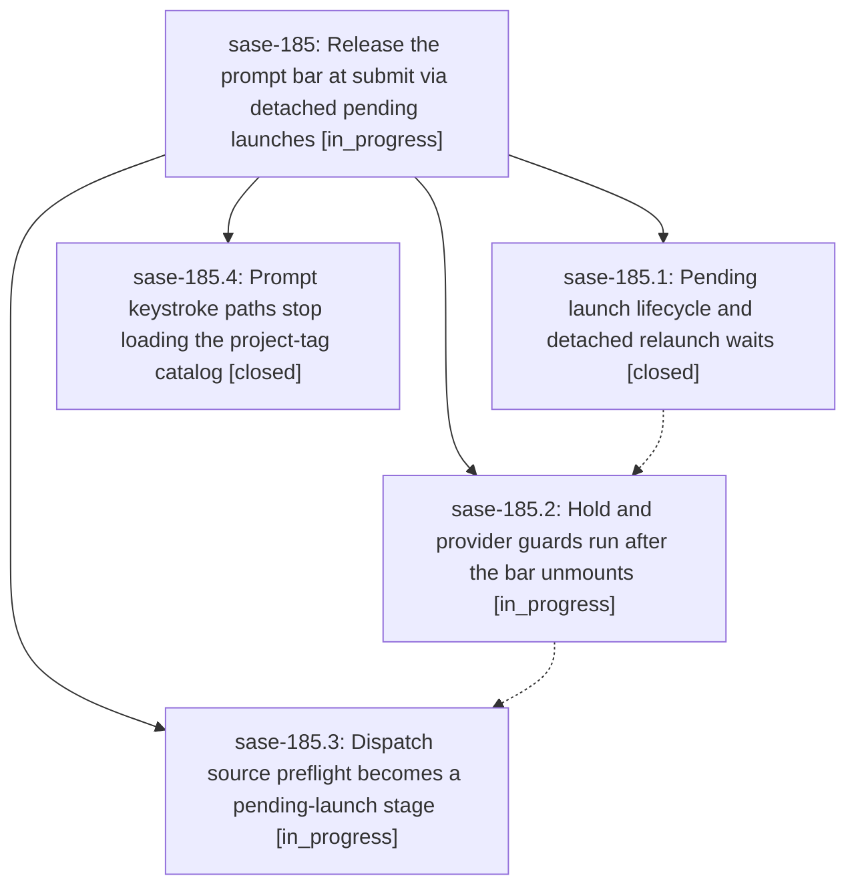

# Bead: sase-185 — Release the prompt bar at submit via detached pending launches

[Bead Pages](../README.md) / sase-185

**Status:** ◐ in_progress · **Type:** ▸ plan · **Tier:** epic
**Owner:** `bryanbugyi34@gmail.com` · **Created by:** [bbugyi200.athena.0r6](https://github.com/sase-org/sase--agents/blob/main/families/bbugyi200.athena.0r6.md) · **Assignee:** `sase-185.land`
**Created:** 2026-09-24 15:03:15 EDT
**Plan:** [202609/detached\_prompt\_submit.md](https://github.com/sase-org/sase--plans/blob/main/202609/detached_prompt_submit.md)

## Description

Submitting from the ACE prompt input bar removes the bar on the very next paint in every launch flow. Kill/dismiss cleanup waits, provider/hold/dispatch preflights, and launch bookkeeping continue as a visible, cancellable pending launch that hands off to the durable `sase run` proc, and every abort path gives the prompt back.

## Phases

| Bead | Title | Status | Size | Created | Agents | Commits |
|---|---|---|---|---|---:|---:|
| [sase-185.1](sase-185.1.md) | Pending launch lifecycle and detached relaunch waits | ✓ closed | medium | 2026-09-24 | 1 | 1 |
| [sase-185.2](sase-185.2.md) | Hold and provider guards run after the bar unmounts | ◐ in_progress | medium | 2026-09-24 | 1 | 0 |
| [sase-185.3](sase-185.3.md) | Dispatch source preflight becomes a pending-launch stage | ◐ in_progress | small | 2026-09-24 | 1 | 0 |
| [sase-185.4](sase-185.4.md) | Prompt keystroke paths stop loading the project-tag catalog | ✓ closed | small | 2026-09-24 | 1 | 1 |

## Lineage

## Agents

| Agent | Bead | Commits |
|---|---|---:|
| [bbugyi200.athena.sase-185.1](https://github.com/sase-org/sase--agents/blob/main/agents/bbugyi200.athena.sase-185.1/README.md) | [sase-185.1](sase-185.1.md) | 1 |
| [bbugyi200.athena.sase-185.2](https://github.com/sase-org/sase--agents/blob/main/agents/bbugyi200.athena.sase-185.2/README.md) | [sase-185.2](sase-185.2.md) | 0 |
| [bbugyi200.athena.sase-185.3](https://github.com/sase-org/sase--agents/blob/main/agents/bbugyi200.athena.sase-185.3/README.md) | [sase-185.3](sase-185.3.md) | 0 |
| [bbugyi200.athena.sase-185.4](https://github.com/sase-org/sase--agents/blob/main/agents/bbugyi200.athena.sase-185.4/README.md) | [sase-185.4](sase-185.4.md) | 1 |
| [bbugyi200.athena.sase-185.land](https://github.com/sase-org/sase--agents/blob/main/agents/bbugyi200.athena.sase-185.land/README.md) | [sase-185](README.md) | 0 |

## Commits

| Repo | Commit | Subject | Bead | Committed |
|---|---|---|---|---|
| sase | [`02dd052`](https://github.com/sase-org/sase/commit/02dd0527f903203cfdb5e0fad18b0c2049068e07) | feat(ace-tui): keystroke paths use snapshot-only project-tag helpers phase sase-185.4 | [sase-185.4](sase-185.4.md) | 2026-09-24 15:30:38 EDT |
| sase | [`8c4f3f8`](https://github.com/sase-org/sase/commit/8c4f3f8094b9c8c968382ac4ce79e9d5cd788822) | feat(ace): accept prompt submits as pending launches (sase-185.1) | [sase-185.1](sase-185.1.md) | 2026-09-24 15:58:18 EDT |
