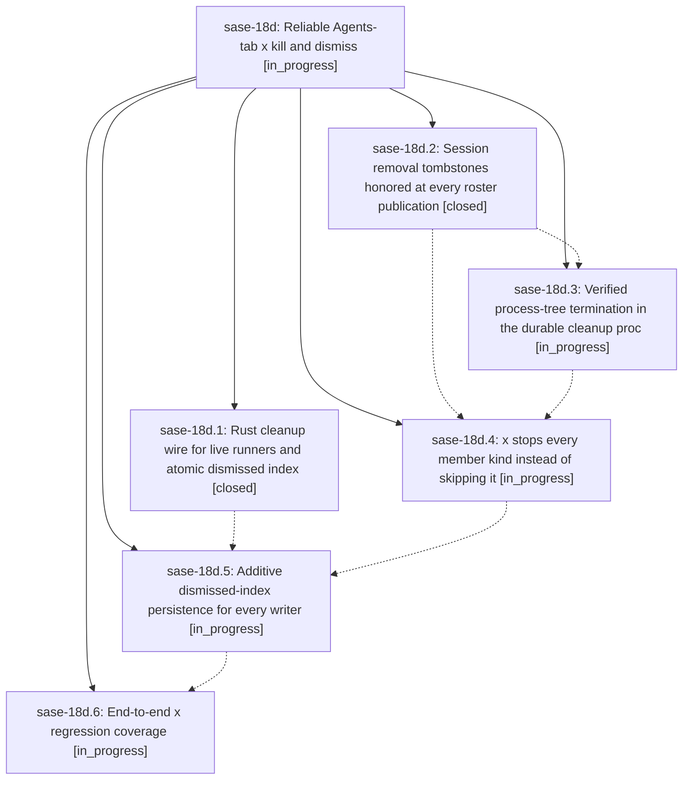

# Bead: sase-18d — Reliable Agents-tab x kill and dismiss

[Bead Pages](../README.md) / sase-18d

**Status:** ◐ in_progress · **Type:** ▸ plan · **Tier:** epic
**Owner:** `bryanbugyi34@gmail.com` · **Created by:** [bbugyi200.athena.0ra](https://github.com/sase-org/sase--agents/blob/main/families/bbugyi200.athena.0ra.md) · **Assignee:** `sase-18d.land`
**Created:** 2026-09-24 16:28:29 EDT
**Plan:** [202609/x\_kill\_removal\_reliability.md](https://github.com/sase-org/sase--plans/blob/main/202609/x_kill_removal_reliability.md)

## Description

Pressing `x` on any Agents-tab node (agent, clan container, workflow, monitor, proc shell, gate, panel, group, or marked set) removes every affected row at once and it never comes back. Every process that belongs to a killed node is verifiably terminated, including descendants that left the runner's process group. This holds even if the TUI exits right after the keypress.

## Phases

| Bead | Title | Status | Size | Created | Agents | Commits |
|---|---|---|---|---|---:|---:|
| [sase-18d.1](sase-18d.1.md) | Rust cleanup wire for live runners and atomic dismissed index | ✓ closed | medium | 2026-09-24 | 1 | 1 |
| [sase-18d.2](sase-18d.2.md) | Session removal tombstones honored at every roster publication | ✓ closed | medium | 2026-09-24 | 1 | 1 |
| [sase-18d.3](sase-18d.3.md) | Verified process-tree termination in the durable cleanup proc | ◐ in_progress | medium | 2026-09-24 | 1 | 0 |
| [sase-18d.4](sase-18d.4.md) | x stops every member kind instead of skipping it | ◐ in_progress | medium | 2026-09-24 | 1 | 0 |
| [sase-18d.5](sase-18d.5.md) | Additive dismissed-index persistence for every writer | ◐ in_progress | medium | 2026-09-24 | 1 | 0 |
| [sase-18d.6](sase-18d.6.md) | End-to-end x regression coverage | ◐ in_progress | small | 2026-09-24 | 1 | 0 |

## Lineage

## Agents

| Agent | Bead | Commits |
|---|---|---:|
| [bbugyi200.athena.sase-18d.1](https://github.com/sase-org/sase--agents/blob/main/agents/bbugyi200.athena.sase-18d.1/README.md) | [sase-18d.1](sase-18d.1.md) | 1 |
| [bbugyi200.athena.sase-18d.2](https://github.com/sase-org/sase--agents/blob/main/agents/bbugyi200.athena.sase-18d.2/README.md) | [sase-18d.2](sase-18d.2.md) | 1 |
| [bbugyi200.athena.sase-18d.3](https://github.com/sase-org/sase--agents/blob/main/agents/bbugyi200.athena.sase-18d.3/README.md) | [sase-18d.3](sase-18d.3.md) | 0 |
| [bbugyi200.athena.sase-18d.4](https://github.com/sase-org/sase--agents/blob/main/agents/bbugyi200.athena.sase-18d.4/README.md) | [sase-18d.4](sase-18d.4.md) | 0 |
| [bbugyi200.athena.sase-18d.5](https://github.com/sase-org/sase--agents/blob/main/agents/bbugyi200.athena.sase-18d.5/README.md) | [sase-18d.5](sase-18d.5.md) | 0 |
| [bbugyi200.athena.sase-18d.6](https://github.com/sase-org/sase--agents/blob/main/agents/bbugyi200.athena.sase-18d.6/README.md) | [sase-18d.6](sase-18d.6.md) | 0 |
| [bbugyi200.athena.sase-18d.land](https://github.com/sase-org/sase--agents/blob/main/agents/bbugyi200.athena.sase-18d.land/README.md) | [sase-18d](README.md) | 0 |

## Commits

| Repo | Commit | Subject | Bead | Committed |
|---|---|---|---|---|
| sase | [`85cc749`](https://github.com/sase-org/sase/commit/85cc749a183168bd1ac6f8d0d9e1c10142e670a6) | feat: Clean up Gemini model handling: default to gemini-3.1-pro-preview, remove env var hacks (sase-18d) | [sase-18d](README.md) | 2026-02-20 11:32:23 EST |
| sase | [`c88987e`](https://github.com/sase-org/sase/commit/c88987e7939f0e0e85ed2794bf3e0a5d16bdf037) | fix(ace): preserve session agent removals | [sase-18d.2](sase-18d.2.md) | 2026-09-24 16:48:59 EDT |
| sase | [`e3f3a4b`](https://github.com/sase-org/sase/commit/e3f3a4bd4010d3ca892d9b2e7c49dec19e77e3ff) | feat(cleanup): carry runner\_is\_live on wire v5 with FAILED+live kill rule | [sase-18d.1](sase-18d.1.md) | 2026-09-24 17:25:12 EDT |
