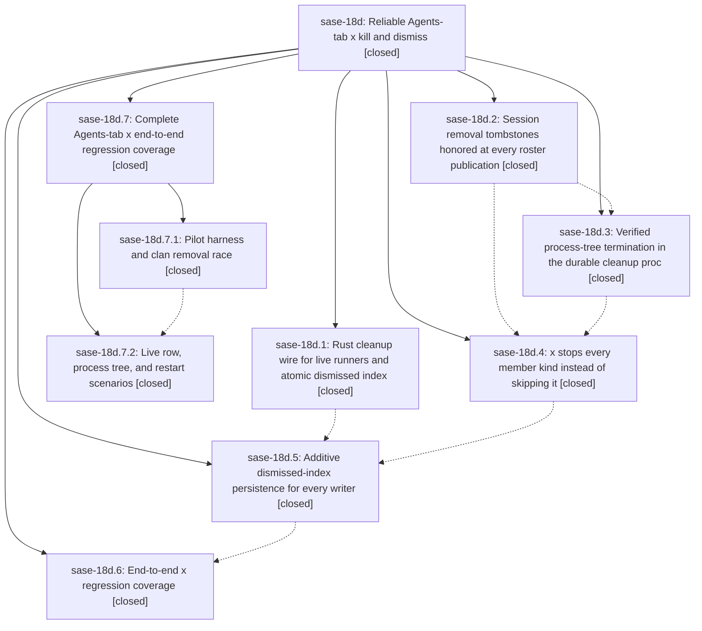

# Bead: sase-18d — Reliable Agents-tab x kill and dismiss

[Bead Pages](../README.md) / sase-18d

**Status:** ✓ closed · **Resolution:** done · **Type:** ▸ plan · **Tier:** epic
**Owner:** `bryanbugyi34@gmail.com` · **Created by:** [bbugyi200.athena.0ra](https://github.com/sase-org/sase--agents/blob/main/families/bbugyi200.athena.0ra.md) · **Assignee:** `sase-18d.land`
**Created:** 2026-09-24 16:28:29 EDT · **Closed:** 2026-09-25 01:38:58 EDT
**Plan:** [202609/x\_kill\_removal\_reliability.md](https://github.com/sase-org/sase--plans/blob/main/202609/x_kill_removal_reliability.md)

<!-- sase:links:start -->

## Links

| Relation | Artifact | Why |
| --- | --- | --- |
| related | [bead:sase-18x][1] | Parent kill/dismiss epic whose pilot harness exposed the stale mirror |

_Plus 1 automatic references — see [Referenced By](#referenced-by)._

[1]: https://github.com/sase-org/sase--beads/blob/main/pages/sase-18x/README.md

<!-- sase:links:end -->

## Description

Pressing `x` on any Agents-tab node (agent, clan container, workflow, monitor, proc shell, gate, panel, group, or marked set) removes every affected row at once and it never comes back. Every process that belongs to a killed node is verifiably terminated, including descendants that left the runner's process group. This holds even if the TUI exits right after the keypress.

## Notes

[2026-09-24T23:24:18Z · 0rt] DISCOVERED ISSUE: just check stops at lint (symvision) on origin/master 33e41c72e, masking every later stage (validate, committed plans, scoped tests): AgentSurvivorsError and Survivor in src/sase/ace/tui/actions/agents/_kill_termination.py and environ_has_launch_key in src/sase/agent/process_tree.py are unused public symbols added by b7cfa069c (sase-18d.3). Presumably sase-18d.4/.5 wire them up, but until then the epic-symbols whitelist or a private rename is needed for every other agent's check to get past lint. Found while verifying an unrelated change; all other lint stages (mypy, ruff, pyscripts, test-waits, feature flags) pass at that SHA.

[2026-09-25T01:57:46Z · sase-18d.land] LAND AUDIT: Phases 1-5 are implemented in source and their commits; core revision 8315364 contains f226caf schema-5/additive API. Phase 6 is closed without its planned on-disk Textual pilot regression module: its note only cites separate tombstone, durable termination, and member-scope tests. Existing tests/test_agents_tab_removal_tombstones.py uses fake apps; tests/test_agent_terminate_processes.py uses real processes separately; no integrated pilot covers clan/load/fleet/restart or FAILED/DONE/live process semantics. A child plan is being proposed for only that missing coverage and any defects it reveals. Post-start commits inspected: 4fb83bb4f resolved the temporary symvision symbols and advanced the core pin; 0d7229bef adjusted finished-agent fork behavior; 3a1d0bab2 changed agent-session query dialect; bf3aa6c8a repaired unrelated TUI tests; none supplies the missing pilot coverage. Recheck interaction with those current behaviors in the child. Follow-up proposals on phases 1-5 remain for the resumed land audit to disposition.

[2026-09-25T05:38:58Z · sase-18d.7.land] RESUMED LAND (after child epic sase-18d.7 landed), master 02c4b029a with origin/master c7a78904b checked for drift. Phases 1-5 were verified by the prior LAND AUDIT note. The missing phase-6 coverage is now delivered by sase-18d.7: a mounted-AceApp Textual pilot with on-disk agents and real process trees, covering the clan x race against an in-flight load, fleet reprojection and complete-history reload, FAILED retry-backoff kill, a FAILED live twin, DONE finalizer untouched, x then immediate exit, and a fresh app instance. It also fixed two epic-caused defects (racing-load resurrection in _loading_compute/_loading_apply, and same-identity twin handling in the dismiss safety net). 62/62 of the pilot, tombstone, durable-termination, terminate-processes and member-scope tests pass with sase-core-rs 0.34.73. Drift: 09e057147 (sase-17m.5.1.1 agent-session renames) and c7a78904b (sase-18f check fixes) do not touch the kill, dismiss or loading-apply paths. Core pin 321e7b47 contains sase-core f226caf (schema-5 runner_is_live). No epic-symbol entries. Follow-up dispositions: 18d.1#1 (pin move): done, pin contains f226caf. 18d.2#1 (16 mypy errors): resolved, whole-repo mypy clean per 18d.7.2. 18d.3#1 (early dismissal publish via full snapshot): resolved by 18d.5; _kill_transactions uses add_dismissed_batch. 18d.3#2 (cache read_process_registry per batch): declined, speculative with no profile evidence; the proposal itself made it conditional on showing up in persist-cleanup profiles. 18d.3#3 and 18d.5#1 (master red gates): mypy and _dispatch_preview_source_summary are resolved and test-waits passes on this tree; the tools mypy and wheel-cache items are sase-18q/sase-18r, pyscripts visual is sase-17b, and toobig is not a check stage (the toobig_split routine owns it). 18d.4#1 (unused AgentSurvivorsError, Survivor, environ_has_launch_key): resolved; they are now used or private. 18d.5#2 (29 clean-tree scoped failures): covered by sase-18s, where I noted that a stale binding explains part of the set. Unrelated current symvision failures (CdResolution, PathCompletionRequest from sase-17x.13.6) are noted on active epic sase-17x.13.

## Phases

| Bead | Title | Status | Size | Created | Agents | Commits |
|---|---|---|---|---|---:|---:|
| [sase-18d.1](sase-18d.1.md) | Rust cleanup wire for live runners and atomic dismissed index | ✓ closed | medium | 2026-09-24 | 1 | 2 |
| [sase-18d.2](sase-18d.2.md) | Session removal tombstones honored at every roster publication | ✓ closed | medium | 2026-09-24 | 1 | 1 |
| [sase-18d.3](sase-18d.3.md) | Verified process-tree termination in the durable cleanup proc | ✓ closed | medium | 2026-09-24 | 1 | 1 |
| [sase-18d.4](sase-18d.4.md) | x stops every member kind instead of skipping it | ✓ closed | medium | 2026-09-24 | 1 | 1 |
| [sase-18d.5](sase-18d.5.md) | Additive dismissed-index persistence for every writer | ✓ closed | medium | 2026-09-24 | 1 | 1 |
| [sase-18d.6](sase-18d.6.md) | End-to-end x regression coverage | ✓ closed | small | 2026-09-24 | 1 | 0 |

## Lineage

## Agents

| Agent | Bead | Commits |
|---|---|---:|
| [bbugyi200.athena.sase-18d.1](https://github.com/sase-org/sase--agents/blob/main/agents/bbugyi200.athena.sase-18d.1/README.md) | [sase-18d.1](sase-18d.1.md) | 2 |
| [bbugyi200.athena.sase-18d.2](https://github.com/sase-org/sase--agents/blob/main/agents/bbugyi200.athena.sase-18d.2/README.md) | [sase-18d.2](sase-18d.2.md) | 1 |
| [bbugyi200.athena.sase-18d.3](https://github.com/sase-org/sase--agents/blob/main/agents/bbugyi200.athena.sase-18d.3/README.md) | [sase-18d.3](sase-18d.3.md) | 1 |
| [bbugyi200.athena.sase-18d.4](https://github.com/sase-org/sase--agents/blob/main/agents/bbugyi200.athena.sase-18d.4/README.md) | [sase-18d.4](sase-18d.4.md) | 1 |
| [bbugyi200.athena.sase-18d.5](https://github.com/sase-org/sase--agents/blob/main/agents/bbugyi200.athena.sase-18d.5/README.md) | [sase-18d.5](sase-18d.5.md) | 1 |
| [bbugyi200.athena.sase-18d.6](https://github.com/sase-org/sase--agents/blob/main/agents/bbugyi200.athena.sase-18d.6/README.md) | [sase-18d.6](sase-18d.6.md) | 0 |
| [bbugyi200.athena.sase-18d.7.1](https://github.com/sase-org/sase--agents/blob/main/agents/bbugyi200.athena.sase-18d.7.1/README.md) | [sase-18d.7.1](sase-18d.7.1.md) | 1 |
| [bbugyi200.athena.sase-18d.7.2](https://github.com/sase-org/sase--agents/blob/main/families/bbugyi200.athena.sase-18d.7.2.md) | [sase-18d.7.2](sase-18d.7.2.md) | 1 |
| [bbugyi200.athena.sase-18d.7.land](https://github.com/sase-org/sase--agents/blob/main/agents/bbugyi200.athena.sase-18d.7.land/README.md) | [sase-18d.7](sase-18d.7.md) | 1 |
| [bbugyi200.athena.sase-18d.land](https://github.com/sase-org/sase--agents/blob/main/families/bbugyi200.athena.sase-18d.land.md) | [sase-18d](README.md) | 0 |

## Commits

| Repo | Commit | Subject | Bead | Committed |
|---|---|---|---|---|
| sase | [`85cc749`](https://github.com/sase-org/sase/commit/85cc749a183168bd1ac6f8d0d9e1c10142e670a6) | feat: Clean up Gemini model handling: default to gemini-3.1-pro-preview, remove env var hacks (sase-18d) | [sase-18d](README.md) | 2026-02-20 11:32:23 EST |
| sase | [`c88987e`](https://github.com/sase-org/sase/commit/c88987e7939f0e0e85ed2794bf3e0a5d16bdf037) | fix(ace): preserve session agent removals | [sase-18d.2](sase-18d.2.md) | 2026-09-24 16:48:59 EDT |
| sase | [`e3f3a4b`](https://github.com/sase-org/sase/commit/e3f3a4bd4010d3ca892d9b2e7c49dec19e77e3ff) | feat(cleanup): carry runner\_is\_live on wire v5 with FAILED+live kill rule | [sase-18d.1](sase-18d.1.md) | 2026-09-24 17:25:12 EDT |
| sase-core | [`sase-core@f226caf`](https://github.com/sase-org/sase-core/commit/f226caf0ba4b61648d3968ef6278793c7636deae) | feat(cleanup): add runner\_is\_live to cleanup target wire (schema 4-\>5) | [sase-18d.1](sase-18d.1.md) | 2026-09-24 17:28:54 EDT |
| sase | [`b7cfa06`](https://github.com/sase-org/sase/commit/b7cfa069cb45b421f4abc87ddb8b21bb15d71c05) | feat(agent): verified process-tree termination in the durable cleanup proc (sase-18d.3) | [sase-18d.3](sase-18d.3.md) | 2026-09-24 19:05:19 EDT |
| sase | [`3cf0f1f`](https://github.com/sase-org/sase/commit/3cf0f1ff68ab3f89233defdf3fc1ec9e5088161d) | feat(ace): x stops every member kind instead of skipping it (sase-18d.4) | [sase-18d.4](sase-18d.4.md) | 2026-09-24 20:06:44 EDT |
| sase | [`1ea13da`](https://github.com/sase-org/sase/commit/1ea13da1b3450d2c89da83beb47814f117e9315b) | feat(dismissed-index): persist dismissals additively for every writer | [sase-18d.5](sase-18d.5.md) | 2026-09-24 21:26:20 EDT |
| sase | [`ae34dba`](https://github.com/sase-org/sase/commit/ae34dba2066acf114bc158de39061ba6533f189d) | test(ace): drive Agents-tab clan x through a mounted pilot and fix racing-load resurrection | [sase-18d.7.1](sase-18d.7.1.md) | 2026-09-24 23:52:25 EDT |
| sase | [`02c4b02`](https://github.com/sase-org/sase/commit/02c4b029a67b743d45c564840c12adca8c4f3029) | test(ace): complete Agents-tab x row-lifecycle e2e coverage (sase-18d.7.2) | [sase-18d.7.2](sase-18d.7.2.md) | 2026-09-25 01:05:35 EDT |
| sase--plans | [`sase--plans@a8f152f`](https://github.com/sase-org/sase--plans/commit/a8f152f1274f99385b54eef086db01d8646ae1bc) | docs(plans): mark sase-18d and sase-18d.7 x-kill plans done | [sase-18d.7](sase-18d.7.md) | 2026-09-25 01:39:43 EDT |

<!-- sase:referenced-by:start -->

## Referenced By

| Relation | Artifact | Why | Uses |
| --- | --- | --- | ---: |
| read-by | [agent:0rt][1] | Check whether epic sase-18d owns the unused symvision symbols | 1 |

[1]: https://github.com/sase-org/sase--agents/blob/main/agents/bbugyi200.athena.0rt/README.md

<!-- sase:referenced-by:end -->
