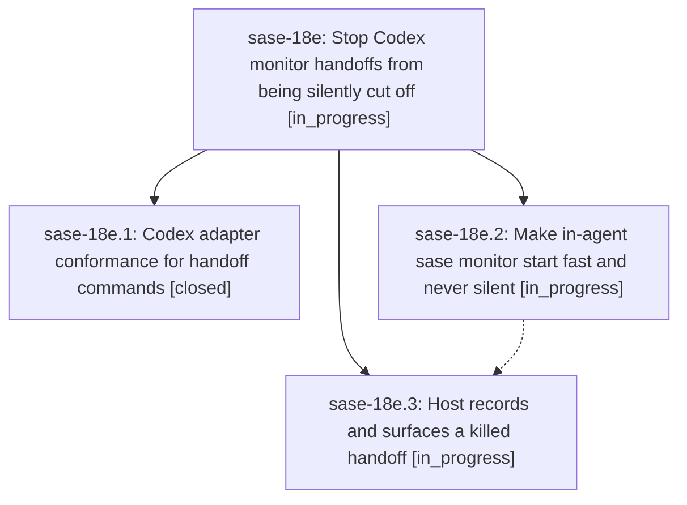

# Bead: sase-18e — Stop Codex monitor handoffs from being silently cut off

[Bead Pages](../README.md) / sase-18e

**Status:** ◐ in_progress · **Type:** ▸ plan · **Tier:** epic
**Owner:** `bryanbugyi34@gmail.com` · **Created by:** [bbugyi200.athena.0re](https://github.com/sase-org/sase--agents/blob/main/families/bbugyi200.athena.0re.md) · **Assignee:** `sase-18e.land`
**Created:** 2026-09-24 16:48:53 EDT
**Plan:** [202609/codex\_monitor\_handoff\_cutoff.md](https://github.com/sase-org/sase--plans/blob/main/202609/codex_monitor_handoff_cutoff.md)

## Description

An agent's in-agent handoff (above all `sase monitor start`) either completes or fails loudly. Codex turns can no longer end while a handoff command is still running, monitor starts are fast and never silent, and a killed handoff is recorded and surfaced instead of leaving an assigned bead stuck in_progress.

## Phases

| Bead | Title | Status | Size | Created | Agents | Commits |
|---|---|---|---|---|---:|---:|
| [sase-18e.1](sase-18e.1.md) | Codex adapter conformance for handoff commands | ✓ closed | medium | 2026-09-24 | 1 | 1 |
| [sase-18e.2](sase-18e.2.md) | Make in-agent sase monitor start fast and never silent | ◐ in_progress | medium | 2026-09-24 | 1 | 0 |
| [sase-18e.3](sase-18e.3.md) | Host records and surfaces a killed handoff | ◐ in_progress | medium | 2026-09-24 | 1 | 0 |

## Lineage

## Agents

| Agent | Bead | Commits |
|---|---|---:|
| [bbugyi200.athena.sase-18e.1](https://github.com/sase-org/sase--agents/blob/main/agents/bbugyi200.athena.sase-18e.1/README.md) | [sase-18e.1](sase-18e.1.md) | 1 |
| [bbugyi200.athena.sase-18e.2](https://github.com/sase-org/sase--agents/blob/main/agents/bbugyi200.athena.sase-18e.2/README.md) | [sase-18e.2](sase-18e.2.md) | 0 |
| [bbugyi200.athena.sase-18e.3](https://github.com/sase-org/sase--agents/blob/main/agents/bbugyi200.athena.sase-18e.3/README.md) | [sase-18e.3](sase-18e.3.md) | 0 |
| [bbugyi200.athena.sase-18e.land](https://github.com/sase-org/sase--agents/blob/main/agents/bbugyi200.athena.sase-18e.land/README.md) | [sase-18e](README.md) | 0 |

## Commits

| Repo | Commit | Subject | Bead | Committed |
|---|---|---|---|---|
| sase | [`6a9bac8`](https://github.com/sase-org/sase/commit/6a9bac885fb61920d213dabe246f0b06352428b7) | fix(codex): recover stranded handoff commands | [sase-18e.1](sase-18e.1.md) | 2026-09-24 17:10:33 EDT |
