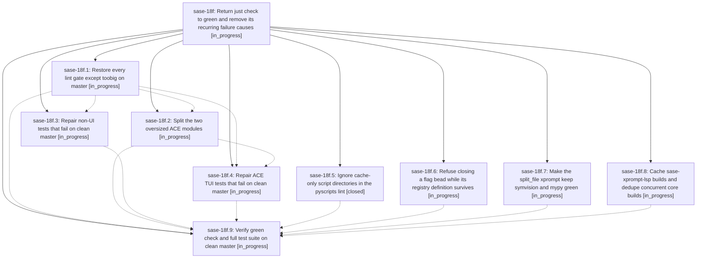

# Bead: sase-18f — Return just check to green and remove its recurring failure causes

[Bead Pages](../README.md) / sase-18f

**Status:** ◐ in_progress · **Type:** ▸ plan · **Tier:** epic
**Owner:** `bryanbugyi34@gmail.com` · **Created by:** [bbugyi200.athena.0rh](https://github.com/sase-org/sase--agents/blob/main/families/bbugyi200.athena.0rh.md) · **Assignee:** `sase-18f.land`
**Created:** 2026-09-24 17:18:50 EDT
**Plan:** [202609/green\_just\_check.md](https://github.com/sase-org/sase--plans/blob/main/202609/green_just_check.md)

## Description

A clean checkout of latest master passes `sase tool run check` and the full non-visual `just test` suite. The recurring causes found in the ToolRun ledger are removed: premature flag-bead closes, split-file agents that break symvision, stale `__pycache__`-only directories that fail pyscripts, and the uncached per-launch Rust LSP rebuild that pushes checks past agent command timeouts.

## Notes

[2026-09-24T21:40:34Z · sase-185.land] DISCOVERED ISSUE (from sase-185.1 PROPOSED FOLLOW-UP #1, re-verified by the sase-185 land agent at master c03c717da, clean tree): mypy 15 errors (10 attr-defined in ace/tui/widgets/_agent_detail_display.py/_agent_detail_state.py; 5 in ace/tui/command_line/input.py:159 and screen.py:1343-1362). test-waits: tests/ace/tui/command_line/test_completion_popup.py:181 fixed-sleep-missing-pragma. toobig: command_line/screen.py 1979 lines, widgets/decks/panel.py 1067 lines. symvision: once sase-185's own dead _dispatch_preview_source_summary is deleted (done in the sase-185 landing), it reports unused public command-line grammar/extras/signature/popup/restore/sources symbols, vim_search_controller helpers (invert_search_direction, offset_for_row, wrap_feedback_message), FileSourceLabel (file_panel/_file_list.py) and status_text (main/monitor_render.py, main/proc_render.py). Full just test lane: 41 deterministic clean-tree failures incl. tests/ace/tui/test_kill_and_edit_prompt_name.py x8 (TypeError: prepare_kill_and_edit_prompt() got an unexpected keyword argument 'family_name' - test not updated by 44ec3e62d sase-17m.4.1.3 rename; no task bead yet), test_config_schema, keymap help/defaults, LLM-calls panel, model completion panel titles, fakey test_cli help, test_launch_approval competing_family_successor, agent_jump_panel_visibility, test_prompt_file_completion ctrl_e, marker_mutation_audit, test_file_panel zoom cap, visual_fixture_host_paths, plus already-tracked sase-174/175/184/186/188/13p. ToolRun e9508bd2c3882f6b873a990f33deffcb.

## Phases

| Bead | Title | Status | Size | Created | Agents | Commits |
|---|---|---|---|---|---:|---:|
| [sase-18f.1](sase-18f.1.md) | Restore every lint gate except toobig on master | ◐ in_progress | medium | 2026-09-24 | 1 | 0 |
| [sase-18f.2](sase-18f.2.md) | Split the two oversized ACE modules | ◐ in_progress | medium | 2026-09-24 | 1 | 0 |
| [sase-18f.3](sase-18f.3.md) | Repair non-UI tests that fail on clean master | ◐ in_progress | medium | 2026-09-24 | 1 | 0 |
| [sase-18f.4](sase-18f.4.md) | Repair ACE TUI tests that fail on clean master | ◐ in_progress | medium | 2026-09-24 | 1 | 0 |
| [sase-18f.5](sase-18f.5.md) | Ignore cache-only script directories in the pyscripts lint | ✓ closed | xsmall | 2026-09-24 | 1 | 1 |
| [sase-18f.6](sase-18f.6.md) | Refuse closing a flag bead while its registry definition survives | ◐ in_progress | small | 2026-09-24 | 1 | 0 |
| [sase-18f.7](sase-18f.7.md) | Make the split\_file xprompt keep symvision and mypy green | ◐ in_progress | small | 2026-09-24 | 1 | 0 |
| [sase-18f.8](sase-18f.8.md) | Cache sase-xprompt-lsp builds and dedupe concurrent core builds | ◐ in_progress | medium | 2026-09-24 | 1 | 0 |
| [sase-18f.9](sase-18f.9.md) | Verify green check and full test suite on clean master | ◐ in_progress | small | 2026-09-24 | 1 | 0 |

## Lineage

## Agents

| Agent | Bead | Commits |
|---|---|---:|
| [bbugyi200.athena.sase-18f.1](https://github.com/sase-org/sase--agents/blob/main/agents/bbugyi200.athena.sase-18f.1/README.md) | [sase-18f.1](sase-18f.1.md) | 0 |
| [bbugyi200.athena.sase-18f.2](https://github.com/sase-org/sase--agents/blob/main/agents/bbugyi200.athena.sase-18f.2/README.md) | [sase-18f.2](sase-18f.2.md) | 0 |
| [bbugyi200.athena.sase-18f.3](https://github.com/sase-org/sase--agents/blob/main/agents/bbugyi200.athena.sase-18f.3/README.md) | [sase-18f.3](sase-18f.3.md) | 0 |
| [bbugyi200.athena.sase-18f.4](https://github.com/sase-org/sase--agents/blob/main/agents/bbugyi200.athena.sase-18f.4/README.md) | [sase-18f.4](sase-18f.4.md) | 0 |
| [bbugyi200.athena.sase-18f.5](https://github.com/sase-org/sase--agents/blob/main/agents/bbugyi200.athena.sase-18f.5/README.md) | [sase-18f.5](sase-18f.5.md) | 1 |
| [bbugyi200.athena.sase-18f.6](https://github.com/sase-org/sase--agents/blob/main/agents/bbugyi200.athena.sase-18f.6/README.md) | [sase-18f.6](sase-18f.6.md) | 0 |
| [bbugyi200.athena.sase-18f.7](https://github.com/sase-org/sase--agents/blob/main/agents/bbugyi200.athena.sase-18f.7/README.md) | [sase-18f.7](sase-18f.7.md) | 0 |
| [bbugyi200.athena.sase-18f.8](https://github.com/sase-org/sase--agents/blob/main/agents/bbugyi200.athena.sase-18f.8/README.md) | [sase-18f.8](sase-18f.8.md) | 0 |
| [bbugyi200.athena.sase-18f.9](https://github.com/sase-org/sase--agents/blob/main/agents/bbugyi200.athena.sase-18f.9/README.md) | [sase-18f.9](sase-18f.9.md) | 0 |
| [bbugyi200.athena.sase-18f.land](https://github.com/sase-org/sase--agents/blob/main/agents/bbugyi200.athena.sase-18f.land/README.md) | [sase-18f](README.md) | 0 |

## Commits

| Repo | Commit | Subject | Bead | Committed |
|---|---|---|---|---|
| sase | [`4b3699f`](https://github.com/sase-org/sase/commit/4b3699f0dc3242c723f498c654f643cec5f337d0) | fix: ignore cache-only script directories in pyscripts lint | [sase-18f.5](sase-18f.5.md) | 2026-09-24 18:03:38 EDT |

<!-- sase:referenced-by:start -->

## Referenced By

| Relation | Artifact | Why | Uses |
| --- | --- | --- | ---: |
| read-by | [agent:sase-185.land][1] | Check whether the sase-185.1 master-red follow-up belongs to this epic | 1 |

[1]: https://github.com/sase-org/sase--agents/blob/main/agents/bbugyi200.athena.sase-185.land/README.md

<!-- sase:referenced-by:end -->
