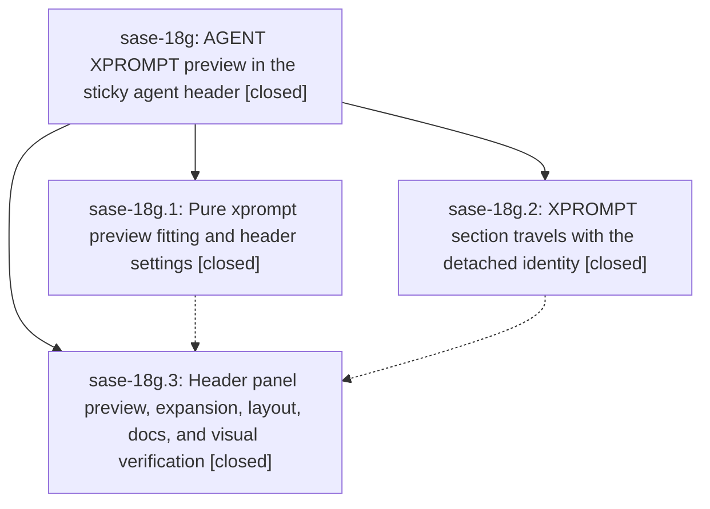

# Bead: sase-18g — AGENT XPROMPT preview in the sticky agent header

[Bead Pages](../README.md) / sase-18g

**Status:** ✓ closed · **Resolution:** done · **Type:** ▸ plan · **Tier:** epic
**Owner:** `bryanbugyi34@gmail.com` · **Created by:** [bbugyi200.athena.0rk](https://github.com/sase-org/sase--agents/blob/main/families/bbugyi200.athena.0rk.md) · **Assignee:** `sase-18g.land`
**Created:** 2026-09-24 17:41:27 EDT · **Closed:** 2026-09-24 23:14:12 EDT
**Plan:** [202609/agent\_header\_xprompt\_preview.md](https://github.com/sase-org/sase--plans/blob/main/202609/agent_header_xprompt_preview.md)

## Description

On the Agents tab, the selected agent's AGENT XPROMPT moves out of the data deck's Context card and into the sticky header panel above the deck. While collapsed, the header shows a dense, syntax-highlighted preview of the prompt. The preview fills the full panel width and as many rows as a height budget derived from the detail column allows. `d` expands the header to the complete xprompt alongside the full identity fields. Header and body always come from the same document, j/k never flickers on agents you have already visited, and the collapsed header no longer wastes a blank row.

## Notes

[2026-09-25T03:14:12Z · sase-18g.land] Verified: all 3 phases closed; commits 67b1b6c5a (preview module + ace.agent_header.collapsed_max_share setting), 4af219eba (xprompt detaches into IdentityHeader, LRU memo, pending flag, hint-cache key), 4858f20a2 (panel preview/expanded XPROMPT, budget, +N lines subtitle, pending hold, pin reapply, phantom-row CSS, docs) match the plan; sase-18g.3 dropped every sase-18g --epic-symbol (epic-symbols reports none). Landing fixes (uncommitted landing diff): (1) expanded header rendered 3 blank rows before AGENT XPROMPT (Group(expanded, Text('\n'))) -> exactly one, with a unit test; (2) agents_xprompt PNG tests pressed d before the header had an identity (d is then a no-op) and the capped expanded header hid sase_plan at 120x40 -> wait for the header subtitle, move to 160x50 goldens (old 120x40 goldens removed); (3) added agents_header_preview_{truncated,fits}_160x50 goldens the panel phase skipped; (4) full just fix-tui-screenshots regenerated 130 Agents/launch-bar/cleanup goldens for the removed phantom row and moved XPROMPT (inspected representatives; unrelated command_line/palette drift reverted); (5) docs/agent_families.md no longer calls AGENT XPROMPT a body Ctrl+J anchor. Live sase screenshot at 200x55: collapsed quote-bar preview under the chip rows, no blank row, body starts at SASE CONTEXT, d expands to fields + AGENT XPROMPT. Integration: 15 commits since 4af219eba reviewed; none touch the header/identity code or duplicate it. just check (-k): fmt/ruff/flags/pyscripts/changelog/validate/plans pass; mypy, test-waits, symvision and 49 scoped tests fail identically without the epic. Follow-ups: 18g.1 master-red -> +1 sase-18s/sase-18q/sase-18r, symvision part resolved by 4fb83bb4f and toobig dropped from check by 951ff0a10; 18g.2 & 18g.3#4 symvision survivors -> declined, fixed by 4fb83bb4f; 18g.3#1 search overlay & #5 parallel step -> +1 sase-18s; 18g.3#2 goldens -> done in this landing; 18g.3#3 wheel-cache mypy -> +1 sase-18q. Discovered: command_line golden drift -> +1 sase-18o; stale sase-18i epic-symbols -> note on sase-18i; tool run -k shows ✓ for failed stages -> note on sase-18j; 26 pre-existing Agents visual failures (legacy detail UI/ctrl+j section stops, incl. family agent-xprompt retarget) and deck-focus capture nondeterminism -> notes on sase-17d.10.1.

## Phases

| Bead | Title | Status | Size | Created | Agents | Commits |
|---|---|---|---|---|---:|---:|
| [sase-18g.1](sase-18g.1.md) | Pure xprompt preview fitting and header settings | ✓ closed | medium | 2026-09-24 | 1 | 1 |
| [sase-18g.2](sase-18g.2.md) | XPROMPT section travels with the detached identity | ✓ closed | medium | 2026-09-24 | 1 | 1 |
| [sase-18g.3](sase-18g.3.md) | Header panel preview, expansion, layout, docs, and visual verification | ✓ closed | medium | 2026-09-24 | 1 | 1 |

## Lineage

## Agents

| Agent | Bead | Commits |
|---|---|---:|
| [bbugyi200.athena.sase-18g.1](https://github.com/sase-org/sase--agents/blob/main/agents/bbugyi200.athena.sase-18g.1/README.md) | [sase-18g.1](sase-18g.1.md) | 1 |
| [bbugyi200.athena.sase-18g.2](https://github.com/sase-org/sase--agents/blob/main/agents/bbugyi200.athena.sase-18g.2/README.md) | [sase-18g.2](sase-18g.2.md) | 1 |
| [bbugyi200.athena.sase-18g.3](https://github.com/sase-org/sase--agents/blob/main/agents/bbugyi200.athena.sase-18g.3/README.md) | [sase-18g.3](sase-18g.3.md) | 1 |
| [bbugyi200.athena.sase-18g.land](https://github.com/sase-org/sase--agents/blob/main/agents/bbugyi200.athena.sase-18g.land/README.md) | [sase-18g](README.md) | 3 |

## Commits

| Repo | Commit | Subject | Bead | Committed |
|---|---|---|---|---|
| sase | [`4af219e`](https://github.com/sase-org/sase/commit/4af219ebae29fdc28715fbf7ecd9dbc1efccc9ad) | feat(ace): detach agent xprompts into identity headers | [sase-18g.2](sase-18g.2.md) | 2026-09-24 19:34:46 EDT |
| sase | [`67b1b6c`](https://github.com/sase-org/sase/commit/67b1b6c5a88fd973812adc2f537038a535d16715) | feat(ace): add pure xprompt header preview fitting and header settings (sase-18g.1) | [sase-18g.1](sase-18g.1.md) | 2026-09-24 19:35:50 EDT |
| sase | [`4858f20`](https://github.com/sase-org/sase/commit/4858f20a2d0016b21e78558c433854112108de2c) | feat(ace): collapsed header shows xprompt preview rows with budget and overflow | [sase-18g.3](sase-18g.3.md) | 2026-09-24 21:09:06 EDT |
| sase | [`d2c2dd1`](https://github.com/sase-org/sase/commit/d2c2dd1429db97bc66928f28ce178ee84be5b73a) | fix(ace): land sase-18g header XPROMPT preview goldens and spacing | [sase-18g](README.md) | 2026-09-25 00:33:04 EDT |
| sase | [`7840592`](https://github.com/sase-org/sase/commit/7840592c5e22e99f91f0c71dd385e3c98ad8eb39) | fix(check): clear sase-18j triage lint stragglers | [sase-18g](README.md) | 2026-09-25 00:43:46 EDT |
| sase--plans | [`sase--plans@25e53da`](https://github.com/sase-org/sase--plans/commit/25e53dae16293c4e7c11e467af3f1d9010f13b4f) | docs(plans): record sase-18g agent header XPROMPT preview landing | [sase-18g](README.md) | 2026-09-25 00:46:43 EDT |

<!-- sase:referenced-by:start -->

## Referenced By

| Relation | Artifact | Why | Uses |
| --- | --- | --- | ---: |
| read-by | [agent:sase-18g.3][1] | Need parent epic status for panel phase | 1 |
| read-by | [agent:sase-18g.land][2] | Need the epic scope, children, and linked plan file | 2 |

[1]: https://github.com/sase-org/sase--agents/blob/main/agents/bbugyi200.athena.sase-18g.3/README.md
[2]: https://github.com/sase-org/sase--agents/blob/main/agents/bbugyi200.athena.sase-18g.land/README.md

<!-- sase:referenced-by:end -->
