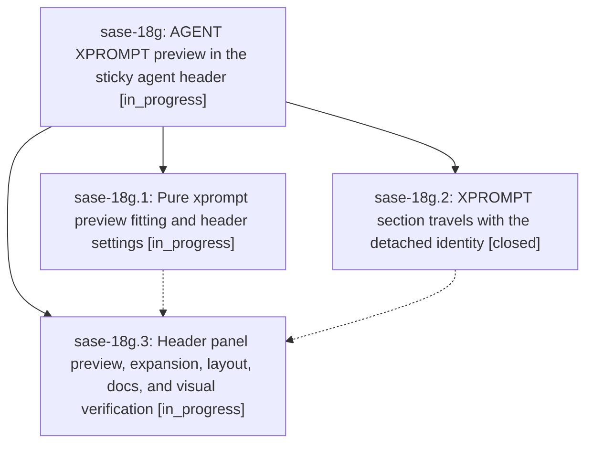

# Bead: sase-18g — AGENT XPROMPT preview in the sticky agent header

[Bead Pages](../README.md) / sase-18g

**Status:** ◐ in_progress · **Type:** ▸ plan · **Tier:** epic
**Owner:** `bryanbugyi34@gmail.com` · **Created by:** [bbugyi200.athena.0rk](https://github.com/sase-org/sase--agents/blob/main/families/bbugyi200.athena.0rk.md) · **Assignee:** `sase-18g.land`
**Created:** 2026-09-24 17:41:27 EDT
**Plan:** [202609/agent\_header\_xprompt\_preview.md](https://github.com/sase-org/sase--plans/blob/main/202609/agent_header_xprompt_preview.md)

## Description

On the Agents tab, the selected agent's AGENT XPROMPT moves out of the data deck's Context card and into the sticky header panel above the deck. While collapsed, the header shows a dense, syntax-highlighted preview of the prompt. The preview fills the full panel width and as many rows as a height budget derived from the detail column allows. `d` expands the header to the complete xprompt alongside the full identity fields. Header and body always come from the same document, j/k never flickers on agents you have already visited, and the collapsed header no longer wastes a blank row.

## Phases

| Bead | Title | Status | Size | Created | Agents | Commits |
|---|---|---|---|---|---:|---:|
| [sase-18g.1](sase-18g.1.md) | Pure xprompt preview fitting and header settings | ◐ in_progress | medium | 2026-09-24 | 1 | 0 |
| [sase-18g.2](sase-18g.2.md) | XPROMPT section travels with the detached identity | ✓ closed | medium | 2026-09-24 | 1 | 1 |
| [sase-18g.3](sase-18g.3.md) | Header panel preview, expansion, layout, docs, and visual verification | ◐ in_progress | medium | 2026-09-24 | 1 | 0 |

## Lineage

## Agents

| Agent | Bead | Commits |
|---|---|---:|
| [bbugyi200.athena.sase-18g.1](https://github.com/sase-org/sase--agents/blob/main/agents/bbugyi200.athena.sase-18g.1/README.md) | [sase-18g.1](sase-18g.1.md) | 0 |
| [bbugyi200.athena.sase-18g.2](https://github.com/sase-org/sase--agents/blob/main/agents/bbugyi200.athena.sase-18g.2/README.md) | [sase-18g.2](sase-18g.2.md) | 1 |
| [bbugyi200.athena.sase-18g.3](https://github.com/sase-org/sase--agents/blob/main/agents/bbugyi200.athena.sase-18g.3/README.md) | [sase-18g.3](sase-18g.3.md) | 0 |
| [bbugyi200.athena.sase-18g.land](https://github.com/sase-org/sase--agents/blob/main/agents/bbugyi200.athena.sase-18g.land/README.md) | [sase-18g](README.md) | 0 |

## Commits

| Repo | Commit | Subject | Bead | Committed |
|---|---|---|---|---|
| sase | [`4af219e`](https://github.com/sase-org/sase/commit/4af219ebae29fdc28715fbf7ecd9dbc1efccc9ad) | feat(ace): detach agent xprompts into identity headers | [sase-18g.2](sase-18g.2.md) | 2026-09-24 19:34:46 EDT |
