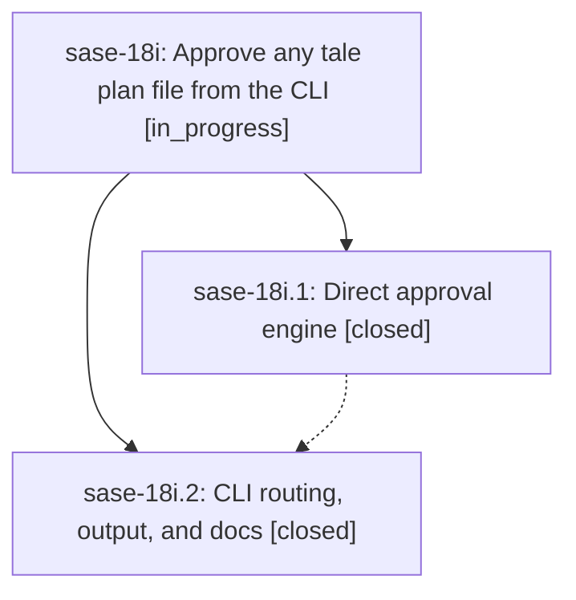

# Bead: sase-18i — Approve any tale plan file from the CLI

[Bead Pages](../README.md) / sase-18i

**Status:** ◐ in_progress · **Type:** ▸ plan · **Tier:** epic
**Owner:** `bryanbugyi34@gmail.com` · **Created by:** [bbugyi200.athena.0rr](https://github.com/sase-org/sase--agents/blob/main/families/bbugyi200.athena.0rr.md) · **Assignee:** `sase-18i.land`
**Created:** 2026-09-24 19:04:55 EDT
**Plan:** [202609/plan\_approve\_gateless\_tales.md](https://github.com/sase-org/sase--plans/blob/main/202609/plan_approve_gateless_tales.md)

<!-- sase:links:start -->

## Links

| Relation | Artifact | Why |
| --- | --- | --- |
| related | file:explicit:f3e4b63c06d70e0a48574b14 | attached via sase artifact create --bead |

_Plus 2 automatic references — see [Referenced By](#referenced-by)._

<!-- sase:links:end -->

## Description

`sase plan approve <plan>` commits and approves a tale plan the way sase's TUI does — through its live approval gate when one exists, and otherwise by committing the plan itself and launching a `#coder` agent into the planner's agent family, or as a standalone agent when no family can be found. `-k/--kind` defaults to `tale`, and every success, dry run, refusal, and failure prints a clear, colored summary.

## Notes

[2026-09-25T01:21:18Z · sase-18i.land] LANDING INTERRUPTED: all child phases closed, but drift audit at master 4858f20a2 found remaining epic work. Commit 65d3dfb1d made %id(..., session=...) canonical; direct approval still emits %id(code, family=planner), which is rejected when legacy_agent_family_syntax is disabled. The original epic plan also requires tests/test_plan_approve_render.py, absent from the tree; the executor already_answered race writes receipt/archive then raises a refusal rather than returning the required warning and accurate recovery state. Planned only this remaining work in sase_plan_approve_cli_landing_integration.md for a child tale. FOLLOW-UP TRIAGE: sase-18i.1 #1 declined as already fixed by 4fb83bb4f (Survivor and AgentSurvivorsError production consumers; environ_has_launch_key privatized). sase-18i.1 #2 declined as already addressed by sase-18f.2 module splits, with toobig intentionally removed from just check by 951ff0a10; no current epic blocker. sase-18i.2 #1 independently reproduced by ToolRun 35b774a2ffcc7928d60f2561619d369f on 4858f20a2, routed as DISCOVERED ISSUE to active sase-18f / open final phase sase-18f.9, so no duplicate task was created. Its source snapshot is file:explicit:f3e4b63c06d70e0a48574b14. Seven sase-18i epic-symbol entries remain for resumed land agent to resolve before close. Do not close this epic until the child tale lands and check is re-evaluated.

## Phases

| Bead | Title | Status | Size | Created | Agents | Commits |
|---|---|---|---|---|---:|---:|
| [sase-18i.1](sase-18i.1.md) | Direct approval engine | ✓ closed | medium | 2026-09-24 | 1 | 1 |
| [sase-18i.2](sase-18i.2.md) | CLI routing, output, and docs | ✓ closed | medium | 2026-09-24 | 1 | 1 |

## Lineage

## Agents

| Agent | Bead | Commits |
|---|---|---:|
| [bbugyi200.athena.sase-18i.1](https://github.com/sase-org/sase--agents/blob/main/agents/bbugyi200.athena.sase-18i.1/README.md) | [sase-18i.1](sase-18i.1.md) | 1 |
| [bbugyi200.athena.sase-18i.2](https://github.com/sase-org/sase--agents/blob/main/agents/bbugyi200.athena.sase-18i.2/README.md) | [sase-18i.2](sase-18i.2.md) | 1 |
| [bbugyi200.athena.sase-18i.land](https://github.com/sase-org/sase--agents/blob/main/families/bbugyi200.athena.sase-18i.land.md) | [sase-18i](README.md) | 1 |

## Commits

| Repo | Commit | Subject | Bead | Committed |
|---|---|---|---|---|
| sase | [`4d0ad9b`](https://github.com/sase-org/sase/commit/4d0ad9ba5da30f3a5917fb67f4e23cb110219346) | feat(plan): implement direct approval engine for gateless tales | [sase-18i.1](sase-18i.1.md) | 2026-09-24 20:05:06 EDT |
| sase | [`e5c80e5`](https://github.com/sase-org/sase/commit/e5c80e5ad1a61ab7cb4f87ffe054d78c9bc9c16d) | feat(plan): approve gateless plans from CLI | [sase-18i.2](sase-18i.2.md) | 2026-09-24 20:58:05 EDT |
| sase | [`11b9c56`](https://github.com/sase-org/sase/commit/11b9c56b0d8f5ee36afca4cb11773438a9feb4a1) | fix(plan): emit session= coder prompts and settle concurrent gate answers | [sase-18i](README.md) | 2026-09-24 22:25:53 EDT |

<!-- sase:referenced-by:start -->

## Referenced By

| Relation | Artifact | Why | Uses |
| --- | --- | --- | ---: |
| read-by | [agent:sase-18i.1][1] | parent epic scope | 1 |
| read-by | [agent:sase-18i.2][2] | Need identify a still-open parent or later phase to own remaining epic symbols before closing assigned phase | 1 |

[1]: https://github.com/sase-org/sase--agents/blob/main/agents/bbugyi200.athena.sase-18i.1/README.md
[2]: https://github.com/sase-org/sase--agents/blob/main/agents/bbugyi200.athena.sase-18i.2/README.md

<!-- sase:referenced-by:end -->
