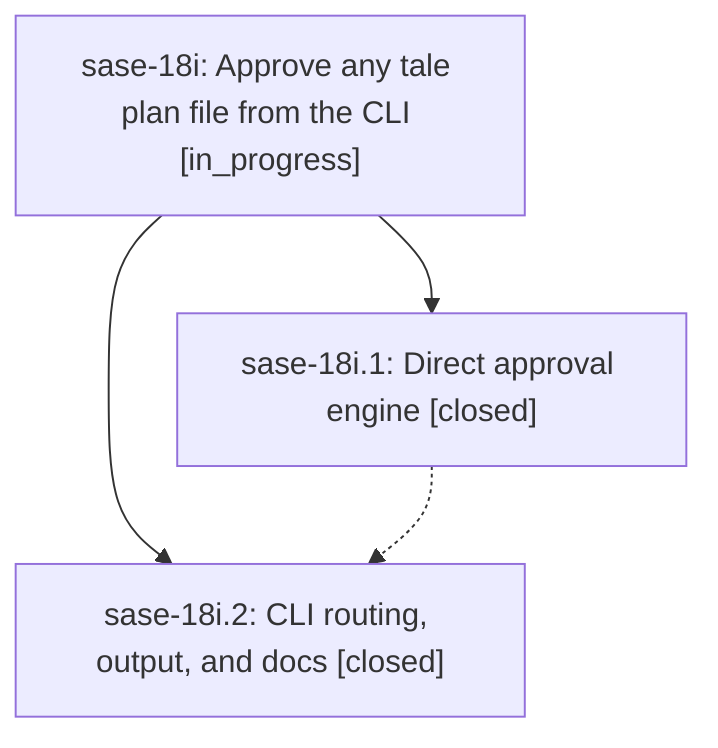

# Bead: sase-18i — Approve any tale plan file from the CLI

[Bead Pages](../README.md) / sase-18i

**Status:** ◐ in_progress · **Type:** ▸ plan · **Tier:** epic
**Owner:** `bryanbugyi34@gmail.com` · **Created by:** [bbugyi200.athena.0rr](https://github.com/sase-org/sase--agents/blob/main/families/bbugyi200.athena.0rr.md) · **Assignee:** `sase-18i.land`
**Created:** 2026-09-24 19:04:55 EDT
**Plan:** [202609/plan\_approve\_gateless\_tales.md](https://github.com/sase-org/sase--plans/blob/main/202609/plan_approve_gateless_tales.md)

## Description

`sase plan approve <plan>` commits and approves a tale plan the way sase's TUI does — through its live approval gate when one exists, and otherwise by committing the plan itself and launching a `#coder` agent into the planner's agent family, or as a standalone agent when no family can be found. `-k/--kind` defaults to `tale`, and every success, dry run, refusal, and failure prints a clear, colored summary.

## Phases

| Bead | Title | Status | Size | Created | Agents | Commits |
|---|---|---|---|---|---:|---:|
| [sase-18i.1](sase-18i.1.md) | Direct approval engine | ✓ closed | medium | 2026-09-24 | 1 | 1 |
| [sase-18i.2](sase-18i.2.md) | CLI routing, output, and docs | ✓ closed | medium | 2026-09-24 | 1 | 1 |

## Lineage

## Agents

| Agent | Bead | Commits |
|---|---|---:|
| [bbugyi200.athena.sase-18i.1](https://github.com/sase-org/sase--agents/blob/main/agents/bbugyi200.athena.sase-18i.1/README.md) | [sase-18i.1](sase-18i.1.md) | 1 |
| [bbugyi200.athena.sase-18i.2](https://github.com/sase-org/sase--agents/blob/main/agents/bbugyi200.athena.sase-18i.2/README.md) | [sase-18i.2](sase-18i.2.md) | 1 |
| [bbugyi200.athena.sase-18i.land](https://github.com/sase-org/sase--agents/blob/main/agents/bbugyi200.athena.sase-18i.land/README.md) | [sase-18i](README.md) | 0 |

## Commits

| Repo | Commit | Subject | Bead | Committed |
|---|---|---|---|---|
| sase | [`4d0ad9b`](https://github.com/sase-org/sase/commit/4d0ad9ba5da30f3a5917fb67f4e23cb110219346) | feat(plan): implement direct approval engine for gateless tales | [sase-18i.1](sase-18i.1.md) | 2026-09-24 20:05:06 EDT |
| sase | [`e5c80e5`](https://github.com/sase-org/sase/commit/e5c80e5ad1a61ab7cb4f87ffe054d78c9bc9c16d) | feat(plan): approve gateless plans from CLI | [sase-18i.2](sase-18i.2.md) | 2026-09-24 20:58:05 EDT |

<!-- sase:referenced-by:start -->

## Referenced By

| Relation | Artifact | Why | Uses |
| --- | --- | --- | ---: |
| read-by | [agent:sase-18i.1][1] | parent epic scope | 1 |

[1]: https://github.com/sase-org/sase--agents/blob/main/agents/bbugyi200.athena.sase-18i.1/README.md

<!-- sase:referenced-by:end -->
