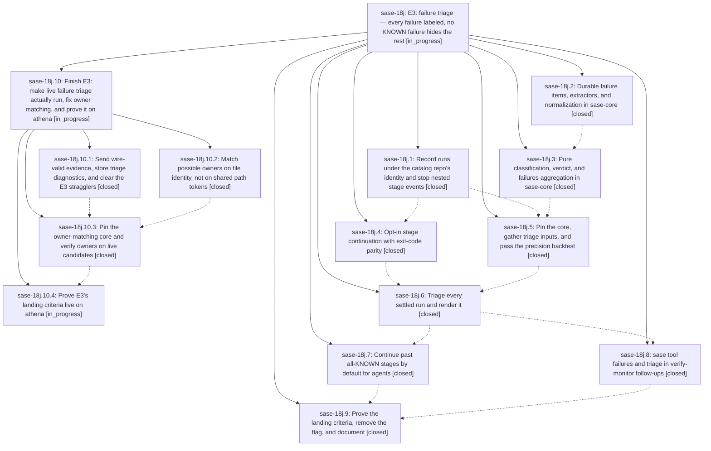

# Bead: sase-18j — E3: failure triage — every failure labeled, no KNOWN failure hides the rest

[Bead Pages](../README.md) / sase-18j

**Status:** ◐ in_progress · **Type:** ▸ plan · **Tier:** epic
**Owner:** `bryanbugyi34@gmail.com` · **Created by:** [bbugyi200.athena.0rq](https://github.com/sase-org/sase--agents/blob/main/sessions/bbugyi200.athena.0rq.md) · **Assignee:** `sase-18j.land`
**Created:** 2026-09-24 19:06:59 EDT
**Plan:** [202609/tool\_e3\_failure\_triage.md](https://github.com/sase-org/sase--plans/blob/main/202609/tool_e3_failure_triage.md)

<!-- sase:links:start -->

## Links

| Relation | Artifact | Why |
| --- | --- | --- |
| related | [bead:sase-19s][1] | E3 failure-triage epic whose v1 extractor registry this extends; phase sase-18j.2 proposed it |

_Plus 5 automatic references — see [Referenced By](#referenced-by)._

[1]: https://github.com/sase-org/sase--beads/blob/main/pages/sase-19s/README.md

<!-- sase:links:end -->

## Description

On a red master, an agent's `sase tool run check` runs past stages whose failures are all KNOWN or FLAKY, so its tests still run. It labels every failure item NEW, KNOWN, FLAKY, or UNKNOWN with evidence, prints one verdict line, and keeps the exit code that fail-fast `just check` would have returned. `sase tool failures` groups the machine's red-master signatures, and verify-monitor follow-ups carry the verdict. KNOWN precision is proven by a chronological backtest before any agent sees a label.

## Notes

[2026-09-25T03:10:22Z · sase-18g.land] DISCOVERED ISSUE: (from sase-18g.land) sase tool run -k check (continuation from sase-18j.4) prints '✓ <stage>' in the final stage summary for stages that exited 1. Run 426c1186cdae13bf84f61fee3a1caf08 at eb6407355: events.jsonl records finished exit_code=1 + continued for lint (mypy), lint (test waits), lint (symvision) and test (scoped), yet stdout lists all four with ✓ and only the trailer says '✗ 4 stage(s) failed'. The failed stages' output is also not retained (logs dir holds only stdout/stderr/events), so an agent cannot see which stage failed or why without rerunning each recipe.

[2026-09-25T03:53:18Z · sase-17m.4.1.land] DISCOVERED ISSUE (from sase-17m.4.1.8 PROPOSED FOLLOW-UP #1): the still-open tool triage epic owns Justfile --epic-symbol entries for tool_run_triage_record/show/stage/settle and tool_run_failures. Phase 1.8 observed Symvision unused-public reports for triage_inputs gather_*/triage_knobs and core/tool_run triage helpers on clean HEAD. Retire each exemption once a production consumer exists; the sase-17m.4.1 epic has no epic-symbol entries.

[2026-09-25T04:41:11Z · sase-18f.land] FIXED BY sase-18f.land (green-check epic landing, on top of master ae34dba20): cdcbcdd9d (sase-18j.5) left master check red in four ways, all repaired in the sase-18f landing commit: (1) mypy tools/smoke_sase_core_rs_tool_runs:75 fingerprint annotated dict[str, Any]; (2) pyscripts Rule 1 - tools/tool_triage_backtest had no reference outside tools/, now covered by tests/test_tool_triage_backtest_tool.py (empty-ledger run writes report/audit and never creates the store); (3) the '# e3 record-and-render ...' comment line inside the continued _lint-symvision command made just comment out every later --epic-symbol argument and {{ args }} - moved into the recipe header comment; (4) symvision: gather_ancestry, gather_flake_baseline, gather_selection_records, tool_run_triage_classify, tool_run_triage_verdict now carry '# symvision: tools/tool_triage_backtest' pragmas (real non-test consumer); gather_owner_candidates and triage_knobs got --epic-symbol 'sase-18j(...)' entries for the settle phase to consume - retire them when sase-18j.6 wires them up. Also regenerated tools/{CLAUDE,GEMINI,QWEN,OPENCODE}.md shims for the tools/AGENTS.md Triage backtest section (sase memory init --check was red).

[2026-09-25T11:47:01Z · sase-191.2] FIXED BY sase-191.2: note #1's '✓ <stage>' for continued failures; persisting failed-stage output in the ledger remains sase-18j.6's failed-stage output capture.

[2026-09-25T14:00:49Z · sase-191.3] DISCOVERED ISSUE: core owner matching over-matches. Probe: tool_run_triage_classify on a KNOWN fixture with locator src/sase/tool/executor.py against 319 live owner candidates returned possible_owners sase-106 (gate_shell handoff bug) and sase-10a (sase-gateway fleet CI) -- neither touches src/sase/tool/. Cause (fact 8): locator_tokens keeps every 3+ char token and match_owners does substring tests, so every sase-* bead matches via the sase token. The core needs a token stoplist or a path-level match, plus a pin move, before owners render. Read-only probe; no bead mutated. -r precision-gate owner probe

[2026-09-25T22:27:51Z · sase-19i.4--1] DISCOVERED ISSUE: sase-19i.4 dropped already-used --epic-symbol sase-18j(tool_run_triage_record) and sase-18j(tool_run_triage_stage) (consumers exist). Remaining whitelist: tool_run_failures and stage_decision (unused public in src/sase/tool/triage_stage.py). Land should consume or privatize those two.

[2026-09-25T23:01:10Z · sase-18j.land] LANDING INTERRUPTED (sase-18j.land, master 7512f4e9a1, core pin d64520b): all 9 phases are closed and their commits are on master, but the live acceptance shows E3's two agent-visible behaviors do not work in production. The remaining work is planned as a child epic parented to this bead.

Evidence:
- Live run f1c9ad8815926dac689f98882dc4c192 (`sase tool run check` from this land agent on clean master): the symvision stage recorded `stopped mode=known reason=helper_error`. Settle then printed `triage unavailable: ... unknown field failures`, and the run shows `triaged=false verdict=undetermined(not_triaged)`.
- Root cause: `gather_selection_records` (src/sase/tool/triage_inputs.py) emits a `failures` key. ToolRunTriageEvidenceRunWire (deny_unknown_fields) refuses it in both `tool_run_triage_stage` and `tool_run_triage_settle`. Only tools/tool_triage_backtest converts failures to items (`_selection_items`).
- Impact: known-gated continuation always stops with `helper_error`, and settle triage fails whenever any full-run selection record exists within 7 days (345 on athena now). 25 of 27 named check runs since 71b25fbf4e were never triaged. The only runs that were triaged are the ones where the selection gatherer yielded nothing.
- Secondary: each settle gatherer gets a 1.0 s slice. Measured in fresh processes at load1~17: owners 0.60 s, selection 0.05 s. A slow gatherer is dropped rather than aborting the triage, but dropped-gatherer diagnostics are only printed in the footer, never stored, and owners have little headroom under load. (The 2.3 s/3.3 s first measurement was a cold-cache outlier.)
- Master is red at lint (symvision): `stage_decision` in src/sase/tool/triage_stage.py is unused-public (note #6).
- Owner over-match (note #5) is still present at the pin. `locator_tokens`/`match_owners` in sase-core classify.rs substring-match 3+ char tokens such as `sase`/`src`/`tool` against 256 live candidates.

Follow-up dispositions so far:
- Flag bead sase-19a closed; the flag was removed in 49c32e19ec.
- sase-18j.2 #3 (specific extractors): new feature task sase-19s.
- sase-18j.7 #4 (handoff store-busy flake): +1 on duplicate sase-18t. It is an ad-hoc run, so no triage runs there.
- Plan's sase-148 corroboration: +1 on sase-148; the stale sentence persists.
- Moved into the child epic as epic-caused work: sase-18j.1 #2 (unscoped monitor lookup fallback for linked-repo identities), sase-18j.7 #3 (`stopd` marker), sase-18j.9 #1 (backtest re-run, live acceptance, measurement baseline), notes #5 and #6.
- Declined as already resolved on master (live run f1c9ad88: _setup, mypy, pyscripts, and test-waits green; symvision shows only stage_decision): sase-18j.1 #1, sase-18j.4 #1, sase-18j.7 #1/#2, sase-18j.8 #1/#2 (pre-existing reds fixed by sase-18f and the d86bcc3ac2/dbc94a00bf pin flip).
- sase-18j.5 #1 was resolved by sase-191 (DoD-5 PASS).
- Epic notes #1–#4 were resolved (FIXED BY sase-191.2 / sase-18f.land; no --epic-symbol entries remain).

Integration check: the non-epic commits since 290cd1aa7c that touch triage-adjacent files are core pin ratchets (the pin still carries every triage binding), sase-191 repairs, and rename sweeps. None duplicates or conflicts with E3.

## Phases

| Bead | Title | Status | Size | Created | Agents | Commits |
|---|---|---|---|---|---:|---:|
| [sase-18j.1](sase-18j.1.md) | Record runs under the catalog repo's identity and stop nested stage events | ✓ closed | medium | 2026-09-24 | 1 | 1 |
| [sase-18j.2](sase-18j.2.md) | Durable failure items, extractors, and normalization in sase-core | ✓ closed | large | 2026-09-24 | 1 | 1 |
| [sase-18j.3](sase-18j.3.md) | Pure classification, verdict, and failures aggregation in sase-core | ✓ closed | large | 2026-09-24 | 1 | 1 |
| [sase-18j.4](sase-18j.4.md) | Opt-in stage continuation with exit-code parity | ✓ closed | medium | 2026-09-24 | 1 | 1 |
| [sase-18j.5](sase-18j.5.md) | Pin the core, gather triage inputs, and pass the precision backtest | ✓ closed | large | 2026-09-24 | 1 | 1 |
| [sase-18j.6](sase-18j.6.md) | Triage every settled run and render it | ✓ closed | large | 2026-09-24 | 1 | 1 |
| [sase-18j.7](sase-18j.7.md) | Continue past all-KNOWN stages by default for agents | ✓ closed | medium | 2026-09-24 | 1 | 1 |
| [sase-18j.8](sase-18j.8.md) | sase tool failures and triage in verify-monitor follow-ups | ✓ closed | medium | 2026-09-24 | 1 | 1 |
| [sase-18j.9](sase-18j.9.md) | Prove the landing criteria, remove the flag, and document | ✓ closed | medium | 2026-09-24 | 1 | 1 |

## Lineage

## Agents

| Agent | Bead | Commits |
|---|---|---:|
| [bbugyi200.athena.sase-18j.1](https://github.com/sase-org/sase--agents/blob/main/agents/bbugyi200.athena.sase-18j.1/README.md) | [sase-18j.1](sase-18j.1.md) | 1 |
| [bbugyi200.athena.sase-18j.10.1](https://github.com/sase-org/sase--agents/blob/main/sessions/bbugyi200.athena.sase-18j.10.1.md) | [sase-18j.10.1](sase-18j.10.1.md) | 1 |
| [bbugyi200.athena.sase-18j.10.2](https://github.com/sase-org/sase--agents/blob/main/agents/bbugyi200.athena.sase-18j.10.2/README.md) | [sase-18j.10.2](sase-18j.10.2.md) | 1 |
| [bbugyi200.athena.sase-18j.10.3](https://github.com/sase-org/sase--agents/blob/main/agents/bbugyi200.athena.sase-18j.10.3/README.md) | [sase-18j.10.3](sase-18j.10.3.md) | 1 |
| [bbugyi200.athena.sase-18j.10.4](https://github.com/sase-org/sase--agents/blob/main/agents/bbugyi200.athena.sase-18j.10.4/README.md) | [sase-18j.10.4](sase-18j.10.4.md) | 0 |
| [bbugyi200.athena.sase-18j.10.land](https://github.com/sase-org/sase--agents/blob/main/agents/bbugyi200.athena.sase-18j.10.land/README.md) | [sase-18j.10](sase-18j.10.md) | 0 |
| [bbugyi200.athena.sase-18j.2](https://github.com/sase-org/sase--agents/blob/main/sessions/bbugyi200.athena.sase-18j.2.md) | [sase-18j.2](sase-18j.2.md) | 1 |
| [bbugyi200.athena.sase-18j.3](https://github.com/sase-org/sase--agents/blob/main/sessions/bbugyi200.athena.sase-18j.3.md) | [sase-18j.3](sase-18j.3.md) | 1 |
| [bbugyi200.athena.sase-18j.4](https://github.com/sase-org/sase--agents/blob/main/agents/bbugyi200.athena.sase-18j.4/README.md) | [sase-18j.4](sase-18j.4.md) | 1 |
| [bbugyi200.athena.sase-18j.5](https://github.com/sase-org/sase--agents/blob/main/sessions/bbugyi200.athena.sase-18j.5.md) | [sase-18j.5](sase-18j.5.md) | 1 |
| [bbugyi200.athena.sase-18j.6](https://github.com/sase-org/sase--agents/blob/main/sessions/bbugyi200.athena.sase-18j.6.md) | [sase-18j.6](sase-18j.6.md) | 1 |
| [bbugyi200.athena.sase-18j.7](https://github.com/sase-org/sase--agents/blob/main/agents/bbugyi200.athena.sase-18j.7/README.md) | [sase-18j.7](sase-18j.7.md) | 1 |
| [bbugyi200.athena.sase-18j.8](https://github.com/sase-org/sase--agents/blob/main/agents/bbugyi200.athena.sase-18j.8/README.md) | [sase-18j.8](sase-18j.8.md) | 1 |
| [bbugyi200.athena.sase-18j.9](https://github.com/sase-org/sase--agents/blob/main/agents/bbugyi200.athena.sase-18j.9/README.md) | [sase-18j.9](sase-18j.9.md) | 1 |
| [bbugyi200.athena.sase-18j.land](https://github.com/sase-org/sase--agents/blob/main/sessions/bbugyi200.athena.sase-18j.land.md) | [sase-18j](README.md) | 0 |

## Commits

| Repo | Commit | Subject | Bead | Committed |
|---|---|---|---|---|
| sase-core | [`sase-core@8315364`](https://github.com/sase-org/sase-core/commit/83153645fe14cdcc34c73b665a93b2cc84e987ee) | feat(triage): durable failure items, extractors, normalization, and extract/record/show bindings | [sase-18j.2](sase-18j.2.md) | 2026-09-24 20:24:05 EDT |
| sase | [`290cd1a`](https://github.com/sase-org/sase/commit/290cd1aa7c8b646dfefd8e457acc0f9fa5c571aa) | fix(tool): record runs under the catalog repo identity and stop nested stage events (sase-18j.1) | [sase-18j.1](sase-18j.1.md) | 2026-09-24 20:52:11 EDT |
| sase | [`eb64073`](https://github.com/sase-org/sase/commit/eb640735540d73d728e31ecfb1323fe09ba84dd4) | feat(tool): add opt-in stage continuation | [sase-18j.4](sase-18j.4.md) | 2026-09-24 21:27:04 EDT |
| sase-core | [`sase-core@321e7b4`](https://github.com/sase-org/sase-core/commit/321e7b4762ff461f189ce18281c8306e0fb9c0eb) | feat(triage): pure classification, verdict, stage/settle, and failures aggregation | [sase-18j.3](sase-18j.3.md) | 2026-09-24 21:30:41 EDT |
| sase | [`cdcbcdd`](https://github.com/sase-org/sase/commit/cdcbcdd9d3988359f1b4fc77d6d0454632a4e760) | feat(tool): add triage input backtest | [sase-18j.5](sase-18j.5.md) | 2026-09-24 22:45:15 EDT |
| sase | [`71b25fb`](https://github.com/sase-org/sase/commit/71b25fbf4eb20f3e184f25104307e20cc5488515) | feat(tool): render settled failure triage | [sase-18j.6](sase-18j.6.md) | 2026-09-25 15:05:30 EDT |
| sase | [`d17a753`](https://github.com/sase-org/sase/commit/d17a7534ad595b45e7076755e0ddd84c1d378460) | feat(tool): known-gated continuation for agent runs | [sase-18j.7](sase-18j.7.md) | 2026-09-25 16:27:31 EDT |
| sase | [`89868a9`](https://github.com/sase-org/sase/commit/89868a90b2e48eae1de60c8d24ce35682bbe46fc) | feat(tool): add sase tool failures and follow-up triage | [sase-18j.8](sase-18j.8.md) | 2026-09-25 17:35:25 EDT |
| sase | [`49c32e1`](https://github.com/sase-org/sase/commit/49c32e19ec698c6c305ca374ee49421668f04215) | feat(tool): finalize failure triage | [sase-18j.9](sase-18j.9.md) | 2026-09-25 18:12:43 EDT |
| sase-core | [`sase-core@9d049aa`](https://github.com/sase-org/sase-core/commit/9d049aac62ff173e41c9fec59734fcfc4af982d8) | fix(triage): match possible owners on file identity | [sase-18j.10.2](sase-18j.10.2.md) | 2026-09-25 20:07:17 EDT |
| sase | [`ff5412b`](https://github.com/sase-org/sase/commit/ff5412bbb63c676ac995871ee856e190de6afb85) | fix(tool): emit wire-valid selection evidence for failure triage | [sase-18j.10.1](sase-18j.10.1.md) | 2026-09-25 20:23:15 EDT |
| sase | [`013a170`](https://github.com/sase-org/sase/commit/013a170720270ac4996122bbdb1026f9468d6042) | feat(triage): pin owner-matching core and verify owners on live candidates | [sase-18j.10.3](sase-18j.10.3.md) | 2026-09-25 21:04:59 EDT |

<!-- sase:referenced-by:start -->

## Referenced By

| Relation | Artifact | Why | Uses |
| --- | --- | --- | ---: |
| read-by | [agent:sase-18f.land][1] | Check whether sase-18j is active and owns the smoke mypy straggler | 1 |
| read-by | [agent:sase-18g.land][2] | Check whether sase-18j owns tool-run stage continuation display | 1 |
| read-by | [agent:sase-18j.10.2][3] | Need note #5 owner-matching over-match details | 1 |
| read-by | [agent:sase-18j.7][4] | epic status check | 1 |
| read-by | [agent:sase-191.land][5] | Landing check: phase 2/3 notes on the E3 epic | 1 |

[1]: https://github.com/sase-org/sase--agents/blob/main/agents/bbugyi200.athena.sase-18f.land/README.md
[2]: https://github.com/sase-org/sase--agents/blob/main/agents/bbugyi200.athena.sase-18g.land/README.md
[3]: https://github.com/sase-org/sase--agents/blob/main/agents/bbugyi200.athena.sase-18j.10.2/README.md
[4]: https://github.com/sase-org/sase--agents/blob/main/agents/bbugyi200.athena.sase-18j.7/README.md
[5]: https://github.com/sase-org/sase--agents/blob/main/agents/bbugyi200.athena.sase-191.land/README.md

<!-- sase:referenced-by:end -->
