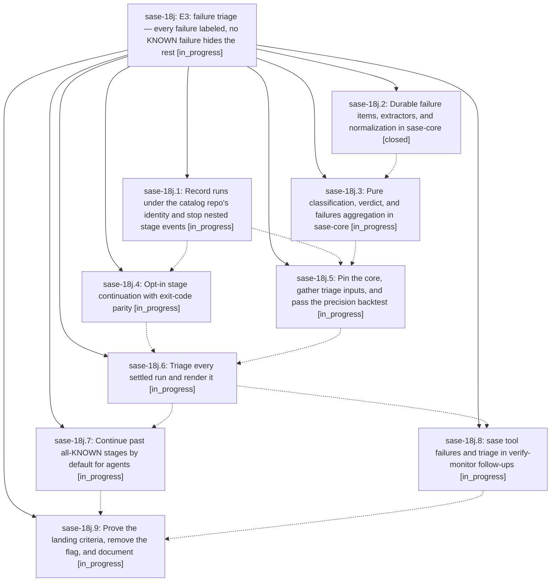

# Bead: sase-18j — E3: failure triage — every failure labeled, no KNOWN failure hides the rest

[Bead Pages](../README.md) / sase-18j

**Status:** ◐ in_progress · **Type:** ▸ plan · **Tier:** epic
**Owner:** `bryanbugyi34@gmail.com` · **Created by:** [bbugyi200.athena.0rq](https://github.com/sase-org/sase--agents/blob/main/families/bbugyi200.athena.0rq.md) · **Assignee:** `sase-18j.land`
**Created:** 2026-09-24 19:06:59 EDT
**Plan:** [202609/tool\_e3\_failure\_triage.md](https://github.com/sase-org/sase--plans/blob/main/202609/tool_e3_failure_triage.md)

## Description

On a red master, an agent's `sase tool run check` runs past stages whose failures are all KNOWN or FLAKY, so its tests still run. It labels every failure item NEW, KNOWN, FLAKY, or UNKNOWN with evidence, prints one verdict line, and keeps the exit code that fail-fast `just check` would have returned. `sase tool failures` groups the machine's red-master signatures, and verify-monitor follow-ups carry the verdict. KNOWN precision is proven by a chronological backtest before any agent sees a label.

## Phases

| Bead | Title | Status | Size | Created | Agents | Commits |
|---|---|---|---|---|---:|---:|
| [sase-18j.1](sase-18j.1.md) | Record runs under the catalog repo's identity and stop nested stage events | ◐ in_progress | medium | 2026-09-24 | 1 | 0 |
| [sase-18j.2](sase-18j.2.md) | Durable failure items, extractors, and normalization in sase-core | ✓ closed | large | 2026-09-24 | 1 | 1 |
| [sase-18j.3](sase-18j.3.md) | Pure classification, verdict, and failures aggregation in sase-core | ◐ in_progress | large | 2026-09-24 | 1 | 0 |
| [sase-18j.4](sase-18j.4.md) | Opt-in stage continuation with exit-code parity | ◐ in_progress | medium | 2026-09-24 | 1 | 0 |
| [sase-18j.5](sase-18j.5.md) | Pin the core, gather triage inputs, and pass the precision backtest | ◐ in_progress | large | 2026-09-24 | 1 | 0 |
| [sase-18j.6](sase-18j.6.md) | Triage every settled run and render it | ◐ in_progress | large | 2026-09-24 | 1 | 0 |
| [sase-18j.7](sase-18j.7.md) | Continue past all-KNOWN stages by default for agents | ◐ in_progress | medium | 2026-09-24 | 1 | 0 |
| [sase-18j.8](sase-18j.8.md) | sase tool failures and triage in verify-monitor follow-ups | ◐ in_progress | medium | 2026-09-24 | 1 | 0 |
| [sase-18j.9](sase-18j.9.md) | Prove the landing criteria, remove the flag, and document | ◐ in_progress | medium | 2026-09-24 | 1 | 0 |

## Lineage

## Agents

| Agent | Bead | Commits |
|---|---|---:|
| [bbugyi200.athena.sase-18j.1](https://github.com/sase-org/sase--agents/blob/main/agents/bbugyi200.athena.sase-18j.1/README.md) | [sase-18j.1](sase-18j.1.md) | 0 |
| [bbugyi200.athena.sase-18j.2](https://github.com/sase-org/sase--agents/blob/main/families/bbugyi200.athena.sase-18j.2.md) | [sase-18j.2](sase-18j.2.md) | 1 |
| [bbugyi200.athena.sase-18j.3](https://github.com/sase-org/sase--agents/blob/main/agents/bbugyi200.athena.sase-18j.3/README.md) | [sase-18j.3](sase-18j.3.md) | 0 |
| [bbugyi200.athena.sase-18j.4](https://github.com/sase-org/sase--agents/blob/main/agents/bbugyi200.athena.sase-18j.4/README.md) | [sase-18j.4](sase-18j.4.md) | 0 |
| [bbugyi200.athena.sase-18j.5](https://github.com/sase-org/sase--agents/blob/main/agents/bbugyi200.athena.sase-18j.5/README.md) | [sase-18j.5](sase-18j.5.md) | 0 |
| [bbugyi200.athena.sase-18j.6](https://github.com/sase-org/sase--agents/blob/main/agents/bbugyi200.athena.sase-18j.6/README.md) | [sase-18j.6](sase-18j.6.md) | 0 |
| [bbugyi200.athena.sase-18j.7](https://github.com/sase-org/sase--agents/blob/main/agents/bbugyi200.athena.sase-18j.7/README.md) | [sase-18j.7](sase-18j.7.md) | 0 |
| [bbugyi200.athena.sase-18j.8](https://github.com/sase-org/sase--agents/blob/main/agents/bbugyi200.athena.sase-18j.8/README.md) | [sase-18j.8](sase-18j.8.md) | 0 |
| [bbugyi200.athena.sase-18j.9](https://github.com/sase-org/sase--agents/blob/main/agents/bbugyi200.athena.sase-18j.9/README.md) | [sase-18j.9](sase-18j.9.md) | 0 |
| [bbugyi200.athena.sase-18j.land](https://github.com/sase-org/sase--agents/blob/main/agents/bbugyi200.athena.sase-18j.land/README.md) | [sase-18j](README.md) | 0 |

## Commits

| Repo | Commit | Subject | Bead | Committed |
|---|---|---|---|---|
| sase-core | [`sase-core@8315364`](https://github.com/sase-org/sase-core/commit/83153645fe14cdcc34c73b665a93b2cc84e987ee) | feat(triage): durable failure items, extractors, normalization, and extract/record/show bindings | [sase-18j.2](sase-18j.2.md) | 2026-09-24 20:24:05 EDT |
