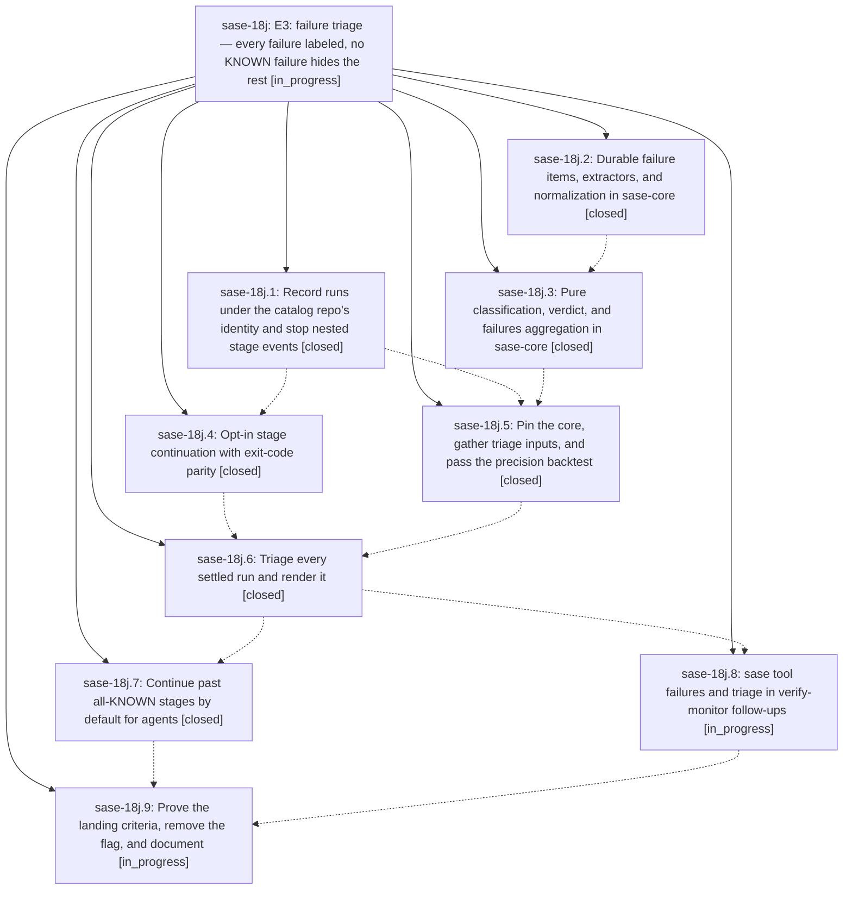

# Bead: sase-18j — E3: failure triage — every failure labeled, no KNOWN failure hides the rest

[Bead Pages](../README.md) / sase-18j

**Status:** ◐ in_progress · **Type:** ▸ plan · **Tier:** epic
**Owner:** `bryanbugyi34@gmail.com` · **Created by:** [bbugyi200.athena.0rq](https://github.com/sase-org/sase--agents/blob/main/families/bbugyi200.athena.0rq.md) · **Assignee:** `sase-18j.land`
**Created:** 2026-09-24 19:06:59 EDT
**Plan:** [202609/tool\_e3\_failure\_triage.md](https://github.com/sase-org/sase--plans/blob/main/202609/tool_e3_failure_triage.md)

## Description

On a red master, an agent's `sase tool run check` runs past stages whose failures are all KNOWN or FLAKY, so its tests still run. It labels every failure item NEW, KNOWN, FLAKY, or UNKNOWN with evidence, prints one verdict line, and keeps the exit code that fail-fast `just check` would have returned. `sase tool failures` groups the machine's red-master signatures, and verify-monitor follow-ups carry the verdict. KNOWN precision is proven by a chronological backtest before any agent sees a label.

## Notes

[2026-09-25T03:10:22Z · sase-18g.land] DISCOVERED ISSUE: (from sase-18g.land) sase tool run -k check (continuation from sase-18j.4) prints '✓ <stage>' in the final stage summary for stages that exited 1. Run 426c1186cdae13bf84f61fee3a1caf08 at eb6407355: events.jsonl records finished exit_code=1 + continued for lint (mypy), lint (test waits), lint (symvision) and test (scoped), yet stdout lists all four with ✓ and only the trailer says '✗ 4 stage(s) failed'. The failed stages' output is also not retained (logs dir holds only stdout/stderr/events), so an agent cannot see which stage failed or why without rerunning each recipe.

[2026-09-25T03:53:18Z · sase-17m.4.1.land] DISCOVERED ISSUE (from sase-17m.4.1.8 PROPOSED FOLLOW-UP #1): the still-open tool triage epic owns Justfile --epic-symbol entries for tool_run_triage_record/show/stage/settle and tool_run_failures. Phase 1.8 observed Symvision unused-public reports for triage_inputs gather_*/triage_knobs and core/tool_run triage helpers on clean HEAD. Retire each exemption once a production consumer exists; the sase-17m.4.1 epic has no epic-symbol entries.

[2026-09-25T04:41:11Z · sase-18f.land] FIXED BY sase-18f.land (green-check epic landing, on top of master ae34dba20): cdcbcdd9d (sase-18j.5) left master check red in four ways, all repaired in the sase-18f landing commit: (1) mypy tools/smoke_sase_core_rs_tool_runs:75 fingerprint annotated dict[str, Any]; (2) pyscripts Rule 1 - tools/tool_triage_backtest had no reference outside tools/, now covered by tests/test_tool_triage_backtest_tool.py (empty-ledger run writes report/audit and never creates the store); (3) the '# e3 record-and-render ...' comment line inside the continued _lint-symvision command made just comment out every later --epic-symbol argument and {{ args }} - moved into the recipe header comment; (4) symvision: gather_ancestry, gather_flake_baseline, gather_selection_records, tool_run_triage_classify, tool_run_triage_verdict now carry '# symvision: tools/tool_triage_backtest' pragmas (real non-test consumer); gather_owner_candidates and triage_knobs got --epic-symbol 'sase-18j(...)' entries for the settle phase to consume - retire them when sase-18j.6 wires them up. Also regenerated tools/{CLAUDE,GEMINI,QWEN,OPENCODE}.md shims for the tools/AGENTS.md Triage backtest section (sase memory init --check was red).

[2026-09-25T11:47:01Z · sase-191.2] FIXED BY sase-191.2: note #1's '✓ <stage>' for continued failures; persisting failed-stage output in the ledger remains sase-18j.6's failed-stage output capture.

[2026-09-25T14:00:49Z · sase-191.3] DISCOVERED ISSUE: core owner matching over-matches. Probe: tool_run_triage_classify on a KNOWN fixture with locator src/sase/tool/executor.py against 319 live owner candidates returned possible_owners sase-106 (gate_shell handoff bug) and sase-10a (sase-gateway fleet CI) -- neither touches src/sase/tool/. Cause (fact 8): locator_tokens keeps every 3+ char token and match_owners does substring tests, so every sase-* bead matches via the sase token. The core needs a token stoplist or a path-level match, plus a pin move, before owners render. Read-only probe; no bead mutated. -r precision-gate owner probe

## Phases

| Bead | Title | Status | Size | Created | Agents | Commits |
|---|---|---|---|---|---:|---:|
| [sase-18j.1](sase-18j.1.md) | Record runs under the catalog repo's identity and stop nested stage events | ✓ closed | medium | 2026-09-24 | 1 | 1 |
| [sase-18j.2](sase-18j.2.md) | Durable failure items, extractors, and normalization in sase-core | ✓ closed | large | 2026-09-24 | 1 | 1 |
| [sase-18j.3](sase-18j.3.md) | Pure classification, verdict, and failures aggregation in sase-core | ✓ closed | large | 2026-09-24 | 1 | 1 |
| [sase-18j.4](sase-18j.4.md) | Opt-in stage continuation with exit-code parity | ✓ closed | medium | 2026-09-24 | 1 | 1 |
| [sase-18j.5](sase-18j.5.md) | Pin the core, gather triage inputs, and pass the precision backtest | ✓ closed | large | 2026-09-24 | 1 | 1 |
| [sase-18j.6](sase-18j.6.md) | Triage every settled run and render it | ✓ closed | large | 2026-09-24 | 1 | 1 |
| [sase-18j.7](sase-18j.7.md) | Continue past all-KNOWN stages by default for agents | ✓ closed | medium | 2026-09-24 | 1 | 1 |
| [sase-18j.8](sase-18j.8.md) | sase tool failures and triage in verify-monitor follow-ups | ◐ in_progress | medium | 2026-09-24 | 1 | 0 |
| [sase-18j.9](sase-18j.9.md) | Prove the landing criteria, remove the flag, and document | ◐ in_progress | medium | 2026-09-24 | 1 | 0 |

## Lineage

## Agents

| Agent | Bead | Commits |
|---|---|---:|
| [bbugyi200.athena.sase-18j.1](https://github.com/sase-org/sase--agents/blob/main/agents/bbugyi200.athena.sase-18j.1/README.md) | [sase-18j.1](sase-18j.1.md) | 1 |
| [bbugyi200.athena.sase-18j.2](https://github.com/sase-org/sase--agents/blob/main/sessions/bbugyi200.athena.sase-18j.2.md) | [sase-18j.2](sase-18j.2.md) | 1 |
| [bbugyi200.athena.sase-18j.3](https://github.com/sase-org/sase--agents/blob/main/sessions/bbugyi200.athena.sase-18j.3.md) | [sase-18j.3](sase-18j.3.md) | 1 |
| [bbugyi200.athena.sase-18j.4](https://github.com/sase-org/sase--agents/blob/main/agents/bbugyi200.athena.sase-18j.4/README.md) | [sase-18j.4](sase-18j.4.md) | 1 |
| [bbugyi200.athena.sase-18j.5](https://github.com/sase-org/sase--agents/blob/main/sessions/bbugyi200.athena.sase-18j.5.md) | [sase-18j.5](sase-18j.5.md) | 1 |
| [bbugyi200.athena.sase-18j.6](https://github.com/sase-org/sase--agents/blob/main/sessions/bbugyi200.athena.sase-18j.6.md) | [sase-18j.6](sase-18j.6.md) | 1 |
| [bbugyi200.athena.sase-18j.7](https://github.com/sase-org/sase--agents/blob/main/agents/bbugyi200.athena.sase-18j.7/README.md) | [sase-18j.7](sase-18j.7.md) | 1 |
| [bbugyi200.athena.sase-18j.8](https://github.com/sase-org/sase--agents/blob/main/agents/bbugyi200.athena.sase-18j.8/README.md) | [sase-18j.8](sase-18j.8.md) | 0 |
| [bbugyi200.athena.sase-18j.9](https://github.com/sase-org/sase--agents/blob/main/agents/bbugyi200.athena.sase-18j.9/README.md) | [sase-18j.9](sase-18j.9.md) | 0 |
| [bbugyi200.athena.sase-18j.land](https://github.com/sase-org/sase--agents/blob/main/agents/bbugyi200.athena.sase-18j.land/README.md) | [sase-18j](README.md) | 0 |

## Commits

| Repo | Commit | Subject | Bead | Committed |
|---|---|---|---|---|
| sase-core | [`sase-core@8315364`](https://github.com/sase-org/sase-core/commit/83153645fe14cdcc34c73b665a93b2cc84e987ee) | feat(triage): durable failure items, extractors, normalization, and extract/record/show bindings | [sase-18j.2](sase-18j.2.md) | 2026-09-24 20:24:05 EDT |
| sase | [`290cd1a`](https://github.com/sase-org/sase/commit/290cd1aa7c8b646dfefd8e457acc0f9fa5c571aa) | fix(tool): record runs under the catalog repo identity and stop nested stage events (sase-18j.1) | [sase-18j.1](sase-18j.1.md) | 2026-09-24 20:52:11 EDT |
| sase | [`eb64073`](https://github.com/sase-org/sase/commit/eb640735540d73d728e31ecfb1323fe09ba84dd4) | feat(tool): add opt-in stage continuation | [sase-18j.4](sase-18j.4.md) | 2026-09-24 21:27:04 EDT |
| sase-core | [`sase-core@321e7b4`](https://github.com/sase-org/sase-core/commit/321e7b4762ff461f189ce18281c8306e0fb9c0eb) | feat(triage): pure classification, verdict, stage/settle, and failures aggregation | [sase-18j.3](sase-18j.3.md) | 2026-09-24 21:30:41 EDT |
| sase | [`cdcbcdd`](https://github.com/sase-org/sase/commit/cdcbcdd9d3988359f1b4fc77d6d0454632a4e760) | feat(tool): add triage input backtest | [sase-18j.5](sase-18j.5.md) | 2026-09-24 22:45:15 EDT |
| sase | [`71b25fb`](https://github.com/sase-org/sase/commit/71b25fbf4eb20f3e184f25104307e20cc5488515) | feat(tool): render settled failure triage | [sase-18j.6](sase-18j.6.md) | 2026-09-25 15:05:30 EDT |
| sase | [`d17a753`](https://github.com/sase-org/sase/commit/d17a7534ad595b45e7076755e0ddd84c1d378460) | feat(tool): known-gated continuation for agent runs | [sase-18j.7](sase-18j.7.md) | 2026-09-25 16:27:31 EDT |

<!-- sase:referenced-by:start -->

## Referenced By

| Relation | Artifact | Why | Uses |
| --- | --- | --- | ---: |
| read-by | [agent:sase-18f.land][1] | Check whether sase-18j is active and owns the smoke mypy straggler | 1 |
| read-by | [agent:sase-18g.land][2] | Check whether sase-18j owns tool-run stage continuation display | 1 |
| read-by | [agent:sase-191.land][3] | Landing check: phase 2/3 notes on the E3 epic | 1 |

[1]: https://github.com/sase-org/sase--agents/blob/main/agents/bbugyi200.athena.sase-18f.land/README.md
[2]: https://github.com/sase-org/sase--agents/blob/main/agents/bbugyi200.athena.sase-18g.land/README.md
[3]: https://github.com/sase-org/sase--agents/blob/main/agents/bbugyi200.athena.sase-191.land/README.md

<!-- sase:referenced-by:end -->
