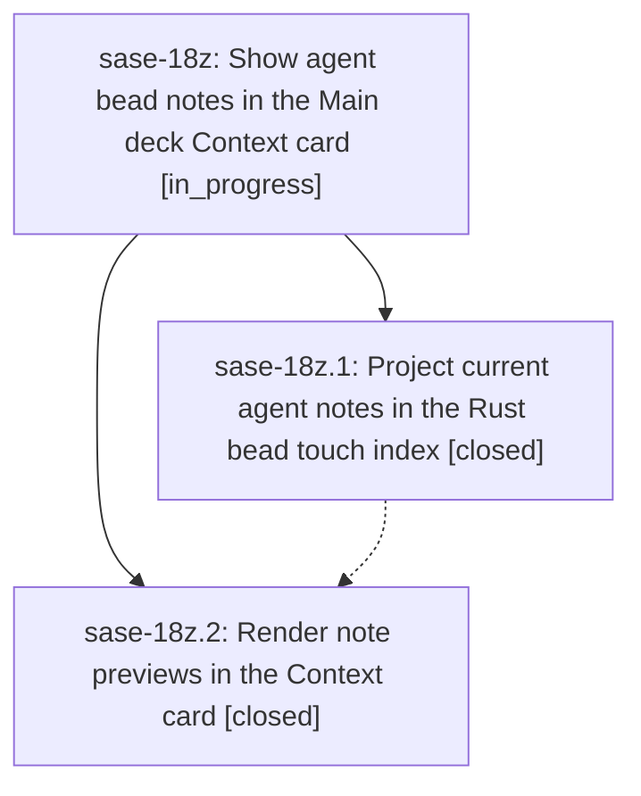

# Bead: sase-18z — Show agent bead notes in the Main deck Context card

[Bead Pages](../README.md) / sase-18z

**Status:** ◐ in_progress · **Type:** ▸ plan · **Tier:** epic
**Owner:** `bryanbugyi34@gmail.com` · **Created by:** [bbugyi200.athena.0rx](https://github.com/sase-org/sase--agents/blob/main/families/bbugyi200.athena.0rx.md) · **Assignee:** `sase-18z.land`
**Created:** 2026-09-25 07:12:28 EDT
**Plan:** [202609/agent\_bead\_note\_previews.md](https://github.com/sase-org/sase--plans/blob/main/202609/agent_bead_note_previews.md)

## Description

Agent-authored bead notes appear as readable, correctly attributed previews under SASE CONTEXT / ARTIFACTS / Beads, with current text and reliable navigation to the complete note log.

## Phases

| Bead | Title | Status | Size | Created | Agents | Commits |
|---|---|---|---|---|---:|---:|
| [sase-18z.1](sase-18z.1.md) | Project current agent notes in the Rust bead touch index | ✓ closed | medium | 2026-09-25 | 1 | 1 |
| [sase-18z.2](sase-18z.2.md) | Render note previews in the Context card | ✓ closed | medium | 2026-09-25 | 1 | 1 |

## Lineage

## Agents

| Agent | Bead | Commits |
|---|---|---:|
| [bbugyi200.athena.sase-18z.1](https://github.com/sase-org/sase--agents/blob/main/agents/bbugyi200.athena.sase-18z.1/README.md) | [sase-18z.1](sase-18z.1.md) | 1 |
| [bbugyi200.athena.sase-18z.2](https://github.com/sase-org/sase--agents/blob/main/agents/bbugyi200.athena.sase-18z.2/README.md) | [sase-18z.2](sase-18z.2.md) | 1 |
| [bbugyi200.athena.sase-18z.land](https://github.com/sase-org/sase--agents/blob/main/agents/bbugyi200.athena.sase-18z.land/README.md) | [sase-18z](README.md) | 0 |

## Commits

| Repo | Commit | Subject | Bead | Committed |
|---|---|---|---|---|
| sase-core | [`sase-core@c558f88`](https://github.com/sase-org/sase-core/commit/c558f88942a155349ee76d6689abd4f9734bcf5f) | feat(bead): add note\_index touch index with note preview (schema 2) | [sase-18z.1](sase-18z.1.md) | 2026-09-25 07:33:33 EDT |
| sase | [`43f7246`](https://github.com/sase-org/sase/commit/43f724619f2ea828ac0eb6d123f01f80251a917d) | feat(ace): preview agent bead notes | [sase-18z.2](sase-18z.2.md) | 2026-09-25 09:32:52 EDT |
