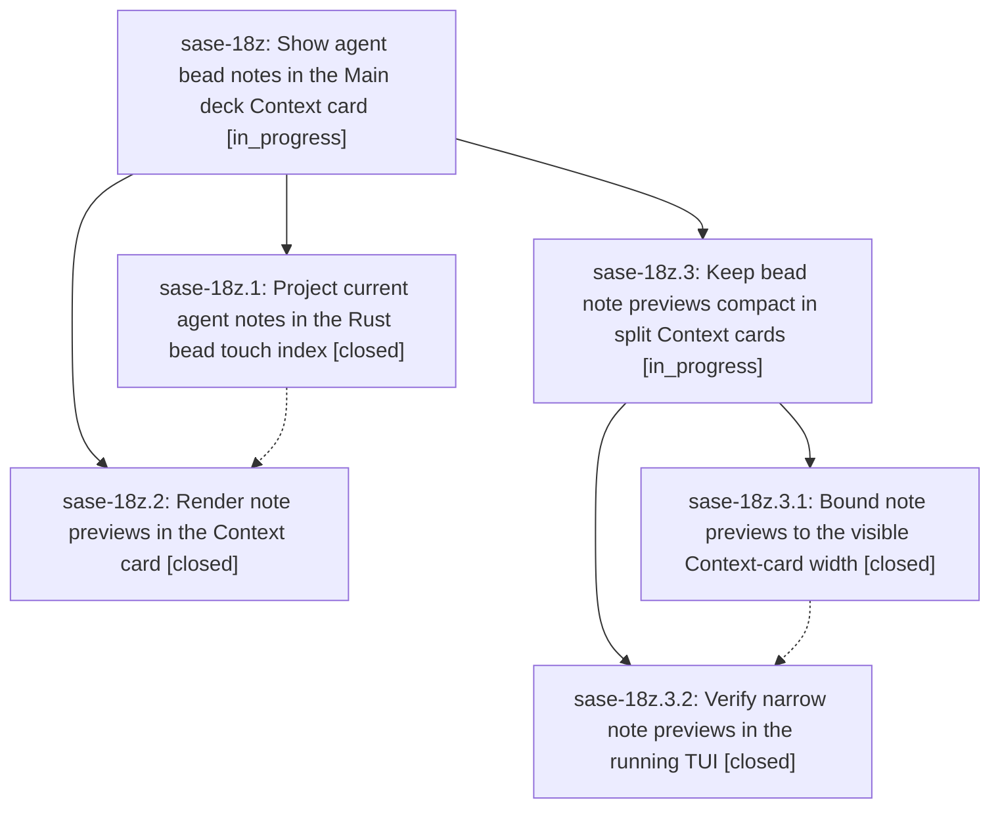

# Bead: sase-18z — Show agent bead notes in the Main deck Context card

[Bead Pages](../README.md) / sase-18z

**Status:** ◐ in_progress · **Type:** ▸ plan · **Tier:** epic
**Owner:** `bryanbugyi34@gmail.com` · **Created by:** [bbugyi200.athena.0rx](https://github.com/sase-org/sase--agents/blob/main/families/bbugyi200.athena.0rx.md) · **Assignee:** `sase-18z.land`
**Created:** 2026-09-25 07:12:28 EDT
**Plan:** [202609/agent\_bead\_note\_previews.md](https://github.com/sase-org/sase--plans/blob/main/202609/agent_bead_note_previews.md)

## Description

Agent-authored bead notes appear as readable, correctly attributed previews under SASE CONTEXT / ARTIFACTS / Beads, with current text and reliable navigation to the complete note log.

## Notes

[2026-09-25T14:42:48Z · sase-18z.land] LANDING AUDIT IN PROGRESS (master 1523580bc6): Read both closed child beads, every note, original plan, Rust c558f88942a1, Python/TUI 43f724619f, and current source. The core pin equals c558f88942a1; focused facade/TUI plus prior failing session-header test passed (65). Since epic start, docs rewrite 8fd6a054fd and Files spread fix 27d03a7b72 landed before phase 2 and are already reflected by its later commit; post-phase service-toast fix 1523580bc6 touches a separate TUI path. Phase 1 PROPOSED FOLLOW-UP (#1) is done by phase 2 pin/facade work. Phase 2 slow-check proposal (#1) reproduced as ToolRun 41813cad77e2ae9d5ffba6fdc1a8730e: lint/SASE/plans passed, scoped pytest remained CPU-active 30m35s, then was stopped; routed with evidence to causally related active epic sase-10w, no new task. Phase 2 baseline session-header proposal (#3) is fixed by unrelated commit 24615e18d4 and passes now; declined as already resolved. Remaining epic-caused issue: checked-in 120x40 note-preview PNG shows nominal 80-cell note lines soft-wrapping repeatedly inside the ~35-cell split Context card, breaching the three-visible-body-line/scannability requirement. Validated child epic plan sase_plan_bead_note_split_layout.md targets only that layout and visual proof; propose it before attempting closure. No --epic-symbol entries currently.

## Phases

| Bead | Title | Status | Size | Created | Agents | Commits |
|---|---|---|---|---|---:|---:|
| [sase-18z.1](sase-18z.1.md) | Project current agent notes in the Rust bead touch index | ✓ closed | medium | 2026-09-25 | 1 | 1 |
| [sase-18z.2](sase-18z.2.md) | Render note previews in the Context card | ✓ closed | medium | 2026-09-25 | 1 | 1 |

## Lineage

## Agents

| Agent | Bead | Commits |
|---|---|---:|
| [bbugyi200.athena.sase-18z.1](https://github.com/sase-org/sase--agents/blob/main/agents/bbugyi200.athena.sase-18z.1/README.md) | [sase-18z.1](sase-18z.1.md) | 1 |
| [bbugyi200.athena.sase-18z.2](https://github.com/sase-org/sase--agents/blob/main/agents/bbugyi200.athena.sase-18z.2/README.md) | [sase-18z.2](sase-18z.2.md) | 1 |
| [bbugyi200.athena.sase-18z.3.1](https://github.com/sase-org/sase--agents/blob/main/families/bbugyi200.athena.sase-18z.3.1.md) | [sase-18z.3.1](sase-18z.3.1.md) | 1 |
| [bbugyi200.athena.sase-18z.3.2](https://github.com/sase-org/sase--agents/blob/main/agents/bbugyi200.athena.sase-18z.3.2/README.md) | [sase-18z.3.2](sase-18z.3.2.md) | 1 |
| [bbugyi200.athena.sase-18z.3.land](https://github.com/sase-org/sase--agents/blob/main/agents/bbugyi200.athena.sase-18z.3.land/README.md) | [sase-18z.3](sase-18z.3.md) | 0 |
| [bbugyi200.athena.sase-18z.land](https://github.com/sase-org/sase--agents/blob/main/families/bbugyi200.athena.sase-18z.land.md) | [sase-18z](README.md) | 0 |

## Commits

| Repo | Commit | Subject | Bead | Committed |
|---|---|---|---|---|
| sase-core | [`sase-core@c558f88`](https://github.com/sase-org/sase-core/commit/c558f88942a155349ee76d6689abd4f9734bcf5f) | feat(bead): add note\_index touch index with note preview (schema 2) | [sase-18z.1](sase-18z.1.md) | 2026-09-25 07:33:33 EDT |
| sase | [`43f7246`](https://github.com/sase-org/sase/commit/43f724619f2ea828ac0eb6d123f01f80251a917d) | feat(ace): preview agent bead notes | [sase-18z.2](sase-18z.2.md) | 2026-09-25 09:32:52 EDT |
| sase | [`204a499`](https://github.com/sase-org/sase/commit/204a4993e298717469eb318410e15bb2b878c2cd) | feat(ace-tui): wrap bead note previews to the visible Context-card width | [sase-18z.3.1](sase-18z.3.1.md) | 2026-09-25 11:45:04 EDT |
| sase | [`7a5559c`](https://github.com/sase-org/sase/commit/7a5559cc737aa1d9b2cb90decf1bdb969855f64b) | fix(ace-tui): keep bead note previews readable in narrow Context cards | [sase-18z.3.2](sase-18z.3.2.md) | 2026-09-25 12:09:41 EDT |
